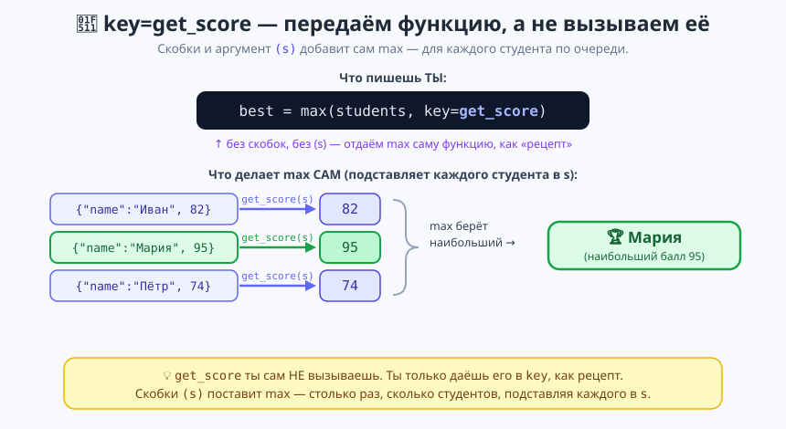
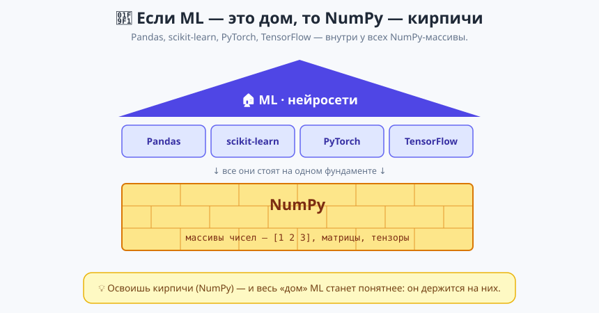
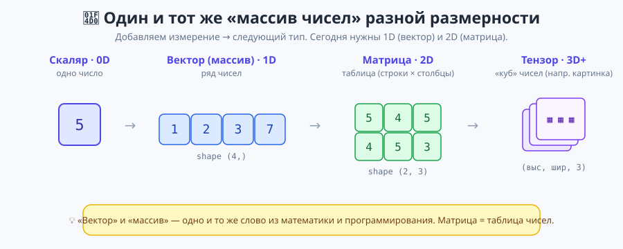
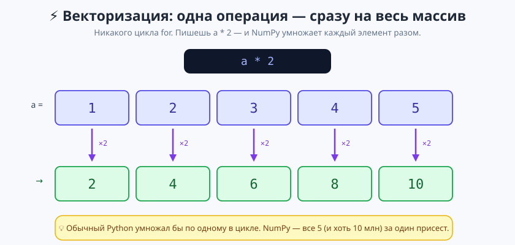

# Нейросети и ML — Справочник

> Короткая «шпаргалка на всё» по курсу. Пропустил урок или что-то забыл — загляни сюда: тут по каждой теме простыми словами, главные команды и примеры. Не заменяет урок, но помогает быстро вспомнить или догнать.

---

## 📋 Оглавление

- [Модуль 1 — Python и математика для ML](#модуль-1--python-и-математика-для-ml)
  - [Урок 1.1 — ООП: классы и объекты](#урок-11--ооп-классы-и-объекты)
  - [Урок 1.2 — Коллекции и генераторы](#урок-12--коллекции-и-генераторы)
  - [Урок 1.3 — Функции и строки](#урок-13--функции-и-строки)
  - [Урок 1.4 — NumPy](#урок-14--numpy)

---

## Модуль 1 — Python и математика для ML

---

### Урок 1.1 — ООП: классы и объекты

#### Что такое класс и объект?

**Класс** — это чертёж (или форма для печенья). Он описывает, из чего состоит вещь и что она умеет. Сам по себе класс — ещё не вещь, а только описание.

**Объект** — это конкретная вещь, сделанная по чертежу. По одному классу можно наделать сколько угодно объектов, и каждый — свой.

> Класс «Собака» — это описание «у собаки есть кличка и возраст, она умеет лаять». А объект — это уже конкретный Барсик 3 лет.

#### Как создать класс

```python
class Dog:
    # __init__ — «сборщик»: запускается, когда создаём объект
    def __init__(self, name, age):
        self.name = name     # запоминаем кличку в самом объекте
        self.age = age

    # метод — это функция, которая живёт внутри класса
    def bark(self):
        print(f"{self.name} говорит: Гав!")

# создаём объект (Барсика)
d = Dog("Барсик", 3)
print(d.name)   # Барсик
d.bark()        # Барсик говорит: Гав!
```

- **`__init__`** — специальный метод, который срабатывает сам в момент создания объекта. В нём мы «раскладываем» переданные данные по объекту.
- **`self`** — это «сам объект». Через `self.name` мы прикрепляем данные именно к этой собаке. `self` всегда пишут **первым** параметром метода.

> ⚠️ Забыл `self.` — и данные не сохранятся в объекте. `self.name = name` кладёт кличку в собаку; просто `name = name` — ничего не делает.

#### `__repr__` — красиво показать объект

Если просто напечатать объект, получится непонятное `<__main__.Dog object at 0x...>`. Метод `__repr__` говорит, как объект должен выглядеть при печати:

```python
class Dog:
    def __init__(self, name):
        self.name = name
    def __repr__(self):
        return f"Dog({self.name})"

print(Dog("Барсик"))   # Dog(Барсик)
```

#### Наследование — один класс на основе другого

Если новый класс похож на старый, но с добавками — его делают **наследником**. Он получает всё от «родителя» и добавляет своё.

```python
class Animal:
    def __init__(self, name):
        self.name = name
    def breathe(self):
        print(f"{self.name} дышит")

# Bird наследует Animal (в скобках — родитель)
class Bird(Animal):
    def __init__(self, name, wingspan):
        super().__init__(name)      # позвать __init__ родителя
        self.wingspan = wingspan
    def fly(self):
        print(f"{self.name} летит, размах {self.wingspan} см")

sparrow = Bird("Воробей", 20)
sparrow.breathe()   # Воробей дышит   ← досталось от Animal
sparrow.fly()       # Воробей летит...  ← своё
```

- **`super().__init__(...)`** — «сначала пусть родитель соберёт свою часть». Без этого имя из `Animal` не запишется.

| Слово | Что значит |
|---|---|
| `class` | объявляем чертёж |
| `__init__` | сборка объекта при создании |
| `self` | сам объект |
| метод | функция внутри класса |
| наследник `class B(A)` | берёт всё от A и добавляет своё |
| `super()` | обращение к родителю |

---

### Урок 1.2 — Коллекции и генераторы

#### Быстро про коллекции

```python
nums = [3, 1, 4]          # список — по порядку, можно менять
nums.append(7)            # добавить в конец
nums[0]                   # 3 — первый (счёт с 0)

student = {"имя": "Иван", "класс": 5}   # словарь — пары ключ→значение
student["имя"]                          # "Иван"
student.get("телефон", "—")             # "—", если ключа нет (без ошибки)

unique = {1, 2, 2, 3}     # множество — только уникальные → {1, 2, 3}
```

Файлы всегда открываем через `with` — он сам закроет файл:
```python
with open("data.txt", "r", encoding="utf-8") as f:
    text = f.read()
```

#### Три друга цикла: `range`, `zip`, `enumerate`

```python
list(range(5))            # [0, 1, 2, 3, 4]      — числа по порядку
list(range(2, 10, 2))     # [2, 4, 6, 8]         — от 2 до 10 шагом 2

# zip — идём по двум спискам параллельно
names = ["Иван", "Мария"]
ages  = [15, 14]
for name, age in zip(names, ages):
    print(name, age)      # Иван 15 / Мария 14

# enumerate — даёт и номер, и значение
for i, name in enumerate(names, start=1):
    print(i, name)        # 1 Иван / 2 Мария
```

> `enumerate` избавляет от некрасивого `for i in range(len(names))`.

#### Генераторы — цикл в одну строку

Очень частый приём: «пройтись по коллекции и собрать из неё новую». Вместо цикла с `append` — одна строка.

```python
# было (3 строки):
result = []
for x in range(1, 6):
    result.append(x ** 2)

# стало (1 строка) — генератор списка:
result = [x ** 2 for x in range(1, 6)]   # [1, 4, 9, 16, 25]
```

**С фильтром** (`if` в конце — оставить не всё):
```python
[x for x in range(1, 11) if x % 2 == 0]   # [2, 4, 6, 8, 10] — только чётные
```

**С выбором значения** (тернарник в начале — включаем всегда, но что-то одно):
```python
["чёт" if x % 2 == 0 else "нечёт" for x in range(1, 5)]
# ['нечёт', 'чёт', 'нечёт', 'чёт']
```

> **Не путай!** `if` **в конце** = ФИЛЬТР (какие-то элементы выкидываем). `if…else` **в начале** = ВЫБОР значения (берём каждый, но решаем, каким он будет).

**Словарь и множество** — то же, но в фигурных скобках:
```python
{x: x ** 2 for x in range(1, 4)}   # {1: 1, 2: 4, 3: 9}   — генератор словаря
{len(w) for w in ["кот", "пёс", "мышь"]}   # {3, 4}       — генератор множества
```

> Фигурные скобки **с двоеточием** → словарь. **Без двоеточия** → множество (только уникальные).

---

### Урок 1.3 — Функции и строки

#### `lambda` — функция в одну строку

Иногда нужна крохотная функция на один раз. Тогда вместо целого `def` пишут `lambda` — ту же функцию, только короче и без имени.

```python
# обычная функция:
def square(x):
    return x ** 2

# то же через lambda:
square = lambda x: x ** 2
print(square(5))     # 25

# несколько аргументов — через запятую:
add = lambda a, b: a + b
add(3, 4)            # 7
```

Шаблон: `lambda аргументы: что_вернуть` (слово `return` не нужно, оно подразумевается).

**Главное применение — «ключ» сортировки/поиска.** Функциям `sorted`, `max`, `min` можно сказать: «сравнивай не сами элементы, а вот такой их признак». Этот признак и задаёт `lambda`:

```python
students = [{"имя": "Иван", "балл": 82}, {"имя": "Мария", "балл": 95}]

best = max(students, key=lambda s: s["балл"])   # {'имя': 'Мария', ...}
```



> Важно: в `key` пишем **саму функцию без скобок** (`key=get_score` или `key=lambda …`). Скобки поставит уже `max`/`sorted`, когда будет применять её к каждому элементу.

#### Сортировка и функции-сборщики

```python
sorted(nums)                 # новый отсортированный список (оригинал цел)
nums.sort()                  # сортирует НА МЕСТЕ, возвращает None
sorted(words, key=len)       # по длине (готовая функция len)
sorted(data, key=lambda d: d["год"], reverse=True)   # по полю, по убыванию

sum([1, 2, 3])               # 6
min(nums) / max(nums)        # наименьший / наибольший
all(x > 0 for x in nums)     # True, если ВСЕ подходят
any(x < 0 for x in nums)     # True, если ХОТЬ ОДИН подходит
```

> Подвох: у пустого списка `all([])` = `True`, а `any([])` = `False`.

#### `*args` и `**kwargs` — любое число аргументов

Обычная функция принимает фиксированное число аргументов. Чтобы принять **сколько угодно** — ставят звёздочку:

```python
def total(*args):        # звёздочка «собирает» все числа в кортеж args
    return sum(args)

total(1, 2, 3)           # 6
total(10, 20, 30, 40)    # 100
```

- **`*args`** собирает аргументы **без имени** в кортеж.
- **`**kwargs`** собирает аргументы **с именем** (`имя=значение`) в словарь.

```python
def hero_card(name, **stats):     # name — обычный; stats — словарь остального
    print(f"Герой: {name}")
    for key, value in stats.items():
        print(f"  {key} — {value}")

hero_card("Ния", role="маг", level=7)
# Герой: Ния
#   role — маг
#   level — 7
```

> Имена `args`/`kwargs` — по договорённости, магию делает звёздочка; можно `*nums`, `**options`.

**Звёздочка при ВЫЗОВЕ работает наоборот — распаковывает** готовую коллекцию в отдельные аргументы:
```python
def greet(name, age):
    print(name, age)

data = ["Иван", 15]
greet(*data)             # то же, что greet("Иван", 15)
```

> `*` в объявлении = «много значений → одна коробка». `*` в вызове = «коробка → много значений».

#### Методы строк и f-строки

```python
"a,b,c".split(",")          # ['a', 'b', 'c']   — разбить
"-".join(["2026", "01"])    # '2026-01'         — склеить (вызывает разделитель!)
"  Привет ".strip()         # 'Привет'          — убрать пробелы по краям
"Привет".lower()            # 'привет'
"файл.py".endswith(".py")   # True

# f-строка — подставить значение прямо в текст
name, avg = "Иван", 4.375
f"{name}: {avg:.2f}"        # 'Иван: 4.38'   — :.2f = два знака после запятой
```

---

### Урок 1.4 — NumPy

#### Что такое NumPy

**NumPy** — библиотека для быстрых вычислений с массивами чисел. Она — фундамент всего ML: Pandas, scikit-learn, PyTorch устроены поверх неё.



> Если ML — это дом, то NumPy — кирпичи, из которых он сложен. Сам по себе NumPy нейросети не обучает — он просто **очень быстро** считает с числами (в десятки раз быстрее обычного Python), а всё остальное построено на нём.

Подключают всегда так:
```python
import numpy as np    # np — общепринятое сокращение
```

#### 4 слова, которые надо знать



- **Скаляр** — одно число (`5`).
- **Вектор** (он же массив) — ряд чисел (`[1, 2, 3]`).
- **Матрица** — таблица чисел (строки × столбцы), как классный журнал.
- **Тензор** — «куб» и больше (например, цветная картинка). Сегодня хватит вектора и матрицы.

> Это один и тот же объект «массив чисел», просто разной размерности — добавили направление, получили следующий тип.

#### Создание массивов

```python
a = np.array([1, 2, 3, 4, 5])     # из обычного списка
m = np.array([[1, 2, 3],          # список списков → матрица
              [4, 5, 6]])

np.zeros(5)          # [0. 0. 0. 0. 0.]   — пять нулей
np.ones((2, 3))      # матрица 2×3 из единиц
np.arange(0, 10, 2)  # [0 2 4 6 8]        — как range (конец не входит)
np.linspace(0, 1, 5) # [0. 0.25 0.5 0.75 1.] — 5 точек от 0 до 1, концы включены
np.random.rand(3)    # 3 случайных числа от 0 до 1
```

**Свойства массива** — их проверяют постоянно:
```python
a.shape    # (5,)   — ФОРМА (сколько чего). У матрицы (строки, столбцы)
a.dtype    # int64  — тип чисел внутри
a.ndim     # 1      — сколько измерений (1 вектор, 2 матрица)
a.size     # 5      — всего чисел
```

> Сломался код в NumPy? Первым делом печатай `.shape` — 90% ошибок из-за несовпадения форм.

**Зерно случайности — `np.random.seed`:**
```python
np.random.seed(42)   # «зерно» генератора
np.random.rand(3)    # теперь ВСЕГДА выдаёт одни и те же 3 числа
```
> Компьютер «выращивает» случайные числа из стартового числа-зерна. Одинаковое зерно → одинаковые числа. Нужно, чтобы у тебя и у учителя код давал **один и тот же** результат (иначе не сравнить). 42 — просто традиция.

#### Индексы и срезы

```python
a = np.array([10, 20, 30, 40, 50])
a[0]        # 10   — первый (счёт с 0)
a[-1]       # 50   — последний
a[1:4]      # [20 30 40]   — с 1 по 4 (4 НЕ входит)
a[::-1]     # [50 40 30 20 10]  — задом наперёд
```

**У матрицы два индекса — через запятую: `m[строка, столбец]`.**

![Схема: индексы матрицы m[строка, столбец]; строка, столбец, ячейка](модули/01-python-и-математика/урок-04-numpy/изображения/индексация-2d.svg)

```python
m = np.array([[1, 2, 3],
              [4, 5, 6],
              [7, 8, 9]])

m[1, 2]     # 6    — строка 1, столбец 2
m[0]        # [1 2 3]   — вся строка 0
m[:, 0]     # [1 4 7]   — весь столбец 0 (: = «все строки»)
m[0:2, 1:3] # [[2 3],[5 6]]  — прямоугольный кусок
```

> «:» на месте индекса значит «все по этой оси». Поэтому столбец достают так: `m[:, номер]`.

**Фильтр по условию (булева маска)** — самая полезная фишка:
```python
a = np.array([10, 20, 30, 40])
a[a > 25]              # [30 40]   — оставить те, что больше 25
a[(a > 15) & (a < 45)] # [20 30 40] — два условия: & это И, | это ИЛИ (в скобках!)
(a > 25).sum()         # 2 — сколько элементов подходит
```

#### Векторизация — операции без цикла

Операция применяется **сразу ко всему массиву**, никакого `for`:



```python
a = np.array([1, 2, 3, 4])
a + 10       # [11 12 13 14]
a * 2        # [2 4 6 8]
a ** 2       # [1 4 9 16]
np.sqrt(a)   # корень из каждого

# два массива — поэлементно
prices = np.array([100, 50, 200])
qty    = np.array([2, 3, 1])
(prices * qty).sum()   # 550 — общий чек
```

#### Broadcasting — операции между разными формами

NumPy умеет «растягивать» меньший массив под больший:
```python
m = np.array([[1, 2, 3], [4, 5, 6]])
row = np.array([10, 20, 30])
m + row     # [[11 22 33], [14 25 36]]  — вектор прибавился к каждой строке
```

#### Агрегации — «схлопнуть» массив в число

```python
a.sum()      # сумма
a.mean()     # среднее
a.min() / a.max()
a.std()      # стандартное отклонение («насколько числа разбросаны»)
a.argmax()   # ИНДЕКС, где максимум (не само число!)
```

**Параметр `axis` — по какому направлению считать** (у матрицы):
```python
m.sum()          # 21 — сумма всех
m.sum(axis=0)    # [5 7 9]  — вниз по столбцам (строки схлопнулись)
m.sum(axis=1)    # [6 15]   — вправо по строкам (столбцы схлопнулись)
```
> Мнемоника: `axis=0` — «вниз», остаётся строка-итог по столбцам. `axis=1` — «вправо», остаётся столбец-итог по строкам. Спроси себя: «что я хочу схлопнуть?».

#### Reshape — поменять форму

```python
a = np.arange(12)     # 12 чисел
a.reshape(3, 4)       # 3 строки по 4 (числа те же, раскладка другая)
a.reshape(2, -1)      # -1 = «посчитай сам» → (2, 6)
m.flatten()           # матрицу обратно в один ряд
```
> Число элементов до и после `reshape` должно совпадать (12 = 3×4 = 2×6).

---

</content>
