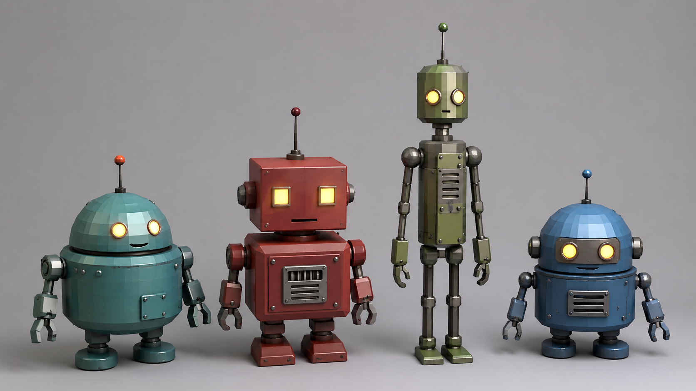
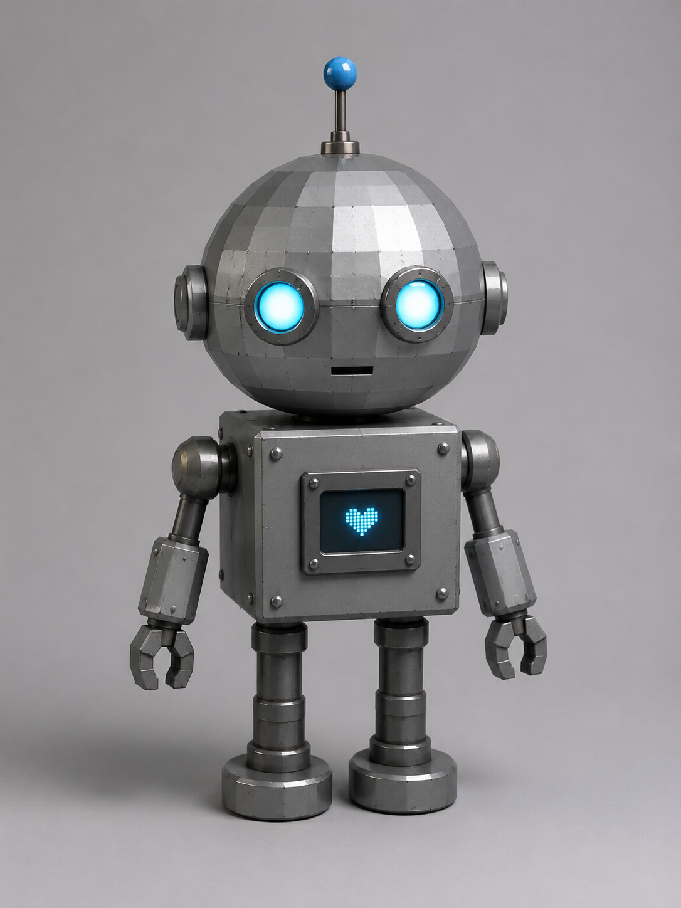

# Самостоятельная работа — Урок 1: Робот-помощник 🤖

> 🧑‍🎓 Это задание ты делаешь **сам(а)**, применяя то, что мы прошли на уроке. Учитель помогает, если застрял.

## Задание

На уроке мы собирали меч. Теперь — совсем другое: собери **робота-помощника** из базовых фигур. Никакого оружия — только примитивы, трансформации и материалы.

> 💡 Этот робот потом «поселится» на твоей полке вместе с предметами из других практик — мы соберём из них общую сцену.

| Референс — варианты роботов | Пример результата |
|-----------------------------|-------------------|
|  |  |

*Слева — разные роботы из простых фигур (идеи для вдохновения). Справа — пример готового робота (экран-«сердечко» на животе — светящаяся грань). Придумай и собери **своего** в таком духе.*

**Из чего собрать робота:**
- Голова — куб или сфера
- Тело — куб/цилиндр
- Руки и ноги — цилиндры
- Глаза — маленькие сферы (можно светящиеся!)
- Антенна — тонкий цилиндр + шарик
- Детали — кнопки, экран на животе

---

## Требования

- [ ] Минимум **6 объектов** (примитивов)
- [ ] Точная расстановка через `G/R/S` + ось + число
- [ ] Минимум **3 материала** с разными цветами
- [ ] Хотя бы один объект с **Metallic > 0.5** (металлический корпус)
- [ ] Робот **симметричен** (руки/ноги/глаза одинаково слева и справа)
- [ ] Финальный **рендер** (`F12`)

---

## Подсказки

- Симметрию пока делай вручную: поставил руку на `X = 1`, копию (`Shift+D`) на `X = -1`
- Глаза-лампочки: материал с Base Color + чуть Emission (забегаем вперёд)
- Чтобы робот «стоял», следи за позициями по Z (ноги ниже тела)
- Не бойся придумать характер: добрый, грустный, боевой?

---

## Что сдать

`.blend` файл + рендер (скриншот или `F12 → Image → Save As`).

## Референс

Референсы и пример **встроены выше** (в разделе «Задание»). Подробности и промпты — в [изображения-практика.md](изображения-практика.md#ref).
