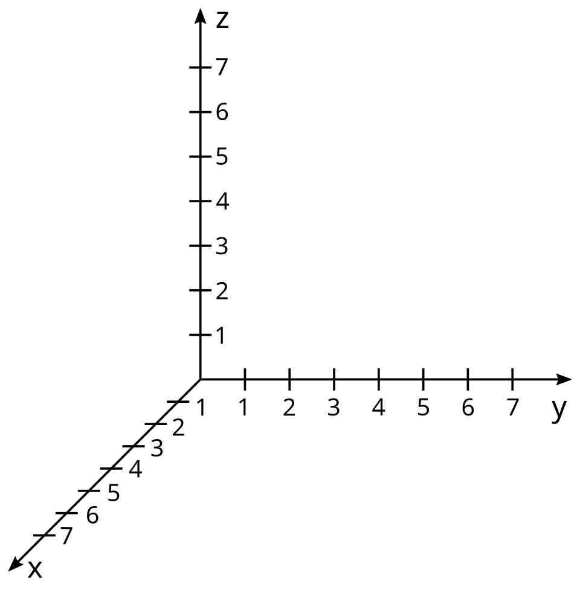
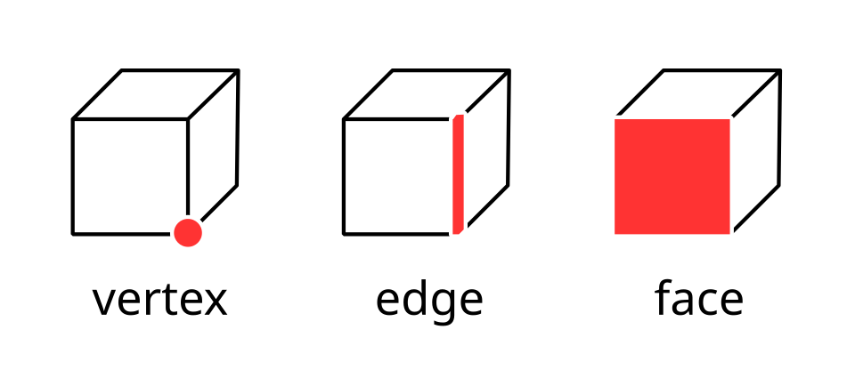
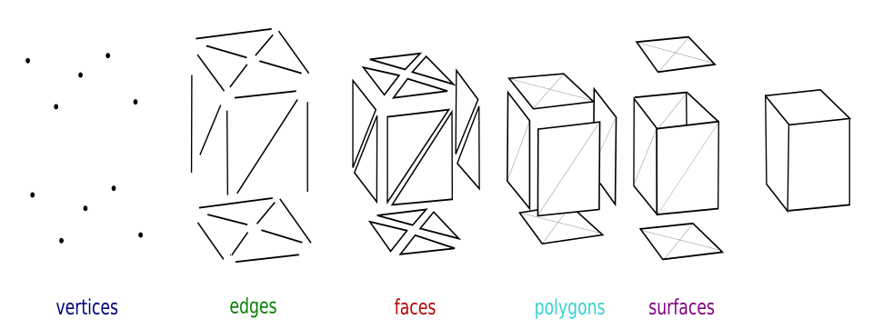

# Урок 1 — Что такое 3D, интерфейс Blender и наш первый меч

**Модуль 1 | 2 академических часа (1,5 часа)**

---

## Цель урока

За этот урок мы:
- Поймём, **что такое 3D** и из чего состоят 3D-модели (вершины, рёбра, грани)
- Разберём интерфейс Blender — быстро и по делу
- Научимся летать в 3D-пространстве
- **Вместе создадим низкополигональный меч** из базовых фигур
- Раскрасим его и сделаем первый рендер

---

## Часть 1 — Теория: из чего состоит 3D-модель (15 минут)

### Что такое 3D-пространство

В обычном рисунке (2D) есть две оси: вправо-влево и вверх-вниз. В **3D** добавляется третья — **глубина**. Поэтому объект можно обойти и посмотреть со всех сторон.

В Blender три оси, у каждой свой цвет:

| Ось | Направление | Цвет |
|-----|-------------|------|
| **X** | влево ↔ вправо | 🔴 красная |
| **Y** | вперёд ↔ назад | 🟢 зелёная |
| **Z** | вниз ↕ вверх | 🔵 синяя |



*Три оси координат. В Blender: X — красная, Y — зелёная, Z — синяя. ([источник: Wikimedia Commons, CC BY-SA](https://commons.wikimedia.org/wiki/File:Coordinate_system_xyz.svg))*

> 💡 **Фишка:** цвета осей запомнить легко — они совпадают с подсказкой в правом верхнем углу Blender (цветной «гизмо» с шариками X/Y/Z). Кликнув по шарику, можно мгновенно повернуть вид вдоль этой оси.

---

### Вершины, рёбра, грани — «кирпичики» 3D

Любая 3D-модель (её называют **меш**, от англ. *mesh* — «сетка») состоит из трёх элементов:

| Элемент | Англ. | Что это | Аналогия |
|---------|-------|---------|----------|
| **Вершина** | Vertex | точка в пространстве | гвоздик |
| **Ребро** | Edge | линия между двумя вершинами | ниточка между гвоздиками |
| **Грань** | Face | плоскость внутри рёбер | ткань, натянутая на рамку |

```
   вершина (Vertex)
      ●─────────●
      │         │   ← ребро (Edge)
      │  грань  │
      │ (Face)  │
      ●─────────●
```



*Слева направо: вершина (Vertex), ребро (Edge), грань (Face). ([источник: Wikimedia Commons](https://commons.wikimedia.org/wiki/File:Vertex_edge_face.svg))*

### Что такое полигон

**Полигон** = грань. Чаще всего это:
- **квад** (Quad) — четырёхугольник (👍 лучший вариант для моделирования)
- **тригон** (Tri) — треугольник (в играх всё в итоге превращается в тригоны)

Когда говорят «модель на 5000 полигонов» — имеют в виду количество граней. Чем их больше, тем детальнее модель, но тем тяжелее компьютеру.



*Меш состоит из вершин, рёбер, граней и полигонов. ([источник: Wikimedia Commons](https://commons.wikimedia.org/wiki/File:Mesh_overview.svg))*

> 💡 **Фишка:** наш курс — про **low-poly** (мало полигонов). Это и красивый стиль, и спасение для слабых компьютеров. Поэтому мы часто будем уменьшать число граней у фигур.

> 📷 Картинку-сравнение low-poly и high-poly проще всего сделать **скриншотом в Blender** (две сферы с разным числом сегментов + wireframe). Описание — в [изображения.md](изображения.md).

---

## Часть 2 — Интерфейс Blender (10 минут)

При запуске закрой стартовое окно кликом **ЛКМ** по пустому месту. Ты увидишь куб, камеру и лампу — это **стандартная сцена**.

```
┌──────────────────────────────────┬─────────────────┐
│                                  │  Outliner        │
│       3D Viewport                │  (все объекты)   │
│   (здесь всё происходит)         ├─────────────────┤
│                                  │  Properties      │
│                                  │  (настройки)     │
├──────────────────────────────────┴─────────────────┤
│                   Timeline                          │
└────────────────────────────────────────────────────┘
```

| Область | Для чего |
|---------|----------|
| **3D Viewport** | рабочее поле — здесь лепим |
| **Outliner** (справа вверху) | список объектов, как слои в Photoshop |
| **Properties** (справа внизу) | настройки: материалы, модификаторы, рендер |
| **Timeline** (внизу) | шкала времени для анимации |

> 📷 [изображения.md](изображения.md) → «Интерфейс Blender с подписями»

> 💡 **Фишка:** любую границу между окнами можно тянуть мышью, меняя размер. А если потянуть за уголок окна — можно разделить или объединить панели. Если всё «сломалось» — `File → Defaults → Load Factory Settings` вернёт стандартный вид.

> ⚠️ Blender **не спрашивает** про сохранение при закрытии! Сохраняйся сам: `Ctrl + S`.

---

## Часть 3 — Навигация в 3D (10 минут)

Самое важное — уметь летать по сцене.

| Действие | Как делать |
|---------|-----------|
| **Вращать** вид | Зажать **колёсико мыши** + двигать |
| **Приближать/удалять** | Крутить **колёсико** |
| **Сдвигать** вид | **Shift + колёсико** + двигать |

### Виды через Numpad

| Клавиша | Что видим |
|---------|----------|
| `Numpad 1` | Спереди |
| `Numpad 3` | Сбоку |
| `Numpad 7` | Сверху |
| `Numpad 5` | Переключить перспективу ↔ ортография |
| `Numpad .` | Сфокусироваться на выделенном |

> 💡 **Фишка — «я потерял объект!»:** нажми `A` (выделить всё), затем `Numpad .` — вид мгновенно прыгнет к объектам. Это спасает в 90% случаев «у меня всё пропало».

> 💡 **Фишка — нет Numpad на ноутбуке:** `Edit → Preferences → Input → ✅ Emulate Numpad`. Тогда виды переключаются обычными цифрами 1, 3, 7.

**Потренируйся 2 минуты:** полетай вокруг куба, посмотри со всех сторон, попробуй виды.

---

## Часть 4 — Создаём меч (40 минут)

Делаем low-poly меч из простых примитивов:

```
        ▲  лезвие (вытянутый куб)
        │
   ═════╪═════  гарда (плоский куб)
        │
       ═╪═  рукоять (цилиндр)
        │
       ╘╤╛  навершие (сфера)
```

> 📷 [изображения.md](изображения.md) → «Референс low-poly меча»

### Шаг 1 — Удалить стандартный куб

Кликни `ЛКМ` по кубу → нажми `X` → **Delete**.

> 💡 **Фишка — как выделять объекты:**
> - `ЛКМ` по объекту — выделить один
> - `Shift + ЛКМ` — добавить ещё объекты к выделению
> - `A` — выделить **всё**
> - `Alt + A` — снять выделение со всего
>
> Выделенный объект подсвечивается **оранжевым контуром**. Последний выбранный — ярче (он «активный»).

> ⚠️ Камеру и лампу **не удаляй** — пригодятся для рендера!

---

### Шаг 2 — Лезвие

1. `Shift + A → Mesh → Cube` — добавь куб

> 💡 **Фишка — как добавлять фигуры:** меню `Shift + A` — это твой «ящик с деталями». Mesh → там все базовые фигуры (куб, сфера, цилиндр, конус, тор). Запомни это сочетание — будешь жать его сотни раз.

2. Теперь меняем форму. Нажми `S → X → 0.15` → Enter *(сузь по X)*
3. Нажми `S → Z → 4` → Enter *(вытяни вверх)*
4. Нажми `G → Z → 2` → Enter *(подними вверх)*

> 💡 **Фишка — главный паттерн Blender (запомни на всю жизнь!):**
> **Действие → Ось → Число → Enter**
> - `G` (Grab) = переместить, `R` (Rotate) = повернуть, `S` (Scale) = масштабировать
> - затем буква оси: `X`, `Y` или `Z`
> - затем число (можно дробное: `0.15`, `1.5`)
>
> Пример: `R → Z → 90` = повернуть на 90° вокруг синей оси. Это работает **везде** в Blender.

> 📷 [изображения.md](изображения.md) → «Шаги создания лезвия»

---

### Шаг 3 — Гарда (перекрестие)

1. `Shift + A → Mesh → Cube`
2. `S → X → 1.2` → Enter *(шире)*
3. `S → Y → 0.3` → Enter *(тоньше)*
4. `S → Z → 0.15` → Enter *(плоская)*
5. `G → Z → 0.2` → Enter *(на границу лезвия и рукояти)*

> 💡 **Фишка — точка опоры (Origin):** у каждого объекта есть оранжевая точка — **Origin**. Вокруг неё происходят вращение и масштабирование. Если объект вращается «не оттуда», значит Origin смещён. Поправить: `Object → Set Origin → Origin to Geometry` (поставит точку в центр объекта).

---

### Шаг 4 — Рукоять

1. `Shift + A → Mesh → Cylinder`
2. Сразу после добавления — нажми `F9` *(откроется панель параметров)*:
   - **Vertices: 8** *(делаем гранёный low-poly цилиндр)*
3. `S → 0.2` → Enter
4. `S → Z → 1.2` → Enter
5. `G → Z → -0.8` → Enter *(опусти под гарду)*

> 🎯 **ЛАЙФХАК — показать здесь!**
> Именно в этот момент покажи детям лайфхак **F9 — панель последней операции** (полностью в [лайфхак.md](лайфхак.md)).
> Дети только что нажали `F9`, чтобы поставить Vertices: 8 — идеальный момент объяснить: «эта панель работает после ЛЮБОГО действия, пока вы не сделали следующее». Дай им поэкспериментировать: добавить сферу и через F9 поменять её сегменты.

---

### Шаг 5 — Навершие (набалдашник)

1. `Shift + A → Mesh → UV Sphere`
2. Сразу `F9`: **Segments: 6, Rings: 4** *(угловатая, low-poly)*
3. `S → 0.3` → Enter
4. `G → Z → -1.7` → Enter *(в самый низ)*

---

### Шаг 6 — Острый кончик (первое знакомство с Edit Mode)

Пока лезвие — прямоугольник. Заострим кончик. Для этого зайдём **внутрь** объекта.

1. Выдели объект **Лезвие** (`ЛКМ`)
2. Нажми `Tab` — вошли в **Edit Mode** (меш стал оранжевым, видны вершины)

> 💡 **Фишка — Object Mode vs Edit Mode:**
> - **Object Mode** — двигаем объект целиком (как мебель по комнате)
> - **Edit Mode** — редактируем его «начинку»: вершины, рёбра, грани (как перешиваем саму мебель)
> - Переключатель — клавиша `Tab`. Подробно разберём на уроке 2.

3. Нажми `3` — режим **Граней** (Face Select)

> 💡 **Фишка — три режима выделения в Edit Mode:**
> `1` — Вершины, `2` — Рёбра, `3` — Грани. Это те самые «кирпичики» из теории! Нажми и посмотри, как меняется выделение.

4. `Alt + A` — снять выделение
5. Поверни вид, кликни `ЛКМ` по **верхней грани** лезвия
6. `G → Z → 1` → Enter *(подними грань)*
7. `S → X → 0` → Enter *(сожми в точку — получилось остриё!)*
8. `Tab` — выйди в Object Mode

> 📷 [изображения.md](изображения.md) → «Заострение кончика в Edit Mode»

> 💡 **Фишка — `S → X → 0`:** масштаб в ноль по оси «схлопывает» геометрию в линию или точку. Так из грани получают острый кончик, а из круга — плоский диск.

---

## Часть 5 — Раскрашиваем меч и рендер (15 минут)

### Что такое материал

**Материал** описывает, как поверхность выглядит: цвет, блеск, металлический он или матовый. В Blender это делается через шейдер **Principled BSDF** (разберём ноды позже, пока — просто крутим параметры).

> 💡 **Фишка — три главных параметра материала:**
> - **Base Color** — цвет
> - **Metallic** — «металл или нет»: 0 = пластик/дерево, 1 = металл
> - **Roughness** — «матовость»: 0 = зеркало, 1 = полностью матовый

### Назначаем материалы

**Лезвие (серебристый металл):**
1. Выдели лезвие → вкладка 🔴 **Material Properties** (справа)
2. Кнопка **New**
3. Base Color: светло-серый · Metallic: **1.0** · Roughness: **0.2**

**Рукоять (тёмное дерево):** Base Color коричневый · Metallic 0 · Roughness 0.9

**Гарда (золото):** Base Color жёлтый · Metallic 1.0 · Roughness 0.3

**Навершие:** тот же золотой материал.

> 💡 **Фишка — переиспользовать материал:** чтобы не создавать золото дважды, у навершия в списке материалов нажми не «New», а кнопку-шарик слева от него — там выпадет список уже созданных материалов. Выбери «золото». Теперь оба объекта связаны: поменяешь цвет у одного — изменится у обоих.

### Смотрим результат и рендерим

1. Нажми `Z → Material Preview` — увидишь цветной меч!

> 💡 **Фишка — режимы просмотра (`Z`):** Solid (серый), Material Preview (с цветами), Rendered (полный рендер в реальном времени). Для слабых ПК сиди в Material Preview — он быстрый.

2. `Numpad 0` — посмотри с камеры

> 💡 **Фишка — навести камеру:** нажми `N` (откроется панель справа) → вкладка **View** → ✅ **Camera to View**. Теперь, двигая вид колёсиком, ты двигаешь камеру. Поймал кадр — сними галочку.

3. `F12` — **рендер!** 🎉

> 💡 **Фишка — сохранить рендер:** в окне рендера `Image → Save As` → выбери папку и формат PNG.

> 📷 [изображения.md](изображения.md) → «Меч с материалами (финальный рендер)»

---

## Итог урока

Сегодня мы:
- ✅ Узнали, что такое вершины, рёбра, грани и полигоны
- ✅ Разобрали оси XYZ и интерфейс
- ✅ Научились навигации
- ✅ Собрали меч и заострили его в Edit Mode
- ✅ Назначили материалы и сделали первый рендер
- ✅ Освоили главный паттерн: **Действие → Ось → Число → Enter**

---

## Лайфхак урока

👉 [лайфхак.md](лайфхак.md) — **F9, панель последней операции** (показывается на Шаге 4)

## Самостоятельная работа

👉 [практика.md](практика.md) — собери своё оружие
