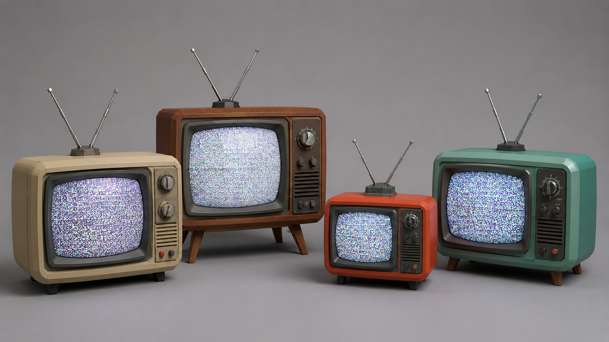
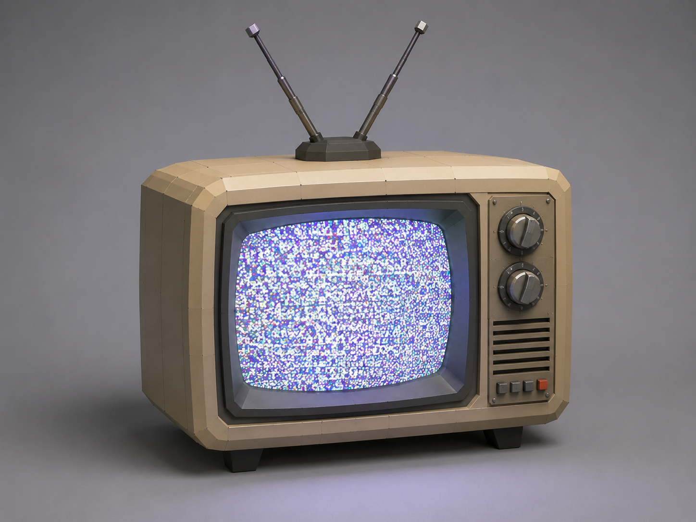

# Самостоятельная работа — Урок 2: Ретро-телевизор 📺

> 🧑‍🎓 Это задание ты делаешь **сам(а)**, применяя инструменты Edit Mode с урока. Учитель помогает, если застрял.

## Задание

На уроке мы делали sci-fi панель. Теперь — другой объект с теми же приёмами: собери **старый ретро-телевизор** (с пузатым экраном, кнопками и антенной-«рожками»).

> 💡 Этот телевизор встанет на полку рядом с роботом из прошлой практики — собираем общую сцену «моя комната».

| Референс — варианты ретро-ТВ | Пример результата |
|------------------------------|-------------------|
|  |  |

*Слева — разные ретро-телевизоры (форма корпуса, антенна-«рожки», ручки). Справа — пример готового: пузатый экран со «снегом»-помехами (Emission), кнопки, ножки. Собери **свой** в этом стиле.*

**Из чего состоит:**
- Корпус — куб (можно слегка пузатый)
- Экран — утопленная грань (Inset + Extrude внутрь), светится (Emission)
- Ручки-переключатели — маленькие цилиндры
- Кнопки — через Inset/Extrude
- Антенна — два тонких цилиндра «рожками» (V-образно)
- Ножки — короткие цилиндры

---

## Требования

- [ ] Использован **Inset + Extrude** для экрана (углубление)
- [ ] Использован **Loop Cut** или **Bevel** хотя бы раз
- [ ] Минимум **3 материала** (корпус, экран, ручки)
- [ ] Экран **светится** (Emission) — картинка/шум на экране
- [ ] Аккуратная сборка (антенна, ножки на месте)
- [ ] Рендер (`F12`)

---

## Подсказки

- Экран: выдели переднюю грань → `I` (рамка) → `E → внутрь` (углубление)
- Скруглить корпус ретро-ТВ — лёгкий Bevel по рёбрам
- «Помехи» на экране: яркий цветной Emission или текстура шума (забегаем вперёд)
- Антенна-рожки: цилиндр → наклонить `R`, продублировать и отзеркалить

---

## Что сдать

`.blend` + рендер.

Референсы и пример **встроены выше** (в разделе «Задание»). Подробности — в [изображения-практика.md](изображения-практика.md#ref).
