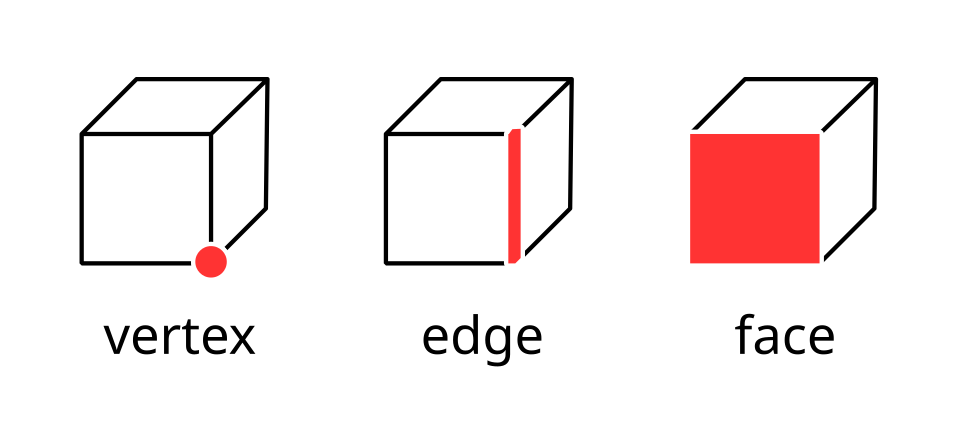

# Урок 2 — Edit Mode: 4 главных инструмента и sci-fi панель управления

**Модуль 1 | 2 академических часа (1,5 часа)**

---

## Цель урока

- Понять разницу между **Object Mode** и **Edit Mode**
- Освоить 4 главных инструмента моделирования: **Extrude, Inset, Loop Cut, Bevel**
- Узнать **разные способы Extrude** (региональный, по нормалям, отдельных граней)
- **Вместе создать sci-fi панель управления** со светящимися кнопками
- Научиться назначать несколько материалов на один объект и делать свечение (Emission)

---

## Часть 1 — Теория: Object Mode и Edit Mode (10 минут)

На прошлом уроке мы двигали объекты целиком и один раз заглянули «внутрь», чтобы заострить меч. Сегодня разберём это как следует.

| Режим | Что делаем | Аналогия |
|-------|-----------|----------|
| **Object Mode** | двигаем/вращаем/масштабируем объект целиком | переставляем мебель по комнате |
| **Edit Mode** | редактируем вершины, рёбра, грани | перешиваем саму мебель |

**Переключатель — клавиша `Tab`.** В Edit Mode объект становится оранжевым, видна вся его сетка.

### Вспоминаем «кирпичики» — теперь они кнопки

В Edit Mode есть три режима выделения. Это те самые вершины, рёбра и грани из урока 1:



*Клавиши `1`, `2`, `3` переключают, ЧТО мы выделяем: вершины / рёбра / грани. ([источник: Wikimedia Commons](https://commons.wikimedia.org/wiki/File:Vertex_edge_face.svg))*

| Клавиша | Режим | Выделяем |
|---------|-------|----------|
| `1` | Vertex | вершины (точки) |
| `2` | Edge | рёбра (линии) |
| `3` | Face | грани (плоскости) |

> 💡 **Фишка:** режим выделения **не меняет** объект — он только определяет, за что ты «хватаешь» меш. Один и тот же куб можно редактировать и по вершинам, и по граням.

---

## Часть 2 — Четыре главных инструмента (25 минут)

Разбираем каждый на свежем кубе, чтобы видеть результат. Добавь куб (`Shift + A → Cube`), войди в Edit Mode (`Tab`).

---

### 🔧 Extrude — выдавить (E)

Берём грань и «вытягиваем» из неё новую геометрию. Самый частый инструмент в моделировании!

1. `3` — режим граней
2. Клик на верхнюю грань
3. `E` → двигай мышь вверх → `ЛКМ` или Enter

Получилась ступенька.

> 💡 **Фишка — у Extrude несколько способов.** Нажми `Alt + E` (вместо `E`) — откроется меню со всеми вариантами:

| Способ | Как вызвать | Что делает | Где пригодится |
|--------|-------------|------------|----------------|
| **Region** (обычный) | `E` | выдавливает выделение как одно целое | ступеньки, башни, выступы |
| **Along Normals** | `Alt+E` → *Along Normals* | выдавливает **перпендикулярно** каждой грани | толщина на изогнутой поверхности |
| **Individual Faces** | `Alt+E` → *Individual Faces* | каждая грань тянется отдельно | шипы, зубцы, кристаллы |
| **Extrude на месте** | `E` → сразу Enter | дублирует грань без сдвига | потом масштабировать `S` |
| **По оси** | `E` → `Z` (или X/Y) | выдавить строго по оси | ровные выступы |

> 💡 **Фишка — `E` + ось + число:** работает наш паттерн с урока 1! `E → Z → 0.5` выдавит грань ровно на 0.5 вверх. Точно и без «дрожащей руки».

> ⚠️ **Частая ошибка:** случайно нажал `E` и кликнул — грань выдавилась на месте, образовалась «слипшаяся» геометрия. Если видишь странные тёмные грани — нажми `Ctrl+Z` и повтори аккуратнее.

> 📷 Скриншот Extrude учитель показывает вживую на экране (описание для генерации — [изображения.md](изображения.md)).

---

### 🔧 Inset — вставка грани (I)

Создаёт новую грань **внутри** выделенной.

1. Выдели верхнюю грань
2. `I` → двигай мышь → Enter

Идеально для кнопок, экранов, иллюминаторов!

> 💡 **Фишка — Inset + Extrude = углубление:** сделай `I` (рамка), затем `E → Z → -0.2` (вдавить внутрь). Так получаются утопленные кнопки и панели.

> 💡 **Фишка — `I` дважды:** нажми `I`, потом ещё раз `I` — Inset применится к **каждой** выделенной грани отдельно, а не ко всем как к одной.

---

### 🔧 Loop Cut — петля разреза (Ctrl + R)

Разрезает меш петлёй по кругу.

1. `Ctrl + R`
2. Наведи на куб — появится **жёлтая линия**
3. Прокрути колесо мыши → добавь несколько петель
4. `ЛКМ` подтвердить → `ПКМ` поставить по центру (или двигай мышью)

> 💡 **Фишка:** петли Loop Cut дают «суставы» для сгибания и дополнительные грани для деталей. Чем больше петель у объекта — тем точнее можно его деформировать.

---

### 🔧 Bevel — фаска (Ctrl + B)

Скругляет или срезает острое ребро.

1. `2` — режим рёбер
2. Выдели ребро
3. `Ctrl + B` → двигай мышь → **крути колесо** (добавляет сегменты) → Enter

> 💡 **Фишка:** в реальном мире нет идеально острых рёбер — у всего есть микро-фаска. Лёгкий Bevel мгновенно делает модель «дороже» и реалистичнее, потому что ловит блик света на ребре.

> 💡 **Фишка — выделение петли рёбер:** наведи на ребро и нажми `Alt + ЛКМ` — выделится **вся петля рёбер** по кругу. Удобно перед Bevel, чтобы скосить ребро целиком.

---

## Часть 3 — Строим sci-fi панель управления (40 минут)

Делаем панель как с пульта космического корабля:

```
┌──────────────────────────────────┐
│  [●][●][●]      [████ экран ████] │
│                                   │
│  [▼──────── слот ──────────▼]    │
│                                   │
│  [◆] [◆] [◆] [◆] [◆]            │
└──────────────────────────────────┘
```

> 📷 [изображения.md](изображения.md) → «Референс sci-fi панели» (промпт для генерации)

### Шаг 1 — Основа панели

1. `Shift + A → Mesh → Cube`
2. `S → X → 3` → Enter *(шире)*
3. `S → Z → 2` → Enter *(выше)*
4. `S → Y → 0.2` → Enter *(тонкая пластина)*
5. `Ctrl + A → All Transforms`

> 💡 **Фишка — зачем `Ctrl + A` после масштаба:** мы сильно растянули куб, и Blender помнит «искажённый» масштаб. Если оставить так — Bevel, модификаторы и текстуры будут вести себя криво. `Ctrl + A → All Transforms` «обнуляет» масштаб до 1.0, сохранив форму. **Делай это после каждого масштабирования — выработай привычку.**

### Шаг 2 — Рамка (Inset + Extrude)

1. `Tab` → Edit Mode, `3` — грани
2. `Numpad 1` — вид спереди
3. `Alt + A` снять выделение → `ЛКМ` на переднюю грань
4. `I` → немного внутрь → Enter *(рамка)*
5. `E → Y → -0.05` → Enter *(утопить центр)*

### Шаг 3 — Кнопки (три круглые)

1. `Tab` → Object Mode
2. `Shift + A → Mesh → Cylinder` → `F9`: **Vertices: 12**
3. `S → 0.25` → Enter, затем `S → Y → 0.3` → Enter *(сплюснуть)*
4. `G` → прижми к панели слева сверху (примерно `X -1.2, Z 0.5, Y -0.22`)
5. Дублируй: `Shift + D → X → 0.6` → Enter — и ещё раз *(три кнопки)*

> 💡 **Фишка — `Shift + D` (дублировать):** делает независимую копию. Сразу после можно задать ось и число: `Shift+D → X → 0.6` поставит копию ровно на 0.6 правее. Не нужно «ловить» мышью.

> 💡 **Фишка — `Alt + D` (связанная копия):** если кнопок будет много и одинаковых — используй `Alt + D`. Тогда, изменив форму одной кнопки в Edit Mode, изменишь сразу все. Экономит время на повторках.

### Шаг 4 — Экран

1. `Shift + A → Mesh → Plane`
2. `S → X → 0.7, S → Z → 0.4` → Enter
3. `G` → прижми справа сверху (`X 0.7, Z 0.5, Y -0.21`)

### Шаг 5 — Слот (щель)

1. `Shift + A → Mesh → Cube`
2. `S → X → 2, S → Z → 0.1, S → Y → 0.05`
3. `G` → по центру (`Z 0, Y -0.225`)

### Шаг 6 — Ряд маленьких кнопок

1. `Shift + A → Mesh → Cylinder` → `F9`: **Vertices: 8**
2. `S → 0.15` → Enter
3. `G` → слева снизу (`X -1.0, Z -0.5, Y -0.22`)

> 🎯 **ЛАЙФХАК — показать здесь!**
> Перед тем как наклепать ряд кнопок, покажи детям лайфхак **Extrude Individual Faces** (полностью в [лайфхак.md](лайфхак.md)) — как из одного куба сделать «ёжика» с шипами. Это и весело, и наглядно показывает разницу способов Extrude, которые мы разобрали в Части 2. После «вау» — спокойно дублируем кнопки через `Shift + D`.

4. `Shift + D → X → 0.5` — повтори, чтобы получить 5 кнопок в ряд

---

## Часть 4 — Материалы и свечение (15 минут)

### Несколько материалов на одном объекте

Разным граням одного меша можно дать разные материалы — мощный приём!

**Основа панели:**
1. Выдели панель → Material Properties → **New** → назови «Панель»
2. Цвет: тёмно-серый с синевой (0.15, 0.15, 0.2), Roughness 0.6, Metallic 0.3

**Добавить второй материал на ту же панель (рамка):**
1. В списке материалов нажми **+** → **New** → «Рамка», цвет темнее
2. В Edit Mode выдели грани рамки → кнопка **Assign**

> 💡 **Фишка — как назначить материал на часть объекта:** материал применяется к выделенным граням только после нажатия **Assign**. Забыл выделить грани — материал «накроет» весь объект.

### Свечение (Emission)

**Кнопки (3 шт):** выдели все три (`Shift+ЛКМ`) → материал ярко-красный → **Emission Color** красный, **Emission Strength** 2.0.

**Экран:** тёмно-синий → Emission Color голубой, Strength 3.0.

> 💡 **Фишка — что такое Emission:** обычный материал只 отражает свет. **Emission** заставляет поверхность **светиться саму** — как лампочка или экран. В движке EEVEE добавь эффект **Bloom** (Render Properties → Bloom), и свечение «расплывётся» красивым ореолом.

### Смотрим результат

`Z → Material Preview` или `Rendered` — видно светящиеся кнопки и экран!

> 📷 [изображения.md](изображения.md) → «Готовая панель с материалами» (промпт)

---

## Итог урока

Сегодня мы:
- ✅ Разобрали Object Mode и Edit Mode, три режима выделения
- ✅ Освоили Extrude (и его **разные способы**), Inset, Loop Cut, Bevel
- ✅ Построили sci-fi панель из нескольких объектов
- ✅ Научились назначать несколько материалов и делать свечение Emission
- ✅ Узнали про `Ctrl+A`, `Shift+D`, `Alt+D`, `Alt+ЛКМ` (петля)

---

## Лайфхак урока

👉 [лайфхак.md](лайфхак.md) — **способы Extrude и «ёжик» из Individual Faces** (показывается на Шаге 6)

## Самостоятельная работа

👉 [практика.md](практика.md) — собери свой пульт управления
