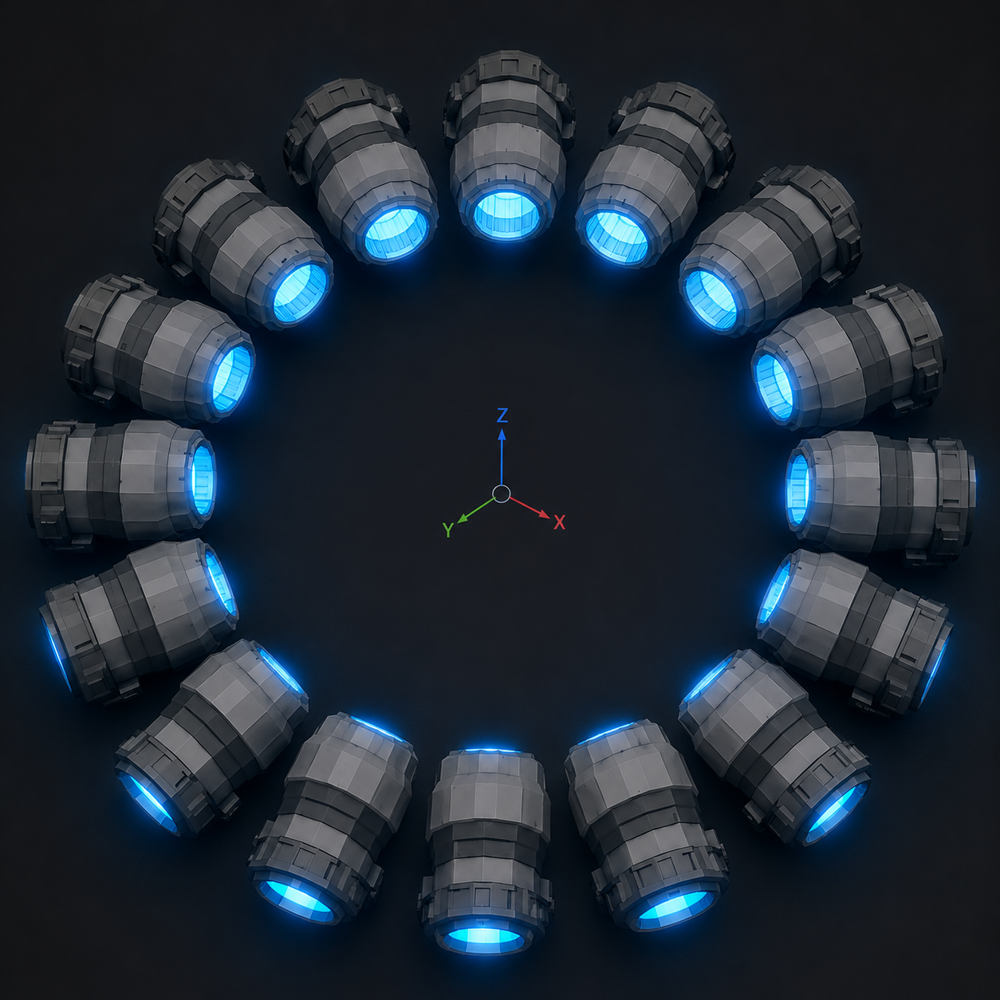

# Лайфхак урока 3 — Array по кругу (радиальный массив через Empty)

> Один из самых полезных приёмов в Blender. Им делают: кольца двигателей, иллюминаторы по кругу, зубья шестерёнок, спицы колеса, лепестки цветка, циферблат часов, колоннаду.

---

## Идея

Обычный Array ставит копии **в ряд**. Но если «сместитель» — это вращающаяся **пустышка (Empty)**, то каждая следующая копия не просто сдвигается, а **поворачивается** вокруг центра. Копии выстраиваются **по кругу**.

---

## Пошагово: кольцо двигателей вокруг хвоста корабля

### Шаг 1 — Объект для размножения

Возьми один двигатель (цилиндр). Помести его на **расстоянии** от центра — например, сдвинь вбок: `G → X → 1`. Это будет «радиус» кольца.

> ⚠️ Важно: объект должен стоять **в стороне** от центра вращения, иначе кольца не получится — всё схлопнется в одну точку.

### Шаг 2 — Добавить пустышку (Empty)

`Shift + A → Empty → Plain Axes`

Empty — это «невидимый» вспомогательный объект. Он не рендерится, но может управлять другими. Оставь его **в центре** (координаты 0, 0, 0).

> 💡 **Фишка:** проверь, что Empty стоит ровно в центре. Если нет — `Shift + C` ставит 3D-курсор в центр, затем `Object → Set Origin`... или просто обнули позицию Empty в N-панели (Location = 0,0,0).

### Шаг 3 — Связать Array с Empty

1. Выдели **двигатель** (не Empty!)
2. Добавь модификатор **Array** (если ещё нет)
3. **Выключи** Relative Offset (сними галочку)
4. **Включи** ✅ **Object Offset**
5. В поле Object выбери свою **Empty**

Пока ничего не изменилось — Empty не повёрнута.

### Шаг 4 — Повернуть Empty = магия по кругу

1. Выдели **Empty**
2. `R → Y → 45` → Enter *(поверни на 45° вокруг оси корабля)*
3. Смотри: копии двигателя **разошлись веером по дуге!**

> Ось вращения зависит от того, как ориентирован корабль. Если кольцо легло не в той плоскости — пробуй `R → X` или `R → Z` вместо `R → Y`.

### Шаг 5 — Замкнуть кольцо

- Выдели двигатель → в Array увеличивай **Count**.
- Подбери угол поворота Empty и Count так, чтобы кольцо замкнулось ровно.

**Формула:** угол = 360 ÷ количество копий.
- 8 копий → поворот Empty на **45°** (360/8)
- 6 копий → **60°**
- 12 копий → **30°**

> 💡 **Фишка:** хочешь и сдвиг по высоте (спираль/пружина)? Помимо поворота, ещё и подвинь Empty по оси: `G → Y → 0.1`. Получишь винтовую расстановку.

---

## Где ещё применить

| Объект | Что размножаем по кругу |
|--------|-------------------------|
| ⚙️ Шестерёнка | зубья |
| 🚀 Корабль | кольцо двигателей, иллюминаторы |
| 🎡 Колесо обозрения | кабинки |
| 🕐 Часы | деления циферблата |
| 🏛 Храм | колонны вокруг |
| 🌸 Цветок | лепестки |

---

## Шпаргалка

1. Объект **в стороне** от центра
2. `Shift+A → Empty` в центре
3. Array → выкл **Relative**, вкл **Object Offset** → выбрать Empty
4. Повернуть **Empty** на `360 ÷ Count` градусов
5. Поднять **Count** до замыкания кольца

*Радиальный Array через пустышку (Empty): копии расставлены по кругу вокруг центра — кольцо двигателей/иллюминаторов.*
