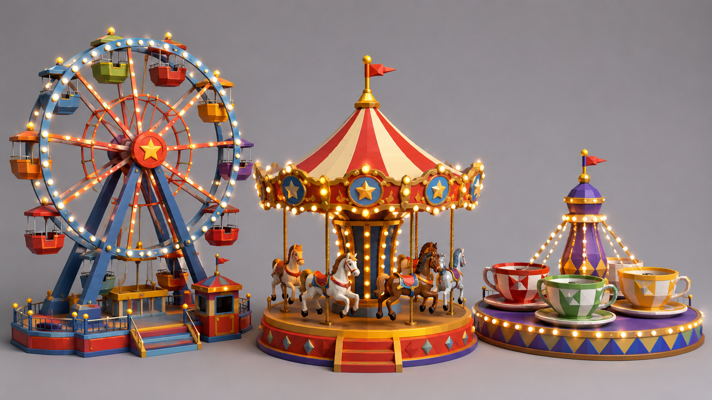

# Самостоятельная работа — Урок 3: Карусель или колесо обозрения 🎡

> 🧑‍🎓 Делаешь сам(а), применяя Mirror и Array. Учитель помогает, если застрял.

## Задание

На уроке мы делали космический корабль. Теперь — аттракцион! Собери **карусель** или **колесо обозрения**, где главную роль играет **радиальный Array** (копии по кругу).

> 💡 Этот аттракцион станет частью общей сцены «парк развлечений» вместе с объектами из будущих практик.

*Референс low-poly аттракционов: **колесо обозрения** (кабинки и спицы — радиальный Array), **карусель** (лошадки по кругу — Array + Empty), **чашки** (радиальная симметрия). Выбери один и собери, опираясь на **радиальный Array** и **Mirror**.*

**Колесо обозрения:**
- Большое кольцо (Torus) — основа
- Кабинки — куб/капсула → **Array по кругу через Empty**
- Спицы к центру — тонкие цилиндры (тоже радиальный Array)
- Опоры — две наклонные «ноги» (симметрия **Mirror**)

**Карусель:**
- Крыша-шатёр (конус)
- Лошадки/кабинки → радиальный Array по кругу
- Столбики — Array
- Основание — цилиндр

---

## Требования

- [ ] Использован **радиальный Array через Empty** (копии по кругу)
- [ ] Использован **Mirror** ИЛИ линейный Array
- [ ] Правильно подобран угол: 360 ÷ количество копий
- [ ] Минимум **4 материала** (металл, яркие цвета аттракциона)
- [ ] Хотя бы один элемент **светится** (гирлянда, лампочки)
- [ ] Рендер (`F12`)

---

## Подсказки

- Кабинки/лошадки: один объект отодвинь от центра → Array → Object Offset → Empty → поверни Empty
- Гирлянда лампочек по кругу — тоже радиальный Array маленьких сфер с Emission
- Опоры колеса: сделай одну, отзеркаль Mirror
- Аттракционы яркие — не бойся сочных цветов!

---

## Что сдать

`.blend` + рендер.

Референс **встроен выше** (в разделе «Задание»). Подробности — в [изображения-практика.md](изображения-практика.md#ref).
