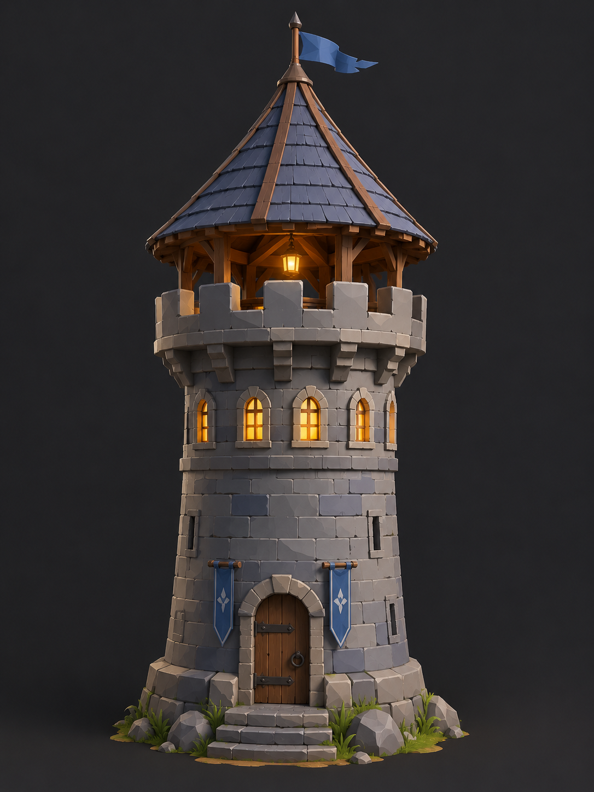
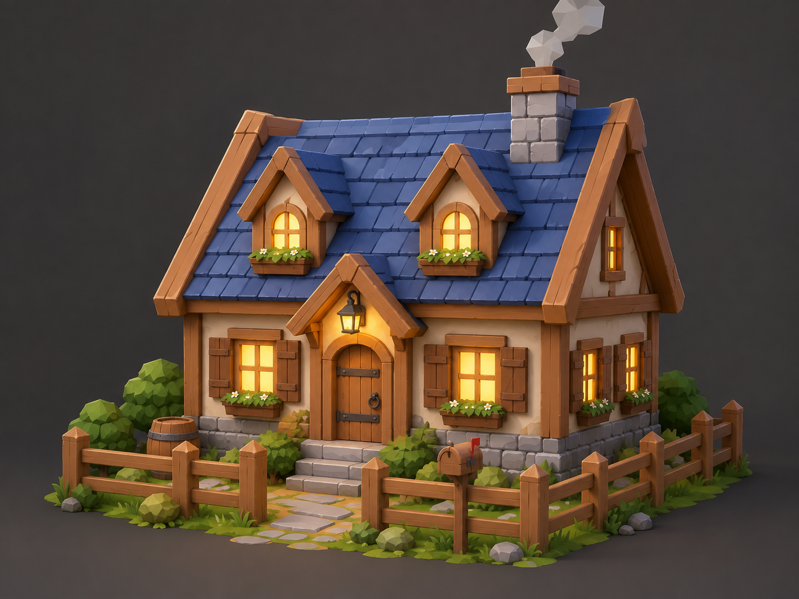

# Самостоятельная работа — Урок 3: Своя башня или домик 🗼🏠

> 🧑‍🎓 Делаешь сам(а), применяя **Mirror** и **Array** с урока. Учитель помогает, если застрял. Задание **простое** — главное закрепить модификаторы.

## Задание

На уроке мы построили целый замок. Теперь собери **что-то одно** из его «мира» — попроще:

- 🗼 **Сторожевую башню** *(рекомендую — самое лёгкое)*
- 🏠 **Домик** рядом с замком
- 🎡 **Карусель / колесо обозрения** *(если хочешь challenge посложнее)*

> 💡 Твой объект встанет рядом с замком — собираем общую сцену «королевство».

---

## 🗼 Вариант 1 — Сторожевая башня (самый простой)

*Пример результата: круглая башня, зубцы по кругу, конусная крыша с флажком, ряд светящихся окошек, дверь. Собери свою в этом духе.*

Всего 4–5 деталей, зато и Mirror, и Array:
- **Башня** — `Cylinder` (круглая) или `Cube` (квадратная).
- **Зубцы по кругу/в ряд** — один кубик → **Array** (по кругу через Empty — как на уроке, или просто в ряд).
- **Крыша** — `Cone` (конус) сверху.
- **Окна-бойницы** — маленький куб → **Array** вверх (ряд окошек).
- **Дверь** — куб; перенеси её **Origin** на край, чтобы открывалась (повтор урока).

✅ *Результат:* аккуратная башенка с зубцами, крышей и рядом окон.

---

## 🏠 Вариант 2 — Домик

*Пример результата: симметричная двускатная крыша (Mirror), окна в ряд (Array), заборчик (Array), светящиеся окна. Детали — на твой вкус.*

- **Стены** — `Cube`.
- **Крыша** — призма (Cube → в Edit Mode сдвинь верхние вершины в конёк) — **симметрична**, можно строить половину и **Mirror**.
- **Окна в ряд** — маленький куб → **Array** по стене.
- **Заборчик** — тонкий столбик → **Array** в ряд перед домом.
- **Дверь** — с перенесённым **Origin** (открывается).

✅ *Результат:* уютный домик с окошками и заборчиком.

---

## 🎡 Вариант 3 — Карусель / колесо обозрения (посложнее, по желанию)

*Референс: **колесо обозрения** (кабинки и спицы — радиальный Array), **карусель** (лошадки по кругу — Array + Empty). Главное — **радиальный Array**.*

- Колесо: большое кольцо (Torus) + кабинки по кругу (Array + Empty) + спицы + две опоры (**Mirror**).
- Карусель: шатёр-конус + лошадки по кругу (Array + Empty) + столбики.

---

## Требования (для любого варианта)

- [ ] Использован **Array** (зубцы / окна / кабинки / заборчик)
- [ ] Использован **Mirror** ИЛИ **радиальный Array по кругу** (через Empty)
- [ ] Хотя бы у одной детали правильно перенесён **Origin** (дверь/створка открывается)
- [ ] Минимум **3 материала**
- [ ] Хотя бы один элемент **светится** (окно/факел/гирлянда — Emission + Bloom)
- [ ] Рендер (`F12`)

---

## 💡 Подсказки

- **Зубцы/окна в ряд:** один кубик → Array → покрути **Count** и **Factor**.
- **По кругу (Array + Empty):** зубец отодвинь на радиус **в Edit Mode** (`Tab → A → G X 1 → Tab`) → `Shift+C` → добавь **Empty** в центр → у зубца Array: снять Relative, включить **Object Offset → Empty** → выдели **Empty** и поверни `R Z (360 ÷ Count)`.
- **Симметрия:** строишь половину → **Mirror** (не забудь **Clipping**).
- **Дверь открывается:** выдели ребро-петлю → `Shift+S → Cursor to Selected` → `Object → Set Origin → Origin to 3D Cursor` → крути `R`.
- **Свечение:** материал → **Emission** + Strength, включи **Bloom** (Render Properties).
- Не бойся простых форм — красиво выходит и из кубиков с цилиндрами.

> ⚠️ **Если кольцо по кругу НЕ получается** (частая проблема!):
> - **Вышла прямая линия, а не круг** → ты **не повернул Empty** (или повернул сам зубец). Крутить надо **Empty**: выдели её → `R Z 20` (для 18 копий).
> - **Кольцо уехало вбок, не вокруг башни** → у зубца точка опоры (Origin) **не в центре**. Двигай зубец **в Edit Mode**, а не в Object Mode; либо `Shift+C` → `Object → Set Origin → Origin to 3D Cursor`.
> - **Все копии в куче** → Empty стоит без поворота — поверни её.
> - Полная таблица разбора — в [лайфхак.md](лайфхак.md).

---

## Что сдать

`.blend` + рендер.

Референс аттракционов — в разделе «Вариант 3». Подробности — в [изображения-практика.md](изображения-практика.md#ref).
