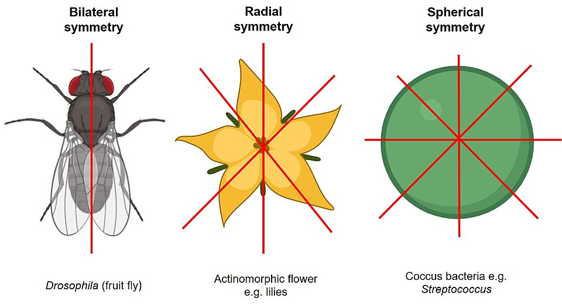
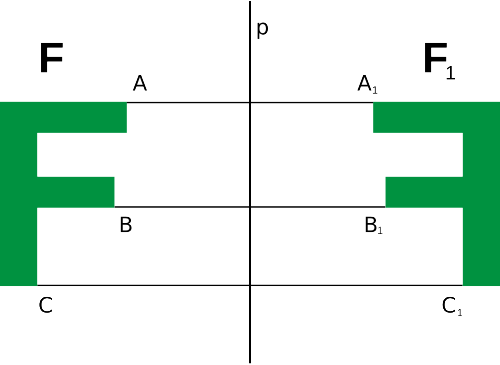

# Урок 3 — Модификаторы Mirror и Array: строим космический корабль

**Модуль 1 | 2 академических часа (1,5 часа)**

> 🔁 В начале урока — [повторение урока 2](повторение.md) («сделай сам», 5–7 мин)

---

## Цель урока

- Понять, **что такое модификатор** и стек модификаторов
- Освоить **Mirror** — симметрия (лепим половину, получаем целое)
- Освоить **Array** — массив копий (линейный и **по кругу**)
- **Вместе построить космический корабль** с симметричными крыльями и рядом двигателей
- Научиться правильно применять (Apply) модификаторы

---

## Часть 1 — Теория: что такое модификатор (10 минут)

**Модификатор** — это «умная надстройка» над объектом. Он меняет вид модели, **не трогая** исходную геометрию. Его можно в любой момент включить, выключить, настроить или удалить.

> Представь фотофильтр в телефоне: фото остаётся прежним, а фильтр меняет картинку. Снял фильтр — фото как было. Модификатор работает так же.

**Где живут модификаторы:** правая панель Properties → вкладка с иконкой 🔧 (**гаечный ключ**) → кнопка **«Добавить модификатор»**.

### Стек модификаторов — порядок важен!

Можно навесить несколько модификаторов друг на друга — это **стек**. Они применяются **сверху вниз**, и каждый получает результат предыдущего.

> 💡 **Фишка:** порядок в стеке решает всё. Например, Mirror **перед** Array — корабль сначала отзеркалится, потом размножится. Array **перед** Mirror — наоборот. Результаты разные! Перетаскивай модификаторы за иконку `⠿`, чтобы менять порядок.

> 📷 **[Вставь сюда картинку: панель модификаторов и стек →](изображения.md#modifiers-panel)**

### Два модификатора — два вида симметрии

Сегодняшние модификаторы делают объект симметричным, но по-разному:

*Слева — **зеркальная** (bilateral) симметрия: это наш **Mirror**. В центре — **радиальная** (radial): это **Array по кругу**. ([источник: Wikimedia Commons, CC BY-SA](https://commons.wikimedia.org/wiki/File:Diagram_comparing_bilateral,_radial,_and_spherical_symmetry.jpg))*

- **Mirror** = зеркальная симметрия (у мухи, бабочки, лица, машины) — одна ось, две одинаковые половины.
- **Array по кругу** = радиальная симметрия (у цветка, снежинки, шестерёнки) — повтор по кругу.

---

## Часть 2 — Mirror: симметричный корпус (25 минут)

Главная идея симметрии: **лепим только половину, а вторую делает Mirror.** Это вдвое меньше работы и идеальная симметрия.

*Mirror работает как зеркало по оси `p`: что слепили слева (F) — точно повторяется справа (F₁). ([источник: Wikimedia Commons](https://commons.wikimedia.org/wiki/File:Reflection_symmetry.svg))*

### Шаг 1 — Фюзеляж (корпус)

1. `Shift + A → Mesh → Cylinder` → `F9`: **Vertices: 8**
2. `R → X → 90` → Enter *(положить цилиндр горизонтально, носом вперёд по Y)*
3. `S → Y → 3` → Enter *(вытянуть в длину)*
4. `S → 0.6` → Enter *(чуть тоньше)*

> 💡 **Фишка — вращение объекта:** чтобы повернуть, нажми `R`, затем ось (`X`/`Y`/`Z`), затем угол. `R → X → 90` повернёт ровно на 90° вокруг красной оси. Вращение идёт вокруг **точки опоры (Origin)** — оранжевой точки объекта.

### Шаг 2 — Нос корабля заострим

1. `Tab` → Edit Mode, `3` — грани
2. `Numpad 3` — вид сбоку, найди переднюю грань (по +Y)
3. Выдели её → `S → 0.3` → Enter *(сузить нос)*
4. `G → Y → 0.5` → Enter *(вытянуть вперёд)*
5. `Tab` → назад в Object Mode

### Шаг 3 — Одно крыло (в Edit Mode)

Делаем **только правое** крыло — левое создаст Mirror.

1. `Tab` → Edit Mode, `3` — грани
2. `Numpad 1` — вид спереди
3. Найди и выдели боковую грань корпуса справа (по +X)
4. `E → X → 1.5` → Enter *(выдавить крыло вбок)*
5. `S → Y → 0.6` → Enter *(сделать крыло короче по длине)*
6. `Tab` → Object Mode

### Шаг 4 — Включаем Mirror

1. Вкладка 🔧 → **Добавить модификатор → Generate → Mirror**
2. По умолчанию зеркалит по оси **X** — и слева появляется второе крыло! ✨
3. Включи галочку **Clipping**

> 💡 **Фишка — что такое Clipping:** Mirror отражает относительно **Origin** объекта (центра корабля). Галочка **Clipping** не даёт вершинам «перейти» через центр и разойтись — шов по центру остаётся склеенным. Включай её всегда при симметричном моделировании.

> 💡 **Фишка — Mirror зеркалит от Origin:** если вторая половина появилась не там (с отступом или внахлёст) — значит Origin корабля не по центру. Поправить: `Object → Set Origin → Origin to Geometry`.

> 📷 **[Вставь сюда картинку: крыло до и после Mirror →](изображения.md#mirror)**

---

## Часть 2.5 — Origin: как двигать точку опоры (важно!)

**Origin** (оранжевая точка) — это «центр» объекта. Вокруг неё идут вращение и масштаб, от неё считают Mirror и модификаторы. Часто Origin нужно **переместить** — например, чтобы дверь вращалась от петли, а не от середины.

**Три способа задать Origin** (`Object → Set Origin → …`):

| Команда | Куда ставит Origin |
|---------|--------------------|
| **Origin to Geometry** | в центр самого объекта |
| **Origin to 3D Cursor** | туда, где стоит 3D-курсор |
| **Origin to Center of Mass** | в центр массы (для сложных форм) |

**Как поставить Origin в нужную точку (через 3D-курсор):**
1. В Edit Mode выдели нужную вершину/ребро (например, заднее ребро двери)
2. `Shift + S → Cursor to Selected` — 3D-курсор прыгнул туда
3. `Tab` → Object Mode
4. `Object → Set Origin → Origin to 3D Cursor`
5. Теперь объект вращается **вокруг этой точки**!

> 💡 **Фишка — двигать ТОЛЬКО Origin вручную:** включи в шапке `Options → ✅ Affect Only Origins` (или в старых версиях — Edit → Preferences). Тогда `G` двигает **саму точку опоры**, не трогая меш. Не забудь выключить после!

> 💡 **Фишка — `Shift + C`:** возвращает 3D-курсор в центр мира (0,0,0). Спасает, когда курсор «уехал».

> 📷 **[Вставь сюда картинку: перемещение Origin (3 способа) →](изображения.md#origin)**

---

## Часть 3 — Array: ряд двигателей (20 минут)

**Array** создаёт цепочку копий объекта. Сделаем ряд одинаковых двигателей.

### Шаг 1 — Один двигатель

1. `Shift + A → Mesh → Cylinder` → `F9`: **Vertices: 12**
2. `R → X → 90` → Enter, `S → 0.25` → Enter, `S → Y → 0.6` → Enter
3. `G` → перемести к хвосту корабля (сзади, по -Y), сбоку от корпуса

### Шаг 2 — Размножаем через Array

1. Вкладка 🔧 → **Добавить модификатор → Generate → Array**
2. **Count: 3** — стало три двигателя!
3. Параметр **Factor X** (в Relative Offset) двигает копии по X — поставь, чтобы двигатели встали рядком вдоль крыла

> 💡 **Фишка — два вида смещения в Array:**
> - **Relative Offset** — смещение в долях размера объекта (1.0 = вплотную друг к другу). Меняется при масштабировании.
> - **Constant Offset** — смещение в метрах Blender, не зависит от размера. Удобно для точных расстояний.

> 💡 **Фишка — Array идёт от оригинала:** двигаешь или вращаешь исходный двигатель — вся цепочка повторяет. Это и есть сила модификатора: настроил один — получил много.

> 📷 **[Вставь сюда картинку: линейный Array (ряд двигателей) →](изображения.md#array)**

---

## Часть 3.5 — Transform Pivot Point: вокруг чего вращать

Когда ты вращаешь (`R`) или масштабируешь (`S`) несколько объектов — Blender делает это вокруг **Pivot Point** (точки трансформации). Её можно менять!

Кнопка вверху центра 3D Viewport (или клавиша `.` — точка — открывает круговое меню):

| Pivot Point | Вокруг чего |
|-------------|-------------|
| **Median Point** | вокруг общего центра выделения (по умолчанию) |
| **3D Cursor** | вокруг 3D-курсора (можно поставить куда угодно!) |
| **Individual Origins** | каждый объект вокруг **своего** Origin |
| **Active Element** | вокруг активного (последнего выбранного) |
| **Bounding Box Center** | вокруг центра габаритного бокса |

**Попробуй:** выдели 3 двигателя → переключи Pivot на **Individual Origins** → `S` — каждый масштабируется вокруг себя. Переключи на **3D Cursor** → `R` — все вращаются вокруг курсора, как карусель.

> 💡 **Фишка:** Pivot Point + 3D Cursor — ручной способ «вращать по кругу» без модификатора. А автоматический способ (через Empty) — прямо сейчас в лайфхаке 👇

> 📷 **[Вставь сюда картинку: меню Transform Pivot Point →](изображения.md#pivot)**

---

## 🎯 ЛАЙФХАК — кольцо двигателей по кругу!

> **Показать здесь!** Дети только что сделали Array в ряд. Самое время показать «магию» — как заставить копии **расставляться по кругу и поворачиваться**. Это твой пример из ТЗ.
>
> Полный пошаговый разбор — в [лайфхак.md](лайфхак.md). Кратко суть:
> 1. Добавить пустышку: `Shift + A → Empty → Plain Axes` (в центре корабля)
> 2. У двигателя в Array включить **Object Offset → выбрать Empty**
> 3. Повернуть **Empty**: `R → Y → 45` — и копии веером встают по кругу!
> 4. Увеличить **Count** — кольцо замыкается.
>
> Так делают: кольца двигателей, иллюминаторы по кругу, зубья шестерёнок, лепестки, спицы колеса.

---

## Часть 4 — Apply и материалы (15 минут)

### Когда «запекать» модификатор (Apply)

Пока модификатор живой — его можно менять. Но для текстур, экспорта или ручной правки его нужно **применить** (Apply) — превратить в реальную геометрию.

`Ctrl + A` на модификаторе (или выпадающее меню `⌄` → **Apply**).

> ⚠️ **Фишка — Apply необратим!** После Apply настройки модификатора пропадут, останется «застывшая» геометрия. Применяй, только когда уверен. Совет: сначала **сохрани копию файла**, потом применяй.

> 💡 **Фишка — Apply нужен порядок:** применять модификаторы надо **сверху вниз** по стеку. Blender не даст применить нижний раньше верхнего.

### Материалы корабля

- **Корпус и крылья:** металл — Base Color серо-голубой, Metallic 0.8, Roughness 0.4
- **Двигатели (сопла):** тёмный металл, Metallic 1.0, Roughness 0.2
- **Свечение двигателей:** добавь внутри сопла маленький диск/сферу с **Emission** голубого/оранжевого цвета, Strength 5 — корабль «завёлся»!

`Z → Material Preview` → любуемся. `F12` → рендер!

> 📷 **[Вставь сюда картинку: готовый космический корабль →](изображения.md#ship-final)**

---

## Итог урока

Сегодня мы:
- ✅ Поняли, что такое модификатор и стек
- ✅ Освоили **Mirror** (симметрия + Clipping)
- ✅ Освоили **Array** (линейный и **по кругу через Empty**)
- ✅ Построили космический корабль с крыльями и двигателями
- ✅ Научились применять модификаторы (Apply) и не бояться их

---

## Лайфхак урока

👉 [лайфхак.md](лайфхак.md) — **Array по кругу через Empty** (показывается после Части 3)

## Самостоятельная работа

👉 [практика.md](практика.md) — построй свой космический корабль или станцию

---

## Навигация

⬅️ [Урок 2](../урок-02/урок.md)  ·  🔁 [Повторение](повторение.md)  ·  ➡️ **Следующий урок: [Урок 4 — Subdivision, Solidify и лазерный меч](../урок-04/урок.md)**
