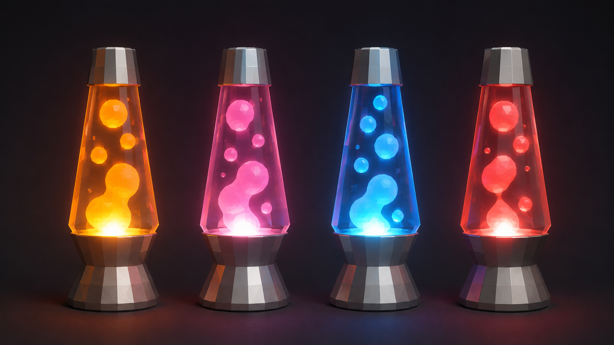
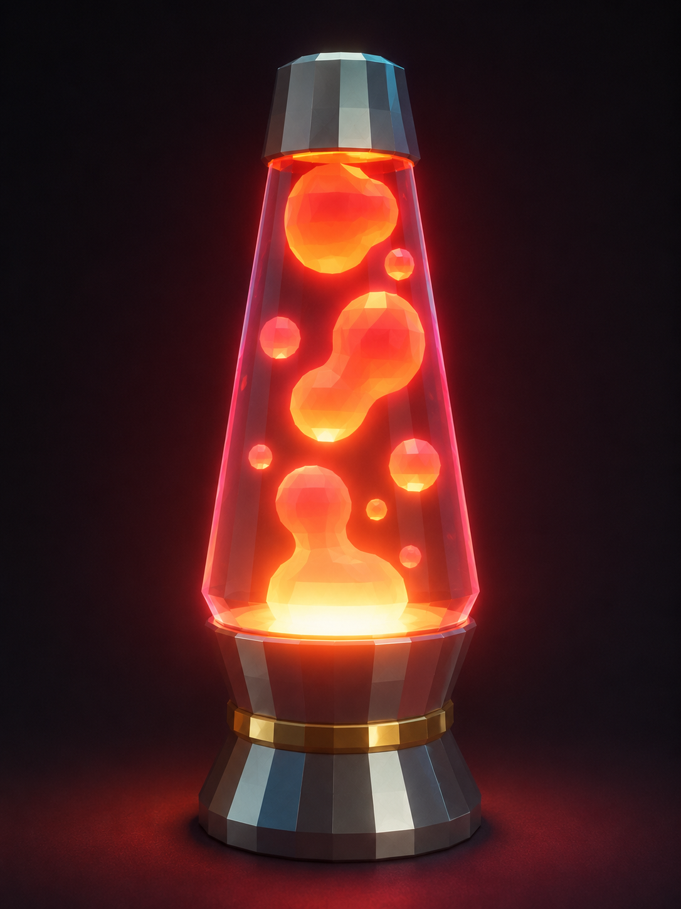

# Самостоятельная работа — Урок 4: Лава-лампа 🔮

> 🧑‍🎓 Делаешь сам(а), применяя SubSurf, Solidify и Emission. Учитель помогает, если застрял.

## Задание

На уроке мы делали лазерный меч. Теперь — уютный светящийся предмет: собери **лава-лампу** (колба с плавающими светящимися каплями).

*Референсы: сужающаяся кверху колба (стекло), металлические основание и крышка, внутри — плавающие светящиеся капли разного размера. Цвет лавы выбери свой (оранжевый / розовый / голубой / красный).*

> 💡 Лава-лампа встанет на полку рядом с роботом и ретро-телевизором — наша сцена «моя комната» растёт.

**Из чего состоит:**
- Колба — цилиндр со сглаживанием (**SubSurf**), сужается кверху
- Капли «лавы» — сферы с **SubSurf**, разного размера, светятся (**Emission**)
- Основание и крышка — цилиндры с фаской/толщиной (**Solidify** на декоративном кольце)
- Подсветка снизу — светящийся диск

---

## Требования

- [ ] Использован **Subdivision Surface** (колба, капли — гладкие)
- [ ] Применены **поддерживающие петли** ИЛИ Edge Crease (форма колбы)
- [ ] Использован **Solidify** хотя бы раз (кольцо/крышка)
- [ ] Капли и подсветка **светятся** (Emission + Bloom)
- [ ] Минимум 3 материала (стекло колбы, металл основания, лава)
- [ ] Рендер в режиме **Rendered** (`F12`)

---

## Подсказки

- Колба: цилиндр → `Ctrl+2` → Shade Smooth → support loops у краёв, чтобы не «поплыла»
- Капли: сферы разного размера, можно слегка сплющить `S → Z`
- Стекло колбы: материал с прозрачностью (или просто светлый Roughness)
- Тёплый цвет лавы (оранжевый/розовый) + Bloom = уют

---

## Что сдать

`.blend` + рендер (в режиме Rendered, чтобы было видно свечение).

*Пример результата: гладкая колба, несколько светящихся капель разного размера, металлическое основание с декоративным кольцом (Solidify), свечение снизу освещает сцену (Emission + Bloom). Твоя может быть другого цвета.*
