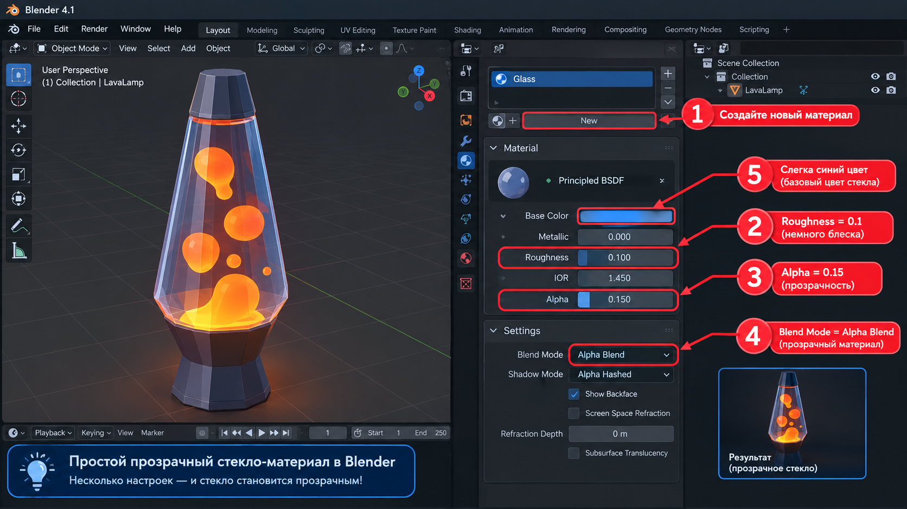

# Самостоятельная работа — Урок 4: Лава-лампа 🔮

> 🧑‍🎓 Делаешь сам(а), применяя SubSurf, Solidify и Emission. Учитель помогает, если застрял.

## Задание

На уроке мы делали лазерный меч. Теперь — уютный светящийся предмет: собери **лава-лампу** (колба с плавающими светящимися каплями).

*Референсы: сужающаяся кверху колба (стекло), металлические основание и крышка, внутри — плавающие светящиеся капли разного размера. Цвет лавы выбери свой (оранжевый / розовый / голубой / красный).*

> 💡 Лава-лампа встанет на полку рядом с роботом и ретро-телевизором — наша сцена «моя комната» растёт.

**Из чего состоит:**
- Колба — цилиндр со сглаживанием (**SubSurf**), сужается кверху
- Капли «лавы» — сферы с **SubSurf**, разного размера, светятся (**Emission**)
- Основание и крышка — цилиндры с фаской/толщиной (**Solidify** на декоративном кольце)
- Подсветка снизу — светящийся диск

---

## Требования

- [ ] Использован **Subdivision Surface** (колба, капли — гладкие)
- [ ] Применены **поддерживающие петли** ИЛИ Edge Crease (форма колбы)
- [ ] Использован **Solidify** хотя бы раз (кольцо/крышка)
- [ ] Капли и подсветка **светятся** (Emission + Bloom)
- [ ] Минимум 3 материала (стекло колбы, металл основания, лава)
- [ ] Рендер в режиме **Rendered** (`F12`)

---

## Подсказки

- Колба: цилиндр → `Ctrl+2` → Shade Smooth → support loops у краёв, чтобы не «поплыла»
- Капли: сферы разного размера, можно слегка сплющить `S → Z`
- **Стекло колбы — по шагам ниже** 🔷 (это новое, мы его ещё не делали)
- Тёплый цвет лавы (оранжевый/розовый) + Bloom = уют

---

## 🔴 Как сделать светящиеся шарики лавы (по шагам)

Шарики внутри колбы — это **отдельные сферы**, которые **светятся** (Emission) и видны сквозь прозрачное стекло.

1. **Добавь сферу:** `Shift + A → Mesh → UV Sphere` (или **Ico Sphere** — она уже гранёная, для low-poly даже лучше).
   ✅ *Должно получиться:* в центре сцены появился шар.
2. **Сгладь форму:** правый клик → **Shade Smooth** (или добавь **Subdivision Surface** `Ctrl+1`), чтобы капля была гладкой.
   ✅ *Должно получиться:* шар стал плавным, без граней.
3. **Сделай капли разными:** `S` — измени размер; можно чуть сплющить `S → Z → 0.7`, чтобы капля была «жидкой».
   ✅ *Должно получиться:* один шар — не идеальный мяч, а мягкая капля.
4. **Материал-свечение:** вкладка **Материал** (🔴) → **New** → в списке **Surface** смени **Principled BSDF** на **Emission**.
   ✅ *Должно получиться:* появились параметры **Color** и **Strength**.
5. **Цвет и яркость:** **Color** — тёплый (оранжевый/розовый/красный), **Strength** — **2–3**.
   ✅ *Должно получиться:* в режиме Rendered (`Z → Rendered`) капля **светится**.
6. **Размножь капли:** выдели шар → `Shift + D` → перетащи внутрь колбы. Сделай **3–5 капель** разного размера на разной высоте.
   💡 Можно всем каплям назначить **один и тот же** материал-свечение (в списке материалов кнопка со стрелкой ⌄ → выбери уже готовый «Лава»).
7. **Расставь внутри колбы:** двигай капли `G → Z` вверх-вниз, чтобы они «плавали» на разной высоте.
   ✅ *Должно получиться:* несколько разноразмерных светящихся капель внутри колбы.

> 💡 **Порядок сборки:** сначала сделай **светящиеся капли** (этот блок), потом надень на колбу **стекло** (блок ниже) — так сразу увидишь, как капли просвечивают через прозрачную колбу.

> 🌈 **Bloom = мягкое сияние:** чтобы капли красиво «сияли», включи **Render Properties → Bloom** (галочка). Без него свечение будет плоским.

---

## 🔷 Как сделать простое стекло (по шагам)

Настоящее стекло с преломлением мы разберём позже (Модуль 3, урок 27). Сейчас сделаем **самый простой «стеклянный» вид** — через прозрачность (Alpha). Капли внутри будут видны сквозь колбу.

*Все 5 настроек на одном экране: (1) New → создать материал, (2) Roughness = 0.1, (3) Alpha = 0.15, (4) Settings → Blend Mode = Alpha Blend, (5) Base Color — слегка синий. Справа внизу — результат: прозрачная колба, сквозь неё видно лаву.*

1. **Выдели колбу** (только её!). Справа в **Properties** открой вкладку **Материал** (иконка-шарик 🔴) → нажми **New**.
   ✅ *Должно получиться:* у колбы появился новый материал (пока обычный, непрозрачный).
2. Найди параметр **Roughness** → поставь **0.1**. (Гладкая поверхность → появится блик, как у стекла.)
   ✅ *Должно получиться:* колба стала блестящей.
3. Найди параметр **Alpha** (ниже в списке) → поставь **0.15**. Это **прозрачность**: `1` = совсем непрозрачно, `0` = невидимо. `0.15` = почти прозрачно.
   ✅ *Пока ничего не изменилось* — Blender ещё «не знает», что материал прозрачный. Включим это в шаге 4.
4. Прокрути вкладку **Материал** вниз до раздела **Settings** → у параметра **Blend Mode** выбери **Alpha Blend**.
   ✅ *Должно получиться:* колба стала **прозрачной** — сквозь неё видно светящиеся капли! 🎉
5. *(по желанию)* **Base Color** → сделай чуть **голубоватым/зеленоватым** — «стеклянный» оттенок.
   ✅ *Должно получиться:* лёгкий цветной оттенок стекла + блик на поверхности.

> 💡 **Важно — где что:** стекло вешаем **только на колбу**. Капли-«лава» и нижняя подсветка — это **отдельные объекты** с материалом **Emission** (свечение), их и видно сквозь стекло.

> ⚠️ **Не видно капель сквозь колбу?** Значит, не включён шаг 4: проверь **Material → Settings → Blend Mode = Alpha Blend**. Без этого материал остаётся непрозрачным. (Если поверхность «мерцает» слоями — там же в Settings сними галочку **Show Backface**.)

> 📚 **На будущее:** «честное» стекло с преломлением света (Transmission + IOR), как у настоящей бутылки, воды и самоцветов — разберём позднее.

---

## Что сдать

`.blend` + рендер (в режиме Rendered, чтобы было видно свечение).

> 💡 На уроке мы вместе собрали **шар судьбы** (стекло + светящийся огонёк) — здесь применяешь тот же приём со стеклом уже сам(а) на лава-лампе.

*Пример результата: гладкая колба, несколько светящихся капель разного размера, металлическое основание с декоративным кольцом (Solidify), свечение снизу освещает сцену (Emission + Bloom). Твоя может быть другого цвета.*
