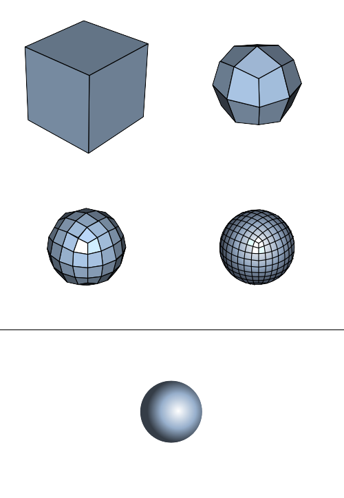

# Урок 4 — Subdivision Surface и Solidify: лазерный меч ⚔️

**Модуль 1 | 2 академических часа (1,5 часа)**

> 🔁 В начале урока — [повторение урока 3](повторение.md) (викторина + вместе, 5–7 мин)

---

## Цель урока

- Освоить модификатор **Subdivision Surface** (сглаживание) и понять, как управлять остротой
- Освоить **Solidify** (придание толщины)
- Разобраться с **Shade Smooth / Shade Flat**
- **Вместе создать лазерный меч** со светящимся клинком (Emission + Bloom)
- Закрепить **Array** (кольца на рукояти) с прошлого урока

---

## Часть 1 — Теория: Subdivision Surface (12 минут)

**Subdivision Surface** (сокращённо **SubSurf**, «сабсёрф») — модификатор, который **делит каждую грань на 4** и сглаживает форму. Чем выше уровень — тем глаже и круглее объект.



*Один и тот же куб: уровень 0 (куб) → 1 → 2 → 3 → предельная гладкая форма (сфера). ([источник: Wikimedia Commons](https://commons.wikimedia.org/wiki/File:Catmull-Clark_subdivision_of_a_cube.svg))*

| Параметр | Что делает |
|----------|-----------|
| **Levels Viewport** | уровень сглаживания на экране |
| **Levels Render** | уровень при финальном рендере (обычно чуть выше) |

> 💡 **Фишка — береги слабый ПК:** каждый уровень SubSurf умножает число граней на 4. Уровень 3 из куба делает 1536 граней! Держи **Viewport на 1–2**, а Render можно поставить 2–3. Иначе компьютер начнёт тормозить.

> 💡 **Фишка — горячая клавиша:** `Ctrl + 1`, `Ctrl + 2`, `Ctrl + 3` мгновенно вешают SubSurf нужного уровня на выделенный объект. `Ctrl + 0` — убрать.

### Главная проблема SubSurf и как её решить

SubSurf скругляет **всё**, включая углы, которые должны остаться острыми. Решение — **поддерживающие петли** (support loops): добавь `Ctrl + R` петлю рядом с ребром, и оно станет острым.

> 💡 **Фишка — правило острых углов:** чем **ближе** поддерживающая петля к ребру, тем **острее** угол под SubSurf. Далеко петля — мягкий скос, близко — резкий угол. Это разбираем подробно в [лайфхак.md](лайфхак.md).

---

## Часть 2 — Теория: Solidify и сглаживание (8 минут)

### Solidify — придать толщину

**Solidify** добавляет толщину плоскому меша. Из бумажного листа делает доску.

**Где нужен:** стены, лезвия, листья, броневые пластины, любой объект, смоделированный как плоскость.

| Параметр | Что делает |
|----------|-----------|
| **Thickness** | толщина |
| **Offset** | в какую сторону растёт толщина (−1 внутрь, +1 наружу, 0 в обе) |

### Shade Smooth vs Shade Flat

Это **не** модификатор, а способ отображения граней (`ПКМ → Shade Smooth / Shade Flat`):

- **Shade Flat** — видны все грани, объект «гранёный» (для low-poly стиля)
- **Shade Smooth** — грани сглажены визуально, объект гладкий (без добавления геометрии!)

> 💡 **Фишка:** Shade Smooth обманывает глаз — форма остаётся угловатой, но свет ложится плавно. Дёшево и сердито для слабых ПК. Часто Shade Smooth заменяет SubSurf там, где не нужна точная круглость.

---

## Часть 3 — Строим лазерный меч (50 минут)

```
   ║   ← клинок (светящийся цилиндр, Emission)
   ║
  ╔╧╗  ← излучатель (emitter)
  ║ ║
  ║▮║  ← рукоять с кольцами (Array)
  ║ ║
  ╚═╝  ← навершие (pommel)
   |   ← поясной зажим (Solidify)
```

> 📷 **[Вставь сюда картинку: референс лазерного меча →](изображения.md#saber-ref)**

### Шаг 1 — Рукоять (с SubSurf)

1. `Shift + A → Mesh → Cylinder` → `F9`: **Vertices: 12**
2. `S → 0.15` → Enter, `S → Z → 1.2` → Enter *(удлинить)*
3. `Ctrl + A → All Transforms`
4. Повесь сглаживание: `Ctrl + 2` *(SubSurf уровень 2)*
5. `ПКМ → Shade Smooth`

> 💡 **Фишка:** сейчас рукоять стала «таблеткой» — SubSurf скруглил торцы слишком сильно. Добавим поддерживающие петли, чтобы вернуть форму.

6. `Tab` → Edit Mode → `Ctrl + R`, наведи у верхнего торца → прокрути колесо до 2 петель → клик → ПКМ
7. То же у нижнего торца
8. `Tab` → теперь рукоять держит форму цилиндра, но с мягкими краями ✨

### Шаг 2 — Кольца на рукояти (Array)

1. `Shift + A → Mesh → Torus` → `F9`: уменьши Major/Minor Segments (low-poly), Major Radius ≈ под рукоять
2. `S` → подгони, чтобы кольцо обхватывало рукоять
3. Модификатор **Array**: Count 4, Constant Offset Z ≈ 0.15 *(кольца в стопку вдоль рукояти)*

> 💡 **Фишка — вспоминаем урок 3:** Array повторяет кольцо вдоль оси. Двигаешь оригинал — двигается вся стопка. Подбери Offset, чтобы кольца легли красиво.

### Шаг 3 — Излучатель (emitter)

1. `Shift + A → Mesh → Cylinder` → Vertices 12
2. `S → 0.18` (чуть шире рукояти), `S → Z → 0.25` (короткий)
3. `G → Z` → посади сверху рукояти
4. `Ctrl + 1` + `Shade Smooth` *(лёгкое сглаживание)*
5. В Edit Mode: верхнюю грань `I` (Inset) → `E → Z → -0.1` *(углубление, откуда «выходит» луч)*

### Шаг 4 — Навершие (pommel)

1. Продублируй излучатель (`Shift + D`) → перемести вниз рукояти → разверни `R → X → 180`

### Шаг 5 — Поясной зажим (Solidify!)

Это плоская деталь — отличный повод для Solidify.

1. `Shift + A → Mesh → Plane`
2. `R → X → 90`, `S → 0.05`, `S → Z → 2` *(узкая длинная полоска)*
3. `G` → прижми сбоку рукояти
4. Модификатор **Solidify**: Thickness ≈ 0.02 → плоская полоска стала объёмным зажимом!

> 💡 **Фишка:** без Solidify зажим был бы бесконечно тонким (плоскость не имеет толщины и в рендере выглядит как бумага). Solidify за один параметр делает из неё настоящую деталь.

### Шаг 6 — Клинок (главное — свечение!)

1. `Shift + A → Mesh → Cylinder` → Vertices 12
2. `S → 0.06` (тонкий), `S → Z → 6` (длинный)
3. `G → Z` → поставь над излучателем
4. Верхушку заостри: Edit Mode → верхняя грань → `S → 0` *(сведём в точку — кончик луча)*

---

## Часть 4 — Материалы и свечение (15 минут)

### Металл рукояти

Выдели рукоять, кольца, излучатель, навершие → материал: Base Color тёмно-серый, Metallic 1.0, Roughness 0.3.

> 💡 **Фишка (BlenderKit):** если включён аддон **BlenderKit** (`Edit → Preferences → Add-ons → BlenderKit`) — можно во вкладке материалов открыть библиотеку и перетащить готовый материал «brushed metal». Потом загляни в его Shader Editor и посмотри, из каких нод он собран — так учатся на готовом. Но базовый металл умей делать и руками!

### Светящийся клинок (Emission + Bloom)

1. Выдели клинок → новый материал
2. Surface смени с Principled BSDF на **Emission** (или подними Emission в Principled)
3. Emission Color: ярко-голубой (или красный/зелёный — выбор ученика)
4. **Emission Strength: 8–10**
5. Включи свечение-ореол: Render Properties → найди **Bloom** → ✅ *(в EEVEE)*

> 💡 **Фишка — что даёт Bloom:** Emission заставляет клинок светиться, а **Bloom** добавляет вокруг него мягкий ореол-свечение, как у настоящего лазера. Без Bloom клинок просто яркий; с Bloom — «дышит» светом.

> ⚠️ Bloom есть в движке **EEVEE**. Проверь: Render Properties → Render Engine = EEVEE.

`Z → Rendered` → меч светится! `F12` → рендер.

> 📷 **[Вставь сюда картинку: готовый лазерный меч →](изображения.md#saber-final)**

---

## Итог урока

Сегодня мы:
- ✅ Освоили **Subdivision Surface** и поддерживающие петли (контроль остроты)
- ✅ Освоили **Solidify** (толщина) и **Shade Smooth/Flat**
- ✅ Закрепили **Array** (кольца рукояти)
- ✅ Построили лазерный меч со светящимся клинком (**Emission + Bloom**)
- ✅ Узнали про BlenderKit как источник готовых материалов

---

## Лайфхак урока

👉 [лайфхак.md](лайфхак.md) — **управление остротой SubSurf: support loops и Edge Crease** (показывается на Шаге 1)

## Самостоятельная работа

👉 [практика.md](практика.md) — собери своё светящееся оружие/артефакт

---

## Навигация

⬅️ [Урок 3](../урок-03/урок.md)  ·  🔁 [Повторение](повторение.md)  ·  ➡️ **Следующий урок: [Урок 5 — Итоговый проект: сундук с сокровищами](../урок-05/урок.md)**
