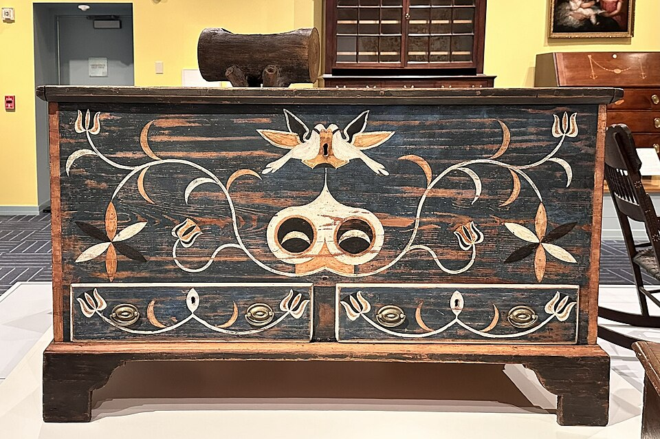

# Урок 5 — Итоговый мини-проект: игровой сундук с сокровищами

**Модуль 1 | 2 академических часа (1,5 часа)**

> 🔁 В начале урока — [повторение урока 4](повторение.md) (опрос + «найди ошибку», 5–7 мин)

---

## Цель урока

Это **итоговый проект модуля 1**. Мы соберём всё, что выучили, в одну модель — игровой сундук:
- примитивы и Edit Mode (урок 1–2)
- Array и Mirror (урок 3)
- Subdivision, Bevel, материалы (урок 4)
- **новый приём:** Bevel-модификатор (неразрушающая фаска на всю модель)

В конце — мини-защита: каждый показывает свой сундук классу.

---

## Что делаем

Классический игровой сундук: деревянное основание, откидная крышка, металлические полосы, замок. Каждый делает **свой вариант** — цвет дерева, форма, украшения на выбор.

> 📷 Референс — настоящий деревянный сундук:
>
> 
>
> *Разбери на части: короб-основание, крышка, угловые накладки, замочная скважина, ножки. Роспись/узор — на твой вкус. ([фото: Wikimedia Commons](https://commons.wikimedia.org/wiki/File:Blanket_chest.jpg))*

```
      ╔══════════════╗
      ║  крышка      ║   ← скруглённая (Bevel/SubSurf)
   ╔══╩══════════════╩══╗
   ║ ▭  основание  ▭   ║   ← металлические полосы (Array)
   ║ ▭     [▮]      ▭   ║   ← замок по центру
   ╚════════════════════╝
```

---

## Часть 1 — Основание сундука (20 минут)

### Шаг 1 — Короб

1. `Shift + A → Mesh → Cube`
2. `S → X → 1.5` → Enter, `S → Y → 1` → Enter *(прямоугольный)*
3. `S → Z → 0.6` → Enter *(невысокий)*
4. `Ctrl + A → All Transforms`

### Шаг 2 — Выдолбить внутренность

1. `Tab` → Edit Mode, `3` — грани
2. Выдели верхнюю грань
3. `I` → Inset немного внутрь → Enter *(толщина стенок)*
4. `E → Z → -0.8` → Enter *(вдавить внутрь — сундук стал полым)*
5. `Tab` → Object Mode

> 💡 **Фишка — Inset + Extrude вглубь = «выдолбить»:** этот же приём (с урока 2) делает любую ёмкость: кружку, ящик, ванну, корпус. Запомни как универсальный.

---

## Часть 2 — Новый приём: Bevel-модификатор (15 минут)

На уроке 4 мы скашивали рёбра инструментом `Ctrl + B`. Но есть **модификатор Bevel** — он скругляет **все рёбра сразу** и остаётся живым (можно настраивать).

### Применяем

1. Выдели короб
2. 🔧 → **Добавить модификатор → Generate → Bevel**
3. **Amount: 0.03** *(размер фаски)*
4. **Segments: 2** *(плавность)*
5. **Limit Method: Angle** *(скашивать только острые рёбра, не трогая плоские)*

Сундук сразу выглядит «дороже» — рёбра ловят свет.

> 📷 **[Вставь сюда картинку: Bevel-модификатор до и после →](изображения.md#bevel)**

> 💡 **Фишка — почему Bevel-модификатор лучше для новичка:** инструмент `Ctrl+B` правит конкретные рёбра вручную. Модификатор скашивает **всё** автоматически и его можно отключить/настроить в любой момент. Для аккуратных краёв на всей модели — это быстрее и безопаснее.

> 💡 **Фишка — Limit Method → Angle:** этот режим сам находит острые рёбра (углы > 30°) и скашивает только их. Плоские поверхности остаются нетронутыми. Незаменимо для коробов, техники, мебели.

---

## Часть 3 — Крышка (15 минут)

### Шаг 1 — Крышка

1. `Shift + A → Mesh → Cube`
2. Подгони по ширине/глубине под основание (`S → X`, `S → Y`)
3. `S → Z → 0.3` *(плоская)*
4. `G → Z` → посади сверху основания

### Шаг 2 — Округлить крышку (на выбор)

**Вариант А (граненая, low-poly):** оставь как есть + Bevel-модификатор.

**Вариант Б (округлая):** в Edit Mode выдели верхние рёбра → `G → Z` приподними центр, ИЛИ повесь `Ctrl + 1` (SubSurf) + support loops по краям (с урока 4).

> 💡 **Фишка — точка опоры для будущей анимации:** если позже захочешь, чтобы крышка открывалась — её Origin должен быть на **задней петле** (по линии сгиба). Поставь 3D-курсор на заднее ребро (`Shift + S → Cursor to Selected` в Edit Mode на выделенном ребре) → `Object → Set Origin → Origin to 3D Cursor`. Тогда крышка будет вращаться как настоящая. *(Пригодится в Модуле 5 — анимация.)*

---

## Часть 4 — Металлические полосы и замок (15 минут)

### Полосы (Array + Mirror)

1. `Shift + A → Mesh → Cube`
2. `S → X → 0.08, S → Y → 1.05, S → Z → 0.65` *(узкая вертикальная полоса спереди-назад)*
3. `G` → прижми к боку сундука
4. Модификатор **Array**: Count 2–3, Offset по X → полосы вдоль сундука
5. Чтобы такие же были симметрично — добавь **Mirror** (или ещё Array)

### Замок

1. `Shift + A → Mesh → Cube` → маленький → `G` на центр передней стенки
2. Скоси Bevel-модификатором
3. Маленький цилиндр — скважина

---

## Часть 5 — Материалы и рендер (15 минут)

- **Дерево:** Base Color коричневый, Roughness 0.8, Metallic 0. *(цвет дерева — на выбор: тёмный дуб, рыжая сосна, серое дерево)*
- **Металл полос и замка:** Base Color тёмно-серый/бронза, Metallic 1.0, Roughness 0.35
- **Бонус — золото внутри:** добавь внутрь пару кубиков/сфер с золотым материалом (Metallic 1, жёлтый) и лёгким Emission — «сокровища блестят»!

> 💡 **Фишка (BlenderKit):** включён BlenderKit? Возьми готовый материал «wood planks» и накинь на основание — мгновенно реалистичное дерево. Потом сравни его ноды со своим простым материалом.

`Z → Material Preview` или `Rendered` → `F12` рендер.

> 📷 **[Вставь сюда картинку: готовый сундук с сокровищами →](изображения.md#chest-final)**

---

## Часть 6 — Мини-защита (5 минут)

Каждый показывает свой сундук классу и за 30 секунд рассказывает:
- какой приём оказался самым полезным
- что было сложнее всего
- что бы добавил, будь больше времени

---

## Итог модуля 1 🎉

За 5 уроков ты прошёл путь от «первый раз вижу Blender» до полноценной модели! Ты умеешь:
- ✅ навигацию, примитивы, трансформации
- ✅ Edit Mode: Extrude, Inset, Loop Cut, Bevel
- ✅ модификаторы: Mirror, Array, Subdivision, Solidify, Bevel
- ✅ материалы, металл, свечение (Emission + Bloom)
- ✅ собирать всё это в готовый проект

**Дальше — Модуль 2:** кривые, булевы операции, Geometry Nodes и большой космический корабль!

---

## Лайфхак урока

👉 [лайфхак.md](лайфхак.md) — **Bevel-модификатор vs инструмент Bevel** (показывается в Части 2)

## Сдать на оценку

👉 [практика.md](практика.md) — требования к итоговой работе

---

## Навигация

⬅️ [Урок 4](../урок-04/урок.md)  ·  🔁 [Повторение](повторение.md)  ·  ➡️ **Дальше — Модуль 2: полигональное моделирование** (см. [план курса](../../ПЛАН-КУРСА.md))

🎉 *Поздравляем с завершением Модуля 1!*
