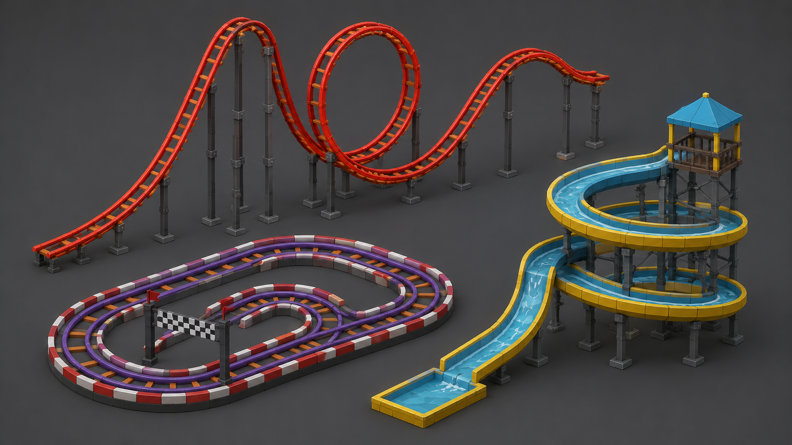
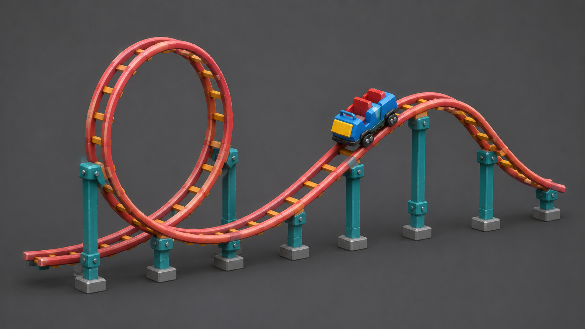

# Самостоятельная работа — Урок 6: Американские горки 🎢

> 🧑‍🎓 Делаешь сам(а), применяя кривые. Учитель помогает, если застрял.

## Задание

На уроке мы делали трубы и провода для корабля. Теперь — другое применение кривых: построй **трассу американских горок** (или гоночный трек / водную горку).

> 💡 Горки дополнят сцену «парк развлечений» с каруселью из практики урока 3.

**Из чего состоит:**
- Рельсы — кривая **Path**, изогнутая петлями и подъёмами, с **Bevel** (труба-рельс)
- Второй рельс рядом — параллельная кривая (или дубль)
- Шпалы-перекладины — маленький куб + **Array along curve** (или вручную)
- Опоры — вертикальные цилиндры под трассой
- Вагончик — простой куб/капсула на рельсах

---

## Требования

- [ ] Трасса построена **кривой** с изгибами (петля, подъём, спуск)
- [ ] Кривой задана **толщина** (Bevel кривой → рельс-труба)
- [ ] Осознанно использован **тип ручек** (`V`: Auto для плавности, Vector для углов)
- [ ] Минимум **2 параллельных рельса** (дубль/соединение кривых)
- [ ] Трасса превращена в меш (`Convert → Mesh`)
- [ ] Материалы (металл рельсов, опоры) + рендер (`F12`)

---

## Подсказки

- Рисуй трассу сбоку (`Numpad 1`) и сверху (`Numpad 7`), чередуя виды
- Плавные виражи — ручки **Auto**; резкий поворот — **Vector**
- Второй рельс: продублируй кривую `Shift+D` и чуть сдвинь
- Опоры: расставь цилиндры под низкими точками трассы
- Перед Convert сохрани копию

---

## Что сдать

`.blend` + рендер.

| Референс — горки и трассы | Пример результата |
|---------------------------|-------------------|
|  |  |

*Слева — варианты трасс (петля, подъём, спуск на рельсах-трубах). Справа — пример готовой горки с петлёй, опорами и вагончиком. Построй свою кривыми.*
