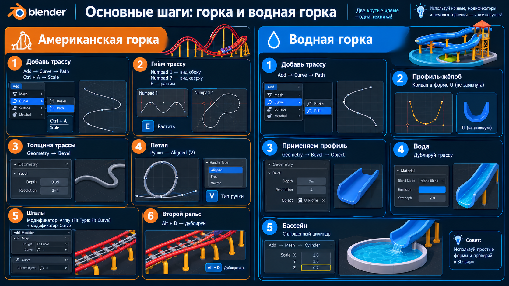
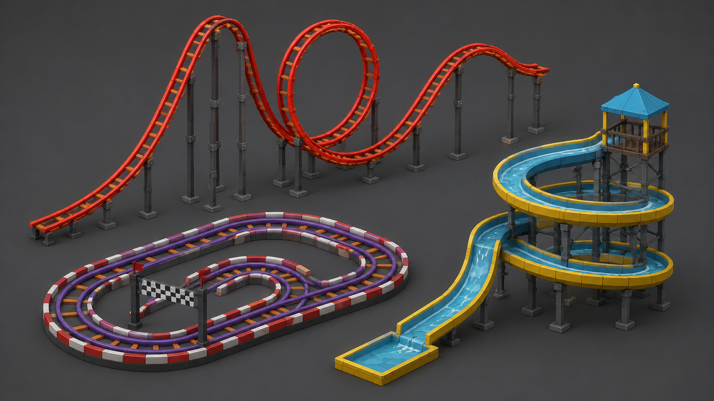
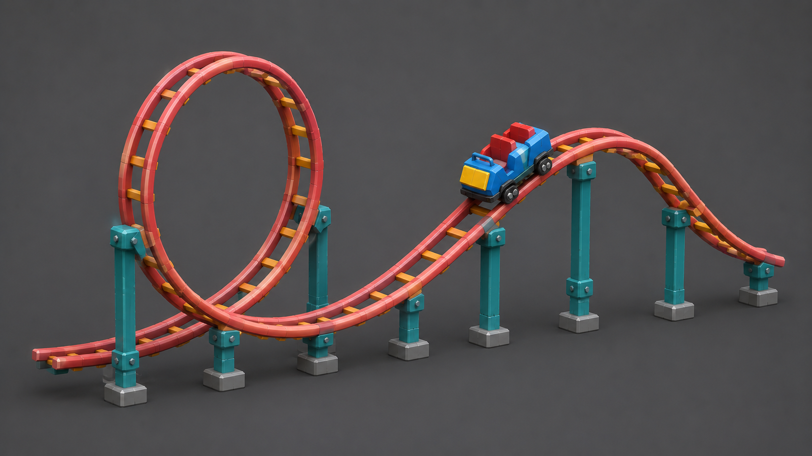

# Самостоятельная работа — Урок 6: Американские горки 🎢

> 🧑‍🎓 Делаешь сам(а), применяя кривые. Учитель помогает, если застрял.

## Задание

На уроке мы гнули кривые для настольной лампы (стойка, держатель, провод). Теперь — другое применение кривых: построй **трассу американских горок** (а для смелых — ещё и **водную горку**).

> 💡 Горки дополнят сцену «парк развлечений» с каруселью из практики урока 3.

**Из чего состоит:**
- Рельсы — кривая **Path**, изогнутая петлями и подъёмами, с **Bevel** (труба-рельс)
- Второй рельс рядом — параллельная кривая (или дубль)
- Шпалы-перекладины — маленький куб + **Array along curve** (или вручную)
- Опоры — вертикальные цилиндры под трассой
- Вагончик — простой куб/капсула на рельсах

---

## Требования

- [ ] Трасса построена **кривой** с изгибами (петля, подъём, спуск)
- [ ] Кривой задана **толщина** (Bevel кривой → рельс-труба)
- [ ] Осознанно использован **тип ручек** (`V`: Auto для плавности, Vector для углов)
- [ ] Минимум **2 параллельных рельса** (дубль/соединение кривых)
- [ ] Трасса превращена в меш (`Convert → Mesh`)
- [ ] Материалы (металл рельсов, опоры) + рендер (`F12`)

---

## Подсказки

*Шпаргалка со всеми шагами и значениями: рельс (Path → Bevel Depth 0.05, Resolution 3–4), петля (ручки Aligned), шпалы (Array → Fit Curve + Curve-модификатор), второй рельс (`Alt+D`); жёлоб водной горки (Bevel → Object, U-профиль), вода (Alpha Blend), бассейн (Cylinder, Scale Z 0.2).*

### 🛤️ Рельс — по шагам

1. `Shift + A → Curve → Path` (или Bezier) — заготовка трассы.
2. **Сразу примени масштаб:** `Ctrl + A → Scale` (иначе труба-рельс выйдет разной толщины — см. подводные камни в теории).
3. Рисуй трассу **сбоку** (`Numpad 1`) для подъёмов/спусков и **сверху** (`Numpad 7`) для поворотов, чередуя виды.
4. Наращивай трассу: выдели крайнюю точку → `E` → клик, ещё `E` → клик… так «ведёшь» рельс.
5. Плавные виражи — ручки **Auto/Aligned** (`V`); резкий поворот — **Vector**.
6. Толщина рельса: 📈 **Object Data → Geometry → Bevel → Depth 0.05** → линия стала рельсом-трубой.
7. Гладкость: **Bevel → Resolution 3–4** (low-poly), **Resolution Preview U** — плавность изгиба вдоль трассы.

### 🌀 Петля («мёртвая петля»)

1. Смотри строго **сбоку** (`Numpad 1`).
2. Веди трассу вверх, затем точками закрути **кольцо**: вверх → назад → вниз → вперёд.
3. Ручки **Aligned** (`V`) — чтобы петля была круглой, без изломов.
4. Совет: сделай кольцо из 5–6 точек; при желании замкни `Alt + C`.

### 🪜 Второй рельс и шпалы

- **Второй рельс:** выдели трассу → `Alt + D` (**связанная** копия) → сдвинь вбок на ширину колеи. У связанной копии толщина меняется у обоих рельсов сразу — удобно подбирать диаметр.
- **Шпалы (перекладины) автоматически вдоль трассы** *(вспомни Array из урока 3!):*
  1. Сделай одну шпалу — маленький `Cube`, сплющи `S`.
  2. Модификатор **Array** → Fit Type **Fit Curve** → Curve = твоя трасса.
  3. Добавь модификатор **Curve** → Object = та же трасса — шпалы лягут вдоль рельсов, повторяя все изгибы.
  4. Count / Relative Offset — подбери частоту шпал.
- **Проще (вручную):** поставь одну шпалу и продублируй `Shift + D` вдоль трассы.

### 🏗️ Опоры

- Под низкими точками трассы поставь вертикальные **цилиндры** (`Shift+A → Cylinder`), подгони высоту до трассы.
- Одинаковые опоры быстро: **Array** (Constant Offset по X) или дубли `Shift + D`.

### 💧 Водная горка — по шагам (если делаешь её)

Водная горка — это **жёлоб** (открытая труба-полукруг), по которому «течёт вода».

1. Нарисуй трассу горки — **Path** с плавными спусками и поворотами (пологие ручки **Auto**). `Ctrl + A → Scale`.
2. **Профиль-жёлоб:** сделай отдельную кривую-профиль в форме буквы **U** (`Shift+A → Curve → Bezier`, согни дугой, **НЕ замыкай** — жёлоб должен быть открытым сверху).
3. Выдели трассу → 📈 **Object Data → Geometry → Bevel → Object** → выбери свою кривую-профиль. Труба превратится в **открытый жёлоб**. 🎉
4. **Вода:** продублируй трассу `Shift + D`, дай ей тонкий Bevel Depth и **голубой полупрозрачный** материал (**Alpha Blend** — стекло из урока 4) или лёгкий Emission — будто вода блестит.
5. Внизу — **бассейн:** цилиндр, сплющенный `S → Z`, с тем же голубым материалом.
6. По желанию — брызги: несколько маленьких **Ico Sphere** у выхода из горки.

> 💡 **Не хочешь возиться с профилем?** Сделай водную горку **закрытой круглой трубой** (обычный Bevel → Depth) — получится крытая аквапарковая труба, тоже здорово.

### Общие советы

- Перед `Convert → Mesh` **сохрани копию** — потом ручки не вернуть.
- Труба «сплющена» или разной толщины? Забыл(а) `Ctrl + A → Scale`.

---

## Что сдать

`.blend` + рендер.

| Референс — горки и трассы | Пример результата |
|---------------------------|-------------------|
|  |  |

*Слева — варианты трасс (петля, подъём, спуск на рельсах-трубах). Справа — пример готовой горки с петлёй, опорами и вагончиком. Построй свою кривыми.*
