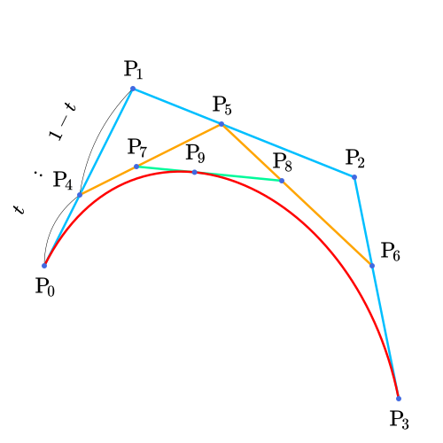

# Урок 6 — Кривые Безье: провода, трубы и антенны для корабля

**Модуль 2 | 2 академических часа (1,5 часа)**

> 🔁 В начале урока — [повторение модуля 1](повторение.md) (викторина, 7 мин)

---

## Цель урока

- Понять, что такое **кривые** и чем они отличаются от меша
- Освоить **кривую Безье** и **Path** — управляющие точки и ручки
- Превращать кривую в **трубу/провод** (Bevel кривой) и в меш
- **Вместе сделать пучок проводов, трубы и антенну** для космического корабля
- **Лайфхак:** несколько труб из одной кривой и как их соединить

---

## Часть 1 — Теория: что такое кривая (12 минут)

Раньше мы лепили из **меша** (вершины, рёбра, грани). Но провод или трубу мешем делать долго. Для гладких линий есть **кривые**.

**Кривая** — это линия, заданная не множеством вершин, а несколькими **управляющими точками**. Blender сам проводит между ними плавную линию.

*Красная линия — кривая. **P₀** и **P₃** — её концы. **P₁** и **P₂** — управляющие точки («ручки»), которые задают изгиб. ([источник: Wikimedia Commons, CC BY-SA](https://commons.wikimedia.org/wiki/File:Cubic_B%C3%A9zier_Curve.svg))*

### Два типа кривых, которые нам нужны

| Тип | Что это | Когда |
|-----|---------|-------|
| **Bezier** | кривая с ручками, гибкая | плавные провода, изгибы |
| **Path (NURBS Path)** | кривая из точек, удобна для «дорожек» | рельсы, трассы, длинные трубы |

> 💡 **Фишка — кривая ≠ меш:** кривую нельзя сразу текстурировать или экспортировать в игру как есть. Зато её **очень легко гнуть**. Поэтому рабочий приём: сначала гнём кривой, потом превращаем в меш (`Object → Convert → Mesh`).

---

## Часть 2 — Первая кривая и её редактирование (15 минут)

### Шаг 1 — Добавить кривую

1. `Shift + A → Curve → Bezier`
2. `Tab` → Edit Mode — видны точки с «ручками» (рычажками)

> 💡 **Аддон — готовые спирали и формы.** Включи **Add Curve: Extra Objects** (Preferences → Add-ons → «Add Curve: Extra Objects» → ✅) — и в `Shift+A → Curve` появятся **спираль (Spirals)**, профили, соединения труб. Спираль-кривая + Bevel = пружина или винтовая лестница без ручного гнутья. *(Пригодится и в Модуле 6 — путь-орбита для Follow Path.)* Каталог — [справочники/аддоны.md](../../справочники/аддоны.md).

> 💡 **Фишка — как управлять формой кривой:**
> - **Точки** двигаем как вершины: выделил `ЛКМ` → `G` → тащи
> - **Ручки** (рычажки у точки) задают плавность изгиба — тяни их концы
> - Добавить точку: выдели крайнюю точку → `E` → клик (кривая «растёт»)

### Шаг 2 — Типы ручек

Выдели точку и нажми `V` — меню типов ручки:

| Тип | Поведение |
|-----|-----------|
| **Auto** | Blender сам делает плавно |
| **Vector** | ручка смотрит на соседнюю точку (ломаная, углы) |
| **Aligned** | ручки на одной линии (гладко) |
| **Free** | ручки независимы (резкие изгибы) |

> 💡 **Фишка:** для проводов удобен **Auto** (само плавно), для резких поворотов трубы — **Vector**.

---

## Часть 3 — Превращаем кривую в трубу (20 минут)

Кривая по умолчанию — бесконечно тонкая линия. Дадим ей толщину!

### Шаг 1 — Толщина (Bevel кривой)

1. Выдели кривую → вкладка 📈 **Object Data Properties** (зелёная иконка кривой)
2. Раздел **Geometry → Bevel**
3. Тип **Round**, **Depth: 0.05** → линия стала **трубой**! 🎉

> 💡 **Фишка — это не модификатор Bevel!** У кривой свой Bevel в настройках данных — он «надувает» линию в трубу. Depth = радиус трубы.

### Шаг 2 — Гладкость трубы

- **Resolution Preview U** — сколько сегментов вдоль кривой (плавность изгиба)
- **Bevel → Resolution** — сколько граней в сечении трубы (круглая или гранёная)

> 💡 **Фишка для слабых ПК:** не задирай Resolution. Для low-poly трубы хватит Bevel Resolution 2–4 (гранёная труба смотрится стильно).

### Шаг 3 — Сужение концов (Taper) — необязательно

Можно сделать трубу сужающейся (как рог антенны): создай вторую кривую-профиль и укажи её в **Geometry → Taper Object**.

> 📷 **[Вставь сюда картинку: кривая → труба (до/после Bevel) →](изображения.md#curve-to-pipe)**

---

## Часть 4 — Собираем оснастку корабля (25 минут)

### Провода (пучок кабелей)

1. `Shift + A → Curve → Bezier`, согни дугой между двумя точками корпуса
2. Дай Depth 0.02 (тонкий провод)
3. Материал: тёмная резина (Roughness 0.7)

> 🎯 **ЛАЙФХАК — показать здесь!**
> Сейчас сделаем **пучок** проводов и трубы быстро — не рисуя каждую заново. Полный разбор в [лайфхак.md](лайфхак.md): дублируем кривую, как соединить несколько труб в одну, общий профиль. Это твой будущий рабочий приём для любой оснастки (трубы в подвале, кабели за компьютером, ветви дерева).

### Толстые трубы

1. Ещё одна Bezier, Depth 0.08 (толстая труба)
2. Тип ручек **Vector** для «технических» прямых углов
3. Материал: металл

### Антенна-штырь

1. `Shift + A → Curve → Path` (прямая «дорожка»)
2. Подними вертикально, Depth 0.03
3. На конце — маленькая сфера (шарик антенны)

### Превращаем в меш (когда доволен)

`Object → Convert → Mesh` — теперь оснастку можно текстурировать и экспортировать.

> 💡 **Фишка — сначала копия!** Перед Convert сохрани копию объекта (или файла): после конвертации редактировать кривую «ручками» уже нельзя — будет обычный меш.

> 📷 **[Вставь сюда картинку: корабль с проводами и антеннами →](изображения.md#ship-rigging)**

---

## Итог урока

Сегодня мы:
- ✅ Поняли, что такое кривые и управляющие точки (Безье)
- ✅ Научились гнуть кривую ручками и менять тип ручек (`V`)
- ✅ Превращали кривую в трубу через Bevel кривой (Depth)
- ✅ Сделали провода, трубы и антенну для корабля
- ✅ Узнали, как конвертировать кривую в меш

---

## Лайфхак урока

👉 [лайфхак.md](лайфхак.md) — **несколько труб из одной кривой и как их соединить** (показывается в Части 4)

## Самостоятельная работа

👉 [практика.md](практика.md) — оснасти свой объект трубами и проводами

---

## Навигация

⬅️ [Модуль 1, Урок 5](../../модуль-01-основы/урок-05/урок.md)  ·  🔁 [Повторение](повторение.md)  ·  ➡️ **Следующий урок: [Урок 7 — Boolean: иллюминаторы и люки](../урок-07/урок.md)**
