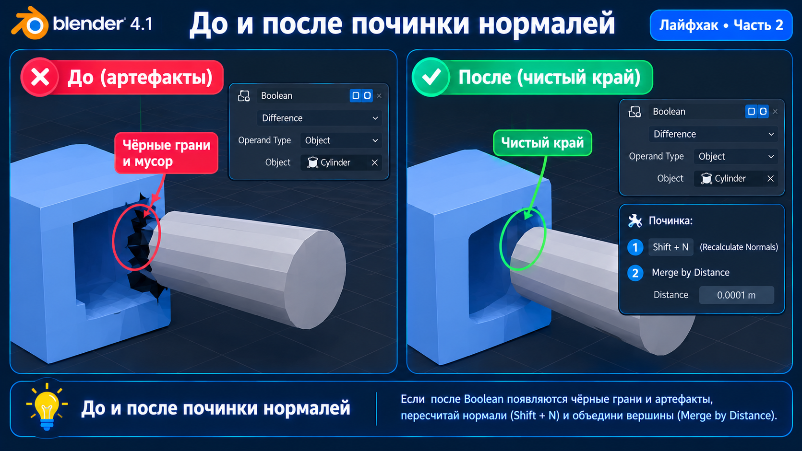

# Лайфхак урока 7 — Чистый Boolean без артефактов

> Boolean — мощный, но капризный инструмент. Артефакты (чёрные грани, дыры, мусор) пугают новичков. Вот как делать Boolean чисто.

---

## Правило №1 — Apply Scale ДО Boolean

Самая частая причина кривого Boolean — неприменённый масштаб.

**Перед** любым Boolean: выдели оба объекта → `Ctrl + A → Scale`.

> Если объект много раз масштабировали (`S`), Blender хранит «искажённый» масштаб — Boolean считает геометрию неверно. Apply исправляет это.

---

## Правило №2 — Чистый «резак»

Резак должен быть **замкнутым** (manifold) объёмом без дыр и без двойных граней.

- Не используй плоскости (Plane) как резак — у них нет объёма
- Резак должен **полностью протыкать** деталь насквозь, а не заканчиваться внутри впритык

---

## Правило №3 — Пересчитать нормали

Если после Boolean появились **чёрные** грани — нормали смотрят внутрь.

1. Выдели объект → `Tab` (Edit Mode)
2. `A` — выделить всё
3. `Shift + N` — пересчитать нормали наружу

> 💡 Включи отображение нормалей (overlays → Face Orientation): синее = правильно, красное = вывернуто.

---

## Правило №4 — Слить двойные вершины

После Boolean бывают дубли вершин.

1. Edit Mode → `A`
2. `M → By Distance` (Merge by Distance)
3. Сольются все вершины ближе порога

---

## Правило №5 — Solver: Exact vs Fast

В модификаторе Boolean есть **Solver**:
- **Exact** — точный, чистый результат (используй его по умолчанию)
- **Fast** — быстрее, но грязнее

> Если Exact тормозит на слабом ПК и геометрия простая — можно Fast. Но для чистоты — Exact.

---

## Правило №6 — Bool Tool: живой и аккуратный

Аддон **Bool Tool** держит резак «живым» (Brush):
- Резак виден полупрозрачным, его можно двигать — отверстие следует
- Когда готово — **Apply** (Bool Tool → Brush to Mesh / применить)

> Удобно: расставляешь кнопки, двигая резаки, и только потом «впекаешь».

---

## Бонус — фаска на резаке = фаска на отверстии

Хочешь, чтобы у экрана (или дырки под кнопку) был скошенный, «дорогой» край? Добавь **Bevel** самому резаку **до** Boolean — край отверстия получится со скосом.

---

## Ещё способы сделать дырку (кроме Boolean)

Boolean удобен, но иногда оставляет лишнюю геометрию (n-gon'ы) и артефакты. Вот другие способы — у каждого свои плюсы.

### 1. Knife Project (проекция ножом)

1. Поставь круг (`Shift+A → Mesh → Circle`) перед гранью, где нужна дырка (разверни его «лицом» к грани).
2. Выдели **грань-мишень** (её объект) и **круг** → у объекта войди в Edit Mode так, чтобы грань смотрела на тебя (вид по оси).
3. `Mesh → Knife Project` — контур круга «врезался» в грань.
4. `E` → внутрь → продавил отверстие. Круг-шаблон больше не нужен — удали.

> Чисто для **плоских** граней; создаёт n-gon.

### 2. Vertex Bevel → круг

1. В Edit Mode выдели **одну вершину** на грани.
2. `Shift + Ctrl + B` (bevel вершины) → потяни → в опциях слева **Shape = 0.1** и крути колесо (больше **Segments**) — вершина стала кружком.
3. `E` внутрь → отверстие.

### 3. LoopTools → Circle

1. Включи аддон **LoopTools** (Preferences → Add-ons).
2. Выдели 4 грани (квадрат) → `ПКМ → LoopTools → Circle` — они стали ровным кругом.
3. `E` внутрь → гнездо. *(Скос `Ctrl+B` по краю + Subdivision = гладкий край.)*

### 4. LoopTools → Bridge (сквозное)

1. Сделай круг из граней (как в способе 3) с **двух** сторон объекта.
2. Выдели оба круга → `ПКМ → LoopTools → Bridge` — отверстие прошло **насквозь**.

### 5. Intersect (Boolean) в Edit Mode

1. Соедини две формы `Ctrl + J` (резак + объект).
2. Edit Mode → наведи на грань «резака» → `L` (выделить связанное).
3. `Face → Intersect (Boolean)` → **Difference** (при необходимости ✅ **Swap**).

> Это Boolean «внутри» одного объекта, без модификатора.

### 6. Carver

Самый быстрый для sci-fi: `Shift + Ctrl + X`, рисуешь рез мышкой (см. теорию, Часть 4.6).

> 💡 **Правило выбора:** нужна гладкая модель под Subdivision — бери «ручные» способы (LoopTools, Knife), у них чище топология. Нужно быстро — Boolean или Carver.

---

## Шпаргалка «Boolean сломался»

| Проблема | Решение |
|----------|---------|
| Кривой результат | `Ctrl+A → Scale` до Boolean |
| Чёрные грани | `Shift+N` (нормали) |
| Дыры/мусор | `M → By Distance` |
| Резак не режет | резак должен протыкать насквозь, иметь объём |
| Грязно/глючно | Solver → Exact |

*Слева — чёрные грани и мусор по краю реза. Справа — после `Shift + N` (пересчёт нормалей) и `M → By Distance` край чистый.*
