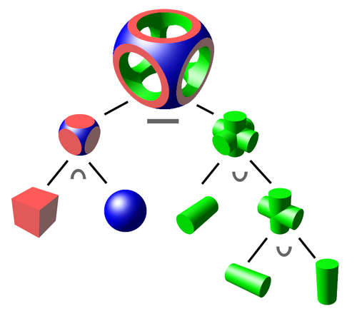

# Урок 7 — Boolean: иллюминаторы и люки в корпусе корабля

**Модуль 2 | 2 академических часа (1,5 часа)**

> 🔁 В начале урока — [повторение урока 6](повторение.md) («сделай сам» + опрос, 5–7 мин)

---

## Цель урока

- Понять **булевы операции**: вычитание, объединение, пересечение
- Освоить модификатор **Boolean** и аддон **Bool Tool**
- Научиться вырезать **иллюминаторы, люки, вентиляцию** в корпусе
- Понять, как **избегать артефактов** Boolean
- **Вместе детализировать корпус корабля** отверстиями и врезками

---

## Часть 1 — Теория: что такое Boolean (10 минут)

**Булевы операции** — это «математика над объёмами». Берём два объекта и комбинируем их:

*Из куба, сферы и цилиндров булевыми операциями (∩ пересечение, − вычитание) собрана сложная деталь. ([источник: Wikimedia Commons, CC BY-SA](https://commons.wikimedia.org/wiki/File:Constructive_solid_geometry))*

| Операция | Значок | Что делает | Пример |
|----------|--------|-----------|--------|
| **Difference** (Разность) | A − B | вычитает B из A | вырезать иллюминатор |
| **Union** (Объединение) | A + B | сливает в один объект | приварить деталь |
| **Intersect** (Пересечение) | A ∩ B | оставляет только общее | сложные пересечения форм |

> 💡 **Фишка — главный объект и резак:** в Difference тот объект, на котором висит модификатор — «главный» (его режут). Второй объект — «резак» (cutter). Резак можно потом спрятать, а отверстие останется.

---

## Часть 2 — Первое вычитание (15 минут)

### Шаг 1 — Корпус-панель

1. `Shift + A → Mesh → Cube`
2. `S → X → 2, S → Z → 1.4, S → Y → 0.15` *(панель корпуса)*
3. `Ctrl + A → All Transforms`

> 💡 **Фишка — обязательно Apply Scale перед Boolean!** Если масштаб не применён, Boolean часто выдаёт кривой результат. `Ctrl + A → Scale` — первое правило чистого Boolean.

### Шаг 2 — Резак для иллюминатора

1. `Shift + A → Mesh → Cylinder` → `F9`: **Vertices: 16**
2. `R → X → 90` *(положить «лицом» к панели)*
3. `S → 0.3`, протолкни сквозь панель (`G → Y`)

### Шаг 3 — Вычитаем

1. Выдели **панель** (не цилиндр!)
2. 🔧 → **Add Modifier → Generate → Boolean**
3. **Operation: Difference**
4. **Object:** выбери цилиндр
5. Спрячь цилиндр: выдели его → `H`

Появился круглый иллюминатор! 🎉

> 💡 **Фишка — резак не обязательно удалять:** пока Boolean не применён (Apply), резак нужен. Спрячь его (`H`) или убери в отдельную коллекцию «Резаки». Двигаешь резак — отверстие двигается за ним (живой Boolean).

> 📷 **[Вставь сюда картинку: вычитание иллюминатора (до/после) →](изображения.md#porthole)**

---

## Часть 3 — Аддон Bool Tool (15 минут)

Делать Boolean вручную для каждого отверстия долго. Аддон **Bool Tool** ускоряет это.

### Включить аддон

`Edit → Preferences → Add-ons` → найти **Bool Tool** → ✅

### Как пользоваться

1. Выдели **резак**, потом `Shift +` выдели **главный объект** (порядок важен!)
2. Горячие клавиши:

| Клавиши | Операция |
|---------|----------|
| `Ctrl + Numpad −` | Difference (вырезать) |
| `Ctrl + Numpad +` | Union (объединить) |
| `Ctrl + Numpad *` | Intersect (пересечение) |

> 💡 **Фишка — Bool Tool делает «живой» Boolean:** резак остаётся, становится полупрозрачным, его можно двигать — отверстие следует за ним в реальном времени. Удобно подбирать位置 окон.

---

## Часть 4 — Детализируем корпус (25 минут)

### Несколько иллюминаторов в ряд

1. Сделай один резак-цилиндр
2. Добавь ему модификатор **Array** (помнишь урок 3?) — 3–4 копии в ряд
3. Применить Array резаку (`Ctrl + A`), затем Boolean Difference к панели — целый ряд окон сразу!

> 💡 **Фишка — комбо Array + Boolean:** сначала размножаем резак массивом, потом одним Boolean режем все отверстия. Так делают ряды окон, перфорацию, решётки.

### Люк (прямоугольный)

1. Резак — куб со скруглением (Bevel-модификатор), протолкни в корпус
2. Boolean Difference → получился утопленный люк
3. Внутрь люка вставь чуть меньший куб — «дверца»

### Вентиляция (щели)

1. Тонкий длинный куб-резак → Array → Boolean → ряд щелей

### Применяем (Apply)

Когда доволен — выдели панель → применить Boolean (`Ctrl + A` на модификаторе). Резаки можно удалить.

> ⚠️ **Фишка — порядок Apply:** если на объекте несколько модификаторов (Boolean, Bevel) — применяй сверху вниз.

> 📷 **[Вставь сюда картинку: готовый корпус с иллюминаторами и люком →](изображения.md#hull-final)**

---

## Часть 5 — Если появились артефакты

Boolean иногда даёт «грязь»: чёрные грани, дыры, странные рёбра. Это нормально — чинится.

👉 Полное руководство в [лайфхак.md](лайфхак.md). Кратко:
- `Ctrl + A → Scale` **до** Boolean
- Пересчитать нормали: Edit Mode → `A` → `Shift + N`
- Слить близкие вершины: `M → By Distance`

> 🎯 **ЛАЙФХАК — показать здесь!** Разбери с детьми, как чинить артефакты Boolean — это спасёт им десятки моделей в будущем.

---

## Итог урока

Сегодня мы:
- ✅ Разобрали Boolean: Difference, Union, Intersect
- ✅ Освоили модификатор Boolean и аддон **Bool Tool**
- ✅ Вырезали иллюминаторы, люк, вентиляцию
- ✅ Скомбинировали **Array + Boolean** (ряд окон)
- ✅ Научились чинить артефакты

---

## Лайфхак урока

👉 [лайфхак.md](лайфхак.md) — **живой Boolean без артефактов** (показывается в Части 5)

## Самостоятельная работа

👉 [практика.md](практика.md) — детализируй свой корабль отверстиями

---

## Навигация

⬅️ [Урок 6](../урок-06/урок.md)  ·  🔁 [Повторение](повторение.md)  ·  ➡️ **Следующий урок: [Урок 8 — Screw и Spin: турбины и сопла](../урок-08/урок.md)**
