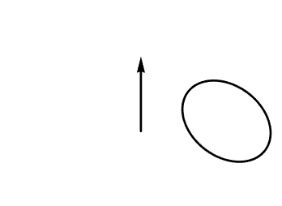

# Урок 8 — Screw и Spin: турбины, сопла и тарелка антенны

**Модуль 2 | 2 академических часа (1,5 часа)**

> 🔁 В начале урока — [повторение урока 7](повторение.md) (викторина, 5–7 мин)

---

## Цель урока

- Понять, что такое **тело вращения**
- Освоить инструмент **Spin** (Edit Mode) и модификатор **Screw**
- **Вместе сделать сопло двигателя, турбину и тарелку антенны** для корабля
- **Лайфхак:** сфера из дуги и пружина через Screw

---

## Часть 1 — Теория: тело вращения (10 минут)

Многие предметы **симметричны вокруг оси**: ваза, бутылка, колесо, сопло, тарелка. Их рисуют не целиком, а **профилем** (силуэт половинки), который **вращают вокруг оси**.

*Круг вращается вокруг оси и образует тор (бублик). Так же из любого профиля получается тело вращения. ([источник: Wikimedia Commons](https://commons.wikimedia.org/wiki/File:Torus_revolution.gif))*

> 💡 **Фишка — мысли профилем:** прежде чем делать вазу или сопло, нарисуй в голове его **силуэт сбоку**. Этот силуэт и есть профиль для вращения. Половину рисуем — вращение достраивает объём.

В Blender два инструмента для этого:
| Инструмент | Что это | Когда |
|------------|---------|-------|
| **Spin** | инструмент в Edit Mode | разовое вращение профиля-меша |
| **Screw** | модификатор | живой, настраиваемый; плюс умеет спирали/пружины |

---

## Часть 2 — Spin: тарелка антенны (20 минут)

### Шаг 1 — Профиль тарелки

1. `Shift + A → Mesh → Plane`, удали всё в Edit Mode кроме... проще: `Shift + A → Mesh → Circle` → удали → начнём с вершин
2. Проще для детей: добавь **Plane**, `Tab`, удали 3 вершины (`X → Vertices`), оставь **одну**
3. Нажми `Numpad 1` (вид спереди)
4. От одной вершины `E` (extrude) рисуй **силуэт половины тарелки** — изогнутую линию-дугу вверх-вбок

> 💡 **Фишка — профиль строится у оси:** ось вращения пройдёт через 3D-курсор (центр). Поэтому профиль рисуй **сбоку от центра** — иначе тарелка схлопнется.

### Шаг 2 — Spin

1. Выдели все вершины профиля (`A`)
2. `F3` → введи **Spin** → выбери
3. Открой панель `F9`:
   - **Steps: 16** (плавность)
   - **Angle: 360**
   - **Axis: Z** (ось вращения)
   - При необходимости поправь **Center** (0,0,0)

Профиль крутанулся в тарелку! 🎉

> 💡 **Фишка — Spin вращает вокруг оси из настроек, через 3D-курсор:** если результат кривой — проверь, что 3D-курсор в центре (`Shift + C`) и выбрана правильная ось в F9.

> 📷 **[Вставь сюда картинку: Spin — профиль и результат →](изображения.md#spin)**

---

## Часть 3 — Screw: сопло двигателя (25 минут)

Модификатор **Screw** делает то же, но **живым** (можно настраивать) и умеет спирали.

### Шаг 1 — Профиль сопла

1. `Shift + A → Mesh → Plane` → Edit Mode → оставь линию из вершин
2. `Numpad 1` — вид спереди
3. Нарисуй `E` силуэт сопла: узко внизу (горло), расширяется колоколом вверх
4. Профиль должен идти **сбоку от центра** (ось Z)

### Шаг 2 — Screw

1. `Tab` → Object Mode
2. 🔧 → **Add Modifier → Generate → Screw**
3. По умолчанию вращает вокруг **Z** на **360°** — появилось сопло-колокол!

| Параметр | Что делает |
|----------|-----------|
| **Angle** | угол вращения (360° = полный оборот) |
| **Screw** | смещение вдоль оси за оборот (для пружин!) |
| **Steps** | плавность вращения |
| **Iterations** | сколько оборотов (для спиралей) |

> 💡 **Фишка — Screw живой:** меняешь профиль в Edit Mode — сопло перестраивается мгновенно. Подбирай форму, пока модификатор не применён.

> 💡 **Фишка — толщина стенки:** профиль — это одна линия, у сопла будут «бумажные» стенки. Добавь после Screw модификатор **Solidify** (помнишь урок 4?) — стенки станут толстыми.

> 📷 **[Вставь сюда картинку: сопло двигателя через Screw →](изображения.md#nozzle)**

---

## Часть 4 — Турбина и сборка (20 минут)

### Турбина (Spin + лопасти)

1. Кольцо турбины — цилиндр (Vertices 16), сплюснутый
2. Одна лопасть — тонкий наклонённый куб
3. Лопасть → **Array по кругу через Empty** (урок 3!) — кольцо лопастей
4. Собери: кольцо + лопасти + сопло-колокол

> 💡 **Фишка — комбо приёмов:** турбина = Spin (кольцо) + радиальный Array (лопасти) + Screw (сопло). Сложные детали собираются из простых приёмов, которые ты уже знаешь.

### Ставим на корабль

Перемести сопло и турбину к хвосту корабля. Внутри сопла — диск с **Emission** (свечение тяги).

> 🎯 **ЛАЙФХАК — показать здесь!** Перед финалом покажи трюки со Screw: **идеальная сфера из полудуги** и **пружина/спираль**. Полный разбор — [лайфхак.md](лайфхак.md).

> 📷 **[Вставь сюда картинку: двигатель в сборе на корабле →](изображения.md#engine-final)**

---

## Итог урока

Сегодня мы:
- ✅ Поняли принцип тела вращения (профиль + ось)
- ✅ Освоили **Spin** (инструмент) и **Screw** (модификатор)
- ✅ Сделали тарелку антенны, сопло, турбину
- ✅ Скомбинировали Screw + Solidify, Spin + радиальный Array
- ✅ Узнали трюки: сфера из дуги и пружина

---

## Лайфхак урока

👉 [лайфхак.md](лайфхак.md) — **сфера из дуги и пружина через Screw** (показывается в Части 4)

## Самостоятельная работа

👉 [практика.md](практика.md) — сделай тело вращения (ваза, колесо, двигатель)

---

## Навигация

⬅️ [Урок 7](../урок-07/урок.md)  ·  🔁 [Повторение](повторение.md)  ·  ➡️ **Следующий урок: [Урок 9 — Продвинутый меш и Loop Tools](../урок-09/урок.md)**
