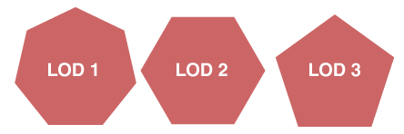

# Урок 10 — Оптимизация меша: Decimate, Weld, Remesh и пояс астероидов

**Модуль 2 | 2 академических часа (1,5 часа)**

> 🔁 В начале урока — [повторение урока 9](повторение.md) (викторина, 5–7 мин)

---

## Цель урока

- Понять, что такое **полигонбюджет** и зачем оптимизировать
- Освоить модификаторы **Decimate**, **Weld**, **Remesh**
- Узнать инструмент **Randomize** для «грубых» поверхностей
- **Вместе сделать пояс астероидов** — много разных камней
- **Лайфхак:** low-poly из high-poly (Decimate для сложных моделей)

---

## Часть 1 — Теория: зачем оптимизировать (10 минут)

Каждая грань нагружает компьютер. Чем больше полигонов в сцене — тем сильнее тормозит (особенно на слабых ПК). Поэтому в играх и больших сценах модели делают **настолько лёгкими, насколько можно без потери вида**.

*Один объект на разных **уровнях детализации (LOD)**: чем дальше от камеры, тем меньше полигонов нужно. ([источник: Wikimedia Commons](https://commons.wikimedia.org/wiki/File:LOD_Example.png))*

> 💡 **Фишка — полигонбюджет:** прикинь, сколько объектов будет в сцене. Если 100 астероидов по 5000 полигонов — это полмиллиона граней, ПК «ляжет». Сделай астероид на 200–500 полигонов — и сцена полетит.

> 💡 **Фишка — где смотреть число полигонов:** включи статистику `Overlays → Statistics` (или в шапке) — Blender покажет Tris/Faces/Verts. Следи за этим числом.

---

## Часть 2 — Три модификатора оптимизации (20 минут)

### 🔻 Decimate (упрощение)

Уменьшает количество полигонов. Главный инструмент оптимизации.

1. Возьми сферу (или любую плотную модель)
2. 🔧 → **Add Modifier → Generate → Decimate**
3. **Ratio: 0.2** — осталось 20% полигонов!

| Режим | Что делает |
|-------|-----------|
| **Collapse** | общее упрощение (используй его), ползунок Ratio |
| **Un-Subdivide** | отменяет Subdivision (по «кругам») |
| **Planar** | убирает лишние вершины на плоских участках |

> 💡 **Фишка — Planar для технических моделей:** если модель состоит из плоских граней (коробки, корпус) — режим **Planar** уберёт лишнюю геометрию, не меняя форму. Для коробок лучше Collapse.

### 🔧 Weld (сварка)

Сливает вершины ближе заданного расстояния. Чинит «двойные» вершины после Boolean/импорта.

- 🔧 → Weld → **Distance** задаёт порог слияния.

### 🧹 Remesh (перетопология)

Полностью пересчитывает сетку — превращает «грязный» меш в равномерный.

| Режим | Когда |
|-------|-------|
| **Blocks** | кубический, «майнкрафт»-стиль |
| **Smooth** | гладкая равномерная сетка |
| **Sharp** | сохраняет острые углы |
| **Voxel** | по вокселям (для скульпта) |

> 💡 **Фишка:** Remesh даёт чистую равномерную сетку, но **много полигонов** — после него часто ставят **Decimate**, чтобы облегчить. Связка Remesh → Decimate спасает «сломанные» модели.

---

## Часть 3 — Делаем астероид (20 минут)

### Шаг 1 — Заготовка камня

1. `Shift + A → Mesh → Ico Sphere` → `F9`: **Subdivisions: 2**
2. `Ctrl + A → All Transforms`

> 💡 **Фишка — почему Ico Sphere:** у неё треугольная равномерная сетка — идеально для камней и органики (в отличие от UV Sphere с полюсами).

### Шаг 2 — Грубая форма (Randomize)

1. `Tab` → Edit Mode → `A` (выделить всё)
2. `F3` → введи **Randomize** → выбери (Mesh → Transform → Randomize)
3. В панели `F9` подбери **Amount** — вершины разъехались, получился неровный камень!

> 💡 **Фишка — Randomize:** случайно сдвигает вершины. Для камней, астероидов, кочек — мгновенный «природный» хаос. Каждый раз результат разный (кнопка нового сида).

3. `Tab` → Object Mode → `ПКМ → Shade Flat` (гранёный low-poly камень)

### Шаг 3 — Облегчаем (Decimate)

1. Добавь **Decimate**, Ratio ≈ 0.5 → камень стал легче, но форма та же
2. Проверь Statistics — стало меньше Tris

> 📷 **[Вставь сюда картинку: астероид — этапы (сфера → Randomize → Decimate) →](изображения.md#asteroid-steps)**

---

## Часть 4 — Целый пояс астероидов (20 минут)

Один камень есть — нужно много **разных**.

### Способ 1 — Дубли с вариациями

1. `Shift + D` дублируй камень
2. Каждому: разный масштаб (`S`), поворот (`R`), и снова `Randomize` в Edit Mode — чтобы не были близнецами
3. Раскидай по кольцу

> 💡 **Фишка — разнообразие:** одинаковые камни выглядят фальшиво. Меняй масштаб, поворот и форму каждого. 5–6 разных «болванок» → дубли с поворотом = богатый пояс.

> 💡 **Фишка — кольцо астероидов:** вспомни радиальный Array (урок 3) или просто раскидай вручную по орбите. Полноценный процедурный разброс сделаем на след. уроке (Geometry Nodes).

### Материал камня

Серо-коричневый, Roughness 0.9, Metallic 0. Можно затемнить впадины (позже — текстурами).

> 📷 **[Вставь сюда картинку: пояс астероидов →](изображения.md#asteroid-belt)**

---

## Итог урока

Сегодня мы:
- ✅ Поняли полигонбюджет и зачем оптимизация
- ✅ Освоили **Decimate**, **Weld**, **Remesh**
- ✅ Узнали **Randomize** и почему Ico Sphere лучше для камней
- ✅ Сделали пояс астероидов из разных камней
- ✅ Научились следить за числом полигонов (Statistics)

---

## Лайфхак урока

👉 [лайфхак.md](лайфхак.md) — **low-poly из high-poly: Decimate для тяжёлых моделей** (показывается в Части 2)

## Самостоятельная работа

👉 [практика.md](практика.md) — оптимизируй скачанную модель под игру

---

## Навигация

⬅️ [Урок 9](../урок-09/урок.md)  ·  🔁 [Повторение](повторение.md)  ·  ➡️ **Следующий урок: [Урок 11 — Geometry Nodes: основы](../урок-11/урок.md)**
