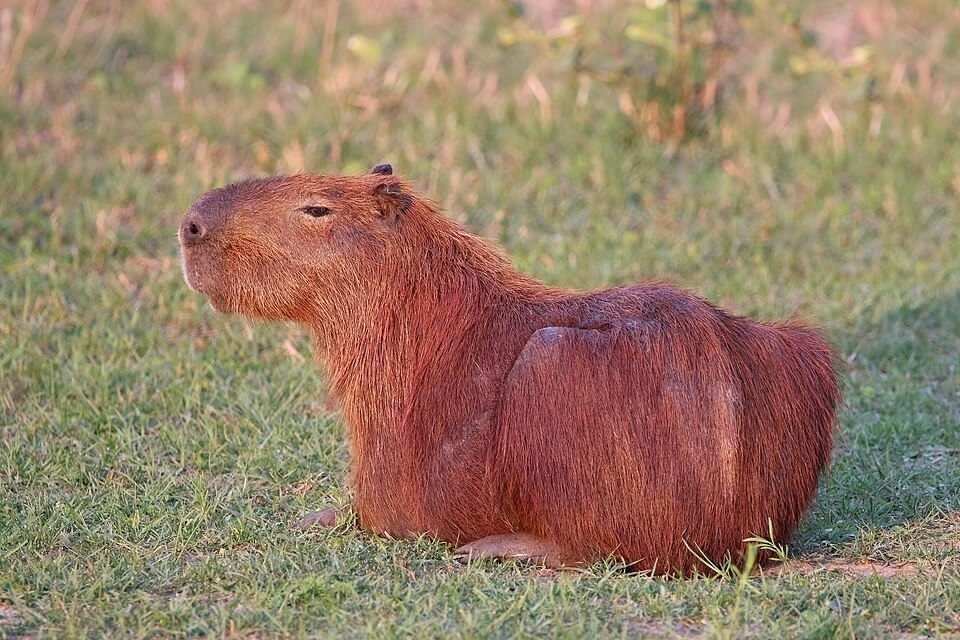

# Урок 13 — Low-poly животные: капибара, заяц, корова 🐹

**Модуль 2 | 2 академических часа (1,5 часа)**

> 🔁 В начале урока — [повторение уроков 11–12](повторение.md) (викторина по Geo Nodes, 5–7 мин)

---

## Цель урока

- Понять принципы **low-poly** стиля и бокс-моделинга
- Научиться лепить **милых животных** из простых форм
- Закрепить **Mirror** (симметрия) и **Proportional Editing** для мягких форм
- **Вместе сделать капибару**, а заяц и корова — на выбор
- **Лайфхак:** любое животное из одного «бокса» (универсальная заготовка)

---

## Часть 1 — Теория: принципы low-poly животных (12 минут)

**Low-poly** — это стиль, где форма передаётся **минимумом полигонов**. Главное — узнаваемый **силуэт**, а не детали.

### Бокс-моделинг — «лепка из коробки»
Главный метод урока — **бокс-моделинг**: берём простую коробку (куб) и постепенно «вытягиваем» из неё форму животного инструментом **Extrude** (выдавливание граней), а потом округляем. Не лепим из тысячи деталей — растим форму из одного куска. Так модель остаётся **цельной** (одна сетка), её легко сглаживать и анимировать потом.

### Топология: почему важны квады и петли
- Старайся, чтобы грани были **квадами** (4-угольники), а не треугольниками — квады ровно сглаживаются и красиво гнутся на сгибах (шея, лапы).
- **Петли рёбер (Loop Cut, `Ctrl+R`)** добавляют «суставы»: там, где тело должно сгибаться или округляться, нужна петля. Мало петель = угловато; слишком много = тяжело и «каша». Ставь петли **там, где нужен изгиб**.

> 📚 **Глубже — выделение:** бокс-моделинг = постоянное выделение граней/петель/колец. Все способы выделять быстро (петли `Alt+клик`, кольца `Ctrl+Alt+клик`, Select Similar `Shift+G`, X-Ray, нарастить/сузить) — в гайде [Выделение: вершины, рёбра, грани](../../справочники/глубокое-погружение/выделение.md). Очень ускорит работу.

### Секреты милых low-poly животных
- **Простые формы** — тело это вытянутый куб/капсула, голова — куб/сфера
- **Крупные черты** — большие глаза, круглые щёки, короткие лапки
- **Симметрия** — лепим половину, Mirror достраивает (лапы, уши, глаза)
- **Мягкость через Proportional Editing** — округляем формы без лишней геометрии

> 💡 **Фишка — думай силуэтом:** прищурься и посмотри на референс — что главное в силуэте? У капибары — крупное «бочкообразное» тело и спокойная мордочка. У зайца — длинные уши. У коровы — пятна и рога. Передай главное, остальное упрости.

> 📷 Наша цель — капибара (референс):
>
> 
>
> *Главное в силуэте: крупное «бочкообразное» тело, короткие лапки, спокойная тупоносая мордочка. Именно это и передаём low-poly. ([фото: Wikimedia Commons, CC BY-SA](https://commons.wikimedia.org/wiki/File:Capybara_(Hydrochoerus_hydrochaeris).jpg))*

---

## Часть 2 — Готовим симметричную заготовку (10 минут)

Чтобы лепить половину животного, настроим Mirror.

1. `Shift + A → Mesh → Cube`
2. `Ctrl + A → All Transforms`
3. 🔧 → **Mirror** → ось **X**, включи ✅ **Clipping** (вспомни урок 3)
4. `Tab` → Edit Mode → удали половину куба по X (выдели грани одной стороны → `X → Faces`)

Теперь всё, что лепим с одной стороны, **зеркалится** на другую. Идеально для лап, ушей, глаз.

> 💡 **Фишка — Clipping не даёт «шву» разъехаться:** вершины по центру прилипают к оси симметрии. Без Clipping половинки разойдутся и появится дыра.

---

## Часть 3 — Лепим капибару (40 минут)

Капибара — большой спокойный грызун. Идеальна для low-poly: «батон» с лапками.

### Шаг 1 — Тело

1. Из заготовки: `S` → растяни куб в «батон» (длинное тело)
2. `Ctrl + R` — добавь 2-3 петли поперёк тела (будут сгибы)
3. Включи **Proportional Editing** (`O`) → двигай петли/вершины, округляя тело в «бочку»

> 💡 **Фишка — Proportional Editing (урок 2):** `O` включает «мягкое» перемещение — соседние вершины тянутся следом. Колесо мыши = радиус. Так из угловатого куба легко лепится плавное тело без лишних петель.

### Шаг 2 — Голова

1. Выдели переднюю грань тела → `E` (выдави вперёд) → `S` (сделай голову покрупнее)
2. Морду чуть опусти и закругли (Proportional Editing)
3. Капибара «носатая» — выдели нижне-переднюю часть, чуть вытяни вперёд

> 💡 **Аддон — умное «зашивание» сетки F2.** Включи аддон **F2** (Preferences → Add-ons → «F2» → ✅). Теперь клавиша **`F`** работает умнее: выделил одну вершину или ребро на краю дыры → `F` сам достроит грань по контексту, не нужно выделять все 4 вершины. Очень ускоряет бокс-моделинг, когда «латаешь» сетку. Каталог — [справочники/аддоны.md](../../справочники/аддоны.md).

### Шаг 3 — Лапки

1. Выдели грань снизу тела (там, где будет лапа) → `E` вниз → короткая толстая лапка
2. Благодаря **Mirror** вторая лапа с другой стороны появляется сама
3. Передвинь по длине тела, сделай вторую пару лап (`E` из другой нижней грани)

### Шаг 4 — Уши и глаза

1. Уши — маленькие грани на голове → `E` наружу (Mirror удвоит)
2. Глаза — отдельные сферы (тёмные), посади на мордочку. Одну поставил — продублируй и отзеркаль (или ставь до Apply Mirror рядом с осью)

### Шаг 5 — Сглаживание

1. `ПКМ → Shade Smooth` (или Shade Auto Smooth, чтобы морда была гладкой, а формы читались)
2. По желанию — лёгкий **Subdivision** уровень 1 для мягкости

> 📷 **[Вставь сюда картинку: этапы капибары →](изображения.md#capybara-steps)**

---

## 🎯 ЛАЙФХАК — любое животное из одной заготовки

> **Показать здесь!** Капибара готова — а теперь покажи, что **тот же «бокс» превращается в зайца, корову, кота** — меняются только пропорции и пара деталей. Полный разбор — [лайфхак.md](лайфхак.md).
> - **Заяц:** тело короче и выше, **уши длинные** (выдави вверх и удлини), задние лапы крупнее
> - **Корова:** тело массивнее, **рога** (маленькие конусы), морда шире, пятна (материалы), вымя
> - **Кот:** тело гибче, хвост (несколько Extrude), острые ушки

---

## Часть 4 — Цвет и финал (15 минут)

- **Капибара:** коричнево-рыжий мех (Roughness 0.9, Metallic 0)
- **Глаза/нос:** тёмный, чуть блестящий
- **Корова:** базовый белый + пятна (второй материал на выделенные грани → Assign, как в уроке 2)

`Apply` модификатора Mirror, когда доволен симметрией. `Z → Material Preview` → `F12`.

> 💡 **Фишка — Apply Mirror в конце:** пока Mirror живой — правки идут симметрично. Применяй его только когда форма готова (для отдельных асимметричных деталей — например, повернуть одно ухо).

> 📷 **[Вставь сюда картинку: готовые животные с цветом →](изображения.md#animals-final)**

---

## Итог урока

Сегодня мы:
- ✅ Поняли принципы low-poly (силуэт, простые формы, крупные черты)
- ✅ Слепили капибару из «бокса» через Extrude + Proportional Editing
- ✅ Закрепили **Mirror** для симметрии лап/ушей/глаз
- ✅ Узнали, как из одной заготовки сделать зайца, корову, кота
- ✅ Раскрасили животное (включая пятна через мульти-материал)

---

## Лайфхак урока

👉 [лайфхак.md](лайфхак.md) — **любое животное из одной заготовки** (показывается после Части 3)

## Самостоятельная работа

👉 [практика.md](практика.md) — слепи своё животное (другое, не капибару)

---

## Навигация

⬅️ [Урок 12](../урок-12/урок.md)  ·  🔁 [Повторение](повторение.md)  ·  ➡️ **Следующий урок: [Урок 14 — Low-poly природа (Skin, Displace)](../урок-14/урок.md)**
