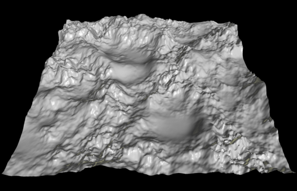

# Урок 14 — Low-poly природа: деревья (Skin) и рельеф (Displace) 🌳

**Модуль 2 | 2 академических часа (1,5 часа)**

> 🔁 В начале урока — [повторение урока 13](повторение.md) («сделай сам» + опрос, 5–7 мин)

---

## Цель урока

- Освоить модификатор **Skin** — деревья и ветки из линий
- Освоить модификатор **Displace** — рельеф и холмы из текстуры
- Собрать **природный набор**: деревья, камни, трава, забор
- Понять, что такое **карта высот (heightmap)**
- **Лайфхак:** Skin-модификатор для чего угодно (деревья, кабели, существа)

---

## Часть 1 — Skin modifier: дерево из линии (25 минут)

**Skin** превращает рёбра и вершины в «трубчатый» меш. Нарисовал линию-веточку — Skin «надул» её в объёмную ветку. Идеально для деревьев, кораллов, кабелей.

### 🧩 Что делает Skin (простыми словами)

«Обтягивает скелет кожей»: ты задаёшь **линию из вершин** (как палочки-скелет), а Skin натягивает на неё объём. Толщину в каждой вершине задаёшь сам.

### Шаг 1 — Скелет дерева

1. `Shift + A → Mesh → Plane` → `Tab` → удали 3 вершины, оставь **одну**
2. От неё `E` вверх — это ствол
3. От верхушки `E` в стороны несколько раз — это ветки (разветвляй!)

> 💡 **Фишка:** дерево — это просто «палка с ветками» из вершин. Рисуй скелет, не думая об объёме — объём добавит Skin.

> 💡 **Аддоны — целый лес и горы за минуту.** Мы лепим дерево руками, чтобы понять, как оно устроено — но для **массовки** есть генераторы:
> - **Add Curve: Sapling Tree Gen** (Preferences → Add-ons → «Sapling» → ✅) → `Shift+A → Curve → Sapling Tree Gen` — целое дерево со стволом, ветками и листвой; в панели снизу крути число веток/листьев (для слабых ПК — поменьше).
> - **A.N.T. Landscape** (Add-ons → «Landscape» → ✅) → `Shift+A → Mesh → Landscape` — готовый рельеф (горы, холмы) вместо ручного Displace.
>
> Приём профи: пару деревьев слепить самому, остальные «насыпать» генератором. Каталог — [справочники/аддоны.md](../../справочники/аддоны.md).

### Шаг 2 — Включаем Skin

1. `Tab` → Object Mode → 🔧 → **Add Modifier → Generate → Skin**
2. Линия превратилась в «трубы»! Но толщина пока одинаковая.

### Шаг 3 — Толщина веток (важно!)

1. `Tab` → Edit Mode → выдели нижнюю вершину (корень ствола)
2. Нажми **`Ctrl + A`** и двигай мышь — задаёшь **толщину skin** в этой вершине
3. Сделай ствол толстым, кончики веток — тонкими (выдели верхние вершины → `Ctrl + A` → тоньше)

> 💡 **Фишка — `Ctrl + A` в Skin = радиус, а не Apply!** В Edit Mode с модификатором Skin сочетание `Ctrl + A` меняет толщину вершины. Толстый низ + тонкие концы = настоящее дерево.

### Шаг 4 — Крона и финал

1. Сверху веток посади **кроны** — Ico Sphere (Shade Flat, зелёный) или несколько шаров
2. По желанию: добавь после Skin модификатор **Subdivision** (1) для мягкости
3. `ПКМ → Shade Smooth` стволу

> 📷 **[Вставь сюда картинку: дерево из линии через Skin →](изображения.md#skin-tree)**

---

## Часть 2 — Displace modifier: рельеф земли (25 минут)

**Displace** двигает вершины меша по **текстуре**: где текстура светлая — вершина поднимается, где тёмная — опускается. Так из плоскости получается рельеф.

### 🧩 Что такое карта высот (heightmap)

*Серая картинка (**карта высот**): чёрное = низко, белое = высоко. Displace по ней поднимает вершины — плоскость превращается в горы. ([источник: Wikimedia Commons](https://commons.wikimedia.org/wiki/File:Heightmap_rendered.png))*

> 💡 **Фишка:** белое тянет вверх, чёрное оставляет внизу. Можно дать готовую карту высот (картинку) или процедурный шум.

### Шаг 1 — Плотная плоскость

1. `Shift + A → Mesh → Plane`, `S → 10`
2. `Tab` → `Ctrl+R` много петель ИЛИ модификатор **Subdivision** (нужно много вершин — иначе двигать нечего!)

> ⚠️ **Фишка — Displace нужна геометрия:** на плоскости из 1 грани рельефа не будет. Сначала раздели её на много граней (Subdivide), потом Displace.

### Шаг 2 — Добавляем Displace + текстуру

1. 🔧 → **Add Modifier → Deform → Displace**
2. В модификаторе нажми **New** (создать текстуру) → кнопка **Show Texture in Texture Tab** (или вкладка 🏁 Texture Properties)
3. В Texture Properties смени Type на **Noise** или **Clouds**
4. Вернись — в Displace покрути **Strength** → земля стала холмистой! 🎉

### Шаг 3 — Стилизуем под low-poly

1. Добавь модификатор **Decimate** (урок 10) ИЛИ `ПКМ → Shade Flat` — гранёные стилизованные холмы
2. Подбери Strength: мягкие холмы, не «иглы»

> 📷 **[Вставь сюда картинку: плоскость → рельеф через Displace →](изображения.md#displace)**

---

## Часть 3 — Собираем природный набор (15 минут)

Теперь у нас есть инструменты для целого мира:

| Объект | Как делаем |
|--------|-----------|
| 🌳 Деревья | Skin (эта тема) |
| ⛰ Рельеф/холмы | Displace (эта тема) |
| 🪨 Камни | Ico Sphere + Randomize (урок 10) |
| 🌿 Трава, цветы | Geometry Nodes разброс (урок 11) |
| 🚧 Забор | Array или Geo Nodes (уроки 3, 12) |

Собери маленький уголок: холм (Displace) + пара деревьев (Skin) + камни + трава.

> 💡 **Фишка — это «кит» (набор) для сцен:** эти ассеты пригодятся в ферме (урок 15), деревне (урок 17) и дипломе. Сохрани их в отдельный файл-библиотеку.

> 🎯 **ЛАЙФХАК — показать здесь!** Skin — это не только деревья. Покажи, как из линий им делают кабели, кораллы, грибы и даже простых «червячков»-существ. Полный разбор — [лайфхак.md](лайфхак.md).

---

## Часть 4 — Материалы и финал (10 минут)

- **Ствол:** коричневый, Roughness 0.9
- **Крона/трава:** зелёный (можно 2-3 оттенка для разнообразия)
- **Земля:** травянисто-зелёный или земляной; впадины темнее (позже — текстурами)

`Apply` модификаторов когда доволен. `F12`.

> 📷 **[Вставь сюда картинку: природный уголок (деревья + холм + камни) →](изображения.md#nature-final)**

---

## Итог урока

Сегодня мы:
- ✅ Освоили **Skin** — деревья и ветки из линий (толщина через `Ctrl+A`)
- ✅ Освоили **Displace** — рельеф из текстуры
- ✅ Поняли, что такое карта высот (heightmap)
- ✅ Собрали природный набор (деревья, холм, камни, трава)
- ✅ Узнали, что Skin годится для кабелей, кораллов, существ

---

## Лайфхак урока

👉 [лайфхак.md](лайфхак.md) — **Skin: деревья, кабели, существа из линий** (показывается в Части 3)

## Самостоятельная работа

👉 [практика.md](практика.md) — собери свой биом (зима / пустыня / джунгли)

---

## Навигация

⬅️ [Урок 13](../урок-13/урок.md)  ·  🔁 [Повторение](повторение.md)  ·  ➡️ **Следующий урок: [Урок 15 — Ферма с животными (повторительный)](../урок-15/урок.md)**
