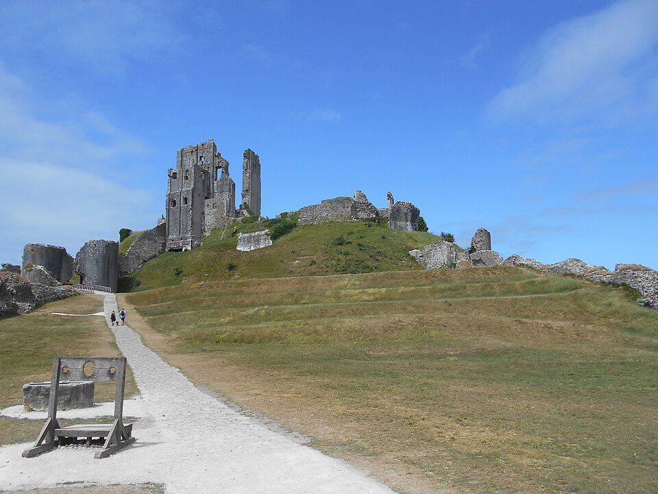

# Урок 17 — Итоговый проект Модуля 2: своя уникальная сцена 🏆

**Модуль 2 | 2 академических часа (1,5 часа)**

> 🔁 В начале урока — [повторение Модуля 2](повторение.md) (большая викторина, 7 мин)

---

## Цель урока

Это **итоговый проект Модуля 2**. Собрать всё, чему научились, в одну большую сцену и защитить её перед классом.

> ⚠️ **Тема — новая!** Корабль и ферму мы уже делали — их не повторяем. Придумай **свой уникальный мир**.

---

## Часть 1 — Выбор темы и план (10 минут)

**Свежие идеи (выбери одну или придумай свою):**

| Тема | Что покажешь |
|------|--------------|
| 🏰 **Сказочный замок** | башни (Screw), стены (Array), флаги, ров, деревья |
| 🌊 **Подводный мир** | кораллы (Skin!), водоросли, рыбки, сундук, камни, пузыри (разброс) |
| 🏙 **Город будущего** | небоскрёбы (Geo Nodes-сетка), неон (Emission), трубы, мосты |
| 🏚 **Древние руины** | разрушенные колонны (Boolean), заросшие лианы (Skin), рельеф (Displace) |
| 🎡 **Парк аттракционов** | карусель (твоя из практики!), горки, фонари, гирлянды |
| 🏝 **Остров с маяком** | маяк (Screw), скалы (Displace), пальмы (Skin), вода, лодочка |
| 🍭 **Сладкий мир** | леденцы (Screw), пряничные домики, шоколадные реки |
| 👽 **Инопланетная база** | купола, странные растения, кратеры (Displace), свечение |

### План
1. Выбери тему, накидай на бумаге **силуэт сцены** (где акцент)
2. Список объектов: что взять из готового (Asset Browser!), что сделать новое

> 💡 **Фишка — переиспользуй своё:** у тебя уже есть масса ассетов с прошлых уроков (деревья, камни, шахматы, тыква, кружка, лестница, транспорт…). Тащи подходящее из Asset Browser — это правильный рабочий подход.

> 📷 Вдохновение (тема на выбор) — например, «Древние руины»:
>
> 
>
> *Реальные руины: разрушенные стены и башни на холме, тропа, дорожка-акцент. Под любую тему ищи реальный референс и разбивай на формы. ([фото: Corfe Castle, Wikimedia Commons](https://commons.wikimedia.org/wiki/File:Corfe_Castle_ruins.jpg))*

---

## Часть 2 — Сборка сцены (50 минут)

Работай по этапам (как профи):

### Этап 1 — Акцент (главный объект)
Самый крупный/важный: замок, маяк, главный небоскрёб, корабль-обломок в руинах.

### Этап 2 — Окружение
Рельеф (Displace), деревья/кораллы (Skin), постройки (Boolean/Array), дороги.

### Этап 3 — Наполнение (разброс)
Geometry Nodes: трава / камни / звёзды / пузыри (уроки 11–12). **Разнообразие!**

### Этап 4 — Детали и мелочь
Греблы, кустики, фонари, мелочь по краям — заполни пустые зоны.

> 💡 **Фишка — этапность спасает:** не прыгай хаотично. Акцент → окружение → наполнение → мелочь. Так сцена собирается быстро и аккуратно.

> 💡 **Фишка — коллекции обязательны:** разложи по «папкам» сразу — иначе в большой сцене утонешь.

---

## Часть 3 — Материалы и кадр (20 минут)

1. Назначь материалы (под тему: камень замка, неон города, кораллы)
2. Поставь **камеру** на красивый ракурс (`Ctrl+Numpad0`)
3. Простой свет для презентации (см. лайфхак)
4. `F12` — финальный рендер

> 🎯 **ЛАЙФХАК — показать здесь!** Как быстро сделать **красивый кадр для защиты** (ракурс + простой свет + фон) — [лайфхак.md](лайфхак.md). Полноценно свет разберём в Модуле 4, сейчас — по-быстрому.

> 📷 **[Вставь сюда картинку: готовые уникальные сцены →](изображения.md#scene-final)**

---

## Часть 4 — Защита проекта (10 минут)

Каждый показывает свою сцену классу и за 1–2 минуты рассказывает:
- Что это за мир и какая была идея
- Какие приёмы модуля использовал (Boolean? Skin? Geo Nodes? китбаш?)
- Что получилось лучше всего, что было сложно
- Что бы добавил, будь больше времени

> Критерии оценки — в [практика.md](практика.md). Покажи их детям **до** начала работы.

---

## Итог Модуля 2 🎉

За 12 уроков ты прошёл огромный путь! Теперь ты умеешь:
- ✅ кривые, Boolean, Screw, продвинутый меш
- ✅ оптимизацию (Decimate/Weld/Remesh)
- ✅ Geometry Nodes (разброс и сетки)
- ✅ low-poly животных и природу (Skin, Displace)
- ✅ собирать большие уникальные сцены (Asset Browser, китбаш, коллекции, композиция)

**Дальше — Модуль 3:** материалы, текстуры, карты текстур и шейдерные ноды — твои модели оживут цветом и фактурой!

---

## Лайфхак урока

👉 [лайфхак.md](лайфхак.md) — **быстрый красивый кадр для защиты** (показывается в Части 3)

## Сдать на оценку

👉 [практика.md](практика.md) — требования к итоговой работе и критерии

---

## Навигация

⬅️ [Урок 16](../урок-16/урок.md)  ·  🔁 [Повторение](повторение.md)  ·  ➡️ **Дальше — Модуль 3: материалы и текстуры** (см. [план курса](../../ПЛАН-КУРСА.md))

🎉 *Поздравляем с завершением Модуля 2!*
