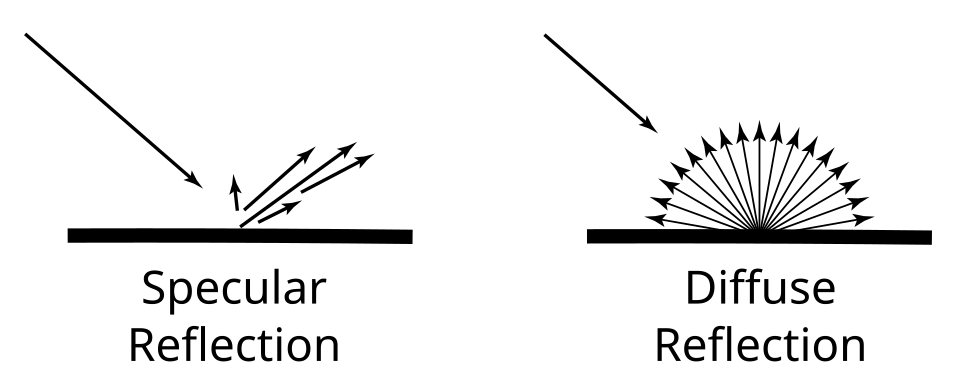
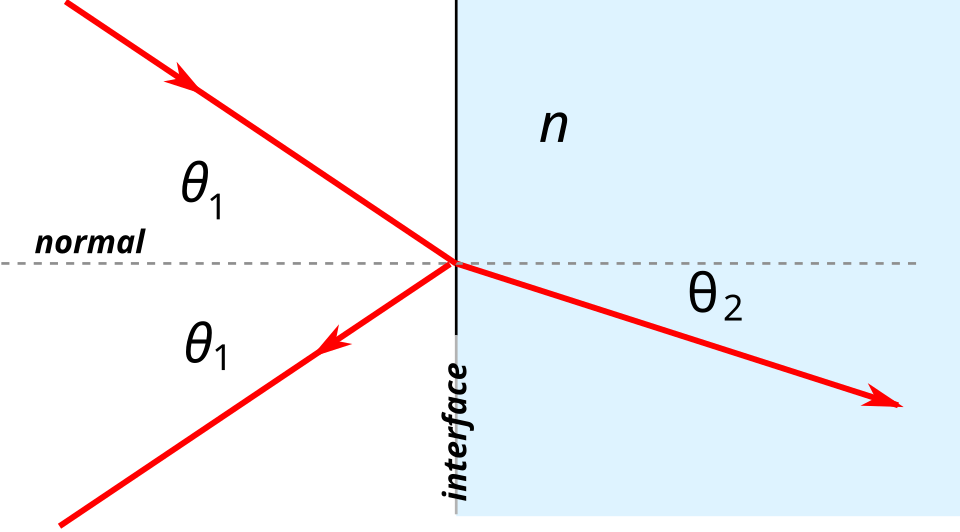

# Урок 18 — Shader Editor и Principled BSDF: витрина материалов 🎨

**Модуль 3 | 2 академических часа (1,5 часа) — плотный урок, можно растянуть на 2×2**

> 🔁 В начале урока — [повторение](повторение.md) (мостик к материалам, 5 мин)

---

## Цель урока

- Понять **физику материала**: как поверхность реагирует на свет (отражение, преломление, свечение)
- Разобрать главный шейдер — **Principled BSDF** и **каждый его вход**
- Сделать **5 базовых материалов**: металл, пластик, дерево, стекло, свечение
- Подключить аддон **Node Wrangler**
- Раскрасить свою модель и узнать приёмы **быстрого назначения** материалов

---

## Часть 1 — Теория: материал, свет и Shader Editor (18 минут)

### 1.1 Что такое материал

**Материал** описывает, **как поверхность взаимодействует со светом**. Когда луч падает на поверхность, может произойти несколько вещей:
- **Отражение** — луч отскакивает (бывает зеркальное и рассеянное),
- **Преломление** — луч проходит внутрь и **изгибается** (стекло, вода),
- **Поглощение** — часть света «съедается» (поэтому мы видим цвет),
- **Излучение** — поверхность сама светит (лампа, экран).

### 1.2 Два вида отражения (это основа Roughness)



*Слева — **зеркальное** (specular): гладкая поверхность отражает лучи в одну сторону → блеск/зеркало. Справа — **диффузное** (diffuse): шероховатая поверхность рассеивает лучи во все стороны → матовость. ([Wikimedia Commons, CC BY 3.0](https://commons.wikimedia.org/wiki/File:Specular_And_Diffuse_Reflection.svg))*

Вся разница между «зеркалом» и «матовым» — это **насколько мелко-шероховата** поверхность. Этим управляет параметр **Roughness** (увидим ниже).

### 1.3 Shader Editor и два главных нода

В Blender материал собирается из **шейдерных нодов** в редакторе **Shader Editor** (раскладка **Shading** сверху).

```
Principled BSDF ──[BSDF]──► Material Output ──(на экран)
```

| 🧩 Нод | Что делает | Главный сокет |
|--------|------------|---------------|
| **Principled BSDF** | «универсальный материал»: один нод задаёт цвет, блеск, металл, стекло, свечение | выход **BSDF** |
| **Material Output** | «розетка»: куда втыкается материал, чтобы он появился на объекте | вход **Surface** |

**Связь:** `Principled BSDF [BSDF] → Material Output [Surface]` — она есть по умолчанию.

> 💡 **Фишка — что значит BSDF:** это «правило», как поверхность раскидывает свет (сколько отразить, куда, как размыть). **Principled** — это «всё-в-одном» BSDF: внутри уже собраны диффузия, блеск, металл, стекло. Не нужно строить материал из десятка нодов — крути входы одного.

> 📚 **Глубже — ноды:** как понимать **сокеты по цвету** (жёлтый=цвет, серый=число, фиолетовый=вектор, зелёный=шейдер), разбор Principled по входам, роль Mix/ColorRamp/Math/Bump и как **читать чужую сеть** справа налево — в гайде [Шейдерные ноды: читать и строить](../../справочники/глубокое-погружение/шейдерные-ноды.md).

---

## Часть 2 — Глубокий разбор Principled BSDF (20 минут)

Это «ручки» материала. Разберём каждую главную.

### 🎨 Base Color
Основной цвет поверхности (для неметаллов — это «краска»; для металла — цвет отражения). Пример: красный, синий, коричневый.

### 🔩 Metallic (0…1)
«Переключатель физики»: **0 = не металл** (дерево, пластик, камень — есть цвет + слабый бесцветный блик), **1 = металл** (нет «краски», цвет даёт окрашенное отражение — золото жёлтое, медь красноватая). Промежуточных значений в природе почти нет — обычно 0 или 1.

### ✨ Roughness (0…1)
Та самая шероховатость из схемы выше:
- **0 = гладко = зеркальный блеск** (specular),
- **1 = шероховато = матовость** (diffuse).
Это **главный** параметр вида: 0.1 — глянец, 0.5 — сатин, 0.9 — резина/мел.

> 💡 **Фишка — два главных слайдера:** 90% материалов — это игра **Metallic** + **Roughness**. «Металл/не металл» × «зеркало/матовость» = почти всё вокруг.

### 💎 IOR и преломление (стекло)



*Луч на границе двух сред частично **отражается** (вверх, угол θ₁), частично **преломляется** внутрь и изгибается (угол θ₂). Насколько сильно изгибается — задаёт **показатель преломления n (IOR)**. ([Wikimedia Commons, CC BY-SA 3.0](https://commons.wikimedia.org/wiki/File:Reflection_and_refraction.svg))*

- **IOR (Index Of Refraction)** — насколько среда «гнёт» свет. Вода ≈ **1.33**, стекло ≈ **1.45–1.5**, алмаз ≈ **2.4**. В Blender 4.1 IOR заодно управляет силой блика у неметаллов.
- **Transmission (0…1)** — сколько света **проходит насквозь**. Transmission = 1 → прозрачное стекло/вода.

> 💡 **Фишка — Transmission ≠ Alpha:** **Transmission** = настоящее стекло (свет преломляется, есть блики и толщина). **Alpha** = просто «невидимость» (дырка, как на стекле без преломления — для листвы, сеток, decals). Для стекла бери Transmission, для «вырезов по картинке» — Alpha.

### 💡 Emission (свечение)
**Emission Color** (цвет свечения) + **Emission Strength** (сила). Поверхность сама светит: лампа, экран, лава, фары. Strength 0 = не светит.

### 🧴 Ещё входы (для общего понимания)
В Principled 4.1 есть и тонкие слои — пригодятся позже:
- **Coat** — прозрачный лак сверху (автомобиль, лакированное дерево),
- **Sheen** — мягкий бархатный блик по краю (ткань, велюр),
- **Subsurface** — подповерхностное рассеивание (кожа, воск, молоко — свет проходит под кожу) — подробно на уроке 27 и в Модуле 5.

> ⚠️ **Фишка — Blender 4.1:** Principled обновлён (v2). Отдельного ползунка «Specular» больше нет — силой блика у неметаллов управляет **IOR** (и Specular IOR Level). Emission разделён на Color + Strength. Не ищи старые названия из туториалов 3.x.

---

## Часть 3 — Витрина из 5 материалов (делаем вместе) (32 минуты)

Сделаем 5 сфер-образцов — как витрина в магазине. Каждая = узнаваемый реальный материал.

### Подготовка
1. `Shift + A → Mesh → UV Sphere` → `ПКМ → Shade Smooth`
2. Продублируй (`Shift+D → X`) 4 раза, поставь в ряд
3. Раскладка **Shading** (сверху) — внизу Shader Editor

### Материал 1 — Золото (металл)
1. Выдели сферу → **New**
2. Base Color: жёлто-оранжевый · **Metallic: 1.0** · **Roughness: 0.2**
3. Золото! Roughness 0.5 → «потёртое» матовое золото.

### Материал 2 — Глянцевый пластик
1. Новая сфера → New → Base Color: яркий цвет · **Metallic: 0** · **Roughness: 0.25**
2. Глянец. Roughness 0.6 → матовый пластик.

### Материал 3 — Дерево (пока однотонное)
1. Base Color: коричневый · Metallic 0 · **Roughness: 0.7**
2. *(Настоящую текстуру дерева добавим на уроках 24 — через карты.)*

### Материал 4 — Стекло
1. New → **Transmission: 1.0** · Roughness: 0.0 · **IOR: 1.45**
2. В **EEVEE**: Material Properties → **Settings → Raytraced/Screen Space Refraction** ✅, а в **Render Properties → Screen Space Reflections → Refraction** ✅
3. Прозрачное стекло! Roughness 0.2 → матовое (заиндевелое) стекло.

> 💡 **Фишка — стекло в EEVEE капризно:** Transmission требует включить Refraction (две галочки выше). Если стекло «чёрное» — проверь их или сравни в Cycles. Подробно стекло/вода/самоцветы — урок 27.

### Материал 5 — Свечение (Emission)
1. New → **Emission Color** яркий · **Emission Strength: 5**
2. Светится. В EEVEE добавь **Bloom**/Glare для ореола.

> 📷 **[Вставь сюда картинку: витрина из 5 материалов →](изображения.md#showcase)**

---

## Часть 4 — Node Wrangler и быстрая раскраска (15 минут)

### Включить Node Wrangler
`Edit → Preferences → Add-ons` → **Node Wrangler** → ✅

> 🎯 **ЛАЙФХАК — показать здесь!** Node Wrangler — суперсила для нодов: `Ctrl+Shift+ЛКМ` по ноду показывает его результат, `Ctrl+T` добавляет Texture Coordinate+Mapping разом и др. Полный разбор — [лайфхак.md](лайфхак.md).

### Раскрась свою модель
1. Открой свою модель (шахматы / кружка / животное / паровоз)
2. Назначь материалы изученных типов (металл корпуса, матовый пластик, стекло окон, свечение фар)
3. Для разных частей — несколько слотов материалов (выдели грани → **Assign**, как в уроке 2)
4. `Z → Material Preview` → `F12`

### Быстрое назначение — не крась по одному!
> 💡 **Фишка — один материал на МНОГО объектов (`Ctrl+L`):** выдели все объекты, **последним** (Shift) — тот, у кого материал уже есть, затем `Ctrl+L → Link Materials`. Материал скопируется на все.

> 💡 **Фишка — быстро выделить нужные грани:** навести + `L` (связанный кусок); `Shift+G` — **Select Similar** (по нормали/материалу/площади); кнопка **Select** у слота материала. Сначала **выдели**, потом один **Assign**.

> 💡 **Фишка — разные цвета ОДНИМ материалом:** `Object Info [Random] → ColorRamp → Base Color` — каждому объекту свой оттенок (пёстрая толпа: астероиды, деревья).

> 📖 Все приёмы — в шпаргалке [справочники/материалы-приёмы.md](../../справочники/материалы-приёмы.md)

> 💡 **Аддон — учимся на чужих материалах (BlenderKit).** Включи **BlenderKit** (Preferences → Add-ons → «BlenderKit» → ✅) — появится вкладка с огромной библиотекой готовых материалов прямо в Blender. **Приём курса:** перетащи на объект готовый материал (например, «brushed metal»), открой его в Shader Editor и **разбери ноды** — посмотри, какие входы Principled BSDF и текстуры он использует. Лучший способ научиться — изучить, как сделали профи, и повторить своё. Каталог аддонов — [справочники/аддоны.md](../../справочники/аддоны.md).

> 📷 **[Вставь сюда картинку: модель до и после материалов →](изображения.md#applied)**

---

## Итог урока

Сегодня мы:
- ✅ Поняли **физику материала**: зеркальное/диффузное отражение, преломление (IOR), свечение
- ✅ Разобрали **каждый вход Principled BSDF** (Base Color, Metallic, Roughness, IOR/Transmission, Emission, Coat/Sheen/Subsurface)
- ✅ Усвоили разницу **Transmission (стекло) vs Alpha (вырез)**
- ✅ Сделали 5 базовых материалов и подключили **Node Wrangler**
- ✅ Узнали приёмы **быстрого назначения** (Ctrl+L, Select Similar)

> 💡 **Главная мысль:** почти любой материал = **Metallic** (металл/не металл) × **Roughness** (зеркало/матовость), плюс по необходимости стекло (Transmission/IOR) или свечение (Emission). Понимаешь физику — соберёшь что угодно.

---

## Лайфхак урока

👉 [лайфхак.md](лайфхак.md) — **суперсилы Node Wrangler** (показывается в Части 4)

## Самостоятельная работа

👉 [практика.md](практика.md) — материалы для своей модели

---

## Навигация

⬅️ [Модуль 2, Урок 17](../../модуль-02-моделирование/урок-17/урок.md)  ·  🔁 [Повторение](повторение.md)  ·  ➡️ **Следующий урок: [Урок 19 — Процедурные текстуры](../урок-19/урок.md)**
