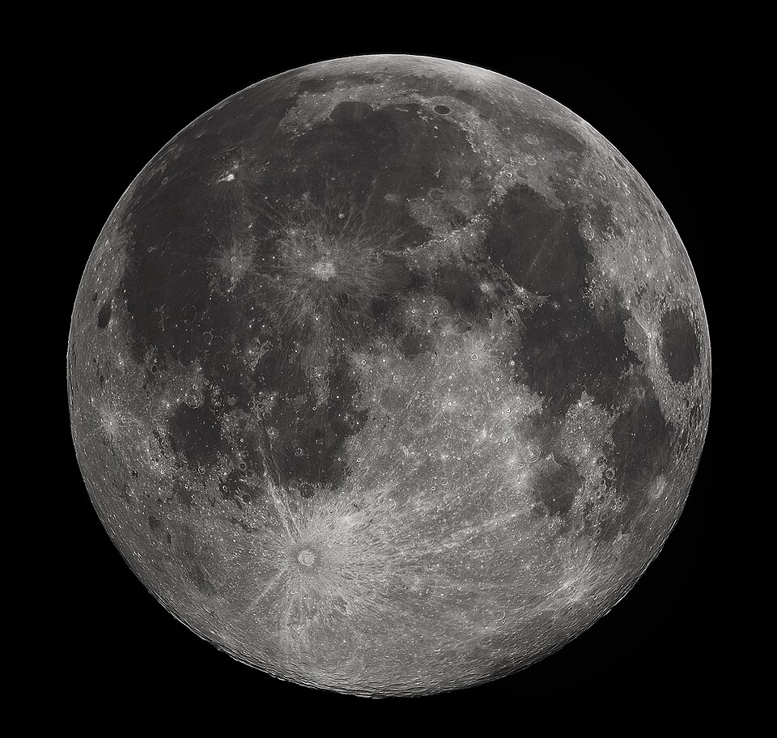

# Урок 19 — Создание звёздных объектов: планеты, луны, космос 🌌

**Модуль 3 | 4 академических часа (или 2×2 ак.ч.)**

> 🔁 В начале урока — [повторение урока 18](повторение.md) (викторина, 5–7 мин)
>
> ⏳ Это **большой блок** (объединяет процедурные текстуры, реальные карты и космос-фон). На формате 2 ак.ч. дели на два занятия (см. [преподавателю.md](преподавателю.md)).

---

## Цель блока

- Понять **процедурные текстуры** (узор по формуле) и **картинки-текстуры** (скачанные карты)
- Освоить ноды: **Noise, Wave, Voronoi, ColorRamp, Mix Color, Mapping, Bump, Image Texture**
- Сделать **газовый гигант** (процедурно) и **луну** (процедурно + реальная текстура)
- Смоделировать **кольца планеты** и **звезду** (повторяем моделирование!)
- Создать **космос-фон** (World: звёзды или HDRI)
- Собрать **звёздную сцену**

---

## Часть 1 — Теория: какие бывают текстуры (15 минут)

**Текстура** задаёт узор/рисунок на поверхности. Два вида:

| Вид | Что это | Плюсы | Где берём |
|-----|---------|-------|-----------|
| **Процедурные** | узор по формуле (Noise, Voronoi, Wave) | бесконечная детализация, не нужны файлы, легко менять | прямо в Blender |
| **Картинки (Image Texture)** | готовое изображение/фото-карта | фотореализм, реальные карты планет | скачиваем (NASA, Solar System Scope) |

### 🧩 Ноды текстур (простыми словами)

| Нод | Что делает (аналогия) | Главные сокеты |
|-----|------------------------|----------------|
| **Noise Texture** | «облака/разводы» — плавный случайный узор | **Scale**, выход **Fac** (0–1) |
| **Wave Texture** | «полосы/волны» | **Scale**, **Distortion**, выход **Fac** |
| **Voronoi Texture** | «ячейки/соты/кратеры» | **Scale**, выход **Distance** |
| **ColorRamp** | «раскраска по числу»: 0–1 → цвета | вход **Fac**, выход **Color** |
| **Mix Color** | «смеситель» двух цветов по маске | **A**, **B**, **Factor**, выход **Result** |

> 💡 **Фишка — Fac это чёрно-белая карта:** текстуры выдают число 0–1 (где темнее/светлее). **ColorRamp** раскрашивает его в нужные цвета. Это основа процедурных материалов.

> 💡 **Фишка — смотри ноды через Viewer:** `Ctrl+Shift+Click` (Node Wrangler) по любому ноду — сразу видно, какой узор он даёт.

---

## Часть 2 — Теория: координаты, Mapping и Bump (15 минут)

Текстуре нужно знать, **куда** ложиться, и можно сделать **рельеф**.

| Нод | Что делает | Главные сокеты |
|-----|------------|----------------|
| **Texture Coordinate** | откуда брать привязку текстуры | выходы **Generated**, **Object**, **UV** |
| **Mapping** | «руль» текстуры: двигает/вращает/масштабирует | **Location/Rotation/Scale**, выход **Vector** |
| **Bump** | рельеф из карты без изменения геометрии | вход **Height**, выход **Normal** |
| **Image Texture** | накладывает картинку-файл | **Open**, вход **Vector**, выход **Color** |

### Теория: что такое Bump

**Bump** **обманывает свет**: берёт чёрно-белую карту (светлое = «выше», тёмное = «ниже») и наклоняет **нормали** так, будто на поверхности есть бугры. Свет ложится как на рельеф, но **геометрия остаётся плоской** — дёшево для слабых ПК.
- **Нормаль** — «куда смотрит» поверхность; по ней считается свет.
- ⚠️ Bump только притворяется рельефом (силуэт гладкий). Настоящий рельеф — **Displacement** (урок 25).

> 💡 **Фишка — Ctrl+T:** выдели текстуру → `Ctrl+T` (Node Wrangler) → Texture Coordinate + Mapping добавятся и подключатся автоматически. Делай так с каждой текстурой.

> 📷 Реальная Луна — наш ориентир:
>
> 
>
> *Тёмные «моря», светлые участки, кратеры. ([фото: G. H. Revera, Wikimedia, CC BY-SA](https://commons.wikimedia.org/wiki/File:FullMoon2010.jpg))*

---

## Часть 3 — Газовый гигант (процедурно) (35 минут)

Юпитер — горизонтальные **полосы** + **вихри** + красное пятно.

### Заготовка
`Shift + A → Mesh → UV Sphere` → `ПКМ → Shade Smooth` → новый материал (раскладка **Shading**).

### Полосы (Wave + ColorRamp)
```
Wave Texture ─[Fac]─► ColorRamp ─[Color]─► Principled BSDF [Base Color]
```
1. `Shift+A → Texture → Wave Texture`, тип **Bands**
2. `Shift+A → Converter → Color Ramp`
3. **Wave [Fac]** → **ColorRamp [Fac]**; **ColorRamp [Color]** → **Principled [Base Color]**
4. В ColorRamp — пояса Юпитера: песочный, рыжий, кремовый, белый

### Вихри (Noise искажает Wave)
1. `Shift+A → Texture → Noise Texture`
2. **Noise [Fac]** → **Wave [Distortion]** → полосы «поплыли»!

> 💡 **Фишка — искажение текстуры текстурой:** Noise в Distortion = вихри. Классика для газовых гигантов и мрамора.

### Большое красное пятно (Gradient-маска + Mix)
```
Texture Coordinate ─► Mapping ─► Gradient (Spherical) ─► ColorRamp(маска) ─┐
полосы [Color] ─► Mix Color [A]                                            │
красный ───────► Mix Color [B]    Mix Color [Factor] ◄─────────────────────┘
                                  Mix Color [Result] ─► Principled [Base Color]
```
1. `Shift+A → Texture → Gradient Texture`, тип **Spherical** → `Ctrl+T` (координаты)
2. `Gradient [Color]` → новый **ColorRamp** (режим **Constant**) → белый круг на чёрном (маска)
3. `Shift+A → Color → Mix Color`: полосы → **A**, красный → **B**, маска → **Factor**, **Result** → Base Color
4. Двигай/сплющивай пятно в **Mapping** (Location, Scale X=1/Y=0.5)

> 📷 **[Вставь сюда картинку: газовый гигант с вихрями →](изображения.md#gasgiant)**

---

## Часть 4 — Луна: два способа (35 минут)

### Способ А — Процедурно (Voronoi + Bump)
```
Texture Coordinate ─[Generated]─► Mapping ─► Voronoi ─[Distance]─► ColorRamp ─► Base Color
                                                     └─► Bump [Height] ─[Normal]─► Principled [Normal]
```
1. Сфера → новый материал → `Voronoi` (через `Ctrl+T` получит Mapping)
2. **Voronoi [Distance]** → **ColorRamp [Fac]** → серые тона Луны → **Base Color**
3. **Voronoi [Distance]** → **Bump [Height]**; **Bump [Normal]** → **Principled [Normal]** → кратеры «продавились»
4. Свет **сбоку** — рельеф читается

### Способ Б — Реальная текстура (Image Texture) 🌕
Карты Луны бесплатны на **[Solar System Scope](https://www.solarsystemscope.com/textures/)** (Moon Color + Moon Displacement) и **[NASA 3D Resources](https://science.nasa.gov/3d-resources/)**. Качай **2K**.
1. `Shift+A → Texture → Image Texture` → **Open** → **Moon Color Map** → `Ctrl+T`
2. **Image [Color]** → **Base Color** — реальный цвет Луны!
3. Второй `Image Texture` → **Moon Displacement Map**
4. ⚠️ У карты высот **Color Space → Non-Color**
5. **Image [Color]** → **Bump [Height]** → **Bump [Normal]** → **Principled [Normal]**

> 💡 **Фишка — Non-Color для карт-данных:** карты высот/шероховатости/нормалей — это **числа**, им ставят **Non-Color**. Цветным картам — **sRGB**. (Подробно — урок 22.)

> 📷 **[Вставь сюда картинку: Луна процедурно и с реальной текстурой →](изображения.md#moon)**

---

## Часть 5 — Кольца и звезда (моделируем!) (25 минут)

Не только материалы — повторяем **моделирование**.

### Планета с кольцами (Сатурн)
1. К планете добавь `Shift+A → Mesh → Torus` → `F9`: сплющи (`S → Z → 0.02`), подгони радиусы под кольцо
2. Материал кольца: светлый, можно полупрозрачный (Alpha), лёгкий Noise для «зернистости»

> 💡 **Фишка — кольцо это Torus:** сплющенный тор = идеальное кольцо планеты. Радиусы Major/Minor задают ширину и диаметр.

### Звезда/Солнце (Emission)
1. Сфера → материал **Emission** (ярко-жёлтый/оранжевый), Strength 8–10
2. В EEVEE включи **Bloom** — солнце «горит» ореолом
3. Поверхность: Noise → ColorRamp (пятна-протуберанцы) в Emission Color

> 📷 **[Вставь сюда картинку: Сатурн с кольцами и звезда →](изображения.md#rings)**

---

## Часть 6 — Космос вокруг (World) (20 минут)

Объекты висят в пустоте — добавим **космос**. Фон задаётся в **World** (Мир).

### Звёзды процедурно
1. Properties → 🌍 **World** → Color почти чёрный (тёмно-синий)
2. Shader Editor переключи на **World**
3. `Noise Texture` (большой Scale, высокий Detail) → `ColorRamp` (**Constant**, узкий белый порог) → **Background [Color]**
```
Noise ─[Fac]─► ColorRamp (Constant, порог) ─► Background [Color] ─► World Output
```
Резкий порог → редкие белые точки-звёзды!

### Или готовая панорама (HDRI)
- Скачай космический HDRI ([Poly Haven](https://polyhaven.com/hdris), тег space) → `Environment Texture` → Background. HDRI = фон **и** свет сразу.

> 💡 **Фишка — звёзды из шума:** Noise + ColorRamp-Constant = звёздное небо без картинок. Двигай порог = больше/меньше звёзд.

> 📷 **[Вставь сюда картинку: звёздная сцена в космосе →](изображения.md#space)**

---

## Часть 7 — Финал (15 минут)

1. Собери сцену: газовый гигант + луна + Сатурн + звезда на космос-фоне
2. Камера на эффектный ракурс (`Ctrl+Numpad0`)
3. `Z → Rendered` → `F12`

> 🎯 **ЛАЙФХАК — показать здесь!** Связка **Noise + ColorRamp** делает что угодно (ржавчина, мрамор, карты планет, облака). Полный разбор — [лайфхак.md](лайфхак.md).

---

## Итог блока

Сегодня мы:
- ✅ Поняли процедурные текстуры и картинки-текстуры
- ✅ Освоили Noise, Wave, Voronoi, ColorRamp, Mix, Mapping, **Bump**, **Image Texture**, **Non-Color**
- ✅ Сделали газовый гигант (процедурно) и луну (двумя способами)
- ✅ Смоделировали кольца (Torus) и звезду (Emission + Bloom)
- ✅ Создали космос-фон (World: звёзды/HDRI)

---

## Лайфхак урока

👉 [лайфхак.md](лайфхак.md) — **Noise + ColorRamp = что угодно** (показывается в Части 7)

## Самостоятельная работа

👉 [практика.md](практика.md) — собери свою звёздную сцену

---

## Навигация

⬅️ [Урок 18](../урок-18/урок.md)  ·  🔁 [Повторение](повторение.md)  ·  ➡️ **Следующий урок: [Урок 20 — Износ и смешивание материалов](../урок-20/урок.md)**
