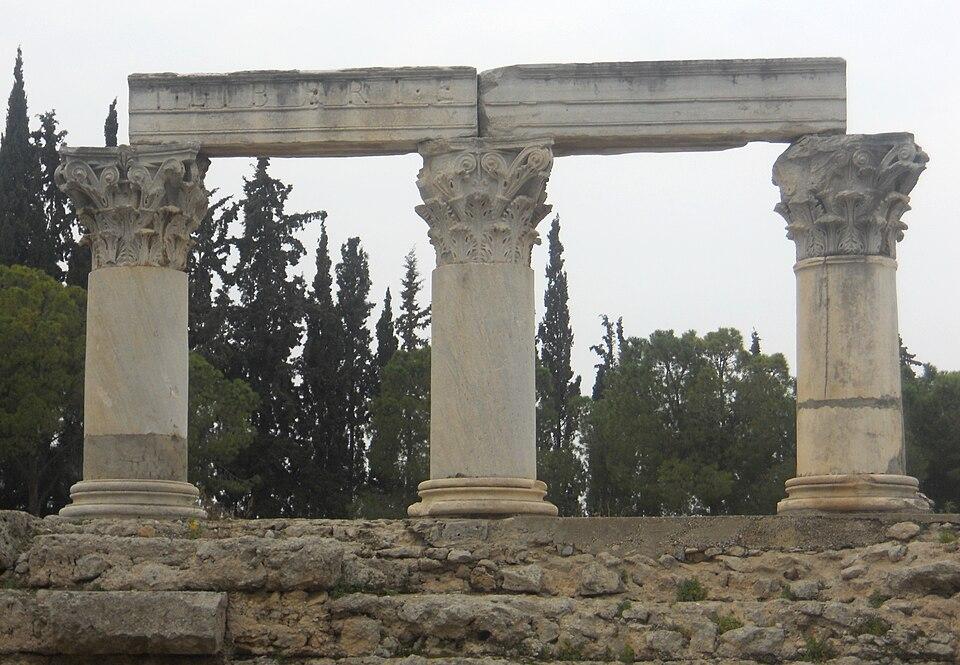

# Урок 20 — Сломанная колонна: разрушение + износ материалов 🏛

**Модуль 3 | 2 академических часа (1,5 часа)**

> 🔁 В начале урока — [повторение урока 19](повторение.md) (викторина, 5–7 мин)

---

## Цель урока

- Понять, что «настоящая старая» вещь — это **разрушение геометрии** + **износ материала**
- Повторить модификаторы: **Subdivision**, **Displace** (с облачной текстурой), **Boolean**
- Смоделировать **сломанную, выветренную колонну**
- Освоить **смешивание материалов** (**Mix Shader** + маски, **Pointiness**)
- Разобрать **теорию нормалей** и **Normal Map**
- Состарить колонну: камень, мох во впадинах, ржавчина/потёртости

> 🔁 Урок объединяет **моделирование** (модификаторы, Boolean) и **материалы** — два больших навыка курса.

---

## Часть 1 — Теория: из чего «старость» (12 минут)

Новая модель выглядит «пластиково». Реализм даёт **две вещи**:

| Что | Чем делаем | Откуда |
|-----|-----------|--------|
| **Разрушение** (сколы, эрозия, трещины — это **форма**) | Subdivision + Displace + Boolean | модификаторы (Модуль 1–2) |
| **Износ** (грязь, мох, ржавчина — это **материал**) | Mix Shader + маски + Pointiness | этот урок |

### Наша цель — настоящая руина



*Реальные античные колонны: видно строение (база → ствол → капитель), выветренный камень, сколотый верх и отбитый архитрав. Это и соберём. ([фото: Ancient Corinth, Wikimedia Commons](https://commons.wikimedia.org/wiki/File:Ancient_Corinth_Ruins_(5987150540).jpg))*

### Почему вещи стареют именно так (это подсказывает, ГДЕ пачкать)

Старение в природе идёт по **трём правилам** — и каждое мы повторим инструментом:
- **Эрозия** — ветер, дождь, песок сглаживают и выедают **открытые поверхности** → делаем **Displace** (Clouds).
- **Биология** — мох, лишайник, грязь копятся в **сырых углублениях и трещинах** (куда не достаёт солнце) → маска по **впадинам** (Pointiness).
- **Механический износ** — удары и трение скалывают **выступающие края и рёбра** (там камень обнажается, светлеет) → маска по **рёбрам** (Pointiness).

> 💡 **Фишка — сначала ломаем форму, потом пачкаем материалом.** Если наложить «грязный» материал на идеально гладкую колонну — она останется ненастоящей. Нужны оба слоя: форма (разрушение) и материал (износ).

> 💡 **Фишка — грязь не случайна:** мох — во впадинах, потёртости — на рёбрах. Поэтому износ привязывают не «наугад», а к **геометрии** (Pointiness сам находит впадины и рёбра — Часть 5).

---

## Часть 2 — Моделируем колонну (15 минут)

1. `Shift + A → Mesh → Cylinder` → `F9`: Vertices 16
2. `S → Z → 3` (вытяни в колонну), `Ctrl + A → All Transforms`
3. **База и капитель** (верх/низ): на торцах `I` (Inset) + `E` (Extrude) — расширь площадки
4. (Бонус) **каннелюры** (вертикальные желобки): резак-цилиндр → радиальный Array вокруг → Boolean Difference (повтор урока 3 и 7!)

> 💡 **Фишка — колонна это просто цилиндр с расширениями.** Не усложняй: главное — силуэт. Детали добавит разрушение.

---

## Часть 3 — Разрушаем: Subdivision + Displace + Boolean (25 минут)

### Шаг 1 — Добавить геометрию (Subdivision)
Displace двигает вершины — значит их должно быть **много**.
1. 🔧 → **Subdivision Surface** (или **Subdivide** в Edit Mode), уровень 2–3
2. Лучше режим **Simple** (без сглаживания), чтобы камень был «рубленый»

> 🔁 Повтор урока 4: SubSurf делит грани. Здесь он нужен как «подложка» под Displace.

### Шаг 2 — Эрозия поверхности (Displace + облачная текстура)
1. 🔧 → **Add Modifier → Deform → Displace** (поставь **после** Subdivision)
2. Нажми **New** (создать текстуру) → перейди в 🏁 **Texture Properties**
3. Тип текстуры → **Clouds** (облачная!) — это процедурный «комковатый» шум
4. Настрой **Size** (крупность бугров), **Depth/Detail**
5. Вернись в Displace → крути **Strength** → поверхность стала **бугристой, выветренной**, как старый камень!

> 💡 **Фишка — облачная текстура (Clouds) для камня:** её «комки» идеально имитируют эрозию и неровности камня. Малый Strength = лёгкая шероховатость, большой = сильные выбоины.

> 🔁 Повтор урока 14/19: Displace двигает вершины по текстуре. Раньше делали рельеф земли — теперь эрозию колонны.

### Шаг 3 — Ломаем (Boolean)
1. Сделай **резак** для скола: куб или Ico Sphere → `Randomize` (урок 10) → неровная глыба
2. **Apply** Subdivision и Displace (чтобы Boolean резал по реальной геометрии)
3. 🔧 → **Boolean → Difference**, объект = резак → **отколи верх колонны неровно** и выкуси пару кусков из бока
4. `Ctrl+A → Scale` до Boolean; `Shift+N` если чёрные грани (повтор урока 7)

> 💡 **Фишка — порядок важен:** сначала Subdivision + Displace (эрозия), **примени их**, потом Boolean (скол). Иначе скол будет гладким, без выветренных краёв.

> 📷 **[Вставь сюда картинку: колонна — цилиндр → эрозия (Displace) → скол (Boolean) →](изображения.md#break)**

---

## Часть 4 — Теория нормалей (10 минут)

Дальше будем «пачкать» колонну материалами, и здесь важны **нормали**.

**Нормаль** — стрелка-перпендикуляр, «куда смотрит» грань. **Свет считается по нормали:** грань к свету — яркая, отвёрнутая — тёмная. Если «обмануть» нормали картой — поверхность кажется рельефной, хотя геометрия не меняется.

| | **Bump** | **Normal Map** |
|--|----------|----------------|
| Карта | серая (высоты) | сине-фиолетовая (RGB) |
| Хранит | «выше/ниже» | точное направление нормали |
| Детали | проще | мелкие (царапины, поры) |
| Color Space | **Non-Color** | **Non-Color** |

> 💡 **Фишка — Normal Map синяя, потому что** направление нормали кодируется цветом (X→R, Y→G, Z→B), а большинство нормалей смотрят «наружу» (по Z=синий). Это **данные** → всегда **Non-Color**. (Детально — урок 24.)

> 📷 **[Вставь сюда картинку: нормали (стрелки) и Normal Map →](изображения.md#normals)**

---

## Часть 5 — Износ материалами: Mix Shader + Pointiness (25 минут)

Теперь «состарим» камень: базовый камень + мох во впадинах + потёртости/ржавчина на сколах.

> 📥 Текстуры камня/штукатурки/ржавчины (как на референсе) — бесплатно на **[Poly Haven](https://polyhaven.com/textures)** и **[ambientCG](https://ambientcg.com)** (см. [где-скачать.md](../../справочники/где-скачать.md)). Карты-данные (Roughness/Normal/Height) → **Non-Color**!

### 🧩 Ноды
| Нод | Что делает | Сокеты |
|-----|------------|--------|
| **Mix Shader** | смешивает два материала | **Fac** (маска), два **Shader** |
| **Geometry** | данные поверхности | выходы **Pointiness**, **Normal** |
| **ColorRamp** | делает маску чёткой | вход **Fac**, выход **Color** |

### Базовый камень + мох во впадинах
```
камень  ─[BSDF]─► Mix Shader [верхний]
мох(зелёный) ─[BSDF]─► Mix Shader [нижний]
Geometry [Pointiness] ─► ColorRamp (вытянуть тёмное=впадины) ─► Mix Shader [Fac]
Mix Shader [Shader] ─► Material Output [Surface]
```
1. Материал 1 — камень (серый, Roughness 0.9); по желанию подключи скачанную текстуру камня в Base Color
2. Материал 2 — мох (тёмно-зелёный)
3. `Geometry [Pointiness]` → `ColorRamp` → **Mix Shader [Fac]** → мох сел во впадины и трещины!

> 🎯 **ЛАЙФХАК — показать здесь!** **Pointiness** сам находит выпуклые рёбра (там сколы трутся) и впадины (там копится мох/грязь). Полный разбор — [лайфхак.md](лайфхак.md).

### Потёртости на сколах (рёбра)
- Ещё один `Geometry [Pointiness]` → `ColorRamp` (вытянуть **светлое** = рёбра) → подмешать более светлый/потёртый камень на острых краях скола.

> 💡 **Фишка — реализм = слои:** форма-разрушение (Displace+Boolean) → базовый камень → мох во впадинах (Pointiness) → потёртые сколы (Pointiness) → мелкие детали (Normal Map). Чем больше осмысленных слоёв — тем «настоящее».

> 📷 **[Вставь сюда картинку: состаренная колонна (камень + мох + сколы) →](изображения.md#weathered)**

---

## Часть 6 — Финал (7 минут)

1. Свет **сбоку** — эрозия и сколы читаются
2. Тёмный/нейтральный фон, можно добавить землю
3. `Z → Rendered` → `F12`

> 📷 **[Вставь сюда картинку: финальная руина-колонна →](изображения.md#final)**

---

## Итог урока

Сегодня мы:
- ✅ Поняли: «старость» = **разрушение формы** + **износ материала**
- ✅ Повторили модификаторы: **Subdivision**, **Displace** (облачная текстура **Clouds**), **Boolean**
- ✅ Смоделировали сломанную выветренную колонну
- ✅ Освоили **Mix Shader** + маски и **Pointiness** (мох во впадинах, потёртости на сколах)
- ✅ Разобрали **нормали** и **Normal Map**

---

## Лайфхак урока

👉 [лайфхак.md](лайфхак.md) — **Pointiness: мох во впадинах и потёртости на сколах** (показывается в Части 5)

## Самостоятельная работа

👉 [практика.md](практика.md) — своя руина / сломанный артефакт

---

## Навигация

⬅️ [Урок 19](../урок-19/урок.md)  ·  🔁 [Повторение](повторение.md)  ·  ➡️ **Следующий урок: [Урок 21 — Голограмма](../урок-21/урок.md)**
