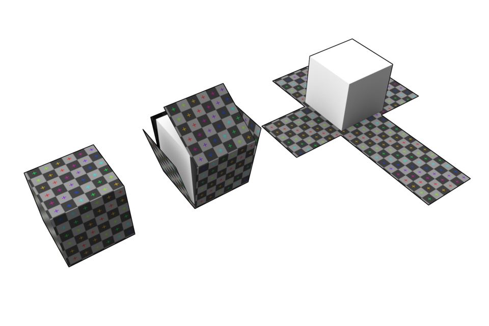

# Урок 22 — UV-развёртка: «раскраиваем» модель 📐

**Модуль 3 | 2 академических часа (1,5 часа)**

> 🔁 В начале урока — [повторение урока 21](повторение.md) (викторина, 5–7 мин)

---

## Цель урока

- Понять, **что такое UV-развёртка** и зачем она нужна
- Научиться ставить **швы (Seams)** — где «разрезать» модель
- Разворачивать через **Unwrap** и **Smart UV Project**
- Проверять развёртку **Checker-текстурой**
- Развернуть свой объект (ящик/предмет) под текстуру

> 🔁 До этого мы накладывали процедурные текстуры и карты планет (по Generated-координатам). Но чтобы точно положить **картинку** на сложную модель — нужна **UV-развёртка**. Это фундамент текстурирования.

---

## Часть 1 — Теория: что такое UV-развёртка (15 минут)

**UV-развёртка** — это «выкройка» твоей 3D-модели, разложенная на плоскость. Как если бы ты **развернул картонную коробку** в плоский лист, **снял этикетку** с бутылки или **очистил апельсин** и разложил кожуру.

*3D-куб «разворачивается» в плоскую крестовую выкройку. По ней текстура точно ложится на каждую грань. ([источник: Wikimedia Commons, Zephyris](https://commons.wikimedia.org/wiki/File:Cube_Representative_UV_Unwrapping.png))*

### Почему U и V

Обычные оси называются X, Y, Z — они заняты для 3D. Поэтому **оси текстуры** назвали следующими буквами: **U** (горизонталь) и **V** (вертикаль). UV — это координаты **на картинке-текстуре** (0–1), которые говорят каждой грани: «бери вот этот кусочек изображения».

### Зачем это нужно
- **Точно положить картинку** (фото-текстуру, рисунок, логотип) на модель без искажений
- **Рисовать** по модели (Texture Paint — урок 28)
- **Запекать** карты (урок 29)

> 💡 **Фишка — процедурные ≠ UV:** процедурным текстурам (Noise/Voronoi) UV почти не нужна (им хватает Generated). А вот **картинкам** UV обязательна — иначе они «плывут» и тянутся.

---

## Часть 2 — Швы (Seams): где разрезать (20 минут)

Чтобы развернуть модель в плоскость, её надо **разрезать** по некоторым рёбрам. Эти линии разреза — **швы (Seams)**.

> Аналогия: чтобы расстелить футболку плоско, её распарывают по бокам и под рукавами. Швы — это и есть «где распарываем».

### Заготовка
Смоделируй простой **ящик/сундучок** (куб + Bevel) или возьми свою модель. `Ctrl+A → All Transforms`.

### Ставим швы
1. `Tab` → Edit Mode → `2` (режим рёбер)
2. Выдели рёбра, по которым «разрежем» (например, вертикальные углы ящика + по низу)
3. `Ctrl + E → Mark Seam` — рёбра-швы станут **красными**
4. Ошибся? Выдели → `Ctrl + E → Clear Seam`

> 💡 **Фишка — выделять петлёй:** `Alt + ЛКМ` по ребру выделяет всю петлю — быстро отметить шов по кругу (повтор урока 9).

> 🎯 **ЛАЙФХАК — показать здесь!** Где правильно резать швы, чтобы их не было видно и текстура не тянулась — в [лайфхак.md](лайфхак.md).

> 📷 **[Вставь сюда картинку: швы на ящике (красные рёбра) →](изображения.md#seams)**

---

## Часть 3 — Разворачиваем (Unwrap) (20 минут)

### Способ 1 — Unwrap (по швам)
1. Раскладка **UV Editing** (сверху) — слева UV-редактор, справа 3D
2. В 3D Viewport: `A` (выделить всё) → `U → Unwrap`
3. Слева, в UV-редакторе, появилась плоская выкройка модели!

### Способ 2 — Smart UV Project (автомат)
- `U → Smart UV Project` — Blender **сам** придумает швы и развернёт. Быстро, но менее аккуратно.

> 💡 **Фишка — когда что:** **Unwrap** (со своими швами) — для важных моделей (точно, красиво). **Smart UV Project** — когда быстро и не критично (камни, мелочь, греблы).

> 📷 **[Вставь сюда картинку: модель и её UV-выкройка рядом →](изображения.md#unwrap)**

---

## Часть 4 — Проверка Checker-текстурой (10 минут)

Как понять, что развёртка хорошая? Наложить **клетчатую (Checker)** текстуру: если клетки **ровные квадраты** — отлично; если **растянуты/кривые** — где-то искажение.

1. Новый материал → Base Color → нажми жёлтую точку слева → **Checker Texture**
2. `Z → Material Preview`
3. Смотри на модель: клетки квадратные и одинаковые = развёртка ровная

> 💡 **Фишка — Checker = «рентген» развёртки:** ровные одинаковые клетки по всей модели = текстура ляжет без искажений. Подробнее с UV-редактором — на уроке 23.

> 📷 **[Вставь сюда картинку: Checker на модели (ровные и кривые клетки) →](изображения.md#checker)**

---

## Итог урока

Сегодня мы:
- ✅ Поняли, что такое **UV-развёртка** (выкройка модели) и зачем (точно класть картинки)
- ✅ Узнали про оси **U и V**
- ✅ Ставили **швы (Mark Seam)** — где разрезать
- ✅ Разворачивали через **Unwrap** и **Smart UV Project**
- ✅ Проверяли развёртку **Checker-текстурой**

---

## Лайфхак урока

👉 [лайфхак.md](лайфхак.md) — **где резать швы правильно** (показывается в Части 2)

## Самостоятельная работа

👉 [практика.md](практика.md) — разверни свой предмет

---

## Навигация

⬅️ [Урок 21](../урок-21/урок.md)  ·  🔁 [Повторение](повторение.md)  ·  ➡️ **Следующий урок: [Урок 23 — UV Editor](../урок-23/урок.md)**
