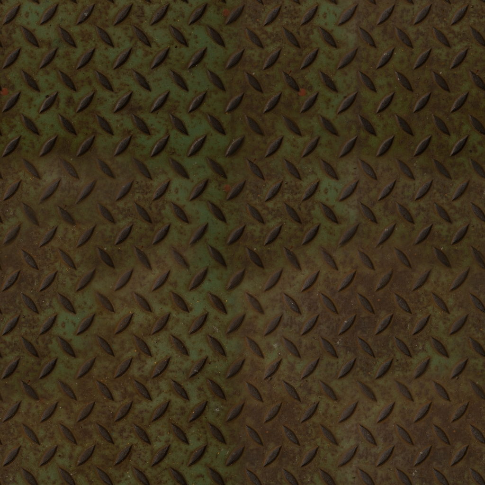
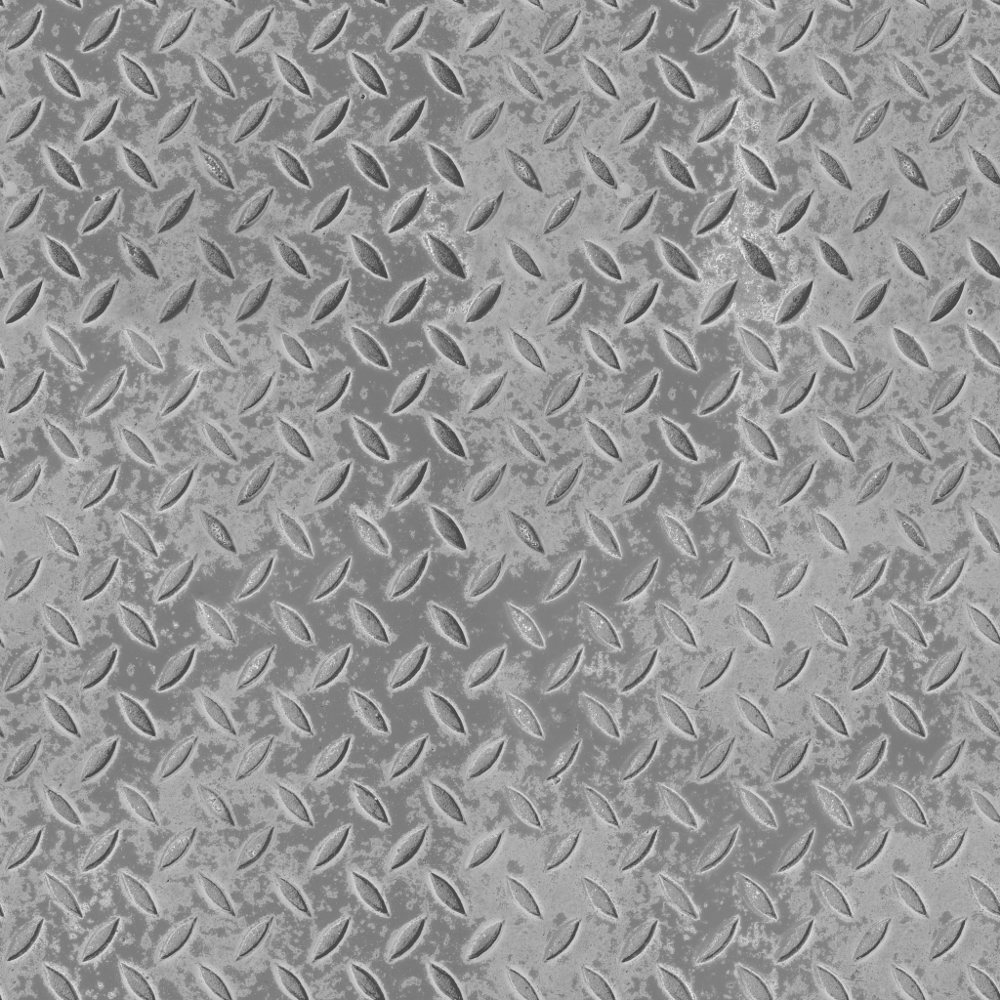
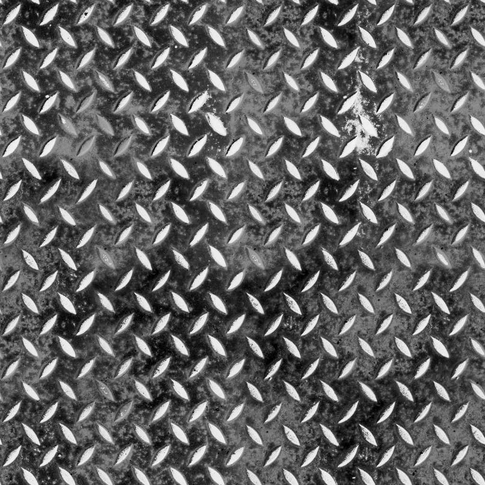
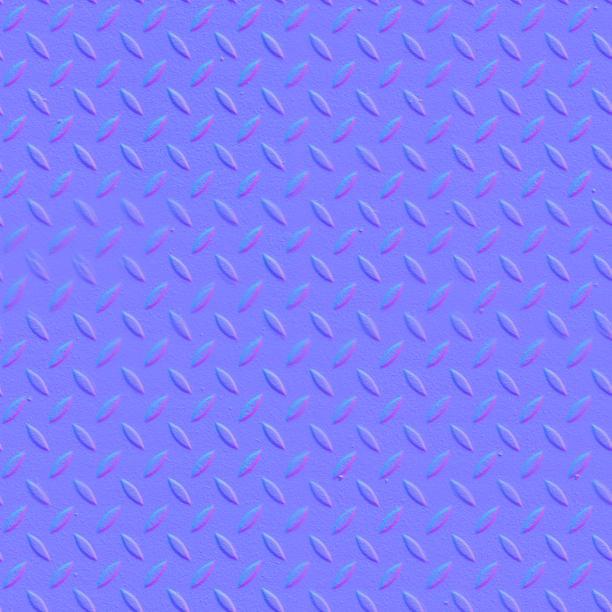

# Урок 24 — Карты текстур (PBR): полный набор 🗺

**Модуль 3 | 2 академических часа (1,5 часа) — плотный урок, можно растянуть на 2×2**

> 🔁 В начале урока — [повторение урока 23](повторение.md) (викторина, 5–7 мин)

---

## Цель урока

- Понять, что такое **PBR** и почему материал описывают **набором карт**
- Глубоко разобрать каждую карту: **Base Color, Roughness, Metallic, Normal, AO, Height** — что она физически означает
- Понять правило **sRGB vs Non-Color** (и почему это важно)
- Собрать **реалистичный металлический материал** по сокетам и через **`Ctrl+Shift+T`**
- Затекстурировать **металлическую панель/люк** на реальном наборе текстур

> 🔁 У нас уже есть аккуратная UV (уроки 22–23). Теперь положим на неё **профессиональный материал** из фото-карт. А карту **высот (Height)** разберём отдельно и подробно на уроке 25.

---

## 📥 Что скачать ДО урока (нужно для практики вместе!)

Берём готовый бесплатный набор **«Metal Plate»** (рифлёный металл с ржавчиной) с Poly Haven — лицензия **CC0**. Разрешение **1K** (слабые ПК!).

🔗 **Страница ассета:** https://polyhaven.com/a/metal_plate — кнопка скачивания, выбери **1K**.

**Или карты напрямую (1K):**
| Карта | Прямая ссылка |
|-------|---------------|
| **Diffuse** (Base Color) | https://dl.polyhaven.org/file/ph-assets/Textures/jpg/1k/metal_plate/metal_plate_diff_1k.jpg |
| **Roughness** | https://dl.polyhaven.org/file/ph-assets/Textures/jpg/1k/metal_plate/metal_plate_rough_1k.jpg |
| **Metallic** | https://dl.polyhaven.org/file/ph-assets/Textures/png/1k/metal_plate/metal_plate_metal_1k.png |
| **Normal (GL)** | https://dl.polyhaven.org/file/ph-assets/Textures/png/1k/metal_plate/metal_plate_nor_gl_1k.png |
| **AO** | https://dl.polyhaven.org/file/ph-assets/Textures/jpg/1k/metal_plate/metal_plate_ao_1k.jpg |

> 💡 Сложи все файлы в **одну папку** — тогда `Ctrl+Shift+T` (Node Wrangler) загрузит весь набор за клик.
> Источники: [справочники/где-скачать.md](../../справочники/где-скачать.md).

---

## Часть 1 — Теория: что такое PBR и зачем столько карт (22 минуты)

### 1.1 Что такое PBR

**PBR** (Physically Based Rendering — «физически достоверный рендеринг») — способ описывать материал так, как ведёт себя **настоящая поверхность** под светом. Главная идея: материал не «нарисован», а задан **физическими свойствами** (цвет, шероховатость, металл/не металл, рельеф). Поэтому он выглядит правильно при **любом** освещении — днём, ночью, под цветным светом.

Одной картинки-цвета мало: фотография кирпича уже содержит запечённые тени и блики, и под другим светом будет «врать». Поэтому свойства **разносят по отдельным картам**, и каждая отвечает за своё.

### 1.2 Разбор каждой карты — на реальном наборе

Вот наш металл и его карты. Смотри, как одна поверхность раскладывается на «слои свойств»:

| Base Color (цвет) | Roughness (шероховатость) |
|-------------------|---------------------------|
|  |  |

| Metallic (металл/не металл) | Normal (мелкий рельеф) |
|-----------------------------|------------------------|
|  |  |

*Набор «Metal Plate» ([Poly Haven, CC0](https://polyhaven.com/a/metal_plate)).*

**🎨 Base Color (Albedo) — чистый цвет.**
Только «краска» поверхности, **без теней и бликов**. Важно: на хорошей Albedo нет запечённого света — иначе тени «приклеятся» к объекту и будут видны даже в темноте. Цветная карта. → вход **Base Color**.

**✨ Roughness — шероховатость (микрорельеф для света).**
Под микроскопом любая поверхность в мелких бугорках. Гладкая (мало бугорков) отражает свет **чётко** — как зеркало; шероховатая **рассеивает** — выглядит матовой.
- ⬛ **чёрное (0) = гладко = блеск/зеркало**
- ⬜ **белое (1) = шероховато = матовость**
На нашей карте ржавые пятна светлее (матовые), чистый металл темнее (более блестящий). Серая карта данных. → вход **Roughness**.

**🔩 Metallic — металл или нет.**
Это «переключатель» физики поверхности:
- **металл (1, белое):** нет собственного цвета поверхности — цвет даёт **окрашенное отражение**; почти всё — зеркальность.
- **не металл / диэлектрик (0, чёрное):** есть обычный цвет + слабый бесцветный блик (дерево, пластик, камень, **ржавчина**).
Посмотри на нашу Metallic-карту: **голый металл — белый (1)**, а **ржавчина — чёрная (0)**, потому что ржавчина уже **не металл**! Обычно карта почти чёрно-белая. → вход **Metallic**.

> 💡 **Фишка — почему металл «без цвета»:** у чистого металла цвет рождается не краской, а **отражением** (золото отражает жёлтое, медь — красноватое). Поэтому в PBR металл = «зеркало с оттенком», а его «цвет» берётся из Base Color как цвет отражения.

**🟦 Normal — мелкий рельеф через направление света.**
Сине-фиолетовая карта **обманывает свет**: она хранит в цвете **направление нормали** для каждой точки (вспомни нормали, урок 20). Красный канал = наклон по X, зелёный = по Y, синий = «вверх» (Z). Поэтому карта в основном синяя — большинство точек смотрят «вверх» (ровно). Где есть бугорок — пиксель краснеет/зеленеет, и свет ведёт себя как на выпуклости. **Геометрия при этом плоская** (силуэт гладкий — в отличие от Displacement, урок 25). → через нод **Normal Map** → вход **Normal**.

**🌑 AO (Ambient Occlusion) — мягкая тень в щелях.**
Заранее посчитанное затенение в углублениях и стыках (куда «не доходит» рассеянный свет). Делает картинку объёмнее. Серая карта (тёмное = глубокие щели). Обычно **подмешивают к Base Color** (умножением). → к **Base Color** (Multiply).

**⛰ Height / Displacement — карта высот.**
Серая карта реальных высот. Её подробно разбираем на **уроке 25** (Bump vs настоящий Displacement). Здесь только упомянем.

### 1.3 Правило sRGB vs Non-Color (очень важно!)

Картинки бывают двух «смыслов»:
- **Цвет** (Base Color) хранится в **sRGB** — это формат «для глаза» (яркость подкручена под человеческое зрение).
- **Данные** (Roughness, Metallic, Normal, Height, AO) — это **числа** (сила свойства), их надо читать **как есть**, поэтому **Non-Color**.

Если поставить серой карте sRGB — Blender «подкрутит яркость», и числа исказятся: материал заблестит не там, нормали соврут.

> ⚠️ **Фишка — главная ошибка новичков:** забыть **Non-Color** на серых/синих картах. Правило: **только Base Color = sRGB, всё остальное = Non-Color.**

> 📷 **[Вставь сюда картинку: один материал — четыре слоя-карты (схема) →](изображения.md#pbr-set)**

---

## Часть 2 — Собираем материал по сокетам (вручную) (23 минуты)

Сначала смоделируем объект, потом соберём материал «руками», чтобы понять, что куда.

### Объект — металлическая панель/люк 🚀
1. `Shift+A → Mesh → Cube`, сплющи в панель (`S → Z → 0.2`), `Ctrl+B` — лёгкая фаска по краю
2. `Ctrl+A → All Transforms`
3. `Tab → A → U → Smart UV Project` (или Cube Projection — урок 23) → `Tab`

> 🔁 Это «бронепанель» для нашего 🚀 космокорабля (перекличка с sci-fi панелью из Модуля 1).

### Схема материала (по сокетам)
```
Base Color (sRGB)     ─[Color]─► Principled [Base Color]
Roughness (Non-Color) ─[Color]─► Principled [Roughness]
Metallic  (Non-Color) ─[Color]─► Principled [Metallic]
Normal    (Non-Color) ─[Color]─► Normal Map ─[Normal]─► Principled [Normal]
AO        (Non-Color) ─[Color]─┐
Base Color (sRGB)     ─[Color]─┴► Mix Color (Multiply) ─[Result]─► Principled [Base Color]
```

### Шаги
1. Дай панели материал, открой **Shader Editor**
2. `Shift+A → Texture → Image Texture` → **Open** → `metal_plate_diff` → `[Color]` → **Base Color** (Color Space = **sRGB**)
3. Ещё `Image Texture` → `metal_plate_rough` → **Non-Color** → `[Color]` → **Roughness**
4. Ещё → `metal_plate_metal` → **Non-Color** → `[Color]` → **Metallic**
5. Ещё → `metal_plate_nor_gl` → **Non-Color** → `Shift+A → Vector → Normal Map`; соедини `Image Texture [Color] → Normal Map [Color]`, затем `Normal Map [Normal] → Principled [Normal]`
6. (Бонус AO) → `metal_plate_ao` → **Non-Color** → `Shift+A → Color → Mix Color`, режим **Multiply**, Factor 1.0; в Mix положи **Base Color** и **AO**, а `Mix [Result] → Principled [Base Color]`

| 🧩 Нод | Что делает | Ключевые сокеты |
|--------|------------|-----------------|
| **Image Texture** | подаёт карту-картинку | выход **Color** (и Alpha); Color Space (sRGB/Non-Color) |
| **Normal Map** | «расшифровывает» сине-фиолетовую карту в реальное направление нормали | вход **Color**; выход **Normal** |
| **Mix Color (Multiply)** | перемножает AO с цветом (затемняет щели) | входы **A/B**; выход **Result** |

> 💡 **Фишка — Normal только через Normal Map:** синюю карту нельзя втыкать прямо в Principled [Normal]. Сначала нод **Normal Map** — он переводит цвет в направление.

> 💡 **Фишка — проверь Metallic вживую:** в `Z → Material Preview` голый металл блестит и отражает, а ржавые пятна — матовые. Это работает Metallic-карта (металл=1, ржавчина=0).

> 📷 **[Вставь сюда картинку: сетап PBR-материала по сокетам →](изображения.md#pbr-setup)**

---

## Часть 3 — `Ctrl+Shift+T`: весь набор за клик (10 минут)

Вручную — долго. **Node Wrangler** делает это автоматически.

1. Выдели **Principled BSDF**
2. `Ctrl + Shift + T`
3. В окне выбери **все файлы** набора сразу (diff, rough, metal, nor_gl, ao…)
4. Аддон **сам** создаст все Image Texture, поставит **Non-Color** где надо, добавит **Normal Map** и подключит к нужным входам!

> 🎯 **ЛАЙФХАК — показать здесь!** `Ctrl+Shift+T` — главная экономия времени в текстурах: целый PBR-материал за один клик. Полный разбор — [лайфхак.md](лайфхак.md).

> 💡 **Фишка — Node Wrangler «читает» имена файлов:** он понимает по названиям (`_diff`, `_rough`, `_nor`, `_metal`, `_ao`), какая карта куда. Поэтому **не переименовывай** скачанные файлы как попало.

> 📷 **[Вставь сюда картинку: Ctrl+Shift+T собрал весь материал →](изображения.md#ctrl-shift-t)**

---

## Часть 4 — Масштаб текстуры и финал (10 минут)

1. Узор слишком крупный/мелкий? Добавь **Mapping** (`Texture Coordinate [UV] → Mapping → все Image Texture`) и крути **Scale** — урок 23. Один Mapping на все карты!
2. Свет **сбоку** — Normal-рельеф читается, металл бликует
3. `Z → Rendered` → `F12`

> 💡 **Фишка — хорошая UV + PBR-набор = реализм почти даром:** вся «магия» уже в картах; твоя задача — развернуть (UV) и подключить (Ctrl+Shift+T). Поэтому уроки 22–23 были так важны.

> 📷 **[Вставь сюда картинку: текстурированная металлическая панель (финал) →](изображения.md#final)**

---

## Итог урока

Сегодня мы:
- ✅ Поняли **PBR** (материал = набор карт-свойств, работает при любом свете)
- ✅ Глубоко разобрали каждую карту: **Base Color, Roughness, Metallic, Normal, AO, Height** — что физически означает
- ✅ Усвоили правило **sRGB (цвет) vs Non-Color (данные)** и почему
- ✅ Собрали материал **по сокетам** и через **`Ctrl+Shift+T`**
- ✅ Затекстурировали металлическую панель реальным набором

> 💡 **Главная мысль:** PBR = разложить поверхность на свойства (цвет / блеск / металл / рельеф). Понимаешь, что делает каждая карта, — соберёшь любой материал и починишь любой «сломанный».

---

## Лайфхак урока

👉 [лайфхак.md](лайфхак.md) — **Ctrl+Shift+T: весь PBR-материал за один клик** (показывается в Части 3)

## Самостоятельная работа

👉 [практика.md](практика.md) — затекстурируй свой объект PBR-набором

---

## Навигация

⬅️ [Урок 23](../урок-23/урок.md)  ·  🔁 [Повторение](повторение.md)  ·  ➡️ **Следующий урок: [Урок 25 — Displacement и Height maps](../урок-25/урок.md)**
