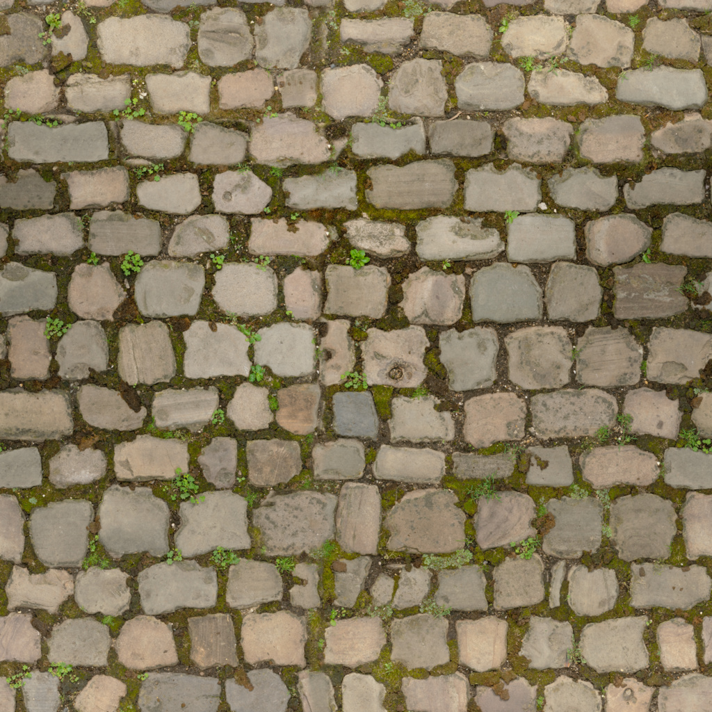
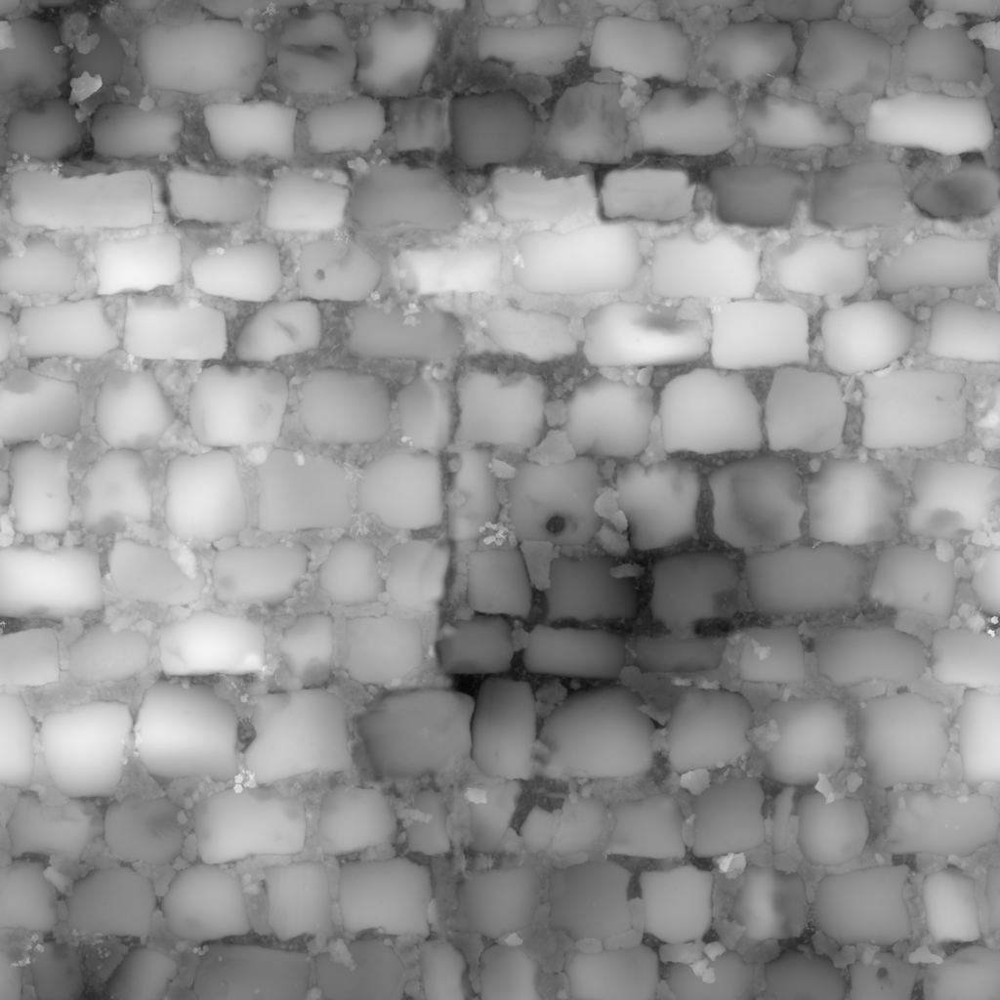

# Урок 25 — Displacement и Height maps: настоящий рельеф ⛰

**Модуль 3 | 2 академических часа (1,5 часа) — плотный урок, можно растянуть на 2×2**

> 🔁 В начале урока — [повторение урока 24](повторение.md) (викторина, 5–7 мин)

---

## Цель урока

- Глубоко понять **Displacement** — настоящее смещение геометрии (в отличие от Bump-обмана)
- Разобрать **карту высот (Height / Displacement map)**: что значат градации серого, Midlevel, биты
- Понять связь **рельеф ↔ геометрия** (почему нужно подразделение)
- **Вместе сделать мощёную дорожку** с реальным рельефом на скачанной текстуре
- Узнать про **Displacement-ноду** и **Adaptive Subdivision** (Cycles)
- Совместить крупный рельеф (Displace) и мелкий (Normal)

---

## 📥 Что скачать ДО урока (нужно для практики вместе!)

Берём готовый бесплатный набор брусчатки **«Cobblestone Floor 04»** с Poly Haven (лицензия **CC0** — можно всё). Разрешение **1K** (слабые ПК!).

🔗 **Страница ассета:** https://polyhaven.com/a/cobblestone_floor_04 — там кнопка скачивания, выбери **1K**.

**Или скачай карты напрямую (1K):**
| Карта | Зачем | Прямая ссылка |
|-------|-------|---------------|
| **Diffuse** (цвет) | цвет камней | https://dl.polyhaven.org/file/ph-assets/Textures/jpg/1k/cobblestone_floor_04/cobblestone_floor_04_diff_1k.jpg |
| **Displacement** (высота) ⭐ | настоящий рельеф | https://dl.polyhaven.org/file/ph-assets/Textures/png/1k/cobblestone_floor_04/cobblestone_floor_04_disp_1k.png |
| **Normal** (мелкий рельеф) | поры, шероховатость | https://dl.polyhaven.org/file/ph-assets/Textures/png/1k/cobblestone_floor_04/cobblestone_floor_04_nor_gl_1k.png |
| **Rough** (матовость) | где блестит/матовый | https://dl.polyhaven.org/file/ph-assets/Textures/jpg/1k/cobblestone_floor_04/cobblestone_floor_04_rough_1k.jpg |

> 💡 Сложи все 4 файла в **одну папку** — тогда сработает `Ctrl+Shift+T` (Node Wrangler из урока 24) и загрузит весь набор разом.
> Полный список источников: [справочники/где-скачать.md](../../справочники/где-скачать.md).

---

## Часть 1 — Теория: что такое Displacement (20 минут)

### 1.1 Bump обманывает, Displacement двигает

На уроке 20 мы делали **Bump**, а на 24 — **Normal Map**. Они **обманывают свет**: геометрия остаётся плоской, просто свет ведёт себя так, будто есть бугорки. Поверни модель боком — **край (силуэт) гладкий**, обман виден.

**Displacement** — это **настоящее смещение вершин**: рельеф появляется в самой геометрии. Силуэт становится **по-настоящему рельефным**.


*Сверху вниз: ровная сетка → **карта высот** (белые буквы ABC = выше) → та же сетка, где буквы **реально выдавлены в геометрии**. ([источник: Wikimedia Commons](https://commons.wikimedia.org/wiki/File:Displacement.jpg))*

### 1.2 Что такое карта высот (Height / Displacement map)

**Карта высот** — это **чёрно-белое** изображение, где яркость пикселя = высота поверхности в этой точке:
- ⬜ **белое = высоко** (выступ),
- ⬛ **чёрное = низко** (впадина),
- 🌫 серое — промежуточные высоты.

Вот реальный пример — наша брусчатка и её карта высот:

| Цвет (Diffuse) | Карта высот (Displacement) |
|----------------|----------------------------|
|  |  |

*Слева — как камни выглядят (цвет). Справа — карта высот: **светлые камни выступают**, **тёмные швы между ними — впадины**. ([Poly Haven, CC0](https://polyhaven.com/a/cobblestone_floor_04))*

> 💡 **Фишка — одна карта, два применения:** и Bump, и Displacement читают **одну и ту же** серую карту высот. Разница в том, что делают: **Bump** подкрашивает свет (плоско), **Displacement** реально поднимает/опускает вершины.

> 💡 **Фишка — Non-Color обязателен:** карта высот — это **числа** (высота), а не «красивый цвет». Поэтому в ноде Image Texture ставь **Non-Color**, иначе высоты исказятся (как и Roughness/Normal — урок 24).

### 1.3 Как Displacement работает «под капотом»

Каждая вершина смещается **вдоль своей нормали** (наружу/внутрь) на величину:

```
сдвиг = (яркость_карты − Midlevel) × Strength
```

- **Midlevel** — какой серый считать «нулём» (обычно **0.5** — средне-серый не двигается). Пиксели **светлее** Midlevel выпирают наружу, **темнее** — вдавливаются.
- **Strength** — общая сила рельефа (множитель). Больше Strength = выше горы.

> 💡 **Фишка — нормали мы уже знаем:** «вдоль нормали» — это перпендикуляр к поверхности (вспомни теорию нормалей, урок 20). Displacement толкает вершины именно по нормали.

### 1.4 Почему нужна геометрия (подразделение)

Двигать можно только **существующие вершины**. У плоскости их 4 (углы) — двигать почти нечего, рельефа не будет. Поэтому перед Displacement плоскость **разбивают на тысячи мелких граней** (Subdivide / Subdivision Surface).

> Аналогия: карта высот — как картинка, а вершины — как «пиксели» поверхности. Мало вершин = крупные «пиксели», детали теряются. Много вершин = рельеф точный, но **тяжелее для ПК**.

> 💡 **Фишка — рельеф не точнее сетки:** даже идеальная карта высот на грубой сетке даст грубый рельеф. Детализация рельефа = детализация геометрии. Отсюда вечный баланс «красиво ↔ тяжело».

> 💡 **Фишка — 8 бит vs 16 бит:** обычная карта (8 бит) знает 256 уровней высоты — на плавных склонах видны «ступеньки». Карта **16 бит** (часто это PNG с Poly Haven) знает 65536 уровней — рельеф гладкий. Для крупного Displacement бери 16-битную карту высот.

### 1.5 Сравнение

| | **Bump / Normal** | **Displacement** |
|--|-------------------|------------------|
| Что меняет | только свет (нормали) | **саму геометрию** (вершины) |
| Силуэт (край) | гладкий (обман) | **рельефный** (по-настоящему) |
| Нужна геометрия | нет | **да** (Subdivide) |
| Нагрузка на ПК | лёгкая | тяжёлая |
| Когда брать | мелочь: поры, царапины | крупный рельеф, край виден |

> 📷 **[Вставь сюда картинку: один камень — Bump (гладкий силуэт) vs Displacement (рельефный силуэт) →](изображения.md#bump-vs-disp)**

---

## Часть 2 — Делаем мощёную дорожку ВМЕСТЕ (35 минут) ⭐

Сделаем **средневековую мощёную дорожку** с настоящим рельефом — на той самой брусчатке, что скачали. (Потом положишь её в коллекцию «двор/руины» к объектам с урока 23.)

### Шаг 1 — Заготовка-плоскость
1. Удали куб. `Shift+A → Mesh → Plane`
2. `S → 4` → `Enter` — дорожка пошире
3. `Ctrl+A → All Transforms` (обнуляем масштаб — повтор урока 3)
4. `Tab → A → U → Unwrap` (UV нужна — уроки 22–23) → `Tab` назад

### Шаг 2 — Накладываем материал (цвет + шероховатость + мелкий рельеф)
Сначала сделаем **плоскую** брусчатку, потом добавим рельеф.

1. Дай объекту материал. Открой **Shader Editor**
2. Самый быстрый путь — **Node Wrangler** (урок 24): выдели **Principled BSDF** → `Ctrl+Shift+T` → выбери сразу 3 файла: `..._diff_`, `..._rough_`, `..._nor_gl_` → **Open**
3. Node Wrangler сам подключит: Diffuse → Base Color, Rough (Non-Color) → Roughness, Normal → Normal Map → Normal
4. `Z → Material Preview` — брусчатка лежит, но **пока плоская** (рельеф только в свете от Normal)

> 💡 **Фишка — Normal ≠ силуэт:** покрути вид — край дорожки идеально ровный. Normal добавил «света», но геометрия плоская. Сейчас исправим.

### Шаг 3 — Добавляем геометрию
1. Выдели дорожку → 🔧 **Add Modifier → Generate → Subdivision Surface**
2. Переключи на **Simple** (вкладка Simple — не сглаживать форму, только дробить)
3. Levels Viewport = **6** (это даёт ~миллион граней на плоскости — не задирай выше на слабом ПК!)

### Шаг 4 — Displace-модификатор с картой высот ⭐
1. 🔧 **Add Modifier → Deform → Displace** (он должен стоять **ПОСЛЕ** Subdivision в стопке)
2. В Displace нажми **New** (создаётся текстура) → открой 🏁 **Texture Properties** (красно-белая шахматка слева)
3. Тип текстуры → **Image or Movie** → **Open** → файл `cobblestone_floor_04_disp_1k.png` (карта высот!)
4. В свойствах изображения поставь **Non-Color** (это высоты, не цвет)
5. **Вернись в Displace** (🔧). Очень важная настройка: **Texture Coordinates → UV** (а не Local!) — тогда рельеф ляжет **точно по тем же UV**, что и цвет. Камни поднимутся ровно там, где они на картинке.

> 💡 **Фишка — координаты решают всё:** если оставить Texture Coordinates = Local, бугры «не совпадут» с камнями. Ставь **UV** — высота и цвет с одной развёртки.

### Шаг 5 — Сила рельефа
1. В Displace крути **Strength** (начни с **0.1–0.2**) — камни начинают выступать, швы проваливаться
2. **Midlevel** оставь ≈ **0.5** (можно чуть подвинуть, чтобы «нулевой» уровень совпал со средним камнем)
3. **Поверни вид сбоку** — теперь **силуэт рельефный**! Это и есть настоящий Displacement.

> ⚠️ **Фишка для слабых ПК:** Displace + Subdivision = тяжело. Если тормозит — снизь Levels до 5, Strength оставь умеренным (без «игл»). В крайнем случае: Apply модификаторов + **Decimate** (урок 10).

> 🎯 **ЛАЙФХАК — показать здесь!** Когда хватит Bump/Normal, когда нужен Displacement, и как их **совмещать** (крупное — Displace, мелкое — Normal) — в [лайфхак.md](лайфхак.md).

> 📷 **[Вставь сюда картинку: плоская брусчатка → рельефная дорожка (Displace), силуэт →](изображения.md#displace-mod)**

---

## Часть 3 — Displacement-нода и Adaptive (Cycles) (15 минут)

Есть и второй способ — через **материал** (нод), без модификатора. Он даёт самый детальный рельеф, но **по-настоящему работает только в Cycles** с Adaptive Subdivision. Знать полезно (на слабых ПК практичнее способ из Части 2).

### Схема (по сокетам)
```
Image Texture (Height, Non-Color) ─[Color]─► Displacement ─[Displacement]─► Material Output [Displacement]
```

| 🧩 Нод | Аналогия | Что делает | Сокеты |
|--------|----------|------------|--------|
| **Image Texture** | карта высот | подаёт серую карту (Non-Color!) | выход **Color** |
| **Displacement** | «переводчик высоты в сдвиг» | превращает серый в смещение поверхности; есть **Scale** (сила) и **Midlevel** | вход **Height**; выход **Displacement** |
| **Material Output** | выход материала | принимает рельеф в специальный вход | вход **Displacement** |

Подключения:
- `Image Texture [Color] → Displacement [Height]`
- `Displacement [Displacement] → Material Output [Displacement]`

**Чтобы заработало:**
1. Render Properties → движок **Cycles**
2. Material Properties → **Settings → Surface → Displacement → Displacement Only** (а не Bump)
3. Дай объекту **Subdivision Surface** и в Render Properties включи **Subdivision → Adaptive** — рельеф считается **только там, где видит камера** (детально и экономнее «тупого» Subdivision)

> 💡 **Фишка — три уровня рельефа:** **Bump/Normal** (мелочь, везде, дёшево) → **Displace-модификатор** (крупный рельеф, EEVEE) → **Displacement-нода + Adaptive** (максимум деталей, Cycles). Выбирай по задаче и мощности ПК.

> 📷 **[Вставь сюда картинку: Displacement-нода + Adaptive (Cycles) →](изображения.md#displace-node)**

---

## Часть 4 — Крупный рельеф + мелкий вместе, рендер (10 минут)

Наша дорожка уже совмещает оба уровня — повторим, почему это профессионально:
- **Displace-модификатор** (карта высот) → **крупные** камни и глубокие швы (видно по силуэту)
- **Normal Map** (из Части 2) → **мелкая** шероховатость и поры поверх

1. Проверь, что и Displace, и Normal Map включены
2. Поставь свет **сбоку** (низкое солнце) — боковой свет красиво подчёркивает рельеф
3. `F12` — рендер. Поверни так, чтобы был виден **рельефный край**.

> 💡 **Фишка — Displacement + Normal = реализм:** крупные формы даёт Displacement (силуэт), богатую мелочь — Normal. Так выглядят поверхности в играх и кино.

> 📷 **[Вставь сюда картинку: финальная мощёная дорожка с рельефом, боковой свет →](изображения.md#final)**

---

## Итог урока

Сегодня мы:
- ✅ Глубоко разобрали **Displacement** (настоящий рельеф) vs **Bump/Normal** (обман света) — отличие по **силуэту**
- ✅ Поняли **карту высот**: белое=выше, формула `(яркость−Midlevel)×Strength`, Non-Color, 8/16 бит
- ✅ Поняли связь **рельеф ↔ геометрия** (нужно подразделение)
- ✅ **Вместе сделали мощёную дорожку** на реальной текстуре (Subdivision + Displace + UV-координаты)
- ✅ Узнали про **Displacement-ноду + Adaptive** (Cycles)
- ✅ Совместили крупный рельеф (Displace) и мелкий (Normal)

> 💡 **Главная мысль:** рельеф по краю силуэта = Displacement (двигает геометрию, нужна сетка); рельеф «только для света» = Bump/Normal (дёшево). Лучший результат — совместить.

---

## Лайфхак урока

👉 [лайфхак.md](лайфхак.md) — **когда Bump, когда Displacement, и как совмещать** (показывается в Части 2)

## Самостоятельная работа

👉 [практика.md](практика.md) — своя поверхность с настоящим рельефом

---

## Навигация

⬅️ [Урок 24](../урок-24/урок.md)  ·  🔁 [Повторение](повторение.md)  ·  ➡️ **Следующий урок: [Урок 26 — Планета Земля](../урок-26/урок.md)**
