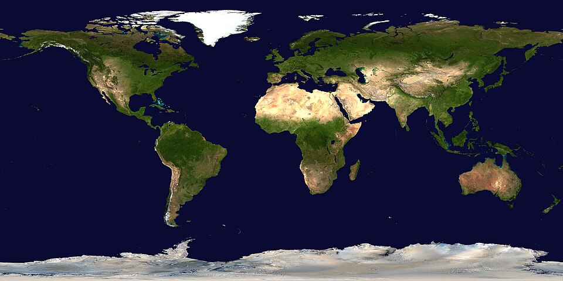

# Урок 26 — Планета Земля: день, ночь, облака, атмосфера 🌍

**Модуль 3 | 4 академических часа (или 2×2 ак.ч.)**

> 🔁 В начале урока — [повторение урока 25](повторение.md) (викторина, 5–7 мин)
>
> ⏳ Большой проект — собираем всё про карты текстур на одном объекте. На формате 2 ак.ч. дели на два занятия (см. [преподавателю.md](преподавателю.md)).

---

## Цель урока

- Собрать **реалистичную Землю** из набора реальных карт NASA
- Закрепить **все карты**: цвет, маска океана (Roughness), нормали (рельеф), ночные огни (Emission)
- Сделать **облака** отдельным слоем
- Добавить **атмосферу** (голубой ободок через Fresnel)
- (Бонус) **вращать Землю** через Scene Time (анимация)

📥 **Что скачать:** карты Земли с **[Solar System Scope](https://www.solarsystemscope.com/textures/)** (раздел Earth) или **[NASA 3D Resources](https://science.nasa.gov/3d-resources/)** — нужны: **Day (Color), Night, Clouds, Normal, Specular/Water**. Бери **2K**. Подробно: [где-скачать.md](../../справочники/где-скачать.md).



*Карта-«цвет» Земли (равнопромежуточная проекция) — ложится на сферу. ([NASA, общественное достояние](https://commons.wikimedia.org/wiki/File:Land_shallow_topo_2048.jpg))*

---

## Часть 1 — Поверхность Земли (день) (30 минут)

### Заготовка
1. `Shift+A → Mesh → UV Sphere` → `F9`: побольше сегментов → `ПКМ → Shade Smooth`
2. У UV-сферы **уже есть UV-развёртка** под такие карты (равнопромежуточные) — разворачивать не нужно!

### Цвет суши и океана (Day Map)
```
Image Texture (Earth Day, sRGB) ─[Color]─► Principled [Base Color]
```
- `Shift+A → Texture → Image Texture` → **Open** → **Earth Day Map** → `[Color]` → **Base Color**

### Океан блестит, суша матовая (Specular/Water mask → Roughness)
- Ещё `Image Texture` → **Specular/Water mask** → **Non-Color**
- Через **ColorRamp** (подстрой так, чтобы **океан = низкий Roughness**, суша = высокий) → **Principled [Roughness]**

> 💡 **Фишка — маска океана:** на карте океан и суша помечены разным серым. Эта маска говорит, **где блестеть** (вода) и где быть матовым (земля). Без неё Земля блестит вся одинаково — ненатурально.

### Рельеф гор (Normal Map)
- `Image Texture` → **Earth Normal** → **Non-Color** → `Normal Map` → **Principled [Normal]**
- Горы и хребты «проявятся» при боковом свете

> 📷 **[Вставь сюда картинку: Земля днём (цвет + океан + рельеф) →](изображения.md#earth-day)**

---

## Часть 2 — Ночные огни городов (Emission) (25 минут)

На тёмной стороне Земли горят огни городов — это карта **Night**, поданная в **Emission**.

```
Image Texture (Earth Night) ─[Color]─► Principled [Emission Color]   (Emission Strength ≈ 1–2)
```
1. `Image Texture` → **Earth Night Map** → `[Color]` → **Emission Color**
2. **Emission Strength** ≈ 1–2

> 🎯 **ЛАЙФХАК — показать здесь!** Как сделать, чтобы огни горели **только на тёмной стороне** (а не везде) — день/ночь по направлению света — в [лайфхак.md](лайфхак.md). Детям это особенно нравится.

> 💡 **Фишка — простой вариант:** даже без хитрой смеси огни-Emission видны в основном на неосвещённой стороне (на свету их «забивает» дневной цвет). Для урока этого достаточно.

> 📷 **[Вставь сюда картинку: ночная сторона Земли с огнями →](изображения.md#earth-night)**

---

## Часть 3 — Облака (отдельный слой) (25 минут)

Облака — **второй шар** чуть больше Земли, полупрозрачный.

1. Выдели Землю → `Shift+D` (дубль) → `S → 1.01` (чуть больше) — это «облачный шар»
2. Новый материал «Облака»:
   - **Earth Clouds map** → в **Base Color** (белый) **и** в **Alpha** (где чёрно — прозрачно)
   - Material Properties → Settings → **Blend Mode → Alpha Blend**
3. Облака парят над поверхностью!

> 💡 **Фишка — облака отдельным шаром:** так их можно **вращать отдельно** от Земли (разная скорость) и менять прозрачность. Карта облаков в Alpha = где облако белое, там непрозрачно.

> 📷 **[Вставь сюда картинку: Земля с облачным слоем →](изображения.md#clouds)**

---

## Часть 4 — Атмосфера (голубой ободок) (20 минут)

У Земли из космоса виден **голубой светящийся ободок** — атмосфера. Делаем **третьим шаром** ещё чуть больше, со свечением по краю (Fresnel).

1. Дубль Земли → `S → 1.03` — «атмосферный шар»
2. Материал:
   - `Fresnel [Fac]` → `ColorRamp` (голубой) → **Emission** (Strength ~2)
   - смешать с **Transparent BSDF** через **Mix Shader** (центр прозрачный, край светится)
   - Blend Mode → Alpha Blend
3. Появился нежный голубой ореол — атмосфера! (это повтор Fresnel с урока 21)

> 💡 **Фишка — Fresnel = ободок:** грани по краю силуэта «смотрят от нас» → Fresnel там ярче. Голубое свечение по краю = атмосфера. Тот же приём, что у голограммы.

> 📷 **[Вставь сюда картинку: Земля с атмосферным ободком →](изображения.md#atmosphere)**

---

## Часть 5 — Космос, вращение и финал (20 минут)

1. **Космос-фон** (World: звёзды из урока 19)
2. **Солнце** (Sun) сбоку — чтобы была освещённая и тёмная сторона (огни!)
3. (Бонус) **Вращение:** выдели Землю → Geometry Nodes или просто анимируй поворот; самый простой — Scene Time → поворот (урок 21). Облака крути чуть быстрее.
4. `Z → Rendered` → нажми Play (если вращаешь) → `F12`

> 📷 **[Вставь сюда картинку: готовая Земля в космосе →](изображения.md#final)**

---

## Итог урока

Сегодня мы:
- ✅ Собрали реалистичную Землю из **реальных карт** NASA
- ✅ Применили все карты: цвет, **маска океана** (Roughness), **нормали** (рельеф), **ночные огни** (Emission)
- ✅ Сделали **облака** отдельным слоем (Alpha)
- ✅ Добавили **атмосферу** (Fresnel-ободок)
- ✅ Поставили Землю в космос и (бонус) заставили вращаться

---

## Лайфхак урока

👉 [лайфхак.md](лайфхак.md) — **день и ночь: огни только на тёмной стороне** (показывается в Части 2)

## Самостоятельная работа

👉 [практика.md](практика.md) — своя планета из реальных карт

---

## Навигация

⬅️ [Урок 25](../урок-25/урок.md)  ·  🔁 [Повторение](повторение.md)  ·  ➡️ **Следующий урок: [Урок 27 — Стекло, вода и самоцветы](../урок-27/урок.md)**
