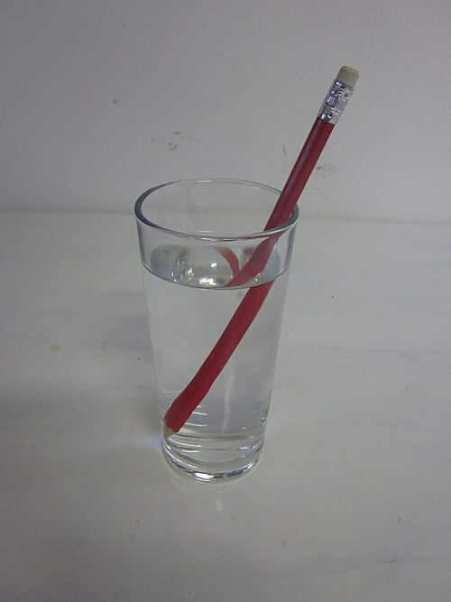
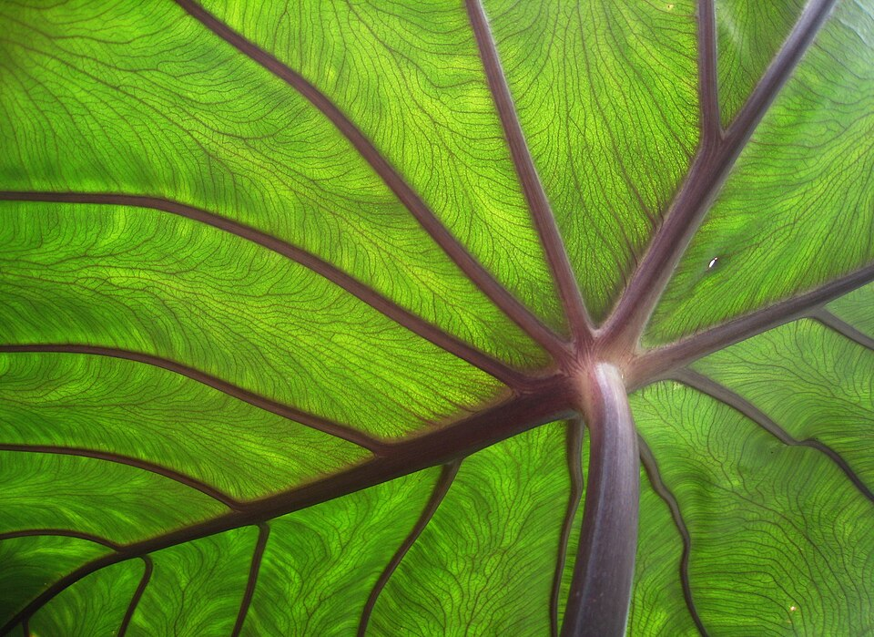

# Урок 27 — Стекло, вода и самоцветы: сложные материалы 💎

**Модуль 3 | 2 академических часа (1,5 часа)**

> 🔁 В начале урока — [повторение урока 26](повторение.md) (викторина, 5–7 мин)

---

## Цель урока

- Понять **прозрачные и просвечивающие** материалы (свет проходит и преломляется)
- Освоить **стекло** (Glass / Transmission, **IOR**)
- Сделать **цветную жидкость/стекло** через **Volume Absorption**
- Понять **Subsurface Scattering (SSS)** — кожа, воск, нефрит, желе, самоцветы
- Узнать **новый модификатор — Ocean** (настоящая вода с волнами)
- **Вместе сделать магическое зелье в колбе** + бонус — море

> 🔁 Раньше материалы только **отражали** свет. Сегодня — материалы, **через которые свет проходит**: стекло, вода, лёд, драгоценные камни, кожа.

---

## Часть 1 — Теория: как ведёт себя свет в прозрачном (16 минут)

Раньше свет от поверхности **отражался**. У прозрачных материалов он ещё и **проходит внутрь** — и тут три явления:

| Явление | Что это | Где |
|---------|---------|-----|
| **Преломление (Refraction)** | свет **гнётся**, проходя сквозь | стекло, вода, лёд, алмаз |
| **Поглощение (Absorption)** | цвет **набирается** с толщиной | цветное стекло, сок, зелье |
| **Подповерхностное рассеяние (SSS)** | свет **входит и рассеивается внутри** | кожа, воск, нефрит, желе, молоко |

### Преломление и IOR



*Карандаш кажется сломанным на границе воды: свет **изгибается**, переходя из воды в воздух. ([Wikimedia Commons, CC BY-SA 3.0](https://commons.wikimedia.org/wiki/File:Pencil_in_glass_of_water_showing_refraction.JPG))*

**IOR (Index Of Refraction)** — насколько сильно среда «гнёт» свет. Чем плотнее оптически среда, тем больше угол изгиба:

| Среда | IOR |
|-------|-----|
| Воздух | 1.0 |
| Вода | 1.33 |
| Стекло | 1.45–1.5 |
| Самоцвет (сапфир) | 1.77 |
| **Алмаз** | **2.42** |

> 💡 **Фишка — почему алмаз сверкает (полное внутреннее отражение):** при большом IOR свет, попав внутрь, не может легко выйти — он **отражается от граней изнутри** и мечется, пока не вырвется вспышкой. Поэтому самоцветы **гранят** (много плоских граней) и берут высокий IOR — камень «играет».

### Поглощение (цвет копится с толщиной)
Цветное стекло/жидкость поглощает часть света. **Чем толще слой — тем насыщеннее цвет** (тонкий край бутылки светлый, середина тёмная). Это закон **Бугера–Ламберта**: краска «накапливается» по пути луча. В Blender это **Volume Absorption** (Часть 3).

### Подповерхностное рассеяние (SSS)



*Лист на просвет светится изнутри: свет **входит, рассеивается** в толще и выходит мягким свечением. Так же ведут себя кожа, воск, молоко, нефрит. ([Wikimedia Commons](https://commons.wikimedia.org/wiki/File:Taro_leaf_underside,_backlit_by_sun_-_edit.jpg))*

**SSS** — свет не отражается сразу, а **ныряет под поверхность**, несколько раз рассеивается внутри и выходит размытым. Поэтому кожа/воск/нефрит выглядят «живыми», а не пластиковыми. Лучше всего видно **на просвет** (свет сзади).

> ⚠️ **Фишка — прозрачность в EEVEE:** для стекла включи в материале **Screen Space Refraction**, а в Render Properties — **Refraction**. Иначе стекло будет «чёрным». (В Cycles работает сразу.)

---

## Часть 2 — Стекло колбы (Glass / Transmission) (20 минут)

### Колба (тело вращения)
1. Нарисуй профиль колбы → **Screw** (повтор урока 8!) → стеклянная бутылочка
2. Дай ей толщину (**Solidify**) — у настоящего стекла есть стенки

### Материал стекла
```
Principled BSDF: Transmission = 1.0, Roughness = 0.0, IOR = 1.45 ─► Material Output
```
- Или `Shift+A → Shader → Glass BSDF` → Material Output, IOR 1.45
- EEVEE: включи Screen Space Refraction (см. фишку выше)

> 💡 **Фишка — Roughness и матовое стекло:** Roughness 0 = чистое прозрачное стекло; 0.2–0.4 = матовое/морозное стекло.

> 📷 **[Вставь сюда картинку: стеклянная колба →](изображения.md#glass)**

---

## Часть 3 — Цветная светящаяся жидкость (Volume Absorption) (20 минут)

Зелье внутри — цветная жидкость. Цвет жидкости даёт **объёмное поглощение**.

### Жидкость
1. Внутри колбы — отдельный меш (уровень жидкости), закрытый объём
2. Материал жидкости:
```
Volume Absorption (Color = фиолетовый, Density = 2) ─► Material Output [Volume]
```
- Чем толще слой жидкости, тем насыщеннее цвет (как в реальности!)
3. Светящееся зелье: добавь чуть **Emission** того же цвета — зелье «магически» светится

> 💡 **Фишка — Volume идёт в отдельный вход:** у Material Output есть вход **Surface** (поверхность) и **Volume** (объём). Absorption/Scatter подают в **Volume**. Так делают туман, дым, цветную воду, зелья.

> 💡 **Фишка — Volume Scatter для тумана/дыма:** похожий нод **Volume Scatter** рассеивает свет внутри — для тумана, облаков, лучей. (Volume Absorption — для прозрачной цветной жидкости.)

> 📷 **[Вставь сюда картинку: зелье — цветная светящаяся жидкость в колбе →](изображения.md#potion)**

---

## Часть 4 — Самоцвет и SSS (15 минут)

### Самоцвет-пробка (Glass, высокий IOR)
- Смоделируй кристалл (куб → заострить) → Glass BSDF, **IOR 2.4** (алмаз) → играет гранями

### Subsurface Scattering (для «живых» материалов)
**SSS** — свет входит внутрь и мягко светится изнутри (кожа, воск, нефрит, желе).
1. Principled BSDF → подними **Subsurface Weight**
2. **Subsurface Radius** (цвет/глубина проникновения) — например, красноватый для кожи, зелёный для нефрита
3. Поднеси свет сзади — материал **просвечивает** по краю

> 💡 **Фишка — SSS оживляет:** без SSS кожа/воск/желе выглядят пластиково. С SSS свет «гуляет» внутри — материал становится живым. Это секрет реалистичных персонажей (пригодится в Модуле 5!).

> 📷 **[Вставь сюда картинку: самоцвет и SSS-материалы (воск, нефрит, желе) →](изображения.md#sss)**

---

## Часть 5 — Новый модификатор: Ocean (вода с волнами) (15 минут)

Настоящую анимированную воду делает модификатор **Ocean** — целое море одной кнопкой.

1. `Shift+A → Mesh → Plane`, `S → 5`
2. 🔧 → **Add Modifier → Physics → Ocean**
3. Плоскость стала **волнистой водой**!
4. Параметры: **Scale** (размер), **Choppiness** (острота волн), **Wave Scale** (высота)
5. Материал воды: Glass/Transmission (IOR 1.33) + чуть голубого + Volume Absorption (бирюза)
6. Нажми **Play** — волны **движутся** сами (Ocean анимирован по времени)!

> 🎯 **ЛАЙФХАК — показать здесь!** Ocean — мощный новый модификатор: настоящее анимированное море, пена, отражения. Полный разбор — в [лайфхак.md](лайфхак.md).

> 📷 **[Вставь сюда картинку: море через Ocean-модификатор →](изображения.md#ocean)**

---

## Часть 6 — Финал (5 минут)

1. Собери: колба (стекло) + зелье (Volume + Emission) + самоцвет (Glass/SSS) на фоне
2. Бонус: поставь зелье у магического моря (Ocean)
3. **HDRI**-фон даёт стеклу красивые отражения (Poly Haven, урок про свет — Модуль 4)
4. `Z → Rendered` → `F12`

> 📷 **[Вставь сюда картинку: магическое зелье (финал) →](изображения.md#final)**

---

## Итог урока

Сегодня мы:
- ✅ Поняли прозрачные/просвечивающие материалы (преломление, поглощение, SSS)
- ✅ Сделали **стекло** (Transmission/Glass, IOR)
- ✅ Сделали **цветную светящуюся жидкость** (Volume Absorption + Emission)
- ✅ Освоили **SSS** (живые материалы — кожа, воск, нефрит)
- ✅ Узнали новый модификатор **Ocean** (анимированная вода)

---

## Лайфхак урока

👉 [лайфхак.md](лайфхак.md) — **Ocean-модификатор: море одной кнопкой** (показывается в Части 5)

## Самостоятельная работа

👉 [практика.md](практика.md) — свой прозрачный объект

---

## Навигация

⬅️ [Урок 26](../урок-26/урок.md)  ·  🔁 [Повторение](повторение.md)  ·  ➡️ **Следующий урок: [Урок 28 — Texture Paint](../урок-28/урок.md)**
