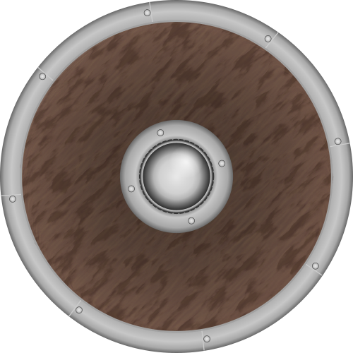

# Урок 28 — Texture Paint: расписываем щит вручную 🎨🛡️

**Модуль 3 | 2 академических часа (1,5 часа) — плотный урок, можно растянуть на 2×2**

> 🔁 В начале урока — [повторение урока 27](повторение.md) (викторина, 5–7 мин)

---

## Цель урока

- Понять, что такое **Texture Paint** — рисование **прямо по модели** кистью
- Завести **холст-текстуру** (paint slot) на свою UV-развёртку
- Освоить **кисти** (Draw, Fill, Smear, Blur) и их настройки (цвет, радиус, сила)
- Включить **симметрию** (рисуешь половину — вторая зеркалится)
- Штамповать **эмблему/логотип** через **Stencil**
- **Сохранить** расписанную текстуру (важно — иначе пропадёт!)
- **Вместе расписать боевой щит**

> 🔁 Это **не износ** (потёртости/ржавчину делали в уроке 20 через Pointiness). Сегодня — **художественная роспись**: ты сам рисуешь узор, лицо, герб, карту.

---

## 📥 Что скачать (для эмблемы-штампа)

Для Части 4 пригодится **картинка-эмблема** (череп, звезда, молния, герб) — **PNG, лучше белая фигура на прозрачном/чёрном фоне**:
- **game-icons.net** — https://game-icons.net — 4000+ игровых иконок, CC BY 3.0 (укажи автора). Скачай PNG.
- Или нарисуй сам в любом редакторе / возьми символ с [Openclipart](https://openclipart.org) (CC0).
- Подробно: [справочники/где-скачать.md](../../справочники/где-скачать.md).

> Без эмблемы тоже можно — нарисуешь её кистью от руки.

---

## Часть 1 — Теория: что такое Texture Paint (16 минут)

### 1.1 Рисуем прямо по модели
**Texture Paint** — режим, где ты **кистью рисуешь по 3D-модели**, как по холсту. Краска ложится на **текстуру-картинку**, а та показывается на модели **по UV-развёртке** (уроки 22–23).

Сравни три способа «раскрасить» из этого модуля:
| Способ | Кто создаёт узор | Урок |
|--------|------------------|------|
| **Процедурные** (Noise/Voronoi) | формула | 19 |
| **Карты-файлы** (PBR) | фотограф/художник заранее | 24 |
| **Texture Paint** | **ты сам, кистью, прямо сейчас** | 28 |

### 1.2 Что нужно, чтобы рисовать
Два обязательных условия:
1. **UV-развёртка** — чтобы краска знала, куда лечь на плоской текстуре (повтор 22–23).
2. **Изображение-холст** (paint slot) — пустая или залитая картинка в **Base Color** материала. Именно по ней «мажет» кисть.

### 1.3 Где можно рисовать (два окна)
- **В 3D-вьюпорте** — водишь кистью **по самой модели** (удобно, видно результат сразу).
- **В Image Editor / UV Editor** — рисуешь **по плоской развёртке** (удобно для ровных краёв и мелочей).
Краска в обоих окнах идёт **в одну и ту же картинку** — можно переключаться.

### 1.4 Разрешение холста = чёткость рисунка
Холст — это картинка из пикселей. Чем больше её разрешение, тем **чётче** рисунок (вспомни **тексели**, урок 22). Но большой холст тяжелее.
- Для урока бери **1024×1024** или **2048×2048** (слабый ПК — 1024).

> 💡 **Фишка — рисуешь по пикселям текстуры:** мажешь по модели, а на деле закрашиваешь **пиксели холста** в том месте, куда смотрит UV. Поэтому кривая UV = краска «поплывёт». Хорошая развёртка (урок 22) важна и здесь.

> 📷 Наш объект — боевой щит:
>
> 
>
> *Структура: деревянные доски, металлический **умбон** (выпуклость в центре), обод с заклёпками. Смоделируем такой и распишем. ([Wikimedia Commons](https://commons.wikimedia.org/wiki/File:Viking_shield.svg))*

---

## Часть 2 — Готовим щит и холст (20 минут)

### Шаг 1 — Модель щита (быстро)
1. `Shift+A → Mesh → Cylinder` → `F9`: Vertices **32**, Depth маленький (`S → Z` сплющи в диск)
2. `Ctrl+B` — лёгкая фаска по краю (обод)
3. **Умбон:** на центр передней грани `I` (Inset) → `E` (Extrude) → чуть вытяни полусферу-горбик
4. `Ctrl+A → All Transforms`

> 🔁 Это игровой ассет в наш средневековый сет (к руинам урока 20 и брусчатке урока 23/25).

### Шаг 2 — Развёртка (UV)
1. `Tab` → Edit Mode → `A` → `U → Smart UV Project` (быстро) или поставь шов по ободу и `Unwrap` (урок 22)
2. Для лицевой стороны удобно: смотри прямо на щит → `U → Project from View` (урок 23) — лицо ляжет «как видишь»
3. `Tab` назад

### Шаг 3 — Холст для рисования (paint slot)
1. Сверху переключись на воркспейс **Texture Paint**
2. Справа панель **Texture Slots** → **+** (Add) → **Base Color** → **New**
3. Имя: `щит_роспись`, размер **2048** (или 1024), **Color** — базовый (например, тёмное дерево). **OK**
4. Blender сам создаст изображение, нод **Image Texture** и подключит его:

```
Image Texture (щит_роспись) ─[Color]─► Principled BSDF [Base Color]
```

| 🧩 Нод | Что делает | Сокеты |
|--------|------------|--------|
| **Image Texture** | холст, по которому мажет кисть | выход **Color** → Base Color |

> 💡 **Фишка — залей фон сразу (Fill):** прежде чем рисовать детали, залей весь холст базовым цветом кистью **Fill** (см. Часть 3). Чистый старт без «дыр».

> 📷 **[Вставь сюда картинку: создание paint-холста (Texture Slots → New) →](изображения.md#canvas)**

---

## Часть 3 — Кисти и роспись (25 минут)

Слева — кисти, сверху — их настройки.

### Главные кисти
| Кисть | Что делает |
|-------|-----------|
| **Draw** | основная — рисует цветом |
| **Fill** | заливка большой области/всего холста |
| **Soften** (Blur) | размывает (мягкие переходы, тени) |
| **Smear** | размазывает краску (как пальцем) |
| **Clone** | копирует кусок из другого места |

### Настройки кисти
- **Color** — цвет (палитра сверху; `X` — поменять основной/запасной цвет местами)
- **Radius** — размер кисти (горячая клавиша **`F`** → веди мышь → ЛКМ)
- **Strength** — сила/непрозрачность (**`Shift+F`**)
- **Falloff** — мягкость края кисти

### Расписываем щит
1. **Fill** → залей фон (дерево/основной цвет щита)
2. **Draw** → нарисуй **обод** (другой цвет по краю), сектора, полосы
3. Мелочи (заклёпки, царапины-узор) — маленький радиус
4. Можно переключиться в **Image Editor** и подровнять края на плоской развёртке

> 💡 **Фишка — рисуй и в 3D, и на развёртке:** крупные мазки удобно в 3D (видно форму), а ровные линии и мелочь — на плоском холсте в Image Editor. Это одна картинка.

### Симметрия — половина работы ⭐
Щит/герб обычно симметричны. Включи зеркало:
1. В заголовке инструмента (или панель **Symmetry**) включи ось **X**
2. Рисуешь слева — **справа появляется зеркально**. Идеально для гербов, лиц, узоров.

> 💡 **Фишка — симметрия экономит вдвое и держит ровно:** левая и правая половины всегда совпадают. Для несимметричных деталей симметрию потом выключи.

> 📷 **[Вставь сюда картинку: роспись щита кистью + X-симметрия →](изображения.md#brushes)**

---

## Часть 4 — Эмблема через Stencil (штамп) (15 минут) ⭐

Чтобы поставить **ровный логотип/эмблему** (череп, звезду, герб), кистью от руки тяжело. Поможет **Stencil** — картинка-трафарет: кладёшь её поверх модели и «прокрашиваешь» сквозь неё.

### Как сделать
1. Кисть **Draw** → панель **Texture** (текстура кисти) → **New/Open** → загрузи свою эмблему (PNG)
2. **Mapping** этой текстуры → **Stencil**
3. На экране появится полупрозрачный трафарет. Управление:
   - **ПКМ + тащить** — переместить трафарет
   - **Shift + ПКМ** — масштаб
   - **Ctrl + ПКМ** — поворот
4. Наведи трафарет на центр щита, выбери цвет → **закрашивай поверх** — проступает только фигура эмблемы. Чёткий логотип готов!

> 🎯 **ЛАЙФХАК — показать здесь!** Stencil — для ровных логотипов, надписей и повторяющихся штампов (звёзды, номера, руны). Полный разбор — в [лайфхак.md](лайфхак.md).

> 💡 **Фишка — контрастная эмблема:** для Stencil бери картинку **белая фигура на чёрном** — Blender по яркости решает, где красить. Размытые/бледные картинки штампуются грязно.

> 📷 **[Вставь сюда картинку: Stencil-трафарет и отштампованная эмблема →](изображения.md#stencil)**

---

## Часть 5 — «Слои» и СОХРАНЕНИЕ (10 минут)

### Про «слои»
В Texture Paint нет слоёв как в Photoshop. Приёмы:
- рисуй продуманно на **одной** картинке (фон → детали → эмблема сверху);
- для отдельного «слоя» (например, грязь/наклейки) заведи **второй** Image Texture и **смешай** его с основным через **Mix Color** (по его Alpha) — урок 24.

### СОХРАНИ текстуру! (важно)
Нарисованная картинка живёт **только в памяти**, пока ты её не сохранил. Если закрыть Blender — пропадёт!
1. В **Image Editor**: `Image → Save As…` → сохрани **`.png`** рядом с .blend
2. И обязательно: `File → External Data → **Pack Resources**` — упакует картинку **внутрь** .blend (не потеряется при переносе)

> ⚠️ **Фишка — звёздочка `*` = не сохранено:** если у имени картинки стоит `*`, рисунок не записан на диск. Привыкай сохранять (`Save As`) и паковать (Pack Resources) — иначе труд пропадёт.

> 📷 **[Вставь сюда картинку: Save As + Pack Resources →](изображения.md#save)**

---

## Часть 6 — Финал (4 минуты)

1. `Z → Material Preview` / `Rendered` — любуйся расписным щитом
2. Свет сбоку — умбон и обод объёмнее
3. `F12` — рендер

> 📷 **[Вставь сюда картинку: готовый расписной щит →](изображения.md#final)**

---

## Итог урока

Сегодня мы:
- ✅ Поняли **Texture Paint** — рисование кистью прямо по модели (по UV)
- ✅ Завели **холст** (paint slot) и расписали его кистями (Draw, Fill, Smear)
- ✅ Включили **симметрию** (рисуешь половину — вторая зеркалится)
- ✅ Отштамповали **эмблему через Stencil**
- ✅ Узнали про «слои» и **сохранили** текстуру (Save As + Pack Resources)

> 💡 **Главная мысль:** Texture Paint — это твоя кисть по 3D. Нужны только хорошая UV и холст-картинка. Симметрия и Stencil делают роспись ровной, а Pack Resources — чтобы она не пропала.

---

## Лайфхак урока

👉 [лайфхак.md](лайфхак.md) — **Stencil: ровные логотипы и штампы** (показывается в Части 4)

## Самостоятельная работа

👉 [практика.md](практика.md) — распиши свой объект

---

## Навигация

⬅️ [Урок 27](../урок-27/урок.md)  ·  🔁 [Повторение](повторение.md)  ·  ➡️ **Следующий урок: [Урок 29 — Запекание (Bake)](../урок-29/урок.md)**
