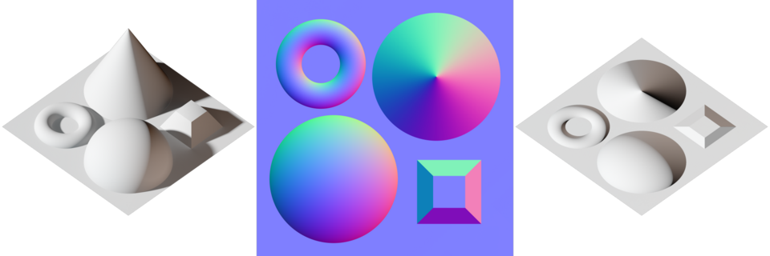
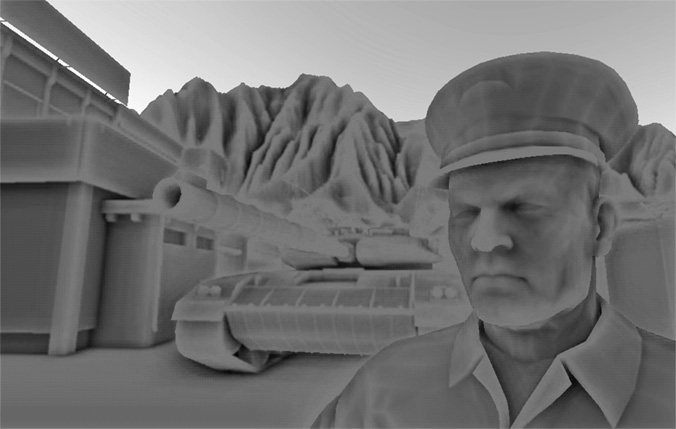

# Урок 29 — Запекание (Bake): переносим детали на low-poly 🔥

**Модуль 3 | 2 академических часа (1,5 часа) — плотный урок, можно растянуть на 2×2**

> 🔁 В начале урока — [повторение урока 28](повторение.md) (викторина, 5–7 мин)

---

## Цель урока

- Понять, что такое **запекание (Bake)** и зачем оно нужно (особенно для слабых ПК и игр)
- Запечь **карту нормалей (Normal)** с **high-poly** на **low-poly**
- Запечь **AO** (мягкие тени в щелях) и подмешать к цвету
- Разобраться с **Cage** (чистое запекание без артефактов)
- **Сохранить** запечённые карты (Save + Pack)
- **Вместе** превратить простую плитку в детальную — без тяжёлой геометрии

---

## 📥 Что скачать (по желанию)

Урок самодостаточный — high-poly и low-poly смоделируем сами. Но для тренировки можно взять готовый детальный объект:
- **Poly Haven Models** — https://polyhaven.com/models (CC0) — запеки детали с готовой модели на свою low-poly.
- В **Модуле 5** мы **слепим** high-poly персонажа и запечём его на low-poly — там этот приём станет главным.
- Подробно: [справочники/где-скачать.md](../../справочники/где-скачать.md).

---

## Часть 1 — Теория: что такое запекание (18 минут)

### 1.1 Запекание = «фотография» сложного в простую картинку
**Bake (запекание)** — это **один раз посчитать** сложную информацию (свет, рельеф, тени, цвет) и **записать её в картинку-текстуру**. Дальше эта картинка просто «приклеена» к модели и ничего не пересчитывает — быстро и дёшево.

> Аналогия: вместо того чтобы каждый раз лепить сложный торт, ты один раз его **сфотографировал** — и используешь фото. Запекание «фотографирует» детали в текстуру.

### 1.2 Главное применение — High-poly → Low-poly



*Слева — **high-poly** (настоящий рельеф: конус, сфера, тор). В центре — его **карта нормалей** (запечённая). Справа — **плоская** поверхность, на которую наложили эту карту: выглядит объёмной, хотя это **плоскость**! ([Wikimedia Commons](https://commons.wikimedia.org/wiki/File:Normal_map_example_with_scene_and_result.png))*

Идея игрового пайплайна:
1. Делаешь **детальную** модель (high-poly) — много полигонов, тяжёлая.
2. Делаешь **простую** (low-poly) — мало полигонов, лёгкая.
3. **Запекаешь** детали high-poly в **карту нормалей** на low-poly.
4. Low-poly + карта нормалей = выглядит детально, **а тормозит как простая**. Идеально для слабых ПК!

> 🔁 Это вершина всего модуля: **Normal Map** (урок 24) теперь не скачиваем, а **делаем сами** из своей геометрии. И наоборот к **Displacement** (урок 25): там мы добавляли настоящую геометрию, здесь — **подделываем** её картой, чтобы было легко.

### 1.3 Что можно запекать
| Bake Type | Что записывает | Куда потом |
|-----------|----------------|------------|
| **Normal** | рельеф high-poly (бугры, фаски) | Normal Map → Principled [Normal] |
| **Ambient Occlusion (AO)** | мягкие тени в щелях/углах | подмешать к Base Color (Multiply) |
| **Diffuse / Combined** | цвет/свет | в Base Color |
| **Roughness / Emit** | свойство материала в картинку | в нужный вход |

> 💡 **Фишка — запекание идёт через Cycles:** Bake — это функция движка **Cycles** (даже если рендеришь в EEVEE, для запекания переключи Render Engine на Cycles). Сама карта потом работает в EEVEE.

> 💡 **Фишка — запечь можно и процедуру:** сложный процедурный материал (например, износ-Pointiness с урока 20) можно **запечь в обычную картинку** — тогда он лёгкий и его можно дорисовать кистью (урок 28).

---

## Часть 2 — Готовим high-poly и low-poly (20 минут)

Сделаем **каменную плитку с рельефом** (high-poly) и **плоскую** плитку (low-poly).

### High-poly (детальная)
1. `Shift+A → Mesh → Plane`, `S → 1.5`
2. `I` (Inset) рамку по краю → `E` (Extrude) приподними бортик
3. В центре: `I` + `E` выдави **эмблему** (звезду/руну) или несколько «камней»
4. Все рёбра: `Ctrl+B` (Bevel, чтобы фаски ловили свет) → 🔧 **Subdivision Surface** уровень 2 (гладкие формы)
5. `ПКМ → Shade Smooth`. Это наша **детальная** плитка.

### Low-poly (простая)
1. `Shift+A → Mesh → Plane`, `S → 1.5` — поставь **ровно на то же место** (та же позиция/размер)
2. Дай чуть толщины (`Solidify` тонкий) — по желанию
3. `Tab → A → U → Unwrap` (low-poly **обязательно** нужна UV — на неё запечём карты!)
4. `Ctrl+A → All Transforms` на обоих объектах

> 💡 **Фишка — low-poly «оборачивает» high-poly:** low-poly должна быть чуть **снаружи или вплотную** к high-poly и повторять его силуэт. Тогда лучи запекания «дотянутся» от low-poly до деталей high-poly.

> 📷 **[Вставь сюда картинку: high-poly (рельеф) и low-poly (плоская) рядом →](изображения.md#high-low)**

---

## Часть 3 — Запекаем Normal (high → low) (22 минуты)

### Шаг 1 — Холст для карты
1. **Render Properties → Render Engine → Cycles** (запекание только в Cycles!)
2. Выдели **low-poly** → дай материал → открой **Shader Editor**
3. `Shift+A → Texture → Image Texture` → **New** → имя `плитка_normal`, размер **2048**, **Non-Color** (нормали — данные!)
4. **Оставь этот Image Texture выделенным** (он — мишень запекания; никуда подключать пока не надо)

### Шаг 2 — Выделение и настройки
1. Сначала выдели **high-poly**, потом **с Shift — low-poly** (low-poly должна быть **активной**, светлее обведена)
2. **Render Properties → Bake:**
   - **Bake Type → Normal**
   - включи **Selected to Active** ✅
   - **Extrusion** ≈ 0.1 и **Max Ray Distance** ≈ 0.1 (дальность лучей; подбери под размер)
3. Нажми **Bake** — подожди. Картинка `плитка_normal` заполнится сине-фиолетовым — это запечённый рельеф!

### Шаг 3 — Подключаем карту
```
Image Texture (плитка_normal, Non-Color) ─[Color]─► Normal Map ─[Normal]─► Principled BSDF [Normal]
```
1. `Shift+A → Vector → Normal Map`
2. `Image Texture [Color] → Normal Map [Color]`, `Normal Map [Normal] → Principled [Normal]`
3. **Спрячь high-poly** (`H`) → посмотри на low-poly при боковом свете: плоская плитка **выглядит рельефной**! 🎉

> 💡 **Фишка — мишень = выделенный Image Texture:** Blender печёт в **тот** Image-нод, что выделен в материале активного объекта. Если печёт «не туда» или ошибка «No active image» — кликни нужный Image Texture, чтобы он стал активным.

> 📷 **[Вставь сюда картинку: low-poly с запечённой картой нормалей (выглядит детально) →](изображения.md#baked-normal)**

---

## Часть 4 — Cage: чистое запекание (15 минут)

Иногда на краях/фасках карта получается «полосатой», искажённой. Лучи от low-poly идут вкось и «мажут». Это лечит **Cage**.

### Что такое Cage
**Cage («клетка»)** — это **раздутая копия** low-poly. Лучи запекания идут **по её нормалям** — ровно, перпендикулярно поверхности, и аккуратно «накрывают» high-poly. Меньше искажений.

### Как включить
1. В панели **Bake** включи **Cage** ✅
2. Задай **Cage Extrusion** (насколько «раздуть») — чуть больше, чтобы клетка охватила все детали
3. (Точный вариант) сделай копию low-poly, раздуй её (`Alt+S` Shrink/Fatten) и укажи как **Cage Object**
4. Перепеки (**Bake**) — края стали чистыми

> 🎯 **ЛАЙФХАК — показать здесь!** Как победить артефакты запекания (Cage, Ray Distance, Margin) — в [лайфхак.md](лайфхак.md).

> 💡 **Фишка — Margin (растекание):** запекание добавляет «кайму» вокруг островов UV, чтобы на швах не было щелей. Если по швам тонкие зазоры — увеличь **Margin**.

> 📷 **[Вставь сюда картинку: до/после Cage (артефакты исчезли) →](изображения.md#cage)**

---

## Часть 5 — Запекаем AO и сохраняем (12 минут)

### AO — мягкие тени в щелях



*Чистый **AO**: свет не достаёт в углы, щели, под детали — там темнее. Это добавляет объём. ([Wikimedia Commons](https://commons.wikimedia.org/wiki/File:Screen_space_ambient_occlusion.jpg))*

1. Ещё `Image Texture → New` (`плитка_AO`, можно sRGB/Non-Color — для маски Non-Color), выдели его
2. Bake Type → **Ambient Occlusion** → **Bake**
3. Подмешай к цвету: `Mix Color` (**Multiply**): Base Color × AO → Principled [Base Color] (как на уроке 24)

### СОХРАНИ карты! (как на уроке 28)
1. Image Editor → `Image → Save As…` → сохрани `плитка_normal.png` и `плитка_AO.png`
2. `File → External Data → **Pack Resources**`

> ⚠️ **Фишка — запечённое тоже надо сохранять:** карты живут в памяти, пока не сохранил. Звёздочка `*` = не записано. Save As + Pack Resources — иначе запекание пропадёт.

> 📷 **[Вставь сюда картинку: AO-карта и её подмешивание к цвету →](изображения.md#ao)**

---

## Часть 6 — Финал (3 минуты)

1. На low-poly: запечённый **Normal** + **AO** (+ свой цвет/PBR)
2. Спрячь/удали high-poly — он больше не нужен (детали уже в картах!)
3. Боковой свет → `Z → Rendered` → `F12`. Лёгкая плитка выглядит как тяжёлая.

> 📷 **[Вставь сюда картинку: финал — детальная low-poly плитка →](изображения.md#final)**

---

## Итог урока

Сегодня мы:
- ✅ Поняли **запекание** — «фотографируем» детали в текстуру (раз посчитал — дальше дёшево)
- ✅ Запекли **карту нормалей** с high-poly на low-poly (Selected to Active, Cycles)
- ✅ Разобрались с **Cage** и Ray Distance (чистое запекание)
- ✅ Запекли **AO** и подмешали к цвету
- ✅ **Сохранили** карты (Save As + Pack Resources)

> 💡 **Главная мысль:** запекание = детали без тяжести. Лепишь/моделишь сложное → запекаешь в карты → надеваешь на лёгкую low-poly. Так делают все игры; в Модуле 5 запечём так персонажа.

---

## Лайфхак урока

👉 [лайфхак.md](лайфхак.md) — **побеждаем артефакты запекания (Cage, Ray Distance, Margin)** (показывается в Части 4)

## Самостоятельная работа

👉 [практика.md](практика.md) — запеки детали своего объекта на low-poly

---

## Навигация

⬅️ [Урок 28](../урок-28/урок.md)  ·  🔁 [Повторение](повторение.md)  ·  ➡️ **Следующий урок: [Урок 30 — Итоговая текстурированная диорама](../урок-30/урок.md)**
