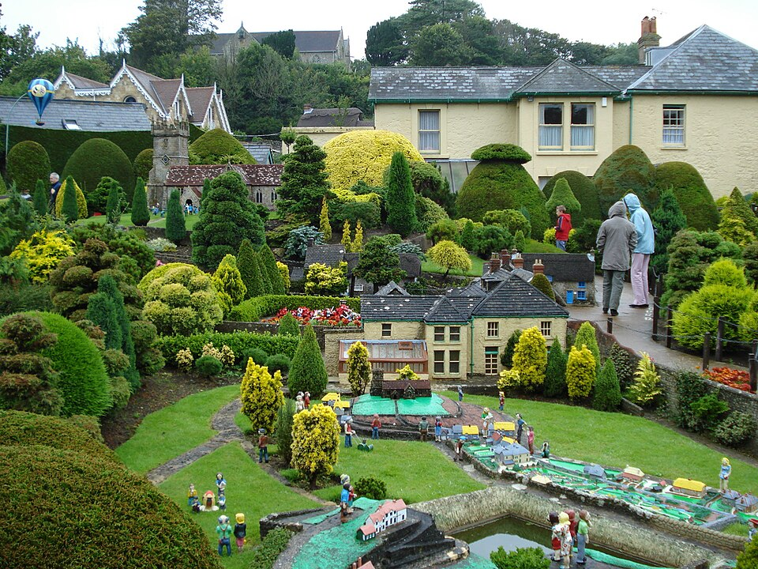

# Урок 30 — Итоговый проект Модуля 3: текстурированная диорама 🏆🎨

**Модуль 3 | 4 академических часа (или 2×2 ак.ч.) — итоговый проект с защитой**

> 🔁 В начале урока — [повторение урока 29](повторение.md) (викторина, 5–7 мин)

---

## Цель урока

Собрать **маленькую сцену-диораму** и применить в ней **всё из Модуля 3**: материалы, процедурные текстуры, UV, карты PBR, рельеф, роспись, стекло/свечение. В конце — **защита** перед классом по **рубрике оценки**.

> ⚠️ **НЕ повторяем** Землю/Луну/планеты с урока 19/26 — придумай **свою** сцену.

---

## 📥 Что скачать (под свою тему)

- **PBR-текстуры** (дерево, камень, металл, ткань) — **Poly Haven** [polyhaven.com/textures](https://polyhaven.com/textures) или **ambientCG** [ambientcg.com](https://ambientcg.com), бери **1K–2K**.
- **Эмблема/узор** для росписи (Stencil) — **game-icons.net** (CC BY) — PNG.
- **HDRI** для красивого света/фона — [polyhaven.com/hdris](https://polyhaven.com/hdris), 2K.
- Подробно: [справочники/где-скачать.md](../../справочники/где-скачать.md).

> Скачай **заранее** и сложи в одну папку рядом с .blend.

---

## Часть 1 — Что такое диорама и выбор темы (20 минут)

**Диорама** — это **маленькая собранная сцена** на подставке: кусочек мира с постройками, объектами и окружением. Не один объект, а **уголок истории**.

*Пример диорамы: домики, сады, вода, фигурки — целый мирок в миниатюре. Наша 3D-диорама — такой же «уголок», но с материалами и текстурами. ([Godshill Model Village, Wikimedia Commons](https://commons.wikimedia.org/wiki/File:Godshill_Model_Village.jpg))*

### Выбери тему (или придумай свою)
| Тема | Что покажешь (и какие техники модуля) |
|------|----------------------------------------|
| 🏰 **Средневековый двор** | брусчатка (Displace, ур.25/29) + расписной щит (ур.28) + замшелый камень-износ (Pointiness, ур.20) |
| 🧪 **Магическая лаборатория** | зелья-стекло и SSS (ур.27) + светящиеся руны (Emission, ур.18) + деревянные полки (PBR, ур.24) |
| 🚀 **Отсек космической станции** | металл-панели (PBR, ур.24) + голограмма (ур.21) + экраны (Emission) |
| 🏚 **Заброшенная комната** | дерево/металл с износом (Pointiness, ур.20) + пыль/AO + ржавчина |
| 💎 **Витрина сокровищ** | золото и самоцветы (ур.18/27) + расписной сундук (ур.28) + бархат (Sheen) |

### План
1. Выбери тему → набросай на бумаге **силуэт сцены**: где главный объект (акцент), где второстепенное.
2. Составь список: что **смоделируешь**, что возьмёшь из **Asset Browser** (ур.15), какие **текстуры** скачаешь.

> 💡 **Фишка — диорама = акцент + окружение + мелочь.** Один главный объект, вокруг — поддержка, по краям — детали. Пустые углы = «бедная» сцена.

> 📷 **[Вставь сюда картинку: примеры 3D-диорам по темам →](изображения.md#themes)**

---

## Часть 2 — Чеклист синтеза: примени техники модуля (15 минут)

Цель — показать **минимум 5** приёмов Модуля 3. Вот шпаргалка «где что» (быстрое напоминание, подробно — в указанном уроке):

| Техника | Ключевое действие (где/как) | Урок |
|---------|------------------------------|------|
| **Principled-материал** | Material Properties → **New**; крути Metallic/Roughness | 18 |
| **Процедурная текстура** | Shader Editor: `Shift+A → Texture → Noise/Voronoi` → ColorRamp → Base Color | 19 |
| **Износ (Pointiness)** | `Shift+A → Input → Geometry [Pointiness]` → ColorRamp → маска в Mix Shader | 20 |
| **UV-развёртка** | `Tab → A → U → Smart UV Project` | 22–23 |
| **Карты PBR** | выдели Principled → `Ctrl+Shift+T` → выбери все файлы набора | 24 |
| **Рельеф (Displace)** | 🔧 Subdivision (Simple) → 🔧 Displace, **Texture Coordinates = UV** | 25 |
| **Стекло/SSS** | Principled: **Transmission = 1** (стекло) или **Subsurface Weight** (SSS) | 27 |
| **Роспись (Texture Paint)** | воркспейс Texture Paint → Tool → Texture Slots `+` → Base Color | 28 |
| **Запекание (опц.)** | Cycles → Bake → Selected to Active → Normal/AO | 29 |

> 💡 **Фишка — не «лишь бы много», а уместно:** 5 приёмов, которые подходят теме, лучше 10 случайных. Металл-панели уместны на станции, мох-износ — на руинах.

---

## Часть 3 — Сборка по этапам (90 минут)

Работай **по порядку** — так большая сцена собирается без хаоса.

### Этап 1 — Блокаут (грубые формы)
1. Удали куб (`X`). Расставь **примитивы** (`Shift+A → Mesh → …`) как «болванки»: главный объект покрупнее, окружение помельче. Без деталей — только силуэт.
2. Сразу раскладывай по **коллекциям**: выдели объекты → `M` → **New Collection** → назови («Постройки», «Природа», «Реквизит»).
   ✅ *Должно получиться:* узнаваемый силуэт сцены из серых форм, разложенный по папкам в Outliner.

### Этап 2 — Моделирование и UV
1. Доведи формы (Extrude/Inset/Bevel/Boolean/Screw — Модуль 2).
2. Каждому объекту, который будешь текстурировать картинками: `Tab → A → U → **Smart UV Project** → OK → Tab`.
   ✅ *Должно получиться:* у объектов есть развёртка (на неё лягут карты/роспись).

### Этап 3 — Материалы и карты
1. Простые поверхности — **Principled** (Material Properties → **New**, крути Metallic/Roughness — ур.18).
2. Реалистичные — **PBR-набор**: открой **Shader Editor**, выдели **Principled BSDF**, `Ctrl+Shift+T`, выбери все файлы набора (diff/rough/nor/ao) → **Open** (ур.24).
   ✅ *Должно получиться:* объект покрыт фотоматериалом; в `Z → Material Preview` видно цвет, блеск, рельеф.
3. Где нужен рельеф по силуэту — **Displace** (Subdivision Simple + Displace, Texture Coordinates = UV — ур.25).

### Этап 4 — Роспись деталей (Texture Paint)
1. Воркспейс **Texture Paint** → Properties **вкладка Tool** (отвёртка+ключ) → **Texture Slots** `+` → **Base Color** → **New** (2048) → распиши узор/эмблему (Stencil) — ур.28.
2. **Сохрани** рисунок: Image Editor → **Image → Save As** (.png).
   ✅ *Должно получиться:* на объекте — твоя ручная роспись, файл сохранён (без `*`).

### Этап 5 — Акценты: стекло, свет, вода
- Стекло/зелье — **Transmission** + (EEVEE) Screen Space Refraction; свечение — **Emission**; вода — **Ocean** (ур.27); голограмма/экран — ур.21.

### Этап 6 — Свет, камера, кадр
1. Свет: `Shift+A → Light → Area`, подвинь сбоку-сверху. Или **HDRI** (World → Environment Texture — ур.19).
2. Камера: наведи вид на лучший ракурс → `Ctrl+Numpad0` (камера встанет как вид).
3. `Z → Rendered` → `F12`.
   ✅ *Должно получиться:* красивый кадр диорамы.

### Этап 7 — Упакуй проект (НЕ потеряй текстуры!)
1. Верхнее меню **File → External Data → Pack Resources**.
   ✅ *Должно получиться:* все картинки-текстуры зашиты внутрь .blend — файл можно переносить, ничего не «отвалится».

> 🎯 **ЛАЙФХАК — показать здесь!** Сборка проекта в один файл и проверка, что ничего не потеряно (Pack Resources, Report Missing Files) — в [лайфхак.md](лайфхак.md).

> 📷 **[Вставь сюда картинку: этапы сборки диорамы (блокаут → материалы → свет) →](изображения.md#workflow)**

---

## Часть 4 — Защита проекта (по рубрике) (15 минут)

Каждый показывает диораму классу (1–2 мин):
- **Что за сцена** и какая была идея
- **Какие 5+ техник модуля** применил (покажи где: «тут PBR-камень, тут роспись щита, тут стекло-зелье»)
- Что вышло лучше всего, что было сложно

> 📊 **Рубрика оценки** — в [практика.md](практика.md). Покажи её детям **до** старта.

> 📷 **[Вставь сюда картинку: готовые диорамы на защите →](изображения.md#defense)**

---

## Итог Модуля 3 🎉

За уроки 18–30 ты научился делать материалы **по-настоящему**:
- ✅ Principled BSDF, процедурные текстуры, ноды по сокетам
- ✅ UV-развёртка, проекции, бесшовные текстуры
- ✅ все карты **PBR**, **Displacement**, запекание high→low
- ✅ Земля, стекло/вода/самоцветы, ручная роспись
- ✅ собрал **текстурированную диораму** и защитил её

**Дальше — Модуль 4:** свет, камера и рендер — научимся показывать свои сцены красиво!

---

## Лайфхак урока

👉 [лайфхак.md](лайфхак.md) — **сборка проекта в один файл (Pack Resources)** (показывается в Части 3, Этап 7)

## Сдать на оценку

👉 [практика.md](практика.md) — требования и **рубрика оценки**

---

## Навигация

⬅️ [Урок 29](../урок-29/урок.md)  ·  🔁 [Повторение](повторение.md)  ·  ➡️ **Дальше — Модуль 4: свет, камера, рендер** (см. [план курса](../../ПЛАН-КУРСА.md))

🎉 *Поздравляем с завершением Модуля 3!*
