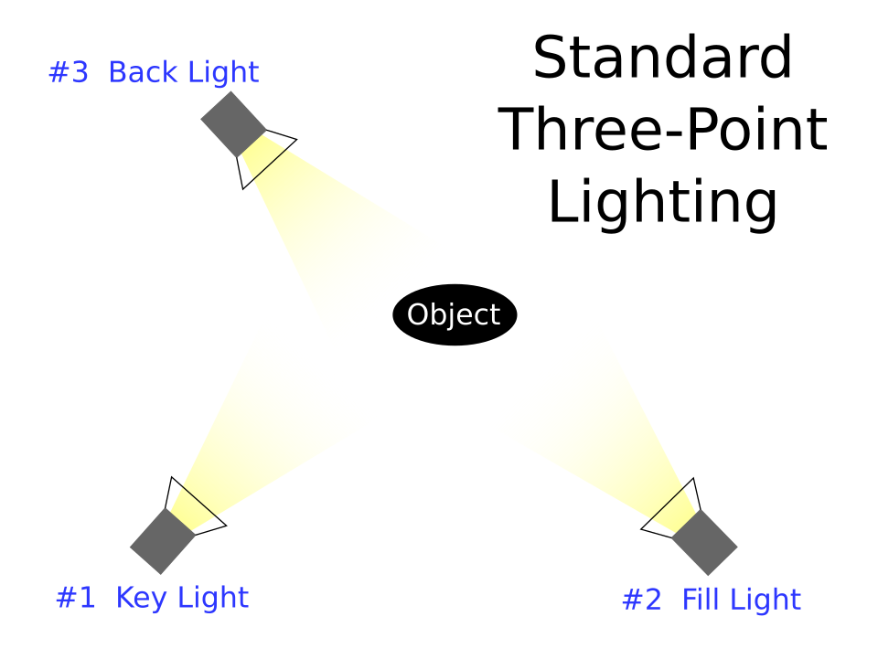

# Урок 31 — Освещение и HDRI: свет решает всё 💡🌌

**Модуль 4 | 2 академических часа (1,5 часа)**

> 🔁 В начале урока — [повторение урока 30](повторение.md) (викторина по Модулю 3, 5–7 мин)

---

## Цель урока

- Понять **типы ламп** (Point, Sun, Spot, Area) и их параметры
- Разобрать **мягкий и жёсткий** свет (почему размер лампы решает всё)
- Поставить **трёхточечную схему** (key + fill + back)
- Сделать **фон и свет через World** — космос со звёздами и **HDRI**
- **Вместе осветить сцену** и собрать красивый кадр

> 🔁 До этого мы делали материалы, но в режиме Solid свет «никакой». Теперь научимся **ставить свет** — без него даже лучшая модель выглядит плоско.

---

## 📥 Что скачать (по желанию)

- **HDRI-панорама** для готового красивого света и фона — **Poly Haven** [polyhaven.com/hdris](https://polyhaven.com/hdris): возьми **2K** (слабый ПК), теги `studio` (нейтральный свет) или `night`/`sky`. Подробно: [где-скачать.md](../../справочники/где-скачать.md).

> Космос-фон можно сделать и **без скачивания** — звёзды процедурно (лайфхак урока).

---

## Часть 1 — Теория: каким бывает свет (20 минут)

### 1.1 Четыре типа ламп
В Blender свет добавляется через `Shift+A → Light`. Четыре вида:

| Лампа | Аналогия | Когда брать |
|-------|----------|-------------|
| **Point** | лампочка — светит во все стороны из точки | свечи, фонарики, лампы |
| **Sun** | солнце — параллельные лучи, бесконечно далёкое (важен **угол**, не позиция) | улица, день, главный свет сцены |
| **Spot** | прожектор — конус света | сцена, фара, акцент на объекте |
| **Area** | софтбокс — светящаяся панель | мягкий студийный свет (наш главный инструмент) |

### 1.2 Главные параметры лампы
Выдели лампу → **Properties → вкладка Object Data** (иконка **зелёная лампочка**):
- **Power** (Вт) у Point/Spot/Area — яркость. **Strength** у Sun.
- **Color** — цвет света (тёплый закат / холодная тень / синева космоса).
- **Size** (у Area/Point) — **размер источника**. Это самый недооценённый параметр (см. ниже).

### 1.3 Мягкий и жёсткий свет — решает РАЗМЕР
- **Маленький** источник (далёкая лампочка, солнце) → **жёсткие чёткие тени** с резким краем.
- **Большой** источник (большая Area-панель, облачное небо) → **мягкие размытые тени**.

> 💡 **Фишка — хочешь мягче? Увеличь Size или придвинь лампу.** Большой близкий софтбокс = мягкие приятные тени (так снимают портреты). Маленькая далёкая точка = резкие драматичные тени.

### 1.4 Трёхточечная схема — классика
Один источник = плоско или слишком контрастно. Профи ставят **три**:



*Три лампы вокруг объекта: **#1 Key** (главный, ярче всех, сбоку-сверху), **#2 Fill** (заполняющий, слабее, смягчает тени с другой стороны), **#3 Back** (контровой, сзади — очерчивает силуэт, отделяет от фона). ([Wikimedia Commons](https://commons.wikimedia.org/wiki/File:3_point_lighting.svg))*

| Лампа | Где стоит | Задача |
|-------|-----------|--------|
| **Key** (ключевой) | спереди-сбоку-сверху | главный свет, лепит форму |
| **Fill** (заполняющий) | с другой стороны, слабее | смягчает (подсвечивает) тени |
| **Back/Rim** (контровой) | сзади объекта | светящийся ободок по силуэту |

### 1.5 World — свет и фон сразу
Фон сцены и общий свет задаются в **Properties → вкладка World** (иконка **красный глобус**):
- просто **цвет + Strength** (равномерная подсветка),
- или **Environment Texture (HDRI)** — фотопанорама, которая даёт **и фон, и реалистичный свет** одним кликом.

> 💡 **Фишка — HDRI = свет «бесплатно»:** одна панорама освещает сцену как настоящее окружение (студия, улица, закат). Часто этого хватает вместо ламп.

---

## Часть 2 — Готовим сцену и ставим Key (15 минут)

### Шаг 1 — Объект и старт
1. Возьми свой **🚀 корабль** (Модуль 1–2) или добавь тест-модель: `Shift+A → Mesh → Monkey` (это Suzanne — классика для проверки света).
2. `ПКМ → Shade Smooth`.
3. Удали стандартную лампу (она слабая): выдели её в Outliner → `X`. **Камеру не трогай.**
4. Наведи курсор в 3D-вид → `Z` → выбери **Rendered** — пока темно (света нет). Это нормально.

### Шаг 2 — Key Light (главный)
1. `Shift+A → Light → Area`.
   ✅ *Должно получиться:* появилась квадратная лампа-панель (пока где-то у центра).
2. Подними и отведи её **вперёд-влево-вверх** от модели: `G` двигай, `R` поворачивай «лицом» к модели. (Удобно: смотри из лампы — выдели лампу, в N-панели → View, или просто на глаз направь.)
3. **Properties → вкладка Object Data** (зелёная лампочка): **Power = 1000 W**, **Size = 2 m**, **Color** — чуть тёплый (почти белый).
   ✅ *Должно получиться:* модель осветилась с одной стороны, с другой — мягкая тень.

> 💡 **Фишка — направить лампу быстро:** выдели лампу → включи `Z → Rendered` → двигай `G`/`R` и сразу видишь, как ложится свет. Подбирай вживую.

---

## Часть 3 — Fill и Back: трёхточечная схема (20 минут)

### Шаг 1 — Fill (заполняющий)
1. Выдели Key-лампу → `Shift+D` → `Esc` (дубликат на месте) → `G` перенеси на **другую сторону** модели (справа).
2. В Object Data сделай её **слабее и мягче**: **Power ≈ 300 W**, **Size = 3 m** (крупнее = мягче), **Color** — чуть холодный (лёгкая синева).
   ✅ *Должно получиться:* глухие чёрные тени посветлели — стали мягкими, читаемыми.

> 💡 **Фишка — Fill всегда слабее Key** (примерно в 2–4 раза). Если Fill = Key, пропадёт объём, картинка станет «плоской».

### Шаг 2 — Back / Rim (контровой)
1. `Shift+D → Esc` ещё раз → перенеси лампу **за** модель (сзади-сверху), направь на её затылок/край.
2. Object Data: **Power ≈ 800 W**, **Size = 1 m** (поменьше — чтобы ободок был чётче).
   ✅ *Должно получиться:* по краю силуэта модели появился светящийся **ободок** — она «отклеилась» от фона.

> 💡 **Фишка — Back делает «дорого»:** контровой ободок отделяет объект от фона. Без него модель сливается с тёмным космосом.

> 📷 **[Вставь сюда картинку: модель с трёхточечным светом (key/fill/back) →](изображения.md#three-point)**

---

## Часть 4 — Космос-фон через World (20 минут)

### Вариант А — звёзды процедурно (без скачивания)
1. **Properties → вкладка World** (красный глобус) → нажми на жёлтую точку у **Color** → выбери… нет — лучше через ноды: переключи нижний редактор на **Shader Editor**, а в его шапке смени режим с **Object** на **World**.
2. Собери звёзды (схема по сокетам):

```
Noise Texture [Fac] ─► Color Ramp [Fac]
Color Ramp [Color] ─► Background [Color]
Background [Background] ─► World Output [Surface]
```
| 🧩 Нод | Что делает | Сокеты |
|--------|------------|--------|
| **Noise Texture** | случайные пятна | **Scale** (крупность), выход **Fac** |
| **Color Ramp** | порог: оставить только яркие точки | вход **Fac**, выход **Color** |
| **Background** | фон Мира (свет+цвет) | вход **Color**, **Strength** |

3. Настрой: **Noise Scale ≈ 800–1000** (мелкие точки); в **Color Ramp** переключи интерполяцию на **Constant** и сдвинь чёрно-белые флажки почти вплотную к правому краю — останутся **редкие белые точки-звёзды** на чёрном.
   ✅ *Должно получиться:* фон стал чёрным космосом с россыпью звёзд.

> 🎯 **ЛАЙФХАК — показать здесь!** Звёздное небо из `Noise + ColorRamp` (и как регулировать густоту/яркость звёзд) — в [лайфхак.md](лайфхак.md).

### Вариант Б — HDRI (одна панорама = свет + фон)
1. В **Shader Editor** (режим **World**): `Shift+A → Texture → Environment Texture` → **Open** → выбери скачанный `.hdr/.exr` → соедини `[Color] → Background [Color]`.
2. `Background [Background] → World Output [Surface]`.
   ✅ *Должно получиться:* сцена осветилась панорамой, на фоне видно окружение. Крути **Strength**, чтобы не пересветить.

> 💡 **Фишка — HDRI крутится:** добавь `Texture Coordinate [Generated] → Mapping → Environment Texture [Vector]` и вращай **Mapping Z**, чтобы повернуть фон/свет под нужный ракурс.

> 📷 **[Вставь сюда картинку: космос-фон со звёздами (World) →](изображения.md#space-world)**

---

## Часть 5 — Финал (10 минут)

1. `Z → Rendered` — оцени картинку целиком: есть объём (key), мягкие тени (fill), ободок (back), фон (World).
2. Подкрути Power ламп, чтобы не было пересвета (белых «выжженных» пятен) и провалов в черноту.
3. `F12` — рендер. `Image → Save As`.

> 💡 **Фишка — свет важнее модели:** одна и та же модель при плохом свете — «никакая», при хорошем — «вау». Свет — половина красивого кадра (вторая половина — камера, урок 32).

> 📷 **[Вставь сюда картинку: финальный освещённый кадр →](изображения.md#final)**

---

## Итог урока

Сегодня мы:
- ✅ Разобрали типы ламп (Point/Sun/Spot/Area) и их параметры (Power, **Size**, Color)
- ✅ Поняли **мягкий vs жёсткий** свет (решает размер источника)
- ✅ Поставили **трёхточечную схему** (key + fill + back)
- ✅ Сделали **космос-фон** через World (звёзды процедурно и HDRI)
- ✅ Собрали красиво освещённый кадр

---

## Лайфхак урока

👉 [лайфхак.md](лайфхак.md) — **звёздное небо через Noise + ColorRamp в World** (показывается в Части 4)

## Самостоятельная работа

👉 [практика.md](практика.md) — освети свою сцену

---

## Навигация

⬅️ [Модуль 3, Урок 30](../../модуль-03-материалы/урок-30/урок.md)  ·  🔁 [Повторение](повторение.md)  ·  ➡️ **Следующий урок: [Урок 32 — Камера и рендер](../урок-32/урок.md)**
