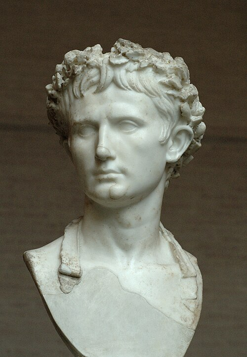

# Урок 31 — Освещение и HDRI: свет музейного экспоната 💡🏛

**Модуль 4 | 2 академических часа (1,5 часа)**

> 🔁 В начале урока — [повторение урока 30](повторение.md) (викторина по Модулю 3, 5–7 мин)

> 🎬 **Сквозной проект Модуля 4:** мы как музейные мастера выставим **экспонат** — сегодня поставим ему **свет** (урок 31), потом снимем **каталожный кадр камерой** (урок 32) и доведём в **пост-обработке** (урок 33).

---

## Цель урока

- Понять **типы ламп** (Point, Sun, Spot, Area) и их параметры
- Разобрать **мягкий и жёсткий** свет (почему размер лампы решает всё)
- Поставить **трёхточечную схему** (key + fill + back) на экспонат
- Сделать **музейный акцент** прожектором (Spot) и фон через **World/HDRI**
- **Вместе осветить экспонат** в маленькой галерее

> 🔁 В Модуле 3 мы делали материалы, но в режиме Solid свет «никакой». Музей — лучшее место учить свет: там всё решает грамотная подсветка экспоната.

---

## 📥 Что скачать (по желанию)

- **HDRI-панорама** для мягкого окружающего света и фона — **Poly Haven** [polyhaven.com/hdris](https://polyhaven.com/hdris): возьми **2K**, теги `studio` или `interior`. Подробно: [где-скачать.md](../../справочники/где-скачать.md).

---

## Часть 1 — Теория: каким бывает свет (20 минут)

### 1.1 Четыре типа ламп
Свет добавляется через `Shift+A → Light`. Четыре вида:

| Лампа | Аналогия | Когда брать |
|-------|----------|-------------|
| **Point** | лампочка — светит во все стороны из точки | свечи, лампы, общий свет |
| **Sun** | солнце — параллельные лучи, бесконечно далёкое (важен **угол**, не позиция) | улица, день |
| **Spot** | **прожектор — конус света** | **музейная подсветка экспоната**, сцена, фара |
| **Area** | софтбокс — светящаяся панель | мягкий студийный/заполняющий свет |

### 1.2 Главные параметры лампы
Выдели лампу → **Properties → вкладка Object Data** (иконка **зелёная лампочка**):
- **Power** (Вт) у Point/Spot/Area — яркость. **Strength** у Sun.
- **Color** — цвет (тёплый «галерейный» / холодный).
- **Size** (у Area/Point) — **размер источника** (см. ниже).
- у **Spot** — **Spot Size** (ширина конуса) и **Blend** (мягкость края пятна).

### 1.3 Мягкий и жёсткий свет — решает РАЗМЕР
- **Маленький** источник (далёкая лампочка, узкий прожектор) → **жёсткие чёткие тени**.
- **Большой** источник (большая Area-панель, рассеиватель) → **мягкие размытые тени**.

> 💡 **Фишка — хочешь мягче? Увеличь Size или придвинь лампу.** Музеи часто смешивают: жёсткий Spot-акцент + мягкий заполняющий, чтобы экспонат и «играл», и не тонул в чёрных тенях.

### 1.4 Трёхточечная схема — классика
Один источник = плоско или слишком контрастно. Профи ставят **три**:

*Три лампы вокруг объекта: **#1 Key** (главный, ярче всех, сбоку-сверху), **#2 Fill** (заполняющий, слабее, смягчает тени), **#3 Back** (контровой, сзади — очерчивает силуэт). ([Wikimedia Commons](https://commons.wikimedia.org/wiki/File:3_point_lighting.svg))*

Вот как это выглядит на реальном музейном экспонате:

*Бюст императора Августа: мягкий ключевой свет лепит форму лица, тени читаемы, фон спокойный. Такой же свет соберём в Blender. ([Glyptothek, Munich — Wikimedia Commons](https://commons.wikimedia.org/wiki/File:Augustus_Bevilacqua_Glyptothek_Munich_317.jpg))*

| Лампа | Где стоит | Задача |
|-------|-----------|--------|
| **Key** (ключевой) | спереди-сбоку-сверху | главный свет, лепит форму |
| **Fill** (заполняющий) | с другой стороны, слабее | смягчает тени |
| **Back/Rim** (контровой) | сзади объекта | ободок по силуэту, отделяет от стены |

### 1.5 World — общий свет и фон
Фон и общий «окружающий» свет — в **Properties → вкладка World** (иконка **красный глобус**):
- просто **цвет + Strength** (равномерная подсветка),
- или **Environment Texture (HDRI)** — даёт **и фон, и реалистичный свет** сразу.

> 💡 **Фишка — в музее World держат тёмным:** слабый общий свет + яркий Spot на экспонат = тот самый «музейный» драматизм, когда экспонат светится в полумраке.

---

## Часть 2 — Строим витрину и ставим Key (20 минут)

### Шаг 1 — Сцена-галерея
1. Удали стартовый куб (`X`). Сделай **пол**: `Shift+A → Mesh → Plane`, `S → 6`.
2. **Задняя стена**: `Shift+A → Mesh → Plane`, `R → X → 90`, `G → Y` отодвинь назад, `G → Z` подними — получился вертикальный экран-стена.
3. **Постамент**: `Shift+A → Mesh → Cube`, `S → X 0.6, S → Y 0.6`, `S → Z 1.2` → `G → Z` поставь на пол — тумба.
4. **Экспонат**: поставь на тумбу свою модель **или** добавь тест-бюст: `Shift+A → Mesh → Monkey` (Suzanne) → `ПКМ → Shade Smooth` → `G → Z` посади на постамент.
   ✅ *Должно получиться:* мини-галерея — пол, стена, тумба, экспонат на ней.
5. Наведи курсор в 3D-вид → `Z` → **Rendered** — пока темно (света нет). Это нормально.

### Шаг 2 — Key Light = музейный прожектор (Spot)
1. `Shift+A → Light → Spot`.
   ✅ *Должно получиться:* появился прожектор с конусом.
2. Подними его **спереди-сверху-слева** от экспоната, направь конус на лицо/верх экспоната (`G` двигай, `R` поворачивай).
3. **Properties → вкладка Object Data** (зелёная лампочка): **Power = 800 W**, **Spot Shape → Spot Size ≈ 40°**, **Blend ≈ 0.3** (мягкий край пятна), **Color** — чуть тёплый.
   ✅ *Должно получиться:* на экспонат лёг тёплый круг света, с другой стороны — выразительная тень.

> 💡 **Фишка — Spot = музейная подсветка:** узкий конус «вырывает» экспонат из темноты. Spot Size — ширина пятна, Blend — мягкость его края.

---

## Часть 3 — Fill и Back: трёхточка на экспонат (20 минут)

### Шаг 1 — Fill (заполняющий, мягкий)
1. `Shift+A → Light → Area` → поставь **справа** от экспоната, чуть ниже Key, направь на тёмную сторону.
2. Object Data: **Power ≈ 150 W**, **Size = 2 m** (крупный = мягкий), **Color** — нейтральный/чуть холодный.
   ✅ *Должно получиться:* глухая чёрная тень посветлела, стала мягкой — лицо экспоната читается полностью.

> 💡 **Фишка — Fill всегда слабее Key** (в 2–4 раза). Если Fill = Key, пропадёт объём.

### Шаг 2 — Back / Rim (контровой)
1. `Shift+A → Light → Area` → перенеси **за** экспонат (сзади-сверху), направь на его затылок/плечи.
2. Object Data: **Power ≈ 300 W**, **Size = 0.5 m** (поменьше = чётче ободок).
   ✅ *Должно получиться:* по краю силуэта появился светящийся **ободок** — экспонат «отклеился» от стены.

> 📷 **[Вставь сюда картинку: экспонат с трёхточечным светом (key/fill/back) →](изображения.md#three-point)**

---

## Часть 4 — Фон галереи через World (15 минут)

### Вариант А — тёмная галерея (драматизм)
1. **Properties → вкладка World** (красный глобус) → **Color** сделай тёмно-серым, **Strength ≈ 0.05–0.1**.
   ✅ *Должно получиться:* общий свет еле теплится, экспонат «горит» под прожектором — музейный полумрак.

### Вариант Б — HDRI-интерьер (мягкий ровный свет)
1. Нижний редактор переключи на **Shader Editor**, в шапке смени **Object → World**.
2. `Shift+A → Texture → Environment Texture` → **Open** → выбери `.hdr` (interior/studio) → соедини `[Color] → Background [Color]`, `Background [Background] → World Output [Surface]`.
   ✅ *Должно получиться:* сцена осветилась мягким окружением; крути **Strength**, чтобы не пересветить.

> 💡 **Аддон — HDRI, не выходя из Blender (BlenderKit).** Кроме скачивания с Poly Haven, готовые HDRI-панорамы можно брать прямо в Blender через аддон **BlenderKit** (Preferences → Add-ons → «BlenderKit» → ✅) — вкладка BlenderKit → раздел **HDR** → перетащи понравившуюся студию/интерьер в сцену. Удобно для быстрых проб света. Каталог — [справочники/аддоны.md](../../справочники/аддоны.md).

> 🎯 **ЛАЙФХАК — показать здесь!** **Музейный акцент**: как одним узким Spot + тёмным World заставить экспонат эффектно «светиться в полумраке» — в [лайфхак.md](лайфхак.md).

> 📷 **[Вставь сюда картинку: галерейный фон/освещение →](изображения.md#gallery)**

---

## Часть 5 — Финал (10 минут)

1. `Z → Rendered` — оцени: объём (key-Spot), мягкие тени (fill), ободок (back), фон-галерея (World).
2. Подкрути Power, чтобы не было пересвета (белых «выжженных» пятен) и провалов в черноту.
3. `F12` — рендер. `Image → Save As`. **Сохрани файл** — он понадобится на уроке 32 (будем снимать камерой)!

> 💡 **Фишка — свет важнее модели:** один и тот же экспонат при плохом свете — «никакой», при музейном — «вау». Свет — половина кадра (вторая половина — камера, урок 32).

> 📷 **[Вставь сюда картинку: финальный освещённый экспонат →](изображения.md#final)**

---

## Итог урока

Сегодня мы:
- ✅ Разобрали типы ламп (Point/Sun/Spot/Area) и параметры (Power, **Size**, Spot Size/Blend, Color)
- ✅ Поняли **мягкий vs жёсткий** свет (решает размер источника)
- ✅ Поставили **трёхточечную схему** (key-Spot + fill + back) на экспонат
- ✅ Сделали **фон-галерею** через World (тёмная / HDRI)
- ✅ Собрали красиво освещённую витрину — основу проекта Модуля 4

---

## Лайфхак урока

👉 [лайфхак.md](лайфхак.md) — **музейный акцент: Spot + тёмный World** (показывается в Части 4)

## Самостоятельная работа

👉 [практика.md](практика.md) — освети свой экспонат/предмет

---

## Навигация

⬅️ [Модуль 3, Урок 30](../../модуль-03-материалы/урок-30/урок.md)  ·  🔁 [Повторение](повторение.md)  ·  ➡️ **Следующий урок: [Урок 32 — Камера и рендер](../урок-32/урок.md)**
