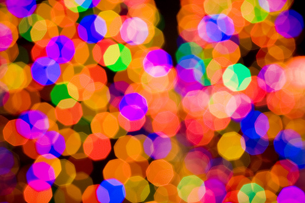

# Урок 32 — Камера и рендер: ловим красивый кадр 🎥

**Модуль 4 | 2 академических часа (1,5 часа)**

> 🔁 В начале урока — [повторение урока 31](повторение.md) (викторина по свету, 5–7 мин)

---

## Цель урока

- Понять **камеру**: фокусное расстояние, ракурс, кадрирование
- Освоить **композицию** (правило третей) и удобную наводку (**Lock Camera to View**)
- Сделать **глубину резкости (DOF)** — размыть фон, выделить главное
- Разобрать **EEVEE vs Cycles** и убрать шум (**Denoise**)
- Настроить **вывод** (1920×1080) и **отрендерить** кадр
- **Вместе снять кадр** «🚀 корабль у планеты»

---

## Часть 1 — Теория: как работает камера (18 минут)

### 1.1 Фокусное расстояние (Lens) — «зум» и перспектива
**Фокусное расстояние** (в миллиметрах) решает, как много влезает в кадр и как искажается перспектива:
- **Маленькое (18–24 мм, «широкий угол»)** — влезает много, перспектива «растянута», близкое кажется огромным. Для масштабных сцен, простора.
- **Среднее (35–50 мм)** — «как глаз человека», естественно.
- **Большое (85–200 мм, «телевик»)** — приближает далёкое, «сплющивает» перспективу. Для портретов и акцента на объекте.

> 💡 **Фишка — фокусное меняет не только «зум»:** широкий угол драматизирует (корабль навис над тобой), телевик успокаивает и «прижимает» фон. Это художественный выбор, а не только приближение.

### 1.2 Композиция — правило третей
Не ставь главный объект ровно в центр. Мысленно раздели кадр на **3×3** и помести важное на **линии/пересечения** — кадр оживает.

### 1.3 Глубина резкости (DOF) — размытие фона
Настоящая камера держит резким только то, что в **фокусе**; остальное **размывается** (красивое боке).

*Размытые цветные кружки — это **боке**: фон не в фокусе. Малая глубина резкости отделяет главный объект от фона. ([Wikimedia Commons](https://commons.wikimedia.org/wiki/File:Bokeh_Example.jpg))*

- **Focus Distance** — на каком расстоянии резкость (наводим на главный объект).
- **F-Stop** — сила размытия: **маленький F (1.4–2.8) = сильное размытие**, большой F (8–16) = почти всё резко.

### 1.4 EEVEE vs Cycles — два движка
| | **EEVEE** | **Cycles** |
|--|-----------|------------|
| Как считает | быстро, «на глаз» (растеризация) | честно трассирует лучи |
| Скорость | очень быстро (реалтайм) | медленнее |
| Качество стекла/отражений/света | хорошо, но с хитростями | максимально реалистично |
| Шум | нет | есть (лечится Denoise) |
| Для слабых ПК | ✅ да | тяжелее |

> 💡 **Фишка — EEVEE для учёбы, Cycles для «вау»:** на уроках и слабых ПК — EEVEE (мгновенно). Для финального красивого кадра со стеклом/светом — Cycles + Denoise.

### 1.5 Denoise — убрать шум Cycles
Cycles даёт «зернистый» шум, который уходит с числом **Samples** — но это долго. Быстрее включить **Denoise** (умное сглаживание шума).

---

## Часть 2 — Ставим камеру и кадр (20 минут)

### Шаг 1 — Смотрим из камеры
1. Наведи курсор в 3D-вид → нажми **`Numpad 0`** — вид переключился «из камеры» (появилась рамка кадра).
   ✅ *Должно получиться:* видишь то, что снимает камера (рамка с уголками).

### Шаг 2 — Наводим камеру удобно (Lock Camera to View)
1. Открой **N-панель** (`N`) → вкладка **View** → в разделе **View Lock** поставь галочку **Camera to View**.
2. Теперь **обычная навигация** (колёсико/вращение) **двигает камеру**. Найди красивый ракурс «корабль у планеты».
3. Поймал кадр — **сними галочку** Camera to View (чтобы не сбить).
   ✅ *Должно получиться:* камера встала на нужный ракурс, кадр зафиксирован.

> 🎯 **ЛАЙФХАК — показать здесь!** **Lock Camera to View** — самый удобный способ кадрировать (летаешь как обычно, а двигается камера). Полный разбор — в [лайфхак.md](лайфхак.md).

### Шаг 3 — Фокусное расстояние
1. Выдели камеру → **Properties → вкладка Object Data Camera** (иконка **зелёная камера**) → раздел **Lens → Focal Length**.
2. Попробуй **24 мм** (масштабно, планета нависает) и **85 мм** (корабль крупно, фон спокойный) — выбери под настроение.
   ✅ *Должно получиться:* кадр меняет «характер» — от драматичного простора до спокойного акцента.

### Шаг 4 — Композиция (направляющие третей)
1. В той же вкладке **Object Data Camera** → раздел **Viewport Display → Composition Guides** → включи **Thirds**.
   ✅ *Должно получиться:* на камере появилась сетка 3×3 — двигай камеру так, чтобы корабль лёг на линию/пересечение.

> 📷 **[Вставь сюда картинку: кадр по правилу третей (корабль у планеты) →](изображения.md#framing)**

---

## Часть 3 — Глубина резкости (DOF) (15 минут)

1. Выдели камеру → **Properties → вкладка Object Data Camera** → раздел **Depth of Field** → поставь галочку **Depth of Field**.
2. **Focus Object:** нажми пипетку/поле **Focus Object** → выбери **корабль** (резкость наведётся точно на него).
   *(Или вручную: **Focus Distance** — расстояние до объекта.)*
3. **Aperture → F-Stop:** поставь **2.0** (сильное размытие фона) и сравни с **8.0** (фон чётче).
   ✅ *Должно получиться:* корабль резкий, планета и звёзды за ним мягко размыты — взгляд идёт на главное.

> 💡 **Фишка — DOF выделяет главное:** размытый фон убирает «шум» сцены и говорит зрителю, куда смотреть. Но не переборщи — слишком малый F размоет и сам объект.

> 📷 **[Вставь сюда картинку: до/после DOF (резкий корабль, размытый фон) →](изображения.md#dof)**

---

## Часть 4 — Движок, шум и вывод (20 минут)

### Шаг 1 — Выбор движка
1. **Properties → вкладка Render** (иконка задней крышки камеры) → **Render Engine**.
2. Для учёбы оставь **EEVEE** (быстро). Для финала со стеклом/светом — попробуй **Cycles**.

### Шаг 2 — Denoise (если Cycles)
1. В **Cycles**: Render Properties → раздел **Sampling** → подними **Render Samples** до ~128.
2. Ниже включи **Denoise** ✅.
   ✅ *Должно получиться:* зернистый шум исчез, картинка чистая.

### Шаг 3 — Размер кадра и сохранение
1. **Properties → вкладка Output** (иконка **принтер**) → **Resolution X = 1920**, **Y = 1080**, **%=100** (Full HD).
2. Раздел **Output**: укажи папку и **File Format = PNG**.
3. Наведи курсор в 3D-вид → **`F12`** — рендер!
   ✅ *Должно получиться:* открылось окно с финальным кадром.
4. В окне рендера: **Image → Save As** → сохрани `.png`.

> 💡 **Фишка — сначала маленький тест:** прежде чем рендерить большой кадр, проверь на `%=50`, что всё на месте (свет, фокус, кадр). Потом ставь 100%.

> 📷 **[Вставь сюда картинку: настройки вывода (1920×1080, PNG) →](изображения.md#output)**

---

## Часть 5 — Финал (7 минут)

Собери всё: камера на ракурсе (трети) + фокусное под настроение + DOF на корабль + движок + 1920×1080 → `F12` → Save As.

> 💡 **Фишка — свет + камера = кадр:** на уроке 31 поставили свет, сейчас — камеру и фокус. Вместе это уже «киношный» кадр. Осталось добавить блеск — пост-обработка (урок 33).

> 📷 **[Вставь сюда картинку: финальный кадр «корабль у планеты» →](изображения.md#final)**

---

## Итог урока

Сегодня мы:
- ✅ Поняли **фокусное расстояние** (зум + характер перспективы)
- ✅ Кадрировали по **правилу третей** и через **Lock Camera to View**
- ✅ Сделали **DOF** (резкий объект, размытый фон)
- ✅ Сравнили **EEVEE и Cycles**, убрали шум **Denoise**
- ✅ Настроили вывод **1920×1080** и отрендерили кадр

---

## Лайфхак урока

👉 [лайфхак.md](лайфхак.md) — **Lock Camera to View: кадрируем летая** (показывается в Части 2)

## Самостоятельная работа

👉 [практика.md](практика.md) — сними свой кадр

---

## Навигация

⬅️ [Урок 31](../урок-31/урок.md)  ·  🔁 [Повторение](повторение.md)  ·  ➡️ **Следующий урок: [Урок 33 — Compositor и финал](../урок-33/урок.md)**
