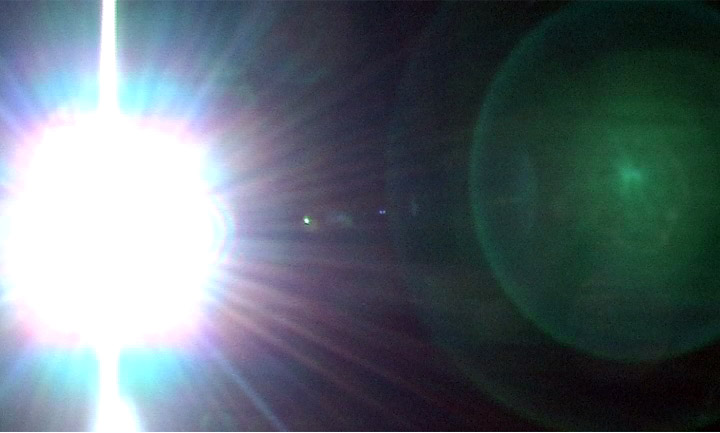

# Урок 33 — Compositor и финал: магия после рендера ✨

**Модуль 4 | 2 академических часа (1,5 часа) — итог Модуля 4**

> 🎬 **Финал проекта:** берём кадр **музейного экспоната** (свет — урок 31, камера — урок 32) и доводим его пост-обработкой.

> 🔁 В начале урока — [повторение урока 32](повторение.md) (викторина по камере, 5–7 мин)

---

## Цель урока

- Понять, что такое **Compositor** — обработка кадра **после** рендера (нодами)
- Добавить **свечение (Glare)** ярким местам — фары, лазеры, звёзды
- Сделать **цветокоррекцию** (настроение кадра)
- Применить **Lens Distortion** (искажение/хроматика) и **виньетку**
- **Вместе довести кадр** музейного экспоната до «каталожно-киношного»

---

## Часть 1 — Теория: что такое Compositor (15 минут)

После `F12` у тебя есть **готовая картинка**. **Compositor** — это «фотошоп внутри Blender» на **нодах**: он берёт отрендеренный кадр и **улучшает** его — добавляет свечение, меняет цвет, добавляет эффекты. Это **пост-обработка** (post = «после»).

### Поток (по сокетам)
```
Render Layers [Image] ─► (эффекты) ─► Composite [Image]
```
- **Render Layers** — твой свежий рендер (вход в обработку).
- **Composite** — итоговый выход (что сохранится при F12).
- Между ними вставляем ноды-эффекты — по очереди, как фильтры.

### Что добавим
| Нод | Что делает | Для чего |
|-----|------------|----------|
| **Glare** | свечение/ореол вокруг ярких мест | фары, лазеры, звёзды, неон, эмиссия |
| **Color Balance** | цвет теней/средних/светов | настроение (тёплый/холодный кадр) |
| **Lens Distortion** | искажение и цветной край (хроматика) | «настоящий объектив», сай-фай |

> 💡 **Фишка — пост-обработка решает 30% красоты:** даже хороший рендер «оживает» от свечения и цветокоррекции. Это последний штрих профи.

---

## Часть 2 — Включаем Compositor (10 минут)

1. Сначала **отрендерь кадр**: наведи в 3D-вид → `F12` → закрой окно рендера (картинка осталась в памяти).
2. Сверху переключись на воркспейс **Compositing**.
3. В шапке окна поставь галочки **Use Nodes** ✅ и **Backdrop** ✅.
   ✅ *Должно получиться:* появились два нода — **Render Layers** и **Composite** — соединённые. На фоне (Backdrop) виден твой кадр.
4. Чтобы видеть результат на фоне, добавим «смотровой» нод: `Shift+A → Output → Viewer`. Подключим к нему цепочку в конце.

> 💡 **Фишка — Backdrop = предпросмотр:** Viewer-нод показывает картинку прямо на фоне Compositor. Колесо/`Shift`+колесо — зум/сдвиг фона. Так видно эффект сразу.

---

## Часть 3 — Свечение: Glare (20 минут) ⭐

Вот что **Glare** имитирует — реальное свечение и блики яркого источника:



*Яркий источник даёт **ореол свечения**, **лучи** (Streaks) и круг-«призрак» (Ghosts). Нод Glare добавляет это к ярким местам твоего рендера. ([Wikimedia Commons](https://commons.wikimedia.org/wiki/File:Lens_flare.jpg))*

1. `Shift+A → Filter → Glare`.
2. Вставь его в цепочку: соедини **Render Layers [Image] → Glare [Image]**, затем **Glare [Image] → Composite [Image]** (и заодно → **Viewer [Image]**, чтобы видеть).
3. В ноде Glare выбери **Type**:
   - **Fog Glow** — мягкий ореол-свечение (bloom) вокруг ярких мест;
   - **Streaks** — лучи-звёздочки от ярких точек (звёзды, блики);
   - **Ghosts** — блики-«призраки» объектива.
4. Покрути:
   - **Threshold** — с какой яркости начинается свечение (ниже = больше всего светится);
   - **Mix** — сила эффекта (от −1 только эффект, до +1).
   ✅ *Должно получиться:* блики на металле/золоте, свет прожектора и любые яркие места «засияли» ореолом — кадр стал живым.

| 🧩 Нод | Что делает | Сокеты |
|--------|------------|--------|
| **Glare** | добавляет свечение ярким пикселям | вход **Image**, выход **Image**; Type, Threshold, Mix |

> 🎯 **ЛАЙФХАК — показать здесь!** **Glare** для лазеров, фар и неона (и наша голограмма/лазерный меч засияют!) — в [лайфхак.md](лайфхак.md).

> 📷 **[Вставь сюда картинку: до/после Glare (свечение бликов и подсветки) →](изображения.md#glare)**

---

## Часть 4 — Цвет и эффекты объектива (20 минут)

### Цветокоррекция (настроение)
1. `Shift+A → Color → Color Balance` → вставь после Glare: **Glare [Image] → Color Balance [Image] → Composite/Viewer**.
2. Три круга: **Lift** (тени), **Gamma** (средние), **Gain** (света). Подвинь точку в круге:
   - тени чуть в **синий** (Lift → синева),
   - света чуть в **тёплый** (Gain → оранжевый).
   ✅ *Должно получиться:* кадр получил «киношное» настроение — холодные тени, тёплый свет.

| 🧩 Нод | Что делает | Сокеты |
|--------|------------|--------|
| **Color Balance** | красит тени/средние/света отдельно | **Lift / Gamma / Gain**; вход/выход **Image** |

### Lens Distortion (объектив/хроматика)
1. `Shift+A → Distort → Lens Distortion` → вставь следующим в цепочку.
2. **Dispersion** ≈ 0.02 — на краях появится тонкая цветная кайма (как в настоящем объективе / сай-фай). **Distort** — лёгкое искривление (по желанию).
   ✅ *Должно получиться:* по краям кадра — едва заметная цветная кайма, «как через линзу».

### (Бонус) Виньетка
- Затемнить углы: `Shift+A → Mask → Ellipse Mask` → `Blur` (размыть) → `Mix (Multiply)` с картинкой. Тёмные края «собирают» взгляд в центр.

> 📷 **[Вставь сюда картинку: цепочка Compositor (Glare → Color → Lens) →](изображения.md#grade)**

---

## Часть 5 — Сохраняем финал (10 минут)

1. Убедись, что конец цепочки идёт в **Composite** (именно он сохраняется).
2. Наведи в 3D-вид → `F12` ещё раз — рендер теперь выходит **с пост-обработкой**.
3. В окне рендера: **Image → Save As** → `.png` (1920×1080 с урока 32).
   ✅ *Должно получиться:* финальный кадр со свечением, цветом и «объективом» — готов к показу!

> 💡 **Фишка — Compositor не трогает 3D:** он меняет только картинку. Можно крутить эффекты сколько угодно — модель и сцена в безопасности.

> 📷 **[Вставь сюда картинку: финальный кадр экспоната с пост-обработкой →](изображения.md#final)**

---

## Итог урока и Модуля 4 🎉

Сегодня мы:
- ✅ Поняли **Compositor** — обработка кадра после рендера (нодами по сокетам)
- ✅ Добавили **Glare** (свечение фар/лазеров/звёзд)
- ✅ Сделали **цветокоррекцию** (Color Balance) и **Lens Distortion**
- ✅ Сохранили **финальный кадр** с пост-обработкой

**За Модуль 4** ты научился превращать серую сцену в красивый кадр: **свет → камера → пост-обработка**. Теперь твои работы выглядят профессионально!

**Дальше — Модуль 5:** скульптинг и персонаж — вылепим своего героя!

---

## Лайфхак урока

👉 [лайфхак.md](лайфхак.md) — **Glare для лазеров, фар и неона** (показывается в Части 3)

## Самостоятельная работа

👉 [практика.md](практика.md) — обработай свой кадр

---

## Навигация

⬅️ [Урок 32](../урок-32/урок.md)  ·  🔁 [Повторение](повторение.md)  ·  ➡️ **Дальше — Модуль 5: скульптинг и персонаж** (см. [план курса](../../ПЛАН-КУРСА.md))

🎉 *Поздравляем с завершением Модуля 4!*
