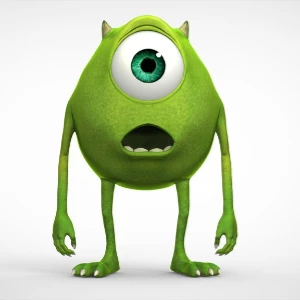
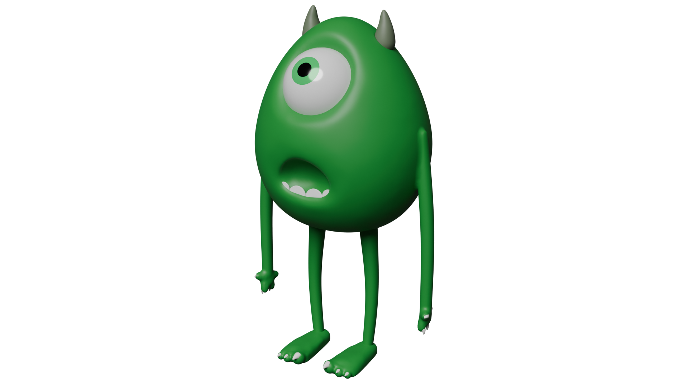

# Самостоятельная работа — Урок 34: Слепи монстра из «Корпорации монстров» 👁️👹

> 🧑‍🎓 Делаешь сам(а): вылепи **монстра из мультика «Корпорация монстров»** (или своего монстра по такому же принципу). Учитель помогает, если застрял.

## Задание

Вылепи **тело-голову монстра** в Sculpt Mode. Отличный пример — **Майк** (круглый одноглазый зелёный монстр с рожками): его тело — это, по сути, большая «голова-яйцо» с одним глазом и ртом, что идеально подходит к технике этого урока. Тонкие руки-ноги и зубы добавим на уроках 35–36 — сегодня лепим **главный объём с лицом**.

> 🎬 **Референс:** учитель покажет кадр персонажа на экране. Можно выбрать **другого** монстра из мультика (Салли, страшила-«звезда» и др.) или придумать **своего** — главное, повторить приёмы урока.

| Референс (мультик) | Пример результата (3D) |
|--------------------|------------------------|
|  |  |

*Слева — референс из мультика (показывается на занятии). Справа — пример того, что должно получиться: тело-«яйцо», один большой глаз, рот, рожки, тонкие руки-ноги (ноги/руки добавим на уроке 35). Лепи по такому же принципу.*

> ⚠️ Картинка-референс персонажа — собственность Disney/Pixar, используется как **учебный** материал в классе. В публичную версию курса её не добавляй.

### Как Майк ложится на техники урока
| Часть Майка | Кисть/приём урока |
|-------------|-------------------|
| Овальное тело-«яйцо» | база-сфера → `S → Z` → **Grab** подправить силуэт |
| Один **большой глаз** (в центре!) | **Draw + `Ctrl`** — крупная круглая впадина-глазница; глазное яблоко — отдельная сфера или **Inflate** |
| Широкий **рот** | **Crease** — длинная дуга-улыбка; приоткрыть — **Grab/Draw+Ctrl** вглубь |
| **Рожки** на макушке | **Snake Hook** — два симметричных рожка |
| Гладкая «кожа» | **Shift**-Smooth по всему телу |

> 💡 У Майка один глаз ровно по центру — это удобно: **симметрия X** помогает лепить рот и рожки ровно, а глаз ставим по центральной линии.

---

## Требования

- [ ] База-шар, `Shade Smooth`, `Ctrl+A`, вытянут в «яйцо»
- [ ] Включены **Matcap**, **симметрия X**, **Dyntopo** (Detail Size средний)
- [ ] Сначала **крупная форма** тела (Grab), потом детали
- [ ] **Большой глаз** (впадина + яблоко) по центру
- [ ] **Рот** (Crease), при желании приоткрытый
- [ ] **Рожки** (Snake Hook), симметрично
- [ ] Поверхность сглажена (**Shift**-Smooth), силуэт проверен со всех сторон
- [ ] Файл сохранён (продолжим на уроках 35–36 — добавим руки/ноги/зубы)

---

## 💡 Подсказки (если что-то забыл)

- **Войти в лепку:** список режимов (слева вверху) → **Sculpt Mode**; вид — **Solid → Matcap**
- **Кисти:** левая панель (`T`): Grab, Draw, Crease, Inflate, Snake Hook, Pinch
- **Вдавить глазницу/рот:** зажми **`Ctrl`** с Draw/Crease
- **Сгладить:** зажми **`Shift`** + веди кистью
- **Размер/сила:** `F` / `Shift+F`
- **Глаз — по центру** (для Майка) или **посередине высоты** (для двуглазого монстра)
- **Глазное яблоко:** удобнее отдельной сферой (`Shift+A → UV Sphere`) — вставить во впадину
- **Порядок:** силуэт → массы → детали

---

## Что сдать

`.blend` + скриншот/рендер монстра с 2–3 ракурсов (анфас и сбоку). Подпиши, какого монстра делал.

> 📷 **[Референсы монстров и куда положить картинки →](изображения-практика.md#ref)**
