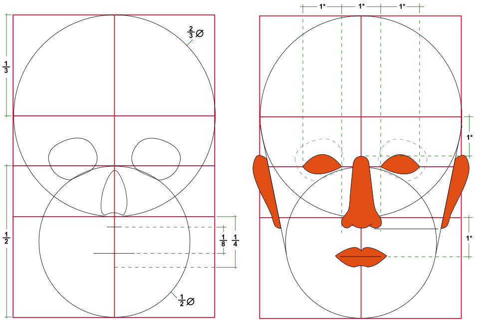
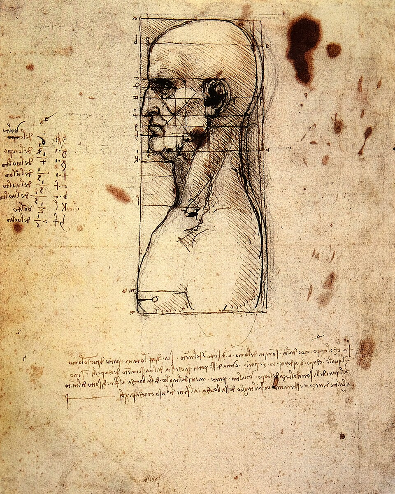

# Урок 34 — Введение в скульптинг: лепим голову персонажа 🗿

**Модуль 5 | 2 академических часа (1,5 часа) — старт большого модуля про персонажа**

> 🔁 В начале урока — [повторение урока 33](повторение.md) (викторина по Compositor, 5–7 мин)

> ⚠️ **Тема важная и непростая.** Не торопись: скульптинг — это как лепка из глины, тут важны спокойствие и пропорции. Каждый шаг расписан подробно.

---

## Цель урока

- Понять, что такое **скульптинг** и чем он отличается от обычного моделирования
- Войти в **Sculpt Mode** и настроить его (Matcap, симметрия)
- Понять **Dyntopo** (динамическая топология) и зачем нужна густая сетка
- Освоить главные **кисти**: Grab, Draw, Clay Strips, Crease, Inflate, Pinch, Smooth, Snake Hook
- Запомнить **пропорции головы** (где глаза, нос, рот)
- **Вместе вылепить голову нашего персонажа-человечка** (в практике — своего монстра)

---

## Часть 1 — Теория: что такое скульптинг (22 минуты)

### 1.1 Скульптинг = цифровая глина (как это работает)
Раньше мы **строили** модель из полигонов (двигали вершины, выдавливали грани — это «полигональное моделирование»). **Скульптинг** — другой подход: ты **лепишь** форму кистями, как из **глины** или **пластилина**.

**Как это работает «под капотом»:** кисть — это **круг** заданного размера. Когда ты ведёшь ею по поверхности, она **двигает все вершины, попавшие в круг**, вдоль их нормали (перпендикуляр к поверхности — помнишь нормали, урок 20):
- **Draw** — выталкивает вершины **наружу** (бугор);
- **Draw + `Ctrl`** — вдавливает **внутрь** (ямка);
- **Smooth** — **усредняет** соседние вершины (разглаживает).
То есть никакой магии: кисть просто аккуратно двигает множество вершин разом.

| | Полигональное моделирование | Скульптинг |
|--|------------------------------|------------|
| Как делаешь | точно двигаешь вершины/грани | **водишь кистью**, как глину |
| Граней | мало | **много** (тысячи) |
| Для чего | техника, дома, оружие | лица, персонажи, мышцы, складки |

> 🔬 **Проверь сам (30 секунд):** добавь сферу, войди в Sculpt Mode, возьми **Draw** и проведи по шару — вырастет бугор. Зажми `Ctrl` и проведи — получится вмятина. Зажми `Shift` — разгладится. Вот и весь скульптинг в основе.

### 1.2 Почему нужна густая сетка (механика)
Кисть двигает **вершины**. Если в круге кисти всего 3–4 вершины — она ворочает их крупными «комками», мелочи не выйдет. Если там **тысячи** вершин — каждая сдвигается чуть-чуть, и форма получается **плавной и детальной**.

> 💡 **Фишка — детализация = плотность вершин под кистью:** хочешь мелкие морщины — нужна **густая** сетка в этом месте. Грубая сетка = только крупные формы.

> 🔬 **Проверь сам:** проведи Draw по обычной сфере (мало вершин) — получится грубый угловатый бугор. Включишь Dyntopo (ниже) — тот же мазок станет гладким. Сразу видно, что решает плотность.

### 1.3 Dyntopo — сетка «прорастает» под кистью (механика)
**Dyntopo (Dynamic Topology)** — режим, где Blender прямо во время лепки **разбивает грани под кистью на более мелкие** (добавляет треугольники) там, где ты водишь. Сетка как бы **прорастает деталями** именно там, где они нужны — заранее думать о ней не надо.

- **Detail Size** — целевой размер грани: **меньше число = мельче треугольники = детальнее, но тяжелее** для ПК.

> 🔬 **Проверь сам:** включи Dyntopo и каркас (`Z → Wireframe`), проведи кистью — увидишь, как под мазком сетка **сгущается** (появляются новые мелкие треугольники). Это и есть «динамическая топология».

> ⚠️ **Фишка для слабых ПК:** Dyntopo с мелким Detail Size быстро «съедает» компьютер. Держи Detail Size **средним** (12–20 px). Тормозит — увеличь число (грубее).

### 1.4 Кисти скульптинга (главные)
Все кисти — это **разные способы двигать вершины** (вытолкнуть, вдавить, сдвинуть вбок, стянуть). Живут в **левой панели инструментов** (нажми `T`, если её не видно):

| Кисть | Как двигает поверхность | Для чего |
|-------|--------------------------|----------|
| **Grab** (`G`) | хватает кусок и **тянет** за мышью (деталь не добавляет) | крупная форма: вытянуть нос, челюсть, лоб |
| **Draw** | выталкивает **выпуклость** (Ctrl — вдавливает) | бугры, общий объём |
| **Clay Strips** | накладывает «глину» плоскими **пластами** | наращивать формы (щёки, надбровья) |
| **Crease** | продавливает **узкую резкую борозду** (Ctrl — гребень) | линия рта, веки, складки |
| **Inflate** | **раздувает** все вершины наружу по нормали | губы, щёки, мышцы |
| **Pinch** | **стягивает** вершины к центру кисти (заостряет) | острые края, нос, гребни |
| **Snake Hook** | **вытягивает «змейкой»** длинный отросток | длинный нос, уши, хвост (а для монстра — рога) |
| **Smooth** | **усредняет** вершины (держи `Shift` с любой кистью) | убрать комки, сгладить переходы |

> 💡 **Фишки управления (на весь модуль):**
> - **`Shift`** + любая кисть = временно **Smooth** — самая частая клавиша.
> - **`Ctrl`** + кисть = **обратное** действие (Draw добавляет → с Ctrl вдавливает).
> - **`F`** — размер кисти, **`Shift+F`** — сила (как в Texture Paint).

### 1.5 Симметрия — лепим половину, вторая зеркалится
Лицо симметрично, поэтому скульпт по умолчанию **зеркалит** по оси **X**: лепишь левый глаз — правый появляется сам. Это экономит половину работы и держит лицо ровным.

> 🔬 **Проверь сам:** проведи кистью слева от центра — справа появится точно такой же мазок. Это работает симметрия X.

### 1.6 Пропорции головы — куда что ставить

> 🎯 **Наш главный герой модуля — стилизованный персонаж-человечек.** Сегодня лепим **его голову**, на уроке 35 — тело. (А в практике каждый делает **своего монстра** — Майка и Ко.)

Чтобы лицо не вышло «кривым», держи в голове базовые пропорции:

| Спереди | В профиль (рисунок Леонардо) |
|---------|------------------------------|
|  |  |

*Слева — схема: **глаза на середине** головы (а не выше!), между глазами помещается **ещё один глаз**, низ носа — посередине нижней половины, рот — чуть ниже. Справа — знаменитый набросок Леонардо да Винчи с сеткой пропорций профиля. ([схема: Wikimedia](https://commons.wikimedia.org/wiki/File:Human_head_proportions.svg) · [Леонардо да Винчи, public domain](https://commons.wikimedia.org/wiki/File:Leonardo_da_vinci,_Male_head_in_profile_with_proportions.jpg))*

> 💡 **Фишка — главная ошибка новичка:** глаза рисуют/лепят **слишком высоко**. На самом деле они ровно **посередине** головы (выше — только лоб и волосы). Стилизованному персонажу (и тем более монстру в практике) пропорции можно нарушать нарочно — огромные глаза, маленький нос — но **осознанно**, а не случайно.

---

## Часть 2 — Готовим заготовку и Sculpt Mode (15 минут)

### Шаг 1 — База-сфера
1. Удали стартовый куб (`X`).
2. `Shift+A → Mesh → UV Sphere`.
3. Слева внизу плашка **«Add UV Sphere»** (или `F9`): оставь Segments 32, Rings 16.
4. `ПКМ → Shade Smooth` (чтобы шар был гладким, без граней).
5. Чуть вытяни в «яйцо» (форма черепа): `S → Z → 1.2 → Enter`. `Ctrl+A → All Transforms`.
   ✅ *Должно получиться:* гладкий яйцевидный шар — болванка головы.

### Шаг 2 — Включаем «глиняный» вид (Matcap)
1. В правом верхнем углу 3D-вида у переключателей шейдинга нажми на **Solid** (шарик) → рядом стрелочка-выпадашка.
2. В разделе **Lighting** выбери **Matcap** → кликни по шарику-образцу → выбери серый/глиняный матовый.
   ✅ *Должно получиться:* шар стал как кусок серой глины — на нём отлично видно объём (это лучший режим для лепки).

### Шаг 3 — Входим в Sculpt Mode
1. Слева вверху 3D-вида — выпадающий список режимов (там сейчас **Object Mode**) → выбери **Sculpt Mode**.
   *(или `Ctrl+Tab` → выбери Sculpt в круговом меню)*
2. Появилась левая панель кистей (если нет — нажми `T`). Курсор стал кругом-кистью.
   ✅ *Должно получиться:* ты в режиме лепки, можно водить кистью по шару.

### Шаг 4 — Проверяем симметрию и Dyntopo
1. **Симметрия:** вверху справа в шапке (или Properties → вкладка **Active Tool** → раздел **Symmetry**) убедись, что ось **X** включена.
2. **Dyntopo:** в шапке 3D-вида нажми выпадашку **Dyntopo** → поставь галочку **Dyntopo** (или `Ctrl+D`). Если выскочит предупреждение — нажми **OK**.
3. Там же задай **Detail Size ≈ 15 px** (среднее — детально, но не убьёт ПК).
   ✅ *Должно получиться:* теперь при лепке сетка сама уплотняется под кистью.

> ⚠️ Если ПК сильно тормозит — выключи Dyntopo и лепи крупные формы на обычной сетке, включай Dyntopo только для деталей.

---

## Часть 3 — Лепим крупную форму головы (25 минут)

Сначала только **большие объёмы** — никаких мелочей! (Мелочи испортят, если форма кривая.)

### Шаг 1 — Grab: вытягиваем череп и челюсть
1. В левой панели выбери кисть **Grab** (или нажми `G`).
2. `F` → сделай кисть **крупной** (почти с пол-головы).
3. Тяни форму: вытяни вперёд **лоб/надбровья**, вытяни вниз **подбородок/челюсть**, наметь затылок. Тяни мягко, по чуть-чуть.
   ✅ *Должно получиться:* из шара появился узнаваемый «череп» — лоб, скулы, челюсть. Пока грубо — это нормально.

> 💡 **Фишка — Grab двигает, а не лепит:** он как пальцы в глине — хватает область (размер = радиус кисти) и тянет. Им задают силуэт.

### Шаг 2 — Clay Strips: наращиваем массу
1. Выбери **Clay Strips**, кисть среднего размера.
2. Наращивай объём там, где надо «добавить глины»: **скулы**, **надбровные дуги**, **щёки**, основание носа.
   ✅ *Должно получиться:* лицо стало объёмнее, появились скулы и брови.

### Шаг 3 — Snake Hook: характерная деталь
1. Выбери **Snake Hook**.
2. Вытяни персонажу его «фишку»: для **человечка** — крупный **нос**, **подбородок** или **уши**; для **монстра** (в практике) — **рога** или **гребень**.
   ✅ *Должно получиться:* у персонажа появилась запоминающаяся черта.

> 💡 **Фишка — Shift сглаживает на ходу:** налепил комков — зажми `Shift` и проведи кистью, всё разгладится. Делай это постоянно между шагами.

> 📷 **[Вставь сюда картинку: этапы крупной формы (Grab → Clay Strips → Snake Hook) →](изображения.md#blockout)**

---

## Часть 4 — Черты лица (20 минут)

Теперь детали — по пропорциям из Части 1.6 (глаза **посередине**!).

### Шаг 1 — Глазницы (Draw + Ctrl)
1. Кисть **Draw**, средний радиус. Зажми **`Ctrl`** (вдавливание) и сделай **две впадины-глазницы** ровно посередине высоты головы. Симметрия сделает вторую сама.
   ✅ *Должно получиться:* две симметричные впадины под глаза.

### Шаг 2 — Нос и переносица (Clay Strips / Grab)
1. **Clay Strips** (без Ctrl) — нарасти **спинку носа** от переносицы вниз. **Grab** — вытяни кончик носа вперёд.
   ✅ *Должно получиться:* читаемый нос между глазницами.

### Шаг 3 — Рот (Crease)
1. Кисть **Crease**. Проведи **линию рта** (борозду) чуть ниже середины нижней половины лица.
2. **Inflate** маленькой кистью — раздуй **губы** над и под линией.
   ✅ *Должно получиться:* щель рта и припухшие губы.

### Шаг 4 — Веки и брови (Crease + Inflate)
1. **Inflate** — наметь **глазные яблоки** (лёгкие выпуклости во впадинах) и **надбровные дуги**.
2. **Crease** — продави складку **верхнего и нижнего века** вокруг глаза.
   ✅ *Должно получиться:* глаза «ожили» — есть веки и брови.

### Шаг 5 — Уши (Grab + Clay Strips)
1. По бокам головы, **на уровне между бровями и носом**, вытяни **Grab** небольшие выступы и доработай **Clay Strips** — уши.
   ✅ *Должно получиться:* парные уши на правильной высоте.

> 🎯 **ЛАЙФХАК — показать здесь!** Симметрия оси X (и как лепить асимметричные детали, временно её выключив) — в [лайфхак.md](лайфхак.md).

> 📷 **[Вставь сюда картинку: черты лица (глаза/нос/рот/уши) →](изображения.md#features)**

---

## Часть 5 — Доводка и финал (10 минут)

1. **Pinch** — пройди по «рёбрам» формы (спинка носа, гребень бровей, край губ), чтобы они стали **чётче**.
2. **Smooth** (зажми `Shift`) — разгладь кожу, убери лишние комки.
3. Покрути модель, проверь силуэт со всех сторон (часто косяки видно только в профиль).
4. `Z → Material Preview` или оставь Matcap → `F12` рендер (по желанию).
5. **Сохрани файл** — на следующих уроках продолжим персонажа.

> 💡 **Фишка — лепи «крупное → среднее → мелкое»:** сначала силуэт (Grab), потом массы (Clay Strips), потом детали (Crease/Pinch). Если прыгать сразу к морщинам — форма развалится.

> 📷 **[Вставь сюда картинку: готовая голова существа →](изображения.md#final)**

---

## Итог урока

Сегодня мы:
- ✅ Поняли, что такое **скульптинг** (цифровая глина) и зачем густая сетка
- ✅ Вошли в **Sculpt Mode**, включили **Matcap**, **симметрию** и **Dyntopo**
- ✅ Освоили кисти: **Grab, Clay Strips, Snake Hook, Draw, Crease, Inflate, Pinch, Smooth**
- ✅ Запомнили **пропорции головы** (глаза посередине!)
- ✅ Вылепили голову персонажа по принципу **крупное → среднее → мелкое**

---

## Лайфхак урока

👉 [лайфхак.md](лайфхак.md) — **симметрия оси X в скульптинге** (показывается в Части 4)

## Самостоятельная работа

👉 [практика.md](практика.md) — вылепи свою голову/существо

---

## Навигация

⬅️ [Модуль 4, Урок 33](../../модуль-04-свет-камера-рендер/урок-33/урок.md)  ·  🔁 [Повторение](повторение.md)  ·  ➡️ **Следующий урок: [Урок 35 — Блокинг тела](../урок-35/урок.md)**
