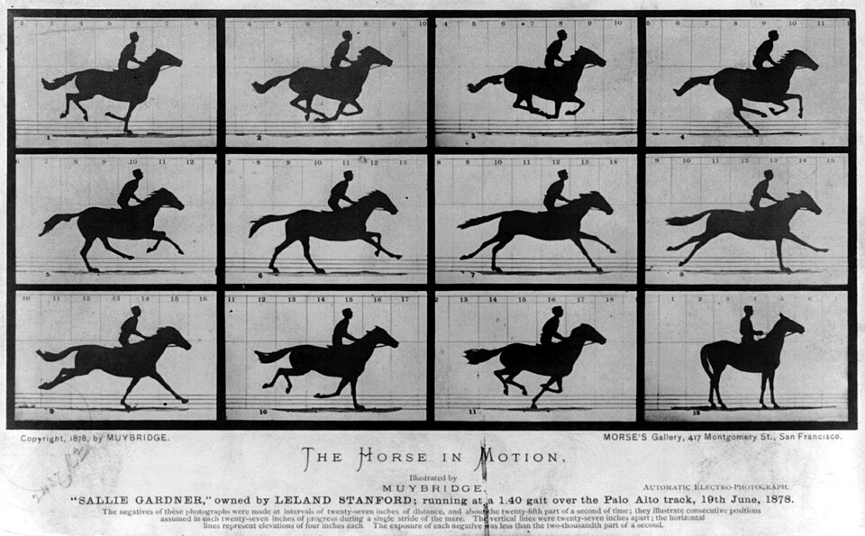
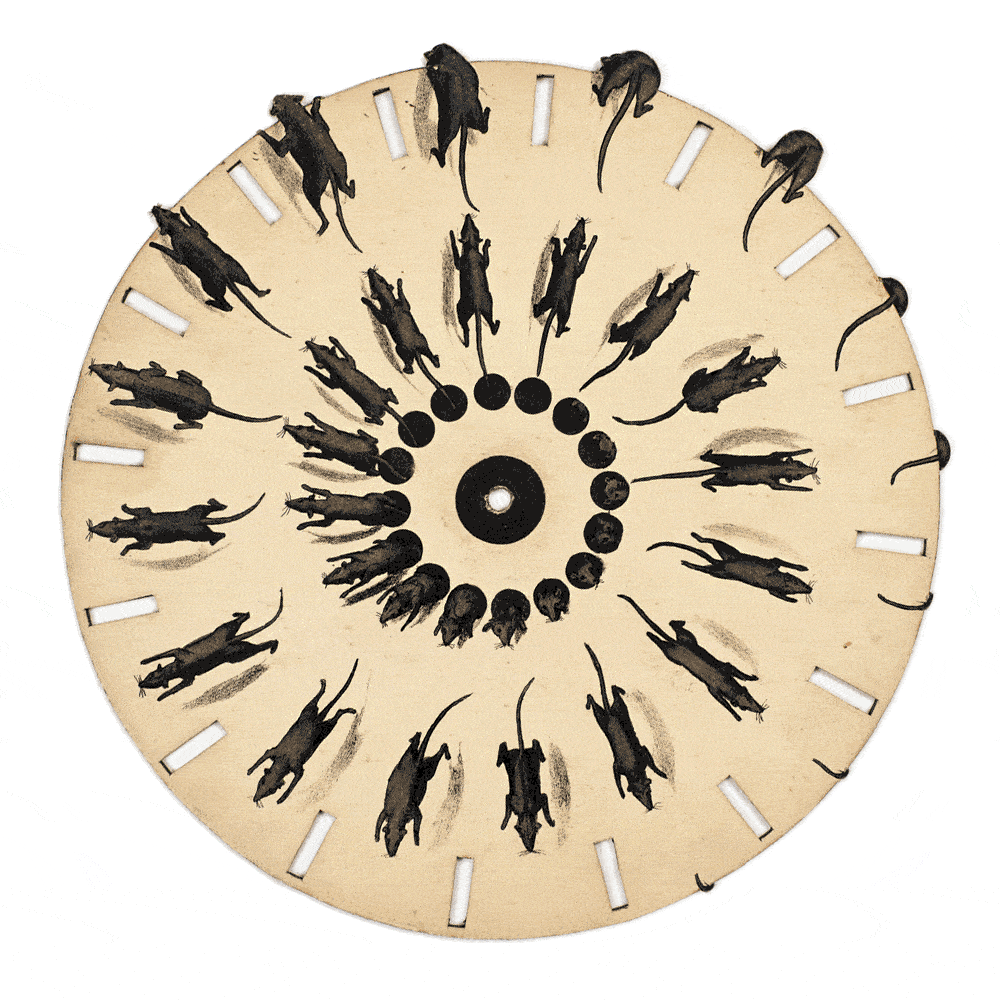

# Урок 41 — Timeline и ключевые кадры: оживляем сцену ⚔️✨

**Модуль 6 | 2 академических часа (1,5 часа)**

> 🔁 В начале урока — [повторение урока 40](повторение.md) (викторина по пайплайну персонажа, 5–7 мин)

> 🎬 **Новый модуль — АНИМАЦИЯ!** До сих пор наши модели стояли как статуи. Сегодня они **задвигаются во времени**. Мы зажжём **лазерный меч** (помнишь его из Модуля 1?): клинок выезжает и разгорается. И поймём самое главное в анимации — что такое **ключевой кадр** и как Blender достраивает движение между ними.

---

## Цель урока

- Понять, **что такое анимация** на самом деле (последовательность кадров) и почему глаз видит движение
- Понять **ключевой кадр (keyframe)** и **интерполяцию** — как Blender сам считает кадры между ключами
- Освоить **Timeline** (шкалу времени): кадры, FPS, проигрывание, диапазон
- Научиться ставить ключи клавишей **`I`** на Location / Rotation / Scale и на **значение материала** (Emission)
- Собрать первую анимацию: **выезжающий и разгорающийся лазерный меч**

---

## Часть 1 — Теория: что такое анимация (20 минут)

### 1.1. Анимация = много картинок подряд

Мультики, кино, игры — это **обман зрения**. На экране быстро сменяются неподвижные картинки — **кадры (frames)**. Каждый кадр чуть-чуть отличается от предыдущего, и мозг «склеивает» их в плавное движение.

Так было задолго до компьютеров. Посмотри на знаменитую фотосерию **«Лошадь в движении»** (Эдвард Майбридж, 1878 год) — он поставил вдоль дорожки 12 фотоаппаратов и снял один скачок лошади по кадрам:



*«The Horse in Motion», Эдвард Майбридж, 1878. [Wikimedia Commons, Public Domain](https://commons.wikimedia.org/wiki/File:The_Horse_in_Motion.jpg). Каждая клетка — отдельный **кадр**: лошадь в чуть другой позе.*

А теперь те же кадры, показанные быстро **по очереди** — и лошадь «поскакала»:


*Те же кадры в движении. [Wikimedia Commons, Public Domain](https://commons.wikimedia.org/wiki/File:Muybridge_race_horse_animated.gif). Картинки не двигаются — они **сменяются**. Движется только твой взгляд.*

> 🧠 **Почему это работает — «инерция зрения» (persistence of vision):** глаз и мозг удерживают увиденную картинку ещё ~1/16 секунды после того, как она исчезла. Если новый кадр появляется раньше, чем «погас» прежний, мозг не замечает разрыва и видит **непрерывное движение**. Именно поэтому достаточно ~24 кадров в секунду, чтобы кино выглядело плавным.

Этот же фокус крутили в оптической игрушке **фенакистископ** (1833): диск с кадрами раскручивали перед зеркалом и смотрели сквозь прорези — рисунки оживали.



*Фенакистископ «Бегущие крысы» (Т. М. Бэйнс, 1833). [Wikimedia Commons, Public Domain](https://commons.wikimedia.org/wiki/File:Animated_phenakistiscope_disc_-_Running_rats_Fantascope_by_Thomas_Mann_Baynes_1833.gif). Тот же принцип, что у Blender, — только кадры нарисованы по кругу.*

### 1.2. FPS — кадры в секунду

**FPS (frames per second)** — сколько кадров показывают за одну секунду.

| FPS | Где | Ощущение |
|-----|-----|----------|
| 12 | старые мультики, рисовка «на двойках» | «дёрганое», но живое |
| **24** | кино, **стандарт Blender** | плавно, «киношно» |
| 30 | ТВ, ролики | чуть глаже |
| 60 | игры | очень плавно |

> 💡 **Фишка:** в Blender по умолчанию **24 FPS**. Значит, кадр №24 — это 1 секунда, кадр №48 — 2 секунды. Хочешь ролик на 5 секунд при 24 FPS → нужно 5 × 24 = **120 кадров**. Это пригодится, когда будем считать длину анимации.

### 1.3. Ключевой кадр (keyframe) — ГЛАВНОЕ понятие 🔑

Представь: чтобы сдвинуть меч с кадра 1 по кадр 50, тебе НЕ нужно вручную ставить его на каждый из 50 кадров. Достаточно отметить только **крайние положения**:

- На **кадре 1**: меч сложен (длина = 0).
- На **кадре 50**: меч выехал (длина = полная).

Эти две отметки «здесь объект был ВОТ таким» и есть **ключевые кадры**. А все кадры между ними (2, 3, … 49) Blender **досчитает сам**. Это называется **интерполяция** (in-between, «промежуточные»).

> 🎬 **Откуда слово:** в классической рисованной анимации главный художник рисовал только важные позы — **ключевые кадры (keys)**. А помощники-«фазовщики» дорисовывали промежуточные. Blender — твой неутомимый помощник: ставишь ключи, а «промежутки» он рисует мгновенно.

**Что хранит ключевой кадр?** Не картинку! Он хранит **значение одного свойства в момент времени**:
- «на кадре 1 позиция по X = 0»
- «на кадре 50 позиция по X = 3»

Свойством может быть что угодно с числом: положение, поворот, масштаб, **яркость материала**, прозрачность, сила лампы… Почти у любого поля в Blender можно поставить ключ.

### 1.4. Как Blender считает «промежутки» — под капотом ⚙️

Соединив два ключа, Blender строит **кривую** значения во времени — её называют **F-Curve (F-кривая)**. По горизонтали — кадры (время), по вертикали — значение свойства.

```
значение
  3 ┤                            ●  ← ключ на кадре 50 (X=3)
    │                      ╭─────
    │                ╭─────
  1 ┤          ╭─────
    │     ╭────
  0 ┤●────              ← ключ на кадре 1 (X=0)
    └┬────────────────────────┬──→ кадры
     1                        50
```

Чтобы узнать положение меча, например, на кадре 25, Blender просто смотрит **высоту кривой** в точке «кадр 25» → получает X ≈ 1,5. И так для каждого кадра. **Кривую целиком мы будем редактировать на следующем уроке (Graph Editor)** — а пока достаточно знать: ключи = точки, между ними — линия, по которой Blender ведёт объект.

> 🔬 **Проверь сам (мини-демо, 2 минуты):** поставь куб. На кадре 1 нажми `I → Location`. Перейди на кадр 50, сдвинь куб вбок (`G X 3 Enter`), снова `I → Location`. Теперь тяни «голову» проигрывателя (синюю полоску) по Timeline туда-сюда — куб **сам едет** по всем промежуточным кадрам. Ты поставил 2 ключа, а движение получилось на 50 кадров!

### 1.5. Timeline — пульт управления временем

**Timeline (Шкала времени)** — широкая панель внизу окна Blender. Это твой «пульт»:

```
 ⏮  ◀  ▶  ⏭        ← кнопки: в начало / играть назад / играть / в конец
[ 1 |·····●··········| 250 ]   ← шкала кадров; ● = текущий кадр (Playhead)
 Start 1   Frame 25   End 250
```

- **Playhead** (синяя вертикальная полоса) — какой кадр ты сейчас видишь. Тащи её мышью или меняй число «Current Frame».
- **Start / End** — диапазон анимации (с какого по какой кадр играть).
- **▶ (Play)** или **`Пробел`** — запустить/остановить проигрывание прямо во вьюпорте.
- На шкале маленькими **ромбиками ◆** показываются твои ключевые кадры выделенного объекта.

> 📷 **[Вставь сюда картинку: панель Timeline с подписями (Playhead, Start/End, ромбики-ключи) →](изображения.md#timeline)**

---

## Часть 2 — Подготовка: лазерный меч (10 минут)

Будем анимировать **лазерный меч**: рукоять стоит на месте, а **клинок выезжает вверх и разгорается** (как в фантастике). Сделаем простую модель — нам важна анимация, а не детали.

**Шаг 1. Рукоять.**
1. Новый файл (`File → New → General`), удали стартовый куб (`X`).
2. `Shift+A → Mesh → Cylinder`. В левом нижнем углу разверни панель **«Add Cylinder»** → поставь **Radius = 0.1**, **Depth = 0.4**. Это рукоять.
   ✅ *Должно получиться:* короткий толстый цилиндр-рукоять стоит в центре.

**Шаг 2. Клинок.**
1. `Shift+A → Mesh → Cylinder` ещё раз → **Radius = 0.04**, **Depth = 1.2** (тонкий длинный).
2. Подними его над рукоятью: `G Z 0.8 Enter`.
3. Назови объекты понятно (двойной клик в Outliner справа): рукоять → `Рукоять`, клинок → `Клинок`.
   ✅ *Должно получиться:* тонкий длинный клинок торчит вверх из рукояти.

**Шаг 3. Материал свечения клинка** (повтор Модуля 1 — Emission).
1. Выдели **Клинок**. Справа: **Properties → вкладка Material** (иконка шарика 🔴) → **New**.
2. Найди вход **Emission Color** → задай ярко-голубой (например, R 0.1 · G 0.6 · B 1.0).
3. Чуть ниже — **Emission Strength**. Пока поставь **0** (клинок «потушён» — разгорится в анимации).
   ✅ *Должно получиться:* клинок пока не светится (Strength = 0). Переключи вид на **Material Preview** (шарик в правом верхнем углу вьюпорта), чтобы видеть свечение позже.

> 💡 **Фишка — почему Emission:** Emission («излучение») заставляет материал **светиться сам**, без ламп. Strength — сила свечения. Анимируя Strength от 0 до большого числа, мы «зажжём» клинок.

---

## Часть 3 — Анимация выезда клинка (Scale) (20 минут)

Сделаем, чтобы клинок **вырастал** из рукояти: на кадре 1 он короткий (спрятан), к кадру 20 — полной длины.

> 💡 Чтобы клинок рос **вверх из рукояти**, а не в обе стороны, нужно опустить его точку опоры (Origin) к низу. Быстрый способ: выдели Клинок → `Object → Set Origin → Origin to 3D Cursor` (курсор по умолчанию в центре сцены, у рукояти). Теперь масштаб по Z пойдёт вверх.

**Шаг 1. Встань на первый кадр.**
1. В Timeline впиши **Current Frame = 1** (или нажми ⏮).
   ✅ *Должно получиться:* Playhead в самом начале шкалы.

**Шаг 2. Спрячь клинок и поставь ключ.**
1. Выдели **Клинок**. Сожми по высоте почти в ноль: `S Z 0.01 Enter` (клинок «втянулся» в рукоять).
2. Наведи мышь на вьюпорт и нажми **`I`** → в меню выбери **Scale**.
   ✅ *Должно получиться:* на кадре 1 появился **жёлтый ромбик** в Timeline. Клинок спрятан.

> 💡 **Фишка — что значит `I`:** `I` = **Insert Keyframe** («вставить ключ»). Появляется меню — что именно «запомнить»: Location (позиция), Rotation (поворот), Scale (масштаб) или всё сразу (LocRotScale). Мы меняли масштаб → выбираем **Scale**.

**Шаг 3. Встань на кадр 20 и «выдвини» клинок.**
1. Current Frame = **20**.
2. Верни клинку полную высоту: `S Z 1 Enter` (или впиши Scale Z = 1 в панели `N → Item`).
3. Снова **`I` → Scale**.
   ✅ *Должно получиться:* второй ромбик на кадре 20. Клинок полной длины.

**Шаг 4. Проверь движение.**
1. Поставь **End = 60** в Timeline (чтобы было видно паузу после выезда).
2. Нажми **`Пробел`** (Play). Клинок **выезжает** с кадра 1 по 20 и дальше стоит.
   ✅ *Должно получиться:* анимация роста клинка проигрывается по кругу. 🎉

> 🎯 **ЛАЙФХАК — показать здесь!** Чтобы не жать `I` после каждого изменения, есть **Auto Keying** — Blender ставит ключи автоматически, как только ты двигаешь объект. Разбор и как не насорить лишними ключами — в [лайфхак.md](лайфхак.md).

---

## Часть 4 — Анимация свечения (значение материала) (15 минут)

Теперь **зажжём** клинок: пока он выезжает (1→20), Emission Strength растёт с 0 до 5. Это докажет, что ключи ставятся **не только на движение**, а на любое числовое свойство.

**Шаг 1. Открой свойство для ключа.**
1. Выдели **Клинок** → **Properties → вкладка Material** → найди поле **Emission Strength**.

**Шаг 2. Ключ «потушено» на кадре 1.**
1. Current Frame = **1**.
2. Убедись, что **Strength = 0**.
3. **Наведи курсор прямо на поле Emission Strength** и нажми **`I`**.
   ✅ *Должно получиться:* поле Strength стало **жёлтым** (= на этом кадре стоит ключ). Это и есть ключ на свойстве материала!

> 💡 **Фишка — цвет поля = есть ли ключ:** в Blender поле с ключом на текущем кадре **жёлтое**, поле с анимацией, но без ключа именно здесь — **зелёное**, обычное поле — **серое/тёмное**. По цвету сразу видно, анимировано ли свойство.

**Шаг 3. Ключ «разгорелось» на кадре 20.**
1. Current Frame = **20**.
2. Поставь **Emission Strength = 5**.
3. Курсор на поле → **`I`**.
   ✅ *Должно получиться:* второй жёлтый ключ. Поле снова жёлтое.

**Шаг 4. Смотрим результат.**
1. Переключи вьюпорт в **Material Preview** или **Rendered** (шарики справа вверху).
2. **`Пробел`** (Play).
   ✅ *Должно получиться:* клинок **одновременно выезжает И разгорается** голубым с 1 по 20 кадр. Настоящий «розжиг» меча! ⚔️✨

> 💡 **Фишка — повтор Модуля 4:** хочешь, чтобы свечение красиво «фонило» в темноте? Включи в World тёмный фон и включи **Bloom** (EEVEE: Properties → Render → Bloom) — вокруг клинка появится ореол.

> 📷 **[Вставь сюда картинку: кадр-результат — клинок наполовину выехал и светится →](изображения.md#result)**

---

## Часть 5 — Чистим и сохраняем (10 минут)

- **Удалить лишний ключ:** если поставил ключ не там — встань на этот кадр, наведи на поле/объект, `Alt+I` (Delete Keyframe). Или ПКМ по ромбику в Timeline → Delete.
- **Подвинуть ключ во времени:** в Timeline выдели ромбик (ЛКМ) → `G` → тащи вбок → ЛКМ. Так можно сделать выезд быстрее/медленнее.
- **Сохрани файл** (`Ctrl+S`) — на следующих уроках будем редактировать кривые этого движения.

> 💡 **Фишка — два главных правила анимации новичка:**
> 1. **Сначала встань на нужный кадр, потом меняй объект, потом ставь ключ.** Перепутал порядок — ключ ляжет не на тот кадр.
> 2. **Меняешь свойство, но ключ не поставил → изменение «потеряется».** Без ключа Blender вернёт объект к ближайшему ключу при проигрывании.

---

## Что мы узнали

- **Анимация** — это смена кадров; глаз «склеивает» их в движение (инерция зрения, ~24 FPS).
- **Ключевой кадр (keyframe)** хранит **значение свойства в момент времени**; ставится клавишей **`I`**.
- **Интерполяция** — Blender сам считает все кадры **между** ключами (по F-кривой).
- **Timeline** — пульт времени: кадры, FPS, Play (`Пробел`), Start/End, ромбики-ключи.
- Ключи ставятся на **движение** (Loc/Rot/Scale) И на **любое числовое свойство** (Emission Strength, прозрачность…).
- **Цвет поля** показывает: жёлтое = ключ здесь, зелёное = анимировано, серое = нет анимации.

**Дальше (урок 42):** откроем **Graph Editor** и научимся редактировать саму кривую движения — делать разгон и торможение (Easing), чтобы движение стало живым, а не «механическим».

---

> 📖 **Трюки анимации** (прыжок по ключам `↑`/`↓`, Auto Keying, цвет полей и др.) собраны в справочнике [справочники/трюки.md](../../справочники/трюки.md). Загляни — там же удобства интерфейса на весь курс.

## Лайфхак урока

👉 [лайфхак.md](лайфхак.md) — **Auto Keying** (авто-ключи): ставим ключи без `I`, и как не насорить лишними (показывается в Части 3)

## Практика

👉 [практика.md](практика.md) — самостоятельная работа: **анимируем светофор** (другой объект, те же навыки: Scale/позиция/свечение по ключам)

---

## Навигация

⬅️ [Урок 40 (Модуль 5)](../../модуль-05-скульптинг-персонаж/урок-40/урок.md)  ·  🔁 [Повторение](повторение.md)  ·  ➡️ [Урок 42 — Graph Editor](../урок-42/урок.md)
