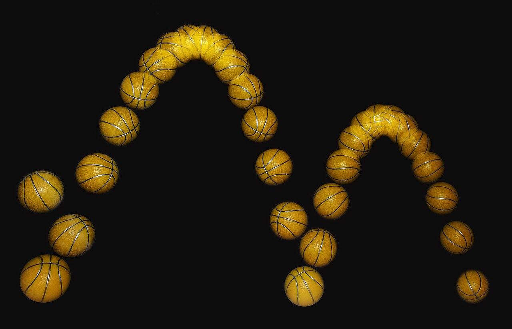
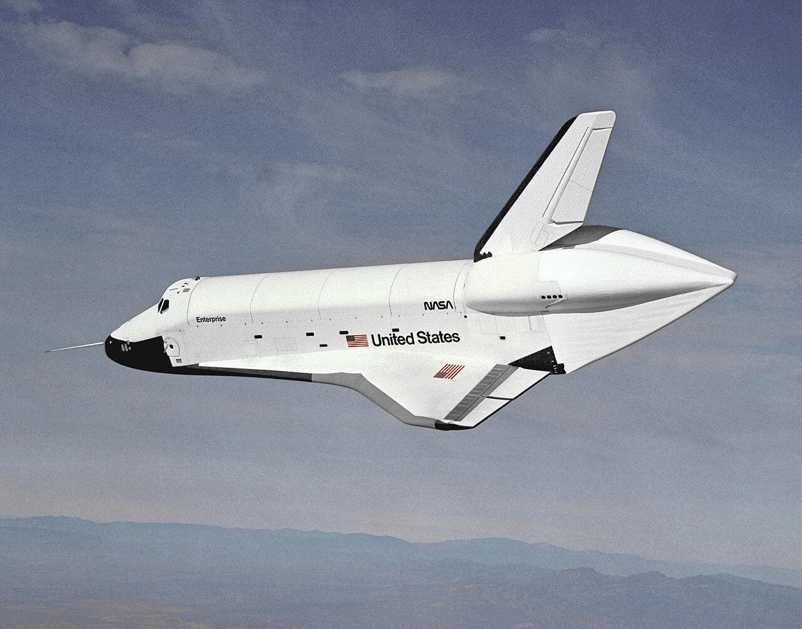

# Урок 42 — Graph Editor: делаем движение живым 🚀📈

**Модуль 6 | 2 академических часа (1,5 часа)**

> 🔁 В начале урока — [повторение урока 41](повторение.md) (викторина по ключевым кадрам, 5–7 мин)

> 🎬 На прошлом уроке мы поставили ключи — и объект «поехал». Но движение было **механическим**: тронулся резко, ехал ровно, встал резко. В жизни так не бывает: всё **разгоняется и тормозит**. Сегодня откроем **Graph Editor** — редактор кривых движения — и научимся делать пролёт корабля плавным и живым, как в кино.

---

## Цель урока

- Понять **F-кривую** — как Blender хранит движение в виде графика «значение во времени»
- Разобрать **типы интерполяции**: Constant (ступеньки), Linear (механически), Bézier (плавно)
- Понять **Easing** («slow in / slow out») — почему живое движение **разгоняется и замедляется**
- Освоить **Graph Editor**: каналы, кривые, ручки (handles), пресеты easing
- Сделать проект: **плавный пролёт корабля** с разгоном и мягкой остановкой
- Бонус: **F-модификатор Noise** — авто-тряска/мерцание (продолжение мерцания клинка из урока 41)

---

## Часть 1 — Теория: F-кривые и Easing (20 минут)

### 1.1. Что такое F-кривая (повтор урока 41, глубже)

Когда ты ставишь ключи, Blender рисует **F-кривую (F-Curve)** — график:
- по горизонтали **→** время (кадры),
- по вертикали **↑** значение свойства (например, позиция по X).

Ключи — это **точки** на графике. А **линия между ними** — это и есть «как» свойство меняется от кадра к кадру. Поменяешь форму линии — поменяется характер движения. Именно форму линии мы сегодня и будем лепить.

```
позиция X
   8 ┤                       ╭───●   ← ключ (кадр 60, X=8)
     │                  ╭────╯
     │              ╭──╯
     │          ╭──╯
  −8 ┤●────────╯              ← ключ (кадр 1, X=−8)
     └┬──────────────────────┬──→ кадры
      1                      60
```

### 1.2. Интерполяция — ТРИ характера движения ⚙️

**Интерполяция** — правило, по которому Blender соединяет две точки. От него зависит «характер» движения:

| Тип | Форма линии | Как двигается | Где уместно |
|-----|-------------|---------------|-------------|
| **Constant** (ступенчатая) | лесенка ▄▀ | стоит — прыжок — стоит | смена кадров, цифры на табло, стоп-моушен |
| **Linear** (прямая) | прямая `╱` | строго ровная скорость | механизмы: конвейер, вентилятор, секундная стрелка |
| **Bézier** (плавная) | S-образная `∿` | **разгон → быстро → торможение** | почти всё живое: корабль, мяч, персонаж |

> 🧠 **Под капотом:** при **Linear** Blender каждый кадр прибавляет **одинаковый** шаг — скорость постоянна, поэтому движение «роботичное». При **Bézier** линия в начале и конце **пологая** (шаг маленький = медленно), а в середине **крутая** (шаг большой = быстро). Крутизна линии = скорость! Пологий участок = медленно, крутой = быстро. **Bézier стоит по умолчанию** — потому и движение из урока 41 уже было слегка плавным.

### 1.3. Easing — «медленно в начале, медленно в конце» 🎾

Главный закон живого движения (один из «12 принципов анимации» студии Disney) — **Slow In, Slow Out**: предмет **разгоняется** из покоя и **тормозит** перед остановкой. Мгновенно набрать полную скорость не может ничто — у всего есть масса и инерция.

Посмотри на **стробоскопическое фото** прыгающего мяча (вспышки через равные доли секунды):



*Прыгающий мяч, снятый стробоскопом. [Wikimedia Commons, CC BY-SA](https://commons.wikimedia.org/wiki/File:Bouncing_ball_strobe_edit.jpg). Внизу шары **далеко** друг от друга (мяч летит **быстро**), а у вершины — **близко** (мяч **замедляется**, замирает на миг и падает обратно). Равные промежутки времени, но разное расстояние = **меняется скорость**. Это и есть Easing — то, что мы зададим кривой.*

> 🔬 **Проверь сам (30 секунд):** разведи руку и медленно поднеси палец к носу. Заметь: ты **начал медленно**, разогнался и **притормозил** у самого носа, чтобы не ткнуть. Ты только что сделал «ease in / ease out» вживую. Любое естественное движение такое.

В Graph Editor «медленно» = **пологая линия у ключа**, «быстро» = **крутая линия**. Управляем этим двумя способами:
- **Ручками (handles)** у точки Bézier — наклоняем их (пологая ручка = медленно в этой точке).
- **Пресетами easing** — готовые формулы (Sinusoidal — мягко; Bounce — отскок; Elastic — пружинка).

### 1.4. Зачем нам это на корабле

Реальный космический корабль не «телепортируется» — он **разгоняется двигателями** и **гасит скорость** перед манёвром. Вот настоящий шаттл в плавном планирующем полёте — наша цель по ощущению:



*Космический шаттл «Энтерпрайз» планирует во время лётных испытаний. [NASA, Public Domain](https://commons.wikimedia.org/wiki/File:Enterprise_free_flight.jpg). Движение тяжёлого корабля — плавное, с инерцией. Этого «веса» мы и добьёмся через Easing вместо ровной линейной скорости.*

---

## Часть 2 — Открываем Graph Editor (10 минут)

**Шаг 1. Включи раскладку Animation.**
1. В самом верху окна Blender — вкладки раскладок (Layout, Modeling, … **Animation**). Нажми **Animation**.
   ✅ *Должно получиться:* снизу появился **Dope Sheet** (список ключей), слева — вид камеры. Это «анимационный» экран.

**Шаг 2. Переключи нижний редактор в Graph Editor.**
1. В левом верхнем углу нижнего редактора — иконка типа редактора (выпадающий список). Выбери **Graph Editor** (иконка кривой 📈).
   ✅ *Должно получиться:* внизу — поле с **кривыми** и список **каналов** слева.

> ⚡ **Трюк — главные клавиши Graph Editor** (наведи мышь на поле кривых):
> | Клавиша | Действие |
> |---------|----------|
> | `Home` | показать все кривые целиком (вписать в экран) |
> | `T` | сменить **тип интерполяции** выделенных ключей |
> | `V` | сменить **тип ручки** (handle) |
> | `Ctrl+E` | сменить **направление easing** (In / Out / In-Out) |
> | `G` / `S` | двигать / масштабировать ключи |
>
> Больше приёмов — в справочнике [справочники/трюки.md](../../справочники/трюки.md).

| 🧩 Элемент Graph Editor | Что это |
|-------------------------|---------|
| **Каналы** (слева) | по одному на каждое анимированное свойство: X Location, Y Location, Z Rotation… Клик — выделить кривую |
| **Кривая** | та самая F-кривая свойства |
| **Точка** | ключевой кадр |
| **Ручки (handles)** | два «усика» у точки Bézier — задают наклон (скорость) |

> 📷 **[Вставь сюда картинку: Graph Editor с подписанными каналами/кривой/ручками →](изображения.md#graph-ui)**

---

## Часть 3 — Проект: ставим пролёт корабля (15 минут)

**Шаг 1. Корабль.**
1. Открой **свой космокорабль из Модуля 1** (`File → Append`), либо быстро собери временный: `Shift+A → Mesh → Cone`, поверни носом вбок (`R Y 90`) и чуть сплющи — «челнок».
2. Назови объект `Корабль` (двойной клик в Outliner).
   ✅ *Должно получиться:* корабль стоит в сцене, носом по направлению полёта (вдоль +X).

**Шаг 2. Старт — кадр 1 (корабль слева за кадром).**
1. Current Frame = **1**.
2. Отведи корабль далеко влево: `G X -8 Enter`.
3. Наведи мышь на вьюпорт → **`I` → Location**.
   ✅ *Должно получиться:* жёлтый ромбик на кадре 1; корабль слева.

**Шаг 3. Финиш — кадр 60 (корабль справа).**
1. Current Frame = **60**.
2. Перегони корабль вправо: `G X 16 Enter` (из −8 в +8).
3. **`I` → Location**.
   ✅ *Должно получиться:* второй ромбик на кадре 60; корабль справа.

**Шаг 4. Проверь.**
1. Поставь **End = 60**, нажми **`Пробел`**.
   ✅ *Должно получиться:* корабль пролетает слева направо. Уже слегка плавно (Bézier по умолчанию) — но сделаем это осознанно и сильнее.

---

## Часть 4 — Оживляем движение: интерполяция и Easing (20 минут)

**Шаг 1. Найди кривую полёта.**
1. Внизу в Graph Editor нажми `Home` (вписать). В списке каналов слева кликни **X Location** — подсветится кривая, по которой летит корабль (она поднимается с −8 до 8).
   ✅ *Должно получиться:* видна одна наклонная кривая с двумя точками.

**Шаг 2. 🔬 Почувствуй разницу — Linear vs Bézier.**
1. Выдели обе точки: наведи на поле кривых → `A`.
2. Нажми **`T` → Linear**. Кривая стала **прямой**. Нажми `Пробел`.
   ✅ *Должно получиться:* корабль летит **роботично** — резко стартует, ровно едет, резко встаёт. Так двигается лифт, не корабль.
3. Снова `A` → **`T` → Bézier**. Кривая снова **S-образная**. `Пробел`.
   ✅ *Должно получиться:* корабль **плавно** разгоняется и тормозит. Уже лучше!

> 💡 **Фишка — крутизна = скорость:** посмотри на S-кривую: у концов она **пологая** (медленно — разгон и торможение), в середине **крутая** (быстро). Глядя на форму кривой, ты «читаешь» скорость, не запуская анимацию.

**Шаг 3. Усиливаем Easing пресетом.**
1. Выдели обе точки (`A`) → **`T` → Sinusoidal** (мягкая плавная формула).
2. Затем **`Ctrl+E` → Ease In and Out**.
   ✅ *Должно получиться:* идеально мягкий разгон из покоя и мягкая остановка — «весомый» корабль. 🚀

> 🎯 **ЛАЙФХАК — показать здесь!** **Ease In / Ease Out** — секрет реалистичности любой анимации (и почему Linear почти всегда выглядит дёшево). Полный разбор с примерами — в [лайфхак.md](лайфхак.md).

**Шаг 4. Тонкая ручная настройка (handles).**
Хочешь, чтобы корабль **дольше тормозил** в конце (важный «киношный» приём)?
1. Выдели **последнюю** точку (ЛКМ по ней в Graph Editor) — у неё появятся две **ручки**.
2. Возьми левую ручку (`G`) и сделай её **более горизонтальной** (опусти/выровняй).
   ✅ *Должно получиться:* конец кривой стал ещё более пологим — корабль **дольше и мягче** подползает к остановке.

> 💡 **Фишка — типы ручек (`V`):** **Auto Clamped** (по умолчанию) — Blender сам держит плавность; **Vector** — ручка смотрит прямо в соседа (как Linear на этом участке); **Aligned** — обе ручки на одной линии, наклоняешь вместе; **Free** — независимо. Для большинства задач хватает Auto Clamped.

**Шаг 5. (По желанию) Крен на повороте.**
Чтобы корабль «жил», добавь лёгкий наклон: на кадре 30 поверни его `R Y 15` и поставь ключ Rotation (`I → Rotation`), на кадрах 1 и 60 — Rotation 0 с ключами. Корабль будет крениться в середине пролёта.

---

## Часть 5 — Бонус: F-модификатор Noise и зацикливание (15 минут)

### 5.1 Noise — авто-дрожь двигателя (продолжение мерцания из урока 41!)

Помнишь, на уроке 41 мы делали мерцание клинка вручную мелкими ключами? Есть способ заставить значение **дрожать само** — **F-модификатор Noise**. Добавим кораблю мелкую вибрацию, будто работают двигатели.

1. В Graph Editor выдели канал **Z Location** (вверх-вниз). *(Если его нет — на кадре 1 чуть подвинь корабль по Z и поставь ключ, чтобы канал появился.)*
2. Открой панель `N` (справа в Graph Editor) → вкладка **Modifiers** → **Add Modifier → Noise**.
3. Настрой: **Strength = 0.05** (амплитуда дрожи), **Scale = 2** (частота).
   ✅ *Должно получиться:* корабль мелко **подрагивает** во время полёта — живая вибрация двигателей, без единого ручного ключа.

> 💡 **Фишка — Noise = «процедурная тряска»:** этот модификатор накладывает на кривую случайные колебания. Им делают: дрожь камеры при взрыве, мерцание лампы/огня, тряску мотора, нервный тик. Тот самый «шум на F-кривой», который я обещал на уроке 41 — вот он. Малый Strength — лёгкая дрожь, большой — землетрясение.

### 5.2 Make Cyclic — бесконечный цикл

Хочешь, чтобы движение **повторялось вечно** (понадобится для цикла ходьбы на уроке 49)?
1. Выдели кривую → `N` → **Modifiers → Add Modifier → Cycles** (или меню **Channel → Extrapolation Mode → Make Cyclic**).
   ✅ *Должно получиться:* анимация зацикливается — корабль летит «по кругу» снова и снова за пределами 1–60.

---

## Часть 6 — Итог и сохранение (10 минут)

- Сравни: запусти с **Linear** и с **Sinusoidal Ease In-Out** — почувствуй, насколько живее стало.
- Прибери лишние ключи (`Alt+I` где не нужно).
- **Сохрани** (`Ctrl+S`).

> 💡 **Фишка — золотое правило:** **Linear — для машин, Bézier/Easing — для всего живого.** Если анимация выглядит «дёшево и роботично» — первым делом проверь кривые в Graph Editor: скорее всего, там Linear или резкие ручки.

---

## Что мы узнали

- **F-кривая** — график «значение во времени»; её **форма** = характер движения.
- **Интерполяция:** Constant (ступеньки), Linear (ровно/механически), **Bézier** (плавно).
- **Крутизна кривой = скорость:** пологий участок — медленно, крутой — быстро.
- **Easing (Slow In/Out)** — живое движение разгоняется и тормозит; задаётся **ручками** или **пресетами** (`T` + `Ctrl+E`).
- **Graph Editor:** каналы, кривые, точки, ручки; `Home`, `T`, `V`, `Ctrl+E`.
- **F-модификатор Noise** — авто-дрожь/мерцание; **Cycles** — зацикливание.

**Дальше (урок 43):** **Constraints (ограничители)** — заставим один объект автоматически следить за другим и двигаться по заданному пути. Соберём планеты на орбитах! 🪐

---

## Лайфхак урока

👉 [лайфхак.md](лайфхак.md) — **Ease In / Ease Out** для реализма: почему плавный разгон-торможение делает анимацию «дорогой» (показывается в Части 4)

## Практика

👉 [практика.md](практика.md) — самостоятельная работа: **прыгающий мяч** (классика анимации: easing + отскок через Graph Editor) — другой объект, те же навыки

---

## Навигация

⬅️ [Урок 41 — Timeline и ключевые кадры](../урок-41/урок.md)  ·  🔁 [Повторение](повторение.md)  ·  ➡️ [Урок 43 — Constraints (орбиты планет)](../урок-43/урок.md)
