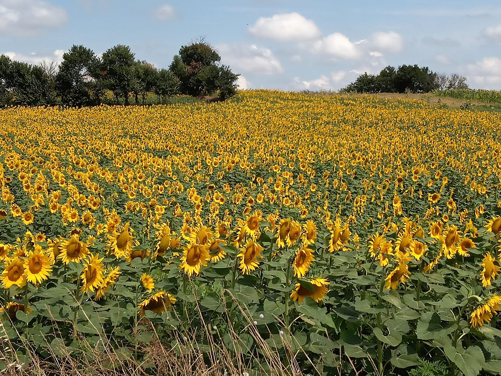
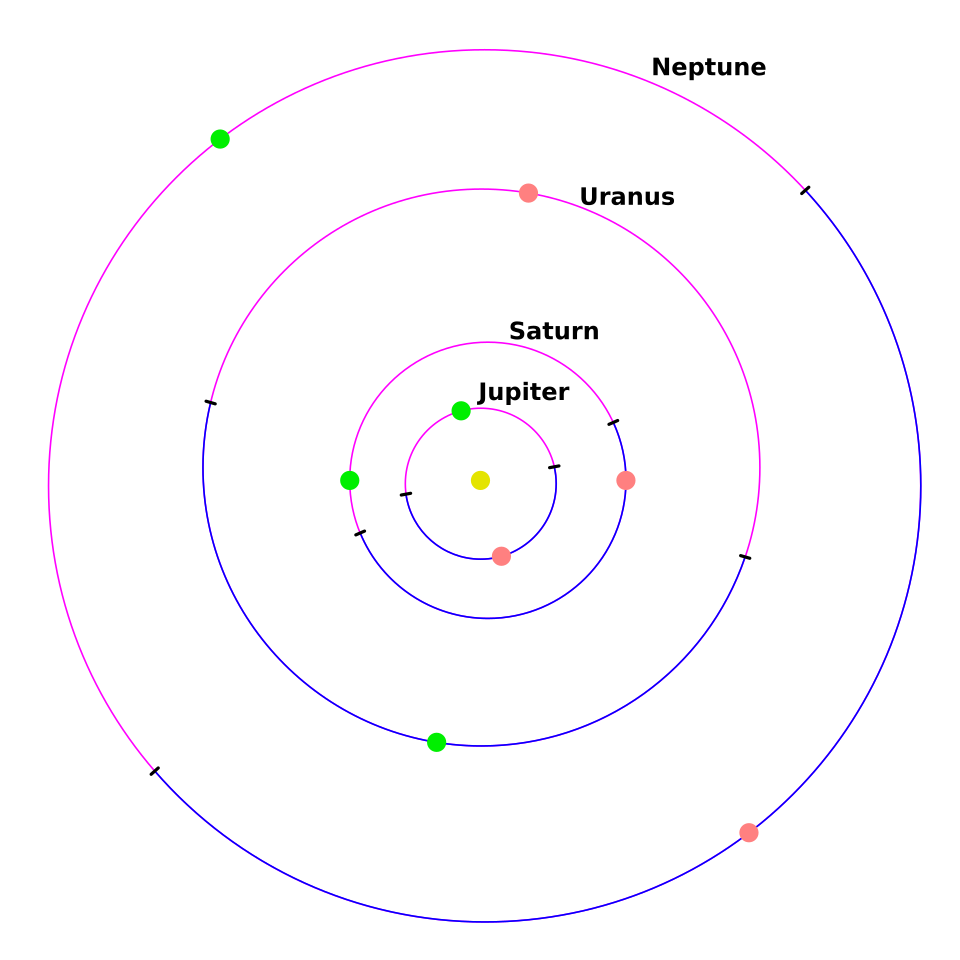

# Урок 43 — Constraints: объекты следят и движутся по пути 🪐

**Модуль 6 | 2 академических часа (1,5 часа)**

> 🔁 В начале урока — [повторение урока 42](повторение.md) (викторина по Graph Editor и Easing, 5–7 мин)

> 🎬 До сих пор мы двигали объекты **вручную** ключами. Сегодня познакомимся с **ограничителями (Constraints)** — они заставляют объект двигаться **автоматически**: всегда смотреть на цель или ехать по заданному пути. Соберём **Солнечную систему**: планеты сами побегут по орбитам, а камера будет держать их в кадре. И всё это — почти без ключей!

---

## Цель урока

- Понять, что такое **Constraint (ограничитель)** и как он работает «поверх» обычного движения
- Освоить **Track To** — объект всегда смотрит на цель (камера, спутник, «глаз»)
- Освоить **Follow Path** — объект едет по кривой-пути (орбита, рельсы, дорога)
- Узнать про **Copy Rotation / Copy Location** — повторить движение другого объекта
- Собрать проект: **Солнечная система** — планеты на орбитах + камера, что следит за сценой

---

## Часть 1 — Теория: что такое Constraints (20 минут)

### 1.1. Ограничитель — «умное правило» поверх объекта ⚙️

**Constraint (ограничитель)** — это правило, которое Blender применяет к объекту **автоматически, каждый кадр**, поверх его обычного положения. Ты не двигаешь объект руками — ты задаёшь правило, а Blender сам считает, где и как объект окажется.

> 🧠 **Под капотом — важно понять:** ограничитель **не меняет** собственные координаты объекта (его keyframes/позицию). Он вычисляет **финальное** положение на экране **после** них. Поэтому:
> - можно в любой момент **выключить/удалить** ограничитель — объект вернётся к своим настоящим координатам;
> - ограничители складываются в **стек** (список), считаются **сверху вниз**;
> - у каждого есть ползунок **Influence (Влияние) 0…1** — насколько сильно правило действует (0 = выключено, 1 = полностью).

**Где живут ограничители:** Properties → вкладка **Object Constraint Properties** (иконка **цепь/косточка** 🔗) → **Add Object Constraint**.

### 1.2. Track To — «всегда смотри на цель» 🎯

**Track To** разворачивает объект так, чтобы выбранная **ось всегда смотрела на цель (Target)**. Куда бы цель ни уехала — объект поворачивается за ней.

Это как **подсолнухи**, которые поворачивают головы к солнцу:

*Поле подсолнухов. [Wikimedia Commons, CC BY-SA](https://commons.wikimedia.org/wiki/File:Sunflower_field_from_Aegean.jpg). Все головы повёрнуты к солнцу — это «живой Track To». В Blender так же: камера, прожектор, спутник или «глаз» всегда нацелены на цель.*

Где пригодится: камера держит героя в кадре; прожектор светит на актёра; спутник/Луна «смотрит» на планету; глаза персонажа следят за мячиком.

### 1.3. Follow Path — «двигайся по пути» 🛤

**Follow Path** заставляет объект **ехать вдоль кривой**. Нарисовал путь — объект бежит по нему. Идеально для **орбит, рельсов, дорог, американских горок**.

Планеты Солнечной системы как раз движутся по почти круговым **орбитам-путям** вокруг Солнца:

*Орбиты внешних планет вокруг Солнца (жёлтая точка в центре). [Wikimedia Commons](https://commons.wikimedia.org/wiki/File:Outer_Planet_Orbits_02.svg). Каждая планета бежит по своему кольцу-пути. В Blender кольцо = кривая-Circle, а Follow Path катит планету по ней.*

> 🔬 **Проверь сам (1 минута):** возьми любой объект, добавь ему Follow Path с кругом-кривой как Target — и объект **прыгнет на кольцо**. Покрути ползунок **Offset** в ограничителе — объект **поедет** по кругу. Ещё не ставя ни одного ключа, ты уже управляешь движением по пути!

### 1.4. Copy Rotation / Copy Location — «повторяй за другим»

Эти ограничители заставляют объект **копировать поворот или позицию** другого объекта. Например: колёса машины копируют поворот оси; группа спутников копирует вращение «родителя». Сегодня используем их по желанию, а на уроке 44 (Drivers) разовьём идею «движение от другого объекта».

---

## Часть 2 — Track To: камера следит за сценой (15 минут)

Сделаем, чтобы **камера всегда смотрела в центр** будущей Солнечной системы — куда бы мы её ни отодвинули.

**Шаг 1. Цель — Empty.**
1. `Shift+A → Empty → Plain Axes` в центре сцены (`0,0,0`). Назови `Центр`.
   ✅ *Должно получиться:* в центре — маленькие оси-крестик (Empty). Он не рендерится, он только «цель».

> 💡 **Фишка — что такое Empty:** «пустышка» — невидимый объект-помощник без меша. Его используют как **цель, точку опоры или родителя**. На рендере его не видно — он рабочий инструмент.

**Шаг 2. Ограничитель на камеру.**
1. Выдели **камеру** (в Outliner или ЛКМ).
2. Properties → вкладка **Object Constraint Properties** (иконка 🔗) → **Add Object Constraint → Track To**.
3. В поле **Target** выбери `Центр`.
   ✅ *Должно получиться:* камера развернулась «лицом» к Empty.

**Шаг 3. Настрой оси.**
1. Камера «смотрит» своей осью **−Z**, а «верх» у неё **Y**. В ограничителе поставь: **To = −Z**, **Up = Y**.
   ✅ *Должно получиться:* камера смотрит ровно на центр, без «заваливания» горизонта.

**Шаг 4. Проверь магию.**
1. Выдели камеру, отодвинь её куда угодно (`G`), подними (`G Z`).
   ✅ *Должно получиться:* как бы ты ни двигал камеру — она **всегда смотрит на центр**. Это Track To. 🎯

> 💡 **Фишка — Up-ось спасает от «заваливания»:** если камера/объект странно крутится вокруг линии взгляда — поменяй **Up** (Y или Z). Up задаёт, где «верх», и убирает крен.

---

## Часть 3 — Follow Path: планета по орбите (20 минут)

**Шаг 1. Солнце в центре.**
1. `Shift+A → Mesh → UV Sphere` в центре, увеличь (`S 1.5`). Назови `Солнце`.
2. Перейди в раскладку **Shading** (материалы делаем нодами — как в уроке 41). В Shader Editor → **New**: на **Principled BSDF** задай **Emission Color** оранжево-жёлтый, **Emission Strength = 5**.
   ✅ *Должно получиться:* в центре светящееся Солнце (включи Material Preview / Bloom для красоты).

**Шаг 2. Орбита — кривая-кольцо.**
1. `Shift+A → Curve → Circle`. Увеличь до размера орбиты: `S 5`.
   ✅ *Должно получиться:* большое кольцо-кривая вокруг Солнца. Это путь.

**Шаг 3. Планета.**
1. `Shift+A → Mesh → UV Sphere`, уменьши (`S 0.4`). Назови `Планета-1`.
2. Обнули её позицию: `Alt+G` (Clear Location) — чтобы она «села» на путь без смещения.

**Шаг 4. Ограничитель Follow Path.**
1. Выдели **Планету-1** → Properties → 🔗 → **Add Object Constraint → Follow Path**.
2. **Target =** `Circle` (наша орбита).
3. Включи галочку **Follow Curve** (чтобы планета ориентировалась вдоль пути).
   ✅ *Должно получиться:* планета прыгнула на кольцо-орбиту.

**Шаг 5. Запускаем движение по орбите.**
1. В ограничителе Follow Path нажми кнопку **Animate Path**.
   ✅ *Должно получиться:* Blender сам проставил анимацию — нажми `Пробел`, и планета **побежала по орбите** вокруг Солнца! 🪐

> 🎯 **ЛАЙФХАК — показать здесь!** **Орбита через Follow Path** — как задать скорость орбиты, направление и стартовую точку (без ручных ключей). Разбор — в [лайфхак.md](лайфхак.md).

> 💡 **Фишка — скорость орбиты:** выдели **кривую-орбиту** → Object Data Properties (зелёная иконка кривой) → **Path Animation → Frames**. Больше Frames = **дольше** один круг = медленнее планета. Так у каждой планеты будет своя скорость.

---

## Часть 4 — Собираем Солнечную систему (20 минут)

Добавим ещё планеты — у каждой **своя орбита** (своего радиуса) и **своя скорость**.

**Шаг 1. Вторая орбита и планета.**
1. Выдели орбиту `Circle` → `Shift+D` (дубликат) → `S 1.8` (сделай кольцо крупнее) — это орбита-2.
2. `Shift+A → UV Sphere`, `S 0.5`, `Alt+G`, назови `Планета-2`.
3. Дай ей **Follow Path** → Target = новый Circle → **Follow Curve** ✓ → **Animate Path**.
   ✅ *Должно получиться:* вторая планета бежит по дальней орбите.

**Шаг 2. Разные скорости.**
1. Для каждой орбиты задай свои **Frames** (Object Data → Path Animation): ближняя — меньше (быстрее, напр. 80), дальняя — больше (медленнее, напр. 160).
   ✅ *Должно получиться:* ближние планеты обгоняют дальние — как в настоящей Солнечной системе.

**Шаг 3. (По желанию) Вращение планет вокруг оси.**
1. Выдели планету → на кадре 1 `I → Rotation`, на кадре 100 поверни `R Z 360` и `I → Rotation` (планета крутится вокруг себя). На уроке 44 сделаем это умнее через **Driver**.

> 💡 **Аддон — раздать настройки многим планетам (Copy Attributes).** Включи аддон **Copy Attributes Menu** (Preferences → Add-ons → «Copy Attributes» → ✅). Выдели несколько планет, **активной** сделай готовую (с материалом/вращением) → **`Ctrl+C` → Copy Selected** (например, материал или вращение) — настройка раздастся всем разом. *(Constraints тоже копируются — но потом **поменяй Target** у каждой планеты на её орбиту, иначе все полетят по одному кольцу.)* Каталог — [справочники/аддоны.md](../../справочники/аддоны.md).

**Шаг 4. Камера и кадр.**
1. Камера уже **следит за центром** (Track To из Части 2) — поставь её повыше и сбоку (`G`), чтобы видеть всю систему сверху-сбоку.
2. `Numpad 0` — посмотри в камеру; `Пробел` — любуйся движением.
   ✅ *Должно получиться:* планеты кружат по орбитам, камера держит всю систему в кадре. 🎉

> 📷 **[Вставь сюда картинку: сцена Солнечной системы с орбитами в Blender →](изображения.md#scene)**

---

## Часть 5 — Итог и сохранение (10 минут)

- Выключи ползунок **Influence** у любого ограничителя до 0 и обратно — увидишь, что объект послушно «забывает» и «вспоминает» правило (ограничитель не ломает исходные координаты).
- **Сохрани** (`Ctrl+S`) — эту систему мы доведём на уроке **45** (практический проект «Солнечная система в движении»).

> 💡 **Фишка — Constraints vs ключи:** ключи — это «записанное руками» движение, а ограничители — «живое правило». Часто их **совмещают**: путь задаёт Follow Path, а взгляд — Track To. Меньше ручной работы — больше автоматики.

---

## Что мы узнали

- **Constraint (ограничитель)** — авто-правило поверх объекта; не меняет его координаты, есть **стек** и **Influence**.
- **Track To** — объект всегда смотрит на **Target** (камера, прожектор, спутник); ось **To** + **Up**.
- **Follow Path** — объект едет по **кривой**; запуск кнопкой **Animate Path**, скорость — через **Path Animation → Frames**.
- **Empty** — невидимый объект-помощник (цель/родитель/опора).
- **Copy Rotation / Location** — повторять движение другого объекта.
- Ограничители экономят ключи: правило вместо ручной анимации.

**Дальше (урок 44):** **Drivers (драйверы)** — свяжем свойства формулой: например, колёса будут вращаться **сами** от движения машины, а голограмма — мерцать по выражению. 🔷

---

## Лайфхак урока

👉 [лайфхак.md](лайфхак.md) — **Орбита через Follow Path**: скорость, направление и старт орбиты без ручных ключей (показывается в Части 3)

## Практика

👉 [практика.md](практика.md) — самостоятельная работа: **камера-наблюдатель + гонка по трассе** (Track To + Follow Path на земном объекте, не космос)

---

## Навигация

⬅️ [Урок 42 — Graph Editor](../урок-42/урок.md)  ·  🔁 [Повторение](повторение.md)  ·  ➡️ [Урок 44 — Drivers (вращение от движения)](../урок-44/урок.md)
