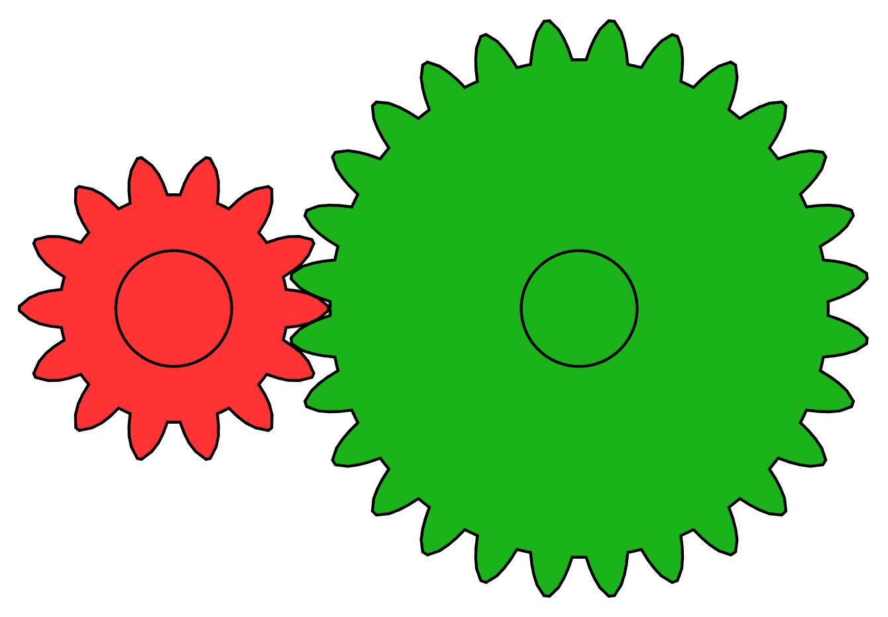

# Урок 44 — Drivers: одно свойство управляет другим ⚙️🔷

**Модуль 6 | 2 академических часа (1,5 часа)**

> 🔁 В начале урока — [повторение урока 43](повторение.md) (викторина по Constraints, 5–7 мин)

> 🎬 На прошлом уроке ограничители двигали объект «по правилу». Сегодня пойдём дальше — **Drivers (драйверы)** связывают свойства **формулой**: покрутил одну шестерню — вторая закрутилась сама, в нужную сторону и с нужной скоростью. Мы **смоделируем настоящие шестерёнки** и заставим их крутиться драйверами, а заодно сделаем **мерцание голограммы по выражению**.

---

## Цель урока

- Понять, что такое **Driver (драйвер)** и чем он отличается от ключей и ограничителей
- Разобрать **из чего состоит драйвер**: управляемое свойство · переменная · выражение
- **Смоделировать шестерёнки** аддоном Extra Objects (Gear) — вместе на уроке
- Связать шестерни драйвером: **зацепление + передаточное число** (обратное вращение, разная скорость)
- Сделать **мерцание голограммы** выражением `sin(frame)` — анимация без единого ключа
- Лайфхак: **колесо вращается от движения** (драйвер из позиции)

---

## Часть 1 — Теория: что такое Drivers (18 минут)

### 1.1. Драйвер — «формула вместо ключей» ⚙️

Раньше значение свойства мы задавали **ключами** (вручную на кадрах). **Driver** задаёт значение **формулой от другого свойства**. То есть свойство Б **вычисляется** из свойства А автоматически, каждый кадр.

Пример из жизни — **шестерёнки**. Они **сцеплены зубьями**: повернулась одна — обязательно повернулась и вторая. Не сами по себе, а **по закону зацепления**:



*Две сцепленные шестерни. [Wikimedia Commons, CC BY-SA](https://commons.wikimedia.org/wiki/File:Animated_two_spur_gears_1_2.gif). Красная (12 зубьев) и зелёная (24 зуба). Замечай: (1) они крутятся **в разные стороны**; (2) маленькая делает **2 оборота**, пока большая — 1 (передаточное число 12:24 = 1:2). Драйвер — это и есть такая «связь по формуле».*

### 1.2. Driver vs ключи vs Constraints

| Способ | Как задаёт движение | Пример |
|--------|---------------------|--------|
| **Ключи** | значения вручную на кадрах | выезд клинка (урок 41) |
| **Constraint** | готовое правило «смотри/двигайся по пути» | орбита, Track To (урок 43) |
| **Driver** | **своя формула** от другого свойства | колесо от движения, шестерня от шестерни |

### 1.3. Из чего состоит драйвер (под капотом) 🧠

У любого драйвера три части:

1. **Управляемое свойство (driven)** — поле, которое мы «отдаём под управление» (например, Rotation Z второй шестерни). После добавления драйвера поле становится **сиреневым**.
2. **Переменная (variable)** — «вход»: откуда брать число. Чаще всего это **Transform Channel** другого объекта (его позиция/поворот). Переменной даём короткое имя, например `a`.
3. **Выражение (expression)** — формула, что сделать со входом. Например `-a * 2` (взять поворот `a`, умножить на 2, развернуть знаком минус).

```
[поворот шестерни А]  →  переменная a  →  выражение  -a * 2  →  [поворот шестерни Б]
```

> 💡 **Фишка — встроенная переменная `frame`:** в выражении можно писать `frame` — это **номер текущего кадра**. Так свойство будет меняться **во времени само** (например, `frame * 0.05` = плавное вращение). А функция `sin(...)` даёт колебание (для мерцания/качания).

> 🔬 **Проверь сам (1 минута):** на кубе ПКМ по полю **Rotation Z → Add Driver**. В окошке поставь Type = **Scripted Expression**, Expression = `frame * 0.05`. Закрой, нажми `Пробел` — куб **крутится сам**, хотя ты не поставил ни одного ключа. Это драйвер от времени.

---

## Часть 2 — Моделируем шестерёнки (15 минут)

Сделаем настоящие шестерни — для этого включим аддон с готовыми «механическими» примитивами.

**Шаг 1. Включи аддон Extra Objects.**
1. `Edit → Preferences → Add-ons` → в поиске **«Extra Objects»** → поставь ✅ у **Add Mesh: Extra Objects**. Закрой окно.
   ✅ *Должно получиться:* в меню `Shift+A → Mesh` появились новые фигуры (Gear, Bolt и др.).

> 💡 **Аддон — Extra Objects (повтор Модуля 2):** мы уже встречали его на паровозе. Сегодня используем **Gear** — готовую шестерню с настраиваемым числом зубьев. Каталог — [справочники/аддоны.md](../../справочники/аддоны.md).

**Шаг 2. Большая шестерня (ведущая).**
1. `Shift+A → Mesh → Gear`. В левом нижнем углу разверни панель **«Add Gear»**:
   - **Number of Teeth = 24**
   - **Radius = 1.0**
   - **Base = 0.2** (толщина), остальное по умолчанию.
2. Назови объект `Шестерня-A`.
   ✅ *Должно получиться:* плоская шестерня с 24 зубьями в центре сцены.

**Шаг 3. Малая шестерня (ведомая).**
1. `Shift+A → Mesh → Gear` → **Number of Teeth = 12**, **Radius = 0.5**.
2. Назови `Шестерня-Б`.
3. Придвинь её к большой, чтобы **зубья вошли в зацепление**: `G X` и подвинь так, чтобы зубцы вошли между зубцами большой (не внахлёст, а «гребёнка в гребёнку»).
   ✅ *Должно получиться:* две шестерни стоят рядом, зубья сцеплены.

> 💡 **Фишка — origin в центре:** у Gear точка опоры (Origin) уже в центре — значит шестерня будет крутиться вокруг своей оси правильно. Если двигал в Edit Mode — проверь `Object → Set Origin → Origin to Geometry`.

> 📷 **[Вставь сюда картинку: две смоделированные шестерни в зацеплении →](изображения.md#gears3d)**

---

## Часть 3 — Драйверы: крутим шестерни (22 минуты)

### 3.1 «Мотор» — ведущая шестерня крутится от времени

1. Выдели **Шестерня-A**. Открой панель `N` → вкладка **Item**, найди **Rotation Z** (или Properties → Object → Transform → Rotation Z).
2. **ПКМ по полю Rotation Z → Add Driver**.
3. В появившемся окошке: **Type = Scripted Expression**, **Expression = `frame * 0.04`**.
   ✅ *Должно получиться:* поле Rotation Z стало **сиреневым**. Нажми `Пробел` — большая шестерня **крутится сама**. Это «мотор» от времени.

### 3.2 «Зацепление» — ведомая крутится от ведущей

Теперь самое интересное: малая шестерня должна крутиться **от большой**, в **обратную** сторону и **вдвое быстрее** (зубьев вдвое меньше).

1. Выдели **Шестерня-Б** → ПКМ по **Rotation Z → Add Driver**.
2. В окошке настрой драйвер:
   - **Type = Scripted Expression**
   - Раздел **Variable** (переменная): имя оставь `var` (или впиши `a`).
   - Тип переменной — **Transform Channel** (иконка).
   - **Object = `Шестерня-A`**
   - **Type = Z Rotation**, **Space = World Space**.
   - **Expression = `-var * 2`** (минус = в обратную сторону; ×2 = передаточное 24/12).
   ✅ *Должно получиться:* поле стало сиреневым. `Пробел` — малая шестерня крутится **навстречу** большой и **в 2 раза быстрее**, как настоящее зацепление! ⚙️⚙️

> 💡 **Фишка — формула передачи:** скорость ведомой = ведущая × (зубья ведущей ÷ зубья ведомой). У нас 24 ÷ 12 = **2**. Сделаешь малую на 8 зубьев — пиши `-var * 3` (24/8). Минус всегда переворачивает направление у сцепленных шестерён.

> 🎯 **ЛАЙФХАК — показать здесь!** **Driver: вращение от движения** — как заставить колесо машинки крутиться ровно настолько, насколько она проехала (без «скольжения»). Разбор формулы — в [лайфхак.md](лайфхак.md).

> 💡 **Фишка — если поле «розовое» с ошибкой:** значит в выражении опечатка (или не задана переменная). Простые формулы (`frame`, `sin`, `+ − * /`, имена переменных) работают сразу, без включения Python. Проверь имя переменной и текст выражения.

---

## Часть 4 — Мерцание голограммы по выражению (15 минут)

Свяжем **яркость свечения** с формулой — голограмма замерцает сама (повтор голограммы из урока 21 и мерцания из урока 41, но теперь — драйвером).

**Шаг 1. Голо-панель.**
1. `Shift+A → Mesh → Plane`, подними вертикально (`R X 90`). Назови `Голограмма`.
2. Перейди в раскладку **Shading**. В Shader Editor → **New**: на **Principled BSDF** задай **Emission Color** голубой, **Emission Strength = 2**.
   ✅ *Должно получиться:* панель ровно светится голубым.

**Шаг 2. Драйвер на яркость.**
1. Наведись на поле **Emission Strength** (на ноде Principled BSDF) → **ПКМ → Add Driver**.
2. **Type = Scripted Expression**, **Expression = `1.5 + sin(frame * 0.6)`**.
   ✅ *Должно получиться:* `Пробел` — голограмма **мерцает/пульсирует** сама. Никаких ключей!

> 💡 **Фишка — как читать `1.5 + sin(frame*0.6)`:** `sin(...)` качается от −1 до +1; `frame*0.6` задаёт **скорость** мерцания (больше число — чаще); `1.5 +` поднимает среднюю яркость, чтобы не гасло в ноль. Хочешь резкое мигание — прибавь второй синус: `1.5 + sin(frame*0.6) + 0.4*sin(frame*4)`.

> 💡 **Фишка — драйвер vs ключи мерцания (урок 41):** тогда мы ставили мелкие ключи руками — теперь формула делает это сама и бесконечно. Драйвер удобнее для «вечных» циклических эффектов (мерцание, качание, вращение).

---

## Часть 5 — Итог и сохранение (10 минут)

- Поменяй число зубьев/коэффициент и посмотри, как меняется скорость ведомой шестерни.
- **Скопировать драйвер** на другой объект: ПКМ по сиреневому полю → **Copy Driver**, затем ПКМ по полю другого объекта → **Paste Driver**.
- **Сохрани** (`Ctrl+S`).

> ⚡ **Трюк — Drivers Editor:** чтобы видеть все драйверы сцены и править формулы в одном месте, переключи редактор на **Drivers Editor** (рядом с Graph Editor). Больше приёмов — [справочники/трюки.md](../../справочники/трюки.md).

---

## Что мы узнали

- **Driver (драйвер)** вычисляет свойство **формулой** от другого свойства (а не ключами).
- Состав драйвера: **управляемое свойство** (станет сиреневым) · **переменная** (вход, Transform Channel) · **выражение** (формула).
- Встроенная **`frame`** даёт движение во времени; **`sin(frame)`** — колебание (мерцание/качание).
- **Шестерни** (Extra Objects → Gear) связали драйвером: `-var * 2` = обратное вращение + передаточное число.
- **Голограмма** мерцает выражением `1.5 + sin(frame*0.6)` — анимация без ключей.
- Драйвер можно **скопировать/вставить** (Copy/Paste Driver).

**Дальше (урок 45):** большой **практический проект — оживший городской перекрёсток**: соберём всё из уроков 41–44 (ключи, Easing, ограничители, драйверы) в одну живую сцену. 🚦

---

## Лайфхак урока

👉 [лайфхак.md](лайфхак.md) — **Driver: вращение колеса от движения** (колесо катится без «скольжения») (показывается в Части 3)

## Практика

👉 [практика.md](практика.md) — самостоятельная работа: **заводная машинка** (колёса крутятся от движения + вращающийся пропеллер/флюгер драйвером) — другой объект, те же навыки

---

## Навигация

⬅️ [Урок 43 — Constraints](../урок-43/урок.md)  ·  🔁 [Повторение](повторение.md)  ·  ➡️ [Урок 45 — Оживший городской перекрёсток](../урок-45/урок.md)
