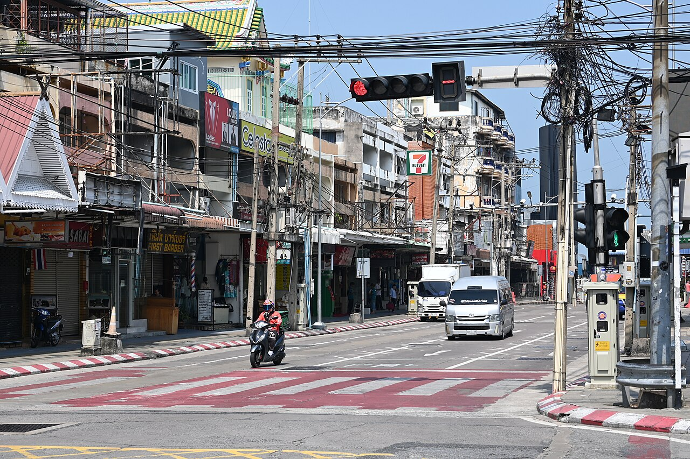

# Урок 45 — Проект: оживший городской перекрёсток 🚦🚗

**Модуль 6 | 2 академических часа (1,5 часа) — проект-сборка**

> 🔁 В начале урока — [повторение урока 44](повторение.md) (викторина по Drivers, 5–7 мин)

> 🎬 Сегодня **собираем всё вместе!** За уроки 41–44 ты освоил четыре инструмента анимации. Теперь применим их в одной живой сцене — **городском перекрёстке**: светофор переключается, машина тормозит на красный и трогается на зелёный, её колёса крутятся сами, автобус поворачивает по дуге, вывеска вертится, а камера держит кадр. Это репетиция перед итоговым роликом модуля.

---

## Цель урока

- **Собрать в одной сцене** все навыки модуля: ключи, Graph Editor/Easing, Constraints, Drivers
- Сделать **цикл светофора** (Emission + ключи) — как наш светофор из урока 41
- Заставить машину **тормозить и разгоняться** с Easing, а колёса — крутиться драйвером
- Пустить автобус по **Follow Path**, вывеску — на **пустышке-родителе**, камеру — на **Track To**
- Понять, как разные инструменты **работают вместе**

---

## Часть 1 — План сцены и «ящик инструментов» (12 минут)

Сегодня мало новой теории — много **сборки**. Сначала вспомним наш набор:

| Инструмент | Урок | За что отвечает в сцене |
|------------|------|--------------------------|
| **Ключи (Keyframes)** | 41 | цикл светофора, движение машины |
| **Graph Editor / Easing** | 42 | плавный разгон и торможение машины |
| **Constraints** (Follow Path, Track To) | 43 | автобус по дуге, камера следит за центром |
| **Drivers** | 44 | колёса крутятся от движения, вывеска/огни |
| **Пустышка-родитель** | 45 | вращение вывески вокруг столба |

Наша цель-референс — обычная городская улица со светофором и машинами:

*Городская улица со светофором и транспортом. [Wikimedia Commons, CC0/PD](https://commons.wikimedia.org/wiki/File:DFC_2058_A_quiet_city_street_lined_with_shops_and_tangled_overhead_wires_with_a_motorcyclist_and_a_white_van_waiting_at_a_red_traffic_light.jpg). Разбери на части: дорога-крест, переход-«зебра», светофор, машины, вывески. Из этого и соберём анимацию.*

> 💡 **Фишка — сначала план, потом сборка:** не лепи всё сразу. Порядок: перекрёсток → светофор → машина → автобус → вывеска/камера. Каждый блок проверяй отдельно.

---

## Часть 2 — Блокаут перекрёстка (12 минут)

**Шаг 1. Земля и дороги.**
1. Растяни стартовый план: `S 10` — это «квартал» (газон/асфальт).
2. Две дороги крестом: `Shift+A → Mesh → Plane`, `S X 10`, `S Y 1.2`, чуть приподними (`G Z 0.01`) — горизонтальная дорога. Дублируй (`Shift+D`), поверни `R Z 90` — вертикальная дорога. Тёмно-серый материал.
   ✅ *Должно получиться:* крест двух дорог на светлом квартале.

**Шаг 2. «Зебра» и порядок.**
1. Сделай несколько белых полосок-переходов (узкие Plane, Array-модификатор — повтор Модуля 1) у края перекрёстка.
2. Сложи всё в **коллекции** (Outliner: `Дороги`, `Светофор`, `Транспорт`) — `M → New Collection`.
   ✅ *Должно получиться:* аккуратная сцена-перекрёсток, объекты разложены по коллекциям.

> 💡 **Фишка — коллекции = порядок:** в большой анимационной сцене легко запутаться. Раскладывай по коллекциям сразу — потом проще прятать/находить (иконка глаза).

---

## Часть 3 — Светофор: цикл огней (18 минут)

Повторяем и углубляем светофор из урока 41 — теперь как часть большой сцены.

**Шаг 1. Модель.**
1. Столб (тонкий Cylinder) + корпус (Cube) + три лампы (UV Sphere/Circle) столбиком: красная сверху, жёлтая, зелёная снизу.
   ✅ *Должно получиться:* узнаваемый светофор на углу перекрёстка.

**Шаг 2. Материалы ламп — в Shading.**
1. Перейди в раскладку **Shading**. Каждой лампе — свой материал: **Principled BSDF → Emission Color** (красный/жёлтый/зелёный), **Emission Strength = 0** на старте.
   ✅ *Должно получиться:* лампы пока потушены (Strength 0).

**Шаг 3. Цикл ключами (как урок 41).**
Светофор: **красный 1–40 → жёлтый 40–48 → зелёный 48–90**. Для каждой лампы ставь ключи `I` на **Emission Strength**:
- **Красный:** кадр 1 = 5 (`I`), кадр 39 = 5 (`I`), кадр 40 = 0 (`I`).
- **Жёлтый:** кадр 39 = 0, кадр 40 = 5, кадр 47 = 5, кадр 48 = 0.
- **Зелёный:** кадр 47 = 0, кадр 48 = 5, кадр 90 = 5.
   ✅ *Должно получиться:* `Пробел` — огни переключаются по очереди. Включи **Bloom** (EEVEE) — лампы красиво сияют.

*Стандартный светофор. [Wikimedia Commons](https://commons.wikimedia.org/wiki/File:UK_traffic_signal_-_Standard_Aspects.svg). Порядок ламп: красный → жёлтый → зелёный. Этот ритм мы и задаём ключами Emission.*

---

## Часть 4 — Машина: стоп на красный, газ на зелёный (20 минут)

Здесь соединяем **ключи + Easing (урок 42) + драйвер колеса (урок 44)**.

**Шаг 1. Машина.**
1. Кузов (Cube, сплющи) + 4 колеса (Cylinder, `R X 90`, Origin в центре каждого). Сделай кузов **родителем** колёс (`Ctrl+P → Object`).
2. Назови кузов `Машина`. Поставь её слева на горизонтальной дороге.

**Шаг 2. Движение ключами с остановкой.**
1. Кадр **1:** машина подъезжает слева — `Машина` на X = −8 → `I → Location`.
2. Кадр **22:** машина у стоп-линии — X = −2 → `I → Location` (тормозит перед красным).
3. Кадр **48:** всё ещё стоит (красный/жёлтый) — X = −2 → `I → Location`.
4. Кадр **80:** уехала вправо на зелёный — X = 8 → `I → Location`.
   ✅ *Должно получиться:* машина подъезжает, ждёт, уезжает — синхронно со светофором.

**Шаг 3. Easing (Graph Editor).**
1. Открой **Graph Editor**, канал **X Location** (`Home`).
2. Выдели ключи → `T → Sinusoidal` → `Ctrl+E → Ease In and Out`.
   ✅ *Должно получиться:* машина **плавно тормозит** к стоп-линии и **плавно разгоняется** на зелёный — не дёргано.

**Шаг 4. Колёса крутятся от движения (драйвер).**
1. Выдели колесо → `N → Item` → ПКМ по **Rotation** катящейся оси → **Add Driver**.
2. **Scripted Expression**, переменная **Transform Channel**: Object = `Машина`, Type = **X Location**, имя `x`. Выражение: **`x / 0.4`** (0.4 — радиус колеса).
3. Скопируй драйвер на остальные колёса (ПКМ → **Copy Driver** / **Paste Driver**).
   ✅ *Должно получиться:* колёса крутятся, когда машина едет, и **замирают, когда она стоит** на красный — сами собой! 🎉

> 💡 **Фишка — вот зачем драйвер:** колесо «знает» о движении кузова и крутится ровно по нему. Стоит машина — стоят колёса. Никаких ручных ключей на вращение. Это магия урока 44 в деле.

---

## Часть 5 — Автобус по дуге (Follow Path) (10 минут)

Добавим транспорт, который **поворачивает** — для этого Follow Path (урок 43).

1. `Shift+A → Curve → Bezier`, в Edit Mode выгни **дугу поворота** (с одной дороги на другую).
2. Сделай автобус (вытянутый Cube). `Alt+G` (обнулить позицию).
3. Автобусу → Properties 🔗 → **Add Object Constraint → Follow Path** → Target = кривая → ✓ **Follow Curve** → **Animate Path**.
4. Скорость — у кривой: Object Data → **Path Animation → Frames**.
   ✅ *Должно получиться:* автобус едет по дуге и поворачивает за угол.

---

## Часть 6 — Вывеска на пустышке + камера (12 минут)

**Шаг 1. Вращающаяся вывеска (пустышка-родитель).**
1. Сделай столб + табличку-вывеску (Plane с Emission — в Shading).
2. `Shift+A → Empty → Plain Axes` в основании столба (ось вращения).
3. Выдели **вывеску**, потом `Shift`-**Empty** → `Ctrl+P → Object` (Empty стал родителем).
4. Выдели **Empty** → ПКМ по **Rotation Z → Add Driver** → `frame * 0.05` (или ключи).
   ✅ *Должно получиться:* вывеска крутится вокруг столба — потому что вращается её **родитель-пустышка**.

> 🎯 **ЛАЙФХАК — показать здесь!** **Пустышка-родитель для вращения**: как вертеть группу объектов вокруг общего центра (вывеска, карусель, круговое движение). Разбор — в [лайфхак.md](лайфхак.md).

**Шаг 2. Камера следит за перекрёстком (Track To).**
1. `Shift+A → Empty` в центре перекрёстка (назови `Центр`).
2. Камере → 🔗 → **Track To** → Target = `Центр`, To = −Z, Up = Y.
3. Подними камеру повыше-сбоку (`G`), `Numpad 0`.
   ✅ *Должно получиться:* камера держит весь перекрёсток в кадре с любого положения.

> 📷 **[Вставь сюда картинку: собранная сцена перекрёстка в Blender →](изображения.md#scene)**

---

## Часть 7 — Свет, кадр, итог (6 минут)

1. Свет: одна **Sun** сверху + мягкий World (день). Огни/вывеска светятся за счёт Emission + Bloom.
2. `Z → Rendered`, `Пробел` — любуйся: светофор переключается, машина тормозит и едет, колёса крутятся, автобус поворачивает, вывеска вертится, камера держит кадр.
3. **Сохрани** (`Ctrl+S`). На уроке **56** научимся выводить такую сцену в **видео**.

> 💡 **Фишка — это и есть «режиссура»:** ты не двигал каждую деталь руками — ты задал **правила и ритм**, а сцена ожила сама. Так и работают аниматоры: меньше ручного труда, больше «настроенной автоматики».

---

## Что мы узнали

- Как **соединить** все инструменты модуля в одной сцене (ключи + Easing + Constraints + Drivers).
- **Светофор** — цикл Emission ключами; **машина** — ключи + Easing (стоп/газ); **колёса** — драйвер от движения.
- **Автобус** — Follow Path (поворот); **вывеска** — пустышка-родитель; **камера** — Track To.
- Главное правило режиссёра-аниматора: **задавай правила и ритм**, а не двигай всё вручную.

**Дальше (урок 46):** начинаем **риггинг** — строим **скелет (арматуру)** для нашего персонажа из Модуля 5. Скоро человечек начнёт двигаться! 🦴

---

## Лайфхак урока

👉 [лайфхак.md](лайфхак.md) — **Пустышка-родитель для вращения** (вертим группу вокруг общего центра) (показывается в Части 6)

## Практика

👉 [практика.md](практика.md) — самостоятельная работа: **свой оживший перекрёсток/двор** (с рубрикой оценки) — добавь свой светофор из урока 41, больше машин, пешехода

---

## Навигация

⬅️ [Урок 44 — Drivers](../урок-44/урок.md)  ·  🔁 [Повторение](повторение.md)  ·  ➡️ [Урок 46 — Арматура и скиннинг (оснащаем персонажа)](../урок-46/урок.md)
