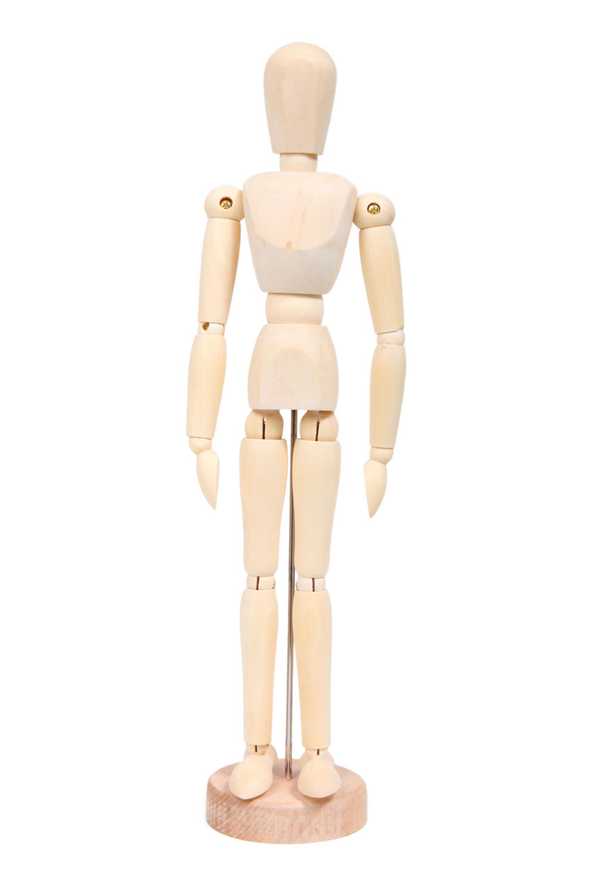
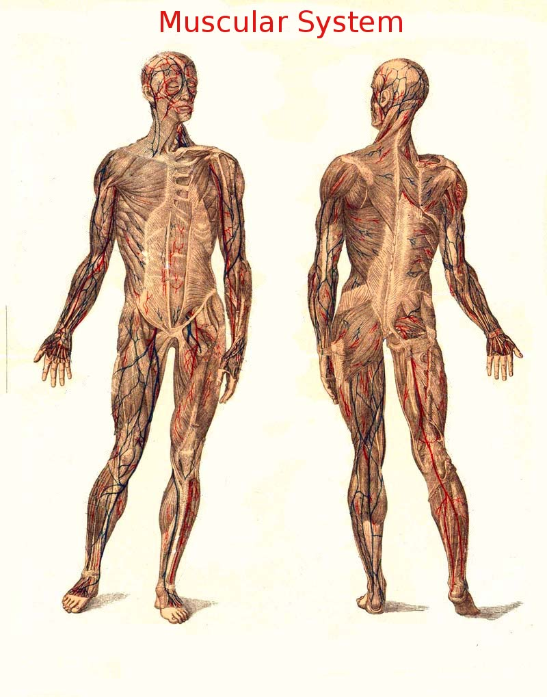

# Урок 46 — Арматура и скиннинг: оснащаем персонажа 🦴🎨

**Модуль 6 | 2 академических часа (1,5 часа) — большой ключевой урок**

> 🔁 В начале урока — [повторение урока 45](повторение.md) (викторина по сборке сцены, 5–7 мин)

> 🎬 **Главный момент модуля!** Помнишь нашего **человечка из Модуля 5**? Сегодня мы вставим в него **скелет (арматуру)** И **«пришьём» к костям кожу** — и он начнёт **сгибаться**. Это два неразделимых шага риггинга: скелет сам по себе ничего не двигает, пока к нему не привязана кожа. Поэтому делаем их в одном уроке — **оснащаем (rig) персонажа** целиком.

> ⏱ Урок насыщенный. Темп спокойный: сначала **скелет**, потом **привязка**, потом **доводка кистью**.

---

## Цель урока

- Понять **арматуру (скелет)**, **кость**, **иерархию** костей
- Построить скелет человечка: позвоночник, руки, ноги (**Extrude `E`**), имена **`.L`/`.R`**, **Symmetrize**
- Понять **скиннинг** и **веса вершин** (почему сгиб плавный)
- Привязать кожу: **Parent → With Automatic Weights**
- Поправить проблемные места в **Weight Paint** (🔴 держит / 🔵 нет)

---

## Часть 1 — Теория: скелет и привязка кожи (22 минуты)

### 1.1. Арматура — скелет внутри модели 🦴

**Арматура (Armature)** — «скелет» из **костей (bones)** внутри модели. Сами кости ничего не рисуют, но к ним **привязывается** кожа — и модель двигается за костями.


*Скелет человека. [Wikimedia Commons](https://commons.wikimedia.org/wiki/File:Human_skeleton_diagram_trace.svg). Кости соединены в **суставах** в **иерархию**: двинул плечо — поехала вся рука.*

**Кость состоит из трёх частей:**
```
        ● Tail (кончик) — отсюда «растёт» следующая кость
        █ Body (тело)   — сама кость (восьмигранник)
        ● Head (основание) — здесь сустав со старшей костью
```
Кость всегда смотрит от **Head** к **Tail**.

### 1.2. Иерархия: родитель → ребёнок 🌳

Кости связаны как семья: двинул **родителя** — **дети едут за ним**; двинул ребёнка — родитель стоит. Как у деревянного манекена художника:



*Деревянный манекен. [Wikimedia Commons](https://commons.wikimedia.org/wiki/File:Wooden_Mannequin.jpg). Повернул верх руки — низ руки и кисть едут следом. Это и есть иерархия костей.*

> 🧠 **Три режима арматуры:** **Object** (двигать весь скелет), **Edit** (`Tab` — строить кости), **Pose** (позировать). Сегодня поработаем во всех трёх.

### 1.3. Скиннинг — кожа, привязанная к костям 🎨

**Скиннинг** — «пришивание» кожи (меша) к скелету. После него каждая вершина знает, **за какой костью следовать**. Как мышцы и кожа поверх скелета:



*Мышечная система. [Wikimedia Commons, PD](https://commons.wikimedia.org/wiki/File:Muscular_System.jpg). Мягкие ткани **привязаны к скелету** и едут за костями. В Blender это задаёт скиннинг.*

### 1.4. Веса вершин (weights) — почему сгиб плавный ⚙️

Каждая вершина кожи слушается костей с силой **0…1** — это **вес**:
- **1** — кость держит полностью, **0** — не влияет, **0.5** — наполовину.

> 🧠 **Под капотом:** вершина на локте имеет вес 0.5 от плеча и 0.5 от предплечья. При сгибе она едет **на середину** между ними — поэтому сгиб **плавный**, а не ломается углом. Веса хранятся в **Vertex Groups** (по одной на кость, с тем же именем — вот зачем `.L`/`.R`).

> 📚 **Глубже — риггинг и веса:** способы привязки (Automatic/Empty/Envelope), доводка **Weight Paint** (Blur/**Normalize**/Mirror X), FK vs IK и **драйверы** — собрано в гайде [Риггинг, веса и скиннинг](../../справочники/глубокое-погружение/риггинг-веса.md).

> 🔬 **Проверь сам (2 мин):** цилиндр (Subdivide вдоль) + арматура из 2 костей → привяжи (Automatic Weights) → согни верхнюю кость → цилиндр согнулся в середине. В Weight Paint видно: верх красный (держит), низ синий.

---

## Часть 2 — Готовим человечка (8 минут)

1. Открой человечка из Модуля 5 (или `File → Append`; нет — слепи болванку из 3 капсул).
2. Поставь в **A-позу**, по центру, ступнями на пол (повтор урока 40).
3. Выдели меш → `Ctrl+A → All Transforms` (иначе скелет «поедет»).
4. Включи **X-Ray** (`Alt+Z`) — видно, что внутри.
   ✅ *Должно получиться:* человечек ровно в центре, просвечивает.

---

## Часть 3 — Строим скелет (22 минуты)

**Шаг 1. Корневая кость + видимость.**
1. `Shift+C` (курсор в центр) → `Shift+A → Armature`.
2. Object Data Properties (зелёный «бегущий человечек») → **Viewport Display** → включи **In Front** и **Names**.
   ✅ *Должно получиться:* кость видна сквозь меш, с именем.

> ⚡ **Трюк — кости поверх модели:** **In Front** показывает арматуру сквозь меш; **Names**/**Axes** помогают не путаться. Больше — [справочники/трюки.md](../../справочники/трюки.md).

**Шаг 2. Позвоночник (`Tab` → Edit Mode).**
1. Поставь основание (**Head**) кости на **бёдра**, кончик (**Tail**) — на **грудь** (двигай `G`). Это `Бёдра`.
2. Выдели **Tail** → `E` тяни вверх → `Грудь`; ещё `E` → `Шея`; ещё `E` → `Голова`.
   ✅ *Должно получиться:* цепочка по центру: бёдра → грудь → шея → голова.

**Шаг 3. Рука (левая).**
1. Выдели **Tail** у плеча (верх груди) → `E` в сторону → `Плечо`; `E` → `Предплечье`; `E` → `Кисть`.
   ✅ *Должно получиться:* рука из 3 костей.

> 💡 **Фишка — ветвление:** из одного сустава (Tail) можно вырастить несколько костей — так из позвоночника «отрастают» руки и ноги. Главное — выделять нужный кончик перед `E`.

**Шаг 4. Нога (та же сторона).**
1. Выдели **Head** корневой кости → `E` вниз → `Бедро`; `E` → `Голень`; `E` вперёд по стопе → `Стопа`.
   ✅ *Должно получиться:* нога из 3 костей. Половина скелета готова.

---

## Часть 4 — Имена .L/.R и зеркало (10 минут)

**Шаг 1. Назови кости стороны `.L`.**
Двойной клик в Outliner: `Плечо.L`, `Предплечье.L`, `Кисть.L`, `Бедро.L`, `Голень.L`, `Стопа.L`. (Центральные — без суффикса.)

**Шаг 2. Зеркаль.**
Выдели кости `.L` → **Armature → Symmetrize** → появятся зеркальные `.R`.
   ✅ *Должно получиться:* симметричный полный скелет. 🦴

> 🎯 **ЛАЙФХАК — показать здесь!** **Симметрия рига** (.L/.R → Symmetrize → Mirror X в Weight Paint) — как симметрия экономит **половину** работы и в скелете, и в покраске весов. Разбор — в [лайфхак.md](лайфхак.md).

> 💡 **Фишка — забыл назвать?** Выдели кости → **Armature → Names → Auto Name Left/Right** (Blender сам расставит `.L`/`.R` по положению).

---

## Часть 5 — Привязка кожи (Automatic Weights) (12 минут)

**Шаг 1. Порядок выделения — важно!**
1. `Tab` → Object Mode. Кликни **меш**, потом **`Shift`+клик** по **арматуре** (она должна стать **активной**).

> 💡 **Фишка — порядок решает:** при `Ctrl+P` родителем становится **активный** (последний выделенный). Нам нужен родитель-скелет → арматуру выделяем **последней**.

**Шаг 2. Привязать.**
1. `Ctrl+P` → **With Automatic Weights**.
   ✅ *Должно получиться:* у меша появился модификатор **Armature** + Vertex Groups (по костям).

**Шаг 3. Тест — согни человечка!**
1. Выдели **арматуру** → **Pose Mode** → выдели **Плечо.L** → `R` подними руку.
   ✅ *Должно получиться:* **рука сгибается вместе с кожей!** 🎉 Согни ногу, наклони корпус — проверь суставы. `Alt+R` — сброс.

> 💡 **Фишка — дефекты видно в ПОЗЕ:** в A-позе всё «ок»; кривая привязка вылезает только при сгибе.

---

## Часть 6 — Доводка кистью (Weight Paint) (12 минут)

Automatic Weights ошибается в сложных местах: подмышки, пах, иногда «прихватывает» лишнее.

**Шаг 1. Зайди красить.**
1. Выдели арматуру → **Pose Mode** → согни проблемную кость (чтобы видеть дефект).
2. Выдели **меш** → режим **Weight Paint**. **`Ctrl`+клик по кости** — выбрать, чьи веса красим.
   ✅ *Должно получиться:* красно-синяя карта влияния этой кости (🔴 = 1 держит, 🔵 = 0 нет).

**Шаг 2. Чини.**
| Беда | Лечение |
|------|---------|
| Палец/ухо не двигается | выбери его кость → **Weight 1.0** → закрась 🔴 |
| Живот едет за рукой | выбери кость руки → **Weight 0.0** → закрась 🔵 |
| Защип «фантиком» в суставе | кисть **Blur** по границе → плавный переход |

3. **Mirror X** (шапка Weight Paint) — красишь левую сторону, правая красится зеркально (нужны `.L`/`.R`).
4. **Weights → Normalize All** — сумма весов = 1 (убирает «разъезды»).
   ✅ *Должно получиться:* человечек чисто сгибается, без защипов.

> 💡 **Фишка — не гонись за идеалом:** для стилизованного человечка достаточно, чтобы основные суставы (плечи, локти, бёдра, колени, шея) гнулись без защипов.

> 📷 **[Вставь сюда картинку: скелет внутри человечка + карта весов руки →](изображения.md#rig)**

---

## Часть 7 — Итог и сохранение (5 минут)

- Поставь персонажа в пару поз (рука машет, шаг) — проверь, что кожа едет хорошо.
- `Alt+R` верни нейтраль. **Сохрани** (`Ctrl+S`).

> 💡 **Фишка — что мы получили:** теперь человечек — **марионетка**: дёргаешь кость, кожа слушается. Это основа всей анимации персонажа.

---

## Что мы узнали

- **Арматура** — скелет из костей; кость = Head/Body/Tail; **иерархия** родитель→ребёнок.
- Кости растят клавишей **`E`**; **`.L`/`.R` + Symmetrize** = половина → целый скелет.
- **Скиннинг** — привязка кожи; **вес 0–1** (смесь костей = плавный сгиб); **Vertex Groups** = кости.
- **Parent → With Automatic Weights** — авто-привязка; тест сгиба в **Pose Mode**.
- **Weight Paint**: 🔴 держит / 🔵 нет; кисть, **Blur**, **Mirror X**, **Normalize All**.

**Дальше (урок 47):** научимся **по-настоящему анимировать** персонажа — позы, принципы движения, удобные настройки рига (реалистичные суставы, организация костей). 🎭

---

## Лайфхак урока

👉 [лайфхак.md](лайфхак.md) — **Симметрия рига**: `.L`/`.R` + Symmetrize (скелет) + Mirror X (веса) — половина работы (показывается в Частях 4 и 6)

## Практика

👉 [практика.md](практика.md) — самостоятельная работа: **оснасти гибкий объект** (лампа/робо-рука/змейка) — скелет-цепочка + привязка, проверь сгиб

---

## Навигация

⬅️ [Урок 45 — Городской перекрёсток](../урок-45/урок.md)  ·  🔁 [Повторение](повторение.md)  ·  ➡️ [Урок 47 — Анимируем персонажа](../урок-47/урок.md)
