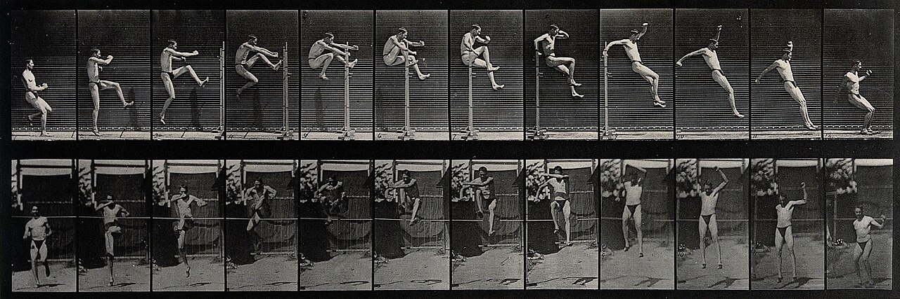

# Урок 47 — Анимируем персонажа: позы, принципы и удобный риг 🎭

**Модуль 6 | 2 академических часа (1,5 часа)**

> 🔁 В начале урока — [повторение урока 46](повторение.md) (викторина по арматуре и скиннингу, 5–7 мин)

> 🎬 У нас есть оснащённый персонаж — он сгибается. Но «сгибается» ≠ «живёт». Сегодня научимся **анимировать его красиво**: как работают аниматоры (позы и принципы движения) и как сделать риг **удобным** (реалистичные суставы, порядок в костях). Соберём первое настоящее действие — **взмах рукой** — и сделаем его «дорогим» по правилам анимации.

---

## Цель урока

- Понять метод **поза-в-позу (pose-to-pose)**: ключевые позы → промежутки
- Освоить **принципы движения**: упреждение (anticipation), доводка (follow-through), дуги (arcs)
- Сделать риг удобным: **Limit Rotation** (суставы как настоящие) и **Bone Collections** (порядок)
- Проверять движение через **Motion Paths** (траекторию кости)
- Анимировать **взмах рукой** и довести его по принципам

---

## Часть 1 — Теория: как аниматоры оживляют (20 минут)

### 1.1. Поза-в-позу (pose-to-pose) 🎭

Профи рисуют не подряд кадр за кадром, а сначала **ключевые позы** (самые важные моменты), потом — позы-связки (**breakdown**), и лишь затем заполняют промежутки. Так движение **спланировано**, а не «как получится».

Посмотри на серию прыжка (Майбридж): видны **ключевые позы** — присел (замах), оттолкнулся, полёт, приземление:

*Прыжок в высоту, Эдвард Майбридж. [Wellcome Collection, Wikimedia](https://commons.wikimedia.org/wiki/File:A_man_high_jumping._Photogravure_after_Eadweard_Muybridge,_1_Wellcome_V0048644.jpg). Любое действие — это цепочка **ключевых поз**: подготовка → действие → завершение. Анимируем так же: сначала главные позы, потом промежутки.*

> 🧠 **Под капотом — из чего собран кадр:** движение строится тремя «слоями». **Ключевые позы (keys)** — главные моменты (замах, удар, стойка). **Брейкдауны (breakdown)** — позы-связки между ключами (задают, как рука проходит путь — по дуге или по прямой). **Промежутки (inbetween)** — их досчитывает Blender интерполяцией (урок 42). А **скорость** задаётся **spacing’ом** — расстоянием между позами по времени: позы близко друг к другу = медленно, далеко = быстро (ровно то, что показывают точки на Motion Path и крутизна F-кривой). Поэтому аниматор думает не «кадрами», а **позами и расстояниями между ними**.

### 1.2. Три принципа, которые делают движение живым

Помимо **Easing** (разгон/торможение, урок 42), запомни три приёма из «12 принципов анимации» Disney:

| Принцип | Что это | Пример |
|---------|---------|--------|
| **Anticipation** (упреждение) | замах **против** движения перед действием | перед прыжком — присесть; перед взмахом — отвести руку назад |
| **Follow-through** (доводка/инерция) | после остановки части тела **довершают** движение | рука махнула — кисть ещё качнулась; плащ колыхнулся |
| **Arcs** (дуги) | живое движется по **дугам**, не по прямым | кисть, голова, стопа — по плавным дугам |

> 🧠 **Почему это работает:** мозг ждёт «разбег» перед действием (anticipation) и «затухание» после (follow-through) — как в реальной физике с инерцией. Прямые линии и мгновенные старты выглядят «мёртво». Поэтому хорошая анимация = **позы + Easing + эти приёмы**.

### 1.3. Как «увидеть» движение — Motion Paths

Чтобы проверить **дугу** (arc) и тайминг, в Blender есть **Motion Paths** — траектория кости через кадры (как след от руки в воздухе). По ней сразу видно: дуга плавная или «ломаная».

> 🔬 **Проверь сам (1 мин):** в Pose Mode выдели кость кисти → `Pose → Motion Paths → Calculate…` → появится пунктир-траектория с точками по кадрам. Чем ровнее дуга и равномернее точки — тем живее движение.

---

## Часть 2 — Делаем риг удобным (18 минут)

### 2.1 Limit Rotation — суставы как настоящие

Сейчас локоть может согнуться «назад» — некрасиво. **Limit Rotation** запрещает суставу выворачиваться.

1. Pose Mode → выдели **Предплечье.L**.
2. **Bone Constraint Properties** (кость+цепь) → **Add → Limit Rotation**.
3. Включи нужную ось (напр. **Limit X**), задай **Min 0°, Max 150°**, поставь **Space = Local**.
   ✅ *Должно получиться:* локоть гнётся только «как у человека» — вперёд, не назад.

> 💡 **Фишка — реалистичные пределы:** локоть и колено гнутся в одну сторону, шея — немного во все. Ограничители спасают от «сломанных» поз и ускоряют анимацию (не надо следить за пределами вручную).

### 2.2 Bone Collections — порядок в скелете

Когда костей много, легко запутаться. **Bone Collections** (Armature Data → Bone Collections) — это «слои» костей: можно спрятать служебные, оставить только нужные.

1. Armature Data Properties → **Bone Collections** → создай коллекцию `Контроль`, перетащи туда кости, которыми будешь анимировать.
2. Прячь/показывай коллекции глазком.
   ✅ *Должно получиться:* в вьюпорте — только нужные кости, остальное скрыто.

> 💡 **Фишка — цвет костей:** в Bone Collections / Bone Properties можно задать **цвет** группам (левая — синяя, правая — красная, центр — зелёная). Глазами быстрее находишь нужное. (Полный «удобный риг» с фигурами-контролами сделает за нас **Rigify**, урок 50.)

---

## Часть 3 — Анимируем взмах рукой (pose-to-pose) (22 минуты)

**Шаг 1. Включи помощников.**
1. Pose Mode. В Timeline включи **Auto Keying** (красный кружок, урок 41) — позы будут записываться сами.
2. End = 24 (1 секунда).

**Шаг 2. Поза А — рука внизу (кадр 1).**
1. Current Frame = **1**. Персонаж стоит, рука вдоль тела.
2. Выдели кости руки → `I → Rotation` (зафиксируй стартовую позу).
   ✅ *Должно получиться:* ключи на кадре 1.

**Шаг 3. Поза Б — рука вверх, машет (кадр 12).**
1. Current Frame = **12**. Подними и согни руку «привет» (`R` на плече и предплечье).
   ✅ *Должно получиться:* с Auto Keying ключи записались сами; рука вверху.

**Шаг 4. Проверь и поправь тайминг.**
1. `Пробел` — рука поднимается. Открой **Dope Sheet** (внизу): тут все ключи позы.
2. Хочешь быстрее/медленнее — выдели ключи (`B`) и сдвинь (`G`) или растяни (`S`) по времени.
   ✅ *Должно получиться:* взмах в нужном темпе.

> 💡 **Фишка — Dope Sheet = «пульт тайминга»:** в нём видно ВСЕ ключи персонажа сразу; двигаешь их группами, меняя ритм действия, не трогая сами позы.

---

## Часть 4 — Делаем взмах живым по принципам (15 минут)

Сейчас рука просто едет вверх. Добавим жизни.

**Шаг 1. Anticipation (упреждение).**
1. На кадре **4** отведи руку чуть **вниз-назад** (мини-замах перед взмахом) → ключ (Auto Key).
   ✅ *Должно получиться:* перед взмахом рука «готовится» — движение читается заранее.

**Шаг 2. Follow-through (доводка).**
1. После взмаха (кадр **12** — рука вверх) на кадре **15** дай кисти чуть **качнуться дальше** и на **18** вернуться. Ключи на кисть.
   ✅ *Должно получиться:* кисть «довершает» взмах по инерции, а не замирает мгновенно.

**Шаг 3. Arcs (дуги) — проверь Motion Paths.**
1. Выдели кость кисти → `Pose → Motion Paths → Calculate`.
2. Траектория кисти должна быть **плавной дугой**. Если «ломаная» — поправь позы/ручки в Graph Editor (урок 42).
   ✅ *Должно получиться:* кисть идёт по красивой дуге — взмах выглядит живым. 🎉

> 🎯 **ЛАЙФХАК — показать здесь!** **Motion Paths** — как «видеть» движение и чинить дуги/тайминг (траектория кости, точки по кадрам). Разбор — в [лайфхак.md](лайфхак.md).

> 💡 **Фишка — Easing тоже работает (урок 42):** открой Graph Editor, дай ключам **Ease In/Out** — рука начнёт и закончит взмах плавно. Позы + принципы + Easing = «дорогая» анимация.

> 📷 **[Вставь сюда картинку: взмах рукой — дуга Motion Path + anticipation/follow-through →](изображения.md#wave)**

---

## Часть 5 — Итог и сохранение (5 минут)

- Запусти взмах целиком: замах (anticipation) → взмах по дуге → доводка кисти (follow-through). Чувствуешь, насколько живее, чем «просто рука вверх»?
- **Сохрани** (`Ctrl+S`) — на уроке 48 добавим **IK** (стопа на полу), на 49 — **ходьбу**.

> 💡 **Фишка — это универсально:** позы + anticipation + follow-through + arcs работают для ЛЮБОГО действия (прыжок, удар, кивок, поклон). Освоил на взмахе — применишь везде.

---

## Что мы узнали

- **Поза-в-позу:** сначала ключевые позы, потом промежутки (движение спланировано).
- **Принципы:** **anticipation** (замах перед), **follow-through** (инерция после), **arcs** (дуги).
- **Удобный риг:** **Limit Rotation** (реалистичные суставы), **Bone Collections** (порядок), цвета костей.
- **Auto Keying** + **Dope Sheet** (тайминг) + **Motion Paths** (видеть дугу).
- Всё вместе с **Easing** (урок 42) = живая, «дорогая» анимация.

**Дальше (урок 48):** **FK и IK** — добавим «умные» цели, чтобы нога ставилась на пол, а рука дотягивалась естественно. 🦵

---

## Лайфхак урока

👉 [лайфхак.md](лайфхак.md) — **Motion Paths**: «видим» траекторию кости, чиним дуги и тайминг (показывается в Части 4)

## Практика

👉 [практика.md](практика.md) — самостоятельная работа: **анимируй другое действие** (прыжок / кивок / поклон / «подобрать предмет») по принципам — другое движение, те же приёмы

---

## Навигация

⬅️ [Урок 46 — Арматура и скиннинг](../урок-46/урок.md)  ·  🔁 [Повторение](повторение.md)  ·  ➡️ [Урок 48 — FK и IK](../урок-48/урок.md)
