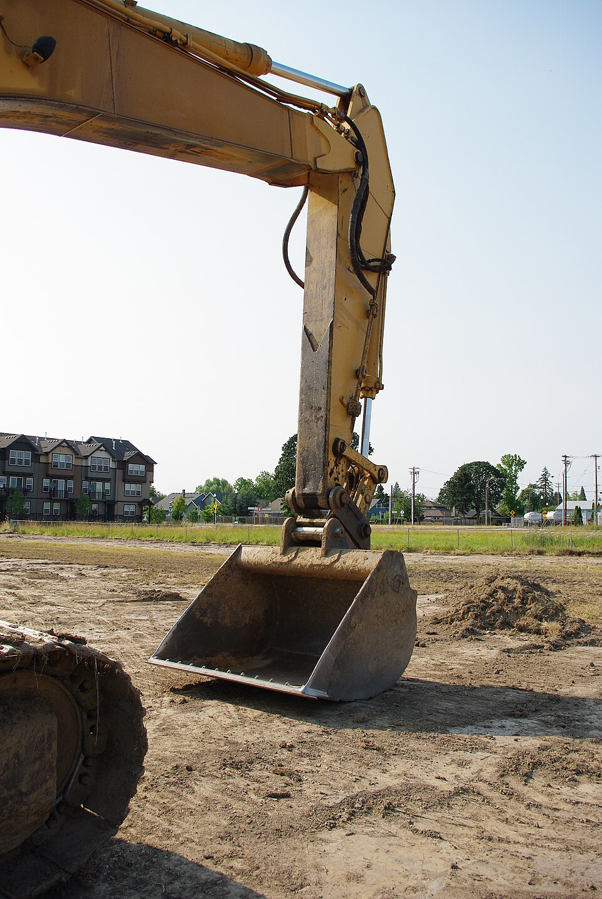

# Урок 48 — FK и IK: естественный сгиб руки и ноги 🦵🦾

**Модуль 6 | 2 академических часа (1,5 часа)**

> 🔁 В начале урока — [повторение урока 47](повторение.md) (викторина по анимации и принципам, 5–7 мин)

> 🎬 Человечек уже сгибается, но позировать ногу **по косточке** неудобно: повернул бедро — стопа улетела в воздух, крути ещё голень, потом стопу… Сегодня поставим **IK** — «умную» цель: двигаешь стопу, а нога **сама** красиво сгибается в колене и **стоит на полу**. Это ключ к ходьбе (урок 49).

---

## Цель урока

- Понять разницу **FK** (вращаем каждую кость) и **IK** (двигаем конец — суставы догоняют)
- Понять, **какую задачу решает IK** (стопа на полу, рука дотягивается)
- Поставить **IK Constraint** на ногу: цель + длина цепи
- Добавить **Pole Target** — чтобы колено смотрело **вперёд**, а не выворачивалось
- Понять, **когда FK, а когда IK**

---

## Часть 1 — Теория: FK против IK (20 минут)

### 1.1. FK — «вперёд по цепочке» (то, что мы делали)

**FK (Forward Kinematics, прямая кинематика)** — ты вращаешь кости **по очереди от корня к концу**: плечо → локоть → запястье. Каждая кость тянет за собой следующие.

- ✅ Отлично для **махов и дуг**: помахать рукой, хвост, маятник.
- ❌ Мучительно для **опоры**: чтобы поставить стопу в точку, надо вручную подобрать поворот бедра, потом голени, потом стопы — и при каждом движении тела всё «уплывает».

### 1.2. IK — «от цели назад к суставам»

**IK (Inverse Kinematics, обратная кинематика)** — наоборот: ты двигаешь **конец** (цель — стопу или кисть), а Blender **сам вычисляет**, как повернуть суставы цепочки, чтобы дотянуться. «Inverse» = от результата к поворотам.

Точно как **рука экскаватора**: оператор ведёт **ковш** в нужное место, а стрела и рукоять **сами сгибаются** в нужные углы:

*Гидравлическая рука экскаватора. [Wikimedia Commons, CC BY-SA](https://commons.wikimedia.org/wiki/File:Caterpillar_330B_Hydraulic_Excavator_bucket_and_arm_-_Hillsboro,_Oregon.JPG). Машинист управляет положением **ковша** (цель), а сегменты-«кости» автоматически встают под нужными углами. Это и есть IK: задаёшь конец — суставы догоняют.*

> 🧠 **Какую боль лечит IK:** при ходьбе стопа должна **стоять на полу**, пока тело едет вперёд. С FK стопа «уезжает» и её надо постоянно докручивать. С IK стопа **прибита к цели** на полу, а колено само сгибается под нужным углом. Без IK правдоподобную ходьбу почти не сделать.

### 1.3. Из чего состоит IK

| Часть | Что задаёт |
|-------|-----------|
| **IK Constraint** | ставится на **последнюю** кость цепи (голень) |
| **Target (цель)** | объект (Empty) или кость, к которой тянется конец |
| **Chain Length** | сколько костей вверх «решать» (нога = **2**: голень+бедро) |
| **Pole Target** | куда направлен **локоть/колено** (вперёд, а не вбок) |

### 1.4. Под капотом: как IK «додумывает» углы (и зачем Pole)

> 🧠 **Механика:** ты задаёшь только **точку-цель**. Дальше **IK-решатель** каждый кадр действует как настойчивый робот: он **чуть-чуть подкручивает** суставы цепочки, смотрит — «кончик приблизился к цели?», снова подкручивает, и так за доли секунды **подгоняет** углы бедра и голени так, чтобы кончик (tail голени) оказался **точно на цели**. Это и значит «обратная» кинематика — Blender идёт **от результата (где цель) к причинам (углам суставов)**.

> 🧠 **Зачем Pole Target:** у цепочки из 2 костей до одной цели существует **бесконечно много** решений — колено может смотреть вперёд, вбок, назад (нога «вращается» вокруг линии «бедро→цель», как циркуль). Решатель не знает, какое выбрать, — и колено «гуляет»/щёлкает. **Pole Target** снимает неоднозначность: «колено смотри **вот туда**». Поэтому для колен и локтей Pole **обязателен**.

> 🔬 **Проверь сам (2 минуты):** на цепочке из 2 костей: сначала **FK** — поверни нижнюю, потом верхнюю (конец гуляет). Потом поставь **IK** с целью-Empty и просто **подвигай Empty** — цепочка сама сгибается, дотягиваясь. Почувствуй разницу «кручу суставы» vs «веду цель».

---

## Часть 2 — FK-напоминание: машем рукой (8 минут)

1. Выдели арматуру → **Pose Mode**. Выдели **Плечо.L** → `R` подними, затем **Предплечье.L** → `R` согни.
   ✅ *Должно получиться:* рука позируется «по косточке». Для **взмаха** это удобно — кисть идёт по дуге. Запомни: для свободных махов **FK хорош**.
2. `Alt+R` — сбрось позу.

---

## Часть 3 — IK на ногу: стопа на полу (22 минуты)

Возьмём оснащённого человечка (риг из урока 46). Поставим IK на **левую ногу**.

**Шаг 1. Создаём цель для стопы (Empty).**
1. **Object Mode**. `Shift+A → Empty → Plain Axes`.
2. Перетащи Empty (`G`) точно к **щиколотке** левой ноги (где стопа кости `Голень.L`). Удобно видеть сквозь тело — включи **X-Ray** (`Alt+Z`).
3. Назови его **`Цель-нога.L`** (двойной клик в Outliner).
   ✅ *Должно получиться:* маленький крестик-Empty стоит у левой щиколотки.

**Шаг 2. Вешаем IK на голень.**
1. Выдели **арматуру** (ЛКМ) → переключись в **Pose Mode** (список режимов слева вверху).
2. Кликни по кости **`Голень.L`** (последняя перед стопой — именно на неё вешаем IK).
3. Справа открой **Bone Constraint Properties** — иконка **кость с цепью-звеном** (не путать с Object Constraint! это для **костей**).
4. Нажми **Add Bone Constraint** → в списке выбери **Inverse Kinematics**.
5. Заполни поля ограничителя:
   - **Target** → выбери объект **`Цель-нога.L`** (это Empty, не арматура!).
   - **Chain Length = 2** (решать 2 кости вверх: голень + бедро; **0** значило бы «всю цепь до корня» — таз бы гнулся).
   ✅ *Должно получиться:* кости голени и бедра подсветились (жёлтым/пунктиром) — они теперь «слушают» цель.

**Шаг 3. Магия IK — двигаем цель.**
1. Выдели **`Цель-нога.L`** (Empty) → нажми **`G`** → поводи вверх/вниз/вперёд.
   ✅ *Должно получиться:* **бедро и голень сгибаются САМИ**, удерживая ногу у цели: поднял Empty — колено согнулось; опустил — нога выпрямилась. Стопа «стоит» там, где Empty. 🦵 (Верни Empty `Alt+G`.)

> 💡 **Фишка — почему Chain Length = 2:** число = сколько костей вверх «слушают» цель. Нога = голень + бедро = **2**. Больше — IK потянет таз/спину (обычно не нужно); меньше — согнётся только голень.

**Шаг 4. (Доводка) Стопа стоит ровно.**
1. Сейчас сама **стопа** может «висеть» носком. Выдели кость **`Стопа.L`** → Bone Constraint Properties → **Add Bone Constraint → Copy Rotation** → **Target = `Цель-нога.L`**.
   ✅ *Должно получиться:* теперь поворот Empty = поворот стопы. Наклоняешь Empty (`R`) — носок поднимается/опускается; стопа держит уровень пола.

---

## Часть 4 — Pole Target: колено смотрит вперёд (15 минут)

Помнишь из теории (1.4): без подсказки колено «гуляет». **Pole Target** говорит колену, **куда** сгибаться.

**Шаг 1. Создаём цель-направление колена.**
1. **Object Mode** → `Shift+A → Empty → Plain Axes`.
2. Перетащи его **перед коленом**, немного **вперёд** от ноги (в сторону, куда смотрит лицо персонажа — обычно по **−Y**), на высоте колена.
3. Назови **`Колено.L`**.
   ✅ *Должно получиться:* Empty висит впереди колена.

**Шаг 2. Подключаем Pole к ограничителю.**
1. Выдели **арматуру** → **Pose Mode** → кость **`Голень.L`** → её **IK Constraint** (в Bone Constraint Properties).
2. Поле **Pole Target** → выбери **`Колено.L`** (Empty).
   ✅ *Должно получиться:* нога, скорее всего, **дёрнется/перекрутится** — это нормально, сейчас поправим угол.

**Шаг 3. Подбираем Pole Angle.**
1. В том же ограничителе крути поле **Pole Angle**. Попробуй по очереди **0°**, **−90°**, **90°**, **180°** — на одном из них колено встанет **строго вперёд**, нога перестанет крутиться. (Для нашего скелета обычно **−90°**.)
   ✅ *Должно получиться:* колено уверенно «глядит» вперёд. Двигаешь Empty `Колено.L` вбок — колено доворачивается туда (пригодится для «носки врозь»).

> 🎯 **ЛАЙФХАК — показать здесь!** **IK для естественного сгиба** — когда включать IK, как «прибить» стопу к полу для ходьбы и почему Pole Target обязателен для колен/локтей. Разбор — в [лайфхак.md](лайфхак.md).

> 💡 **Фишка — зеркаль на правую ногу:** повтори Empty-цель + IK + Pole для **`Голень.R`** (имена с `.R`). Названия по сторонам (`.L`/`.R`, урок 46) помогают не запутаться, какая нога какая.

> 📷 **[Вставь сюда картинку: нога с IK — Empty-цель + Pole, колено вперёд →](изображения.md#ik)**

---

## Часть 5 — Когда FK, а когда IK + итог (15 минут)

| Ситуация | Лучше |
|----------|-------|
| Стопа на полу, шаг, прыжок | **IK** (цель прибита к полу) |
| Рука опирается о стол, держит фиксированный предмет | **IK** |
| Свободный мах рукой, хвост, маятник, причёска | **FK** (красивая дуга) |
| Лазание, толчок от опоры | **IK** |

> 💡 **Фишка — профи переключают:** в серьёзных ригах (Rigify, урок 50) у руки/ноги есть **переключатель FK↔IK**: для шага — IK, для взмаха — FK. Пока достаточно: **ноги — на IK** (для ходьбы), **руки — на FK** (для жестов).

- Проверь: подвигай `Цель-нога.L` — нога красиво гнётся, колено вперёд.
- `Alt+G` целям, `Alt+R` костям — вернуть нейтраль.
- **Сохрани** (`Ctrl+S`) — на уроке 49 на этих IK-ногах построим **цикл ходьбы**.

---

## Что мы узнали

- **FK** — вращаем кости по очереди (хорошо для махов/дуг).
- **IK** — двигаем **цель** (конец), суставы догоняют сами (хорошо для опоры/контакта).
- **IK Constraint**: Target (Empty/кость) + **Chain Length** (нога = 2).
- **Pole Target** — направляет колено/локоть (чтобы не выворачивались); правится **Pole Angle**.
- Стопа держит уровень через **Copy Rotation** на цель.
- Профи **переключают** FK↔IK; у нас ноги — IK (под ходьбу).

**Дальше (урок 49):** **Поза и ходьба** — на IK-ногах соберём **цикл шага** (по классическому референсу), а в практике оживим **животных фермы**! 🚶🐄

---

## Лайфхак урока

👉 [лайфхак.md](лайфхак.md) — **IK для естественного сгиба** (когда IK, «прибить» стопу к полу, зачем Pole) (показывается в Части 4)

## Практика

👉 [практика.md](практика.md) — самостоятельная работа: **смоделируй и оживи экскаватор** (моделирование Модулей 1–2 + риг с IK + анимация копания) — строим с нуля, повторяем всё

---

## Навигация

⬅️ [Урок 47 — Анимируем персонажа](../урок-47/урок.md)  ·  🔁 [Повторение](повторение.md)  ·  ➡️ [Урок 49 — Поза и ходьба](../урок-49/урок.md)
