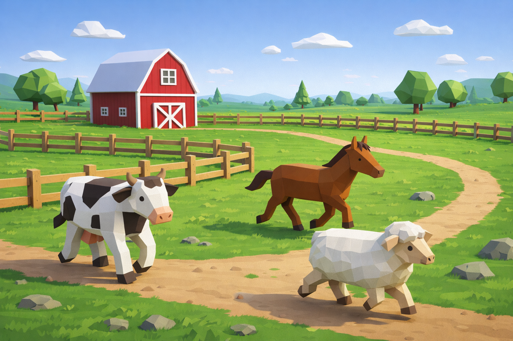
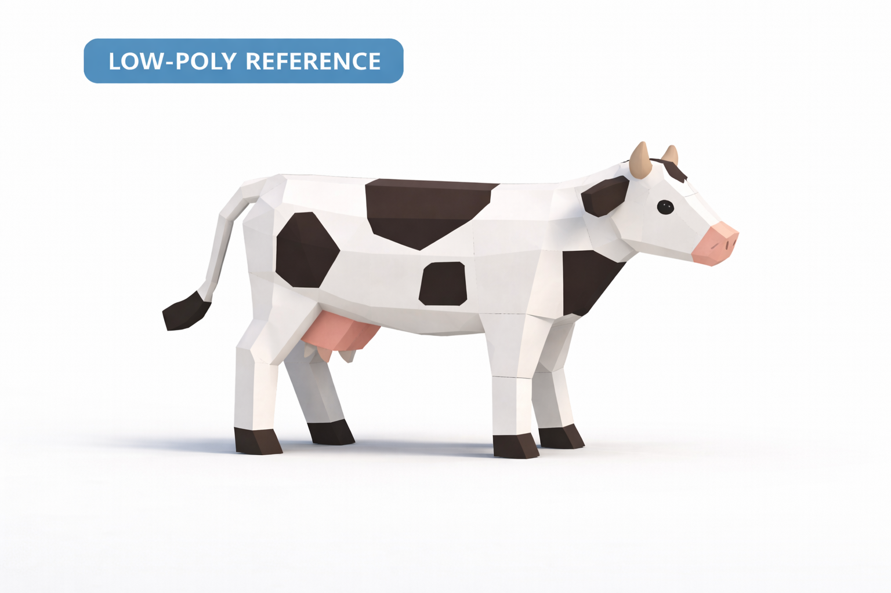
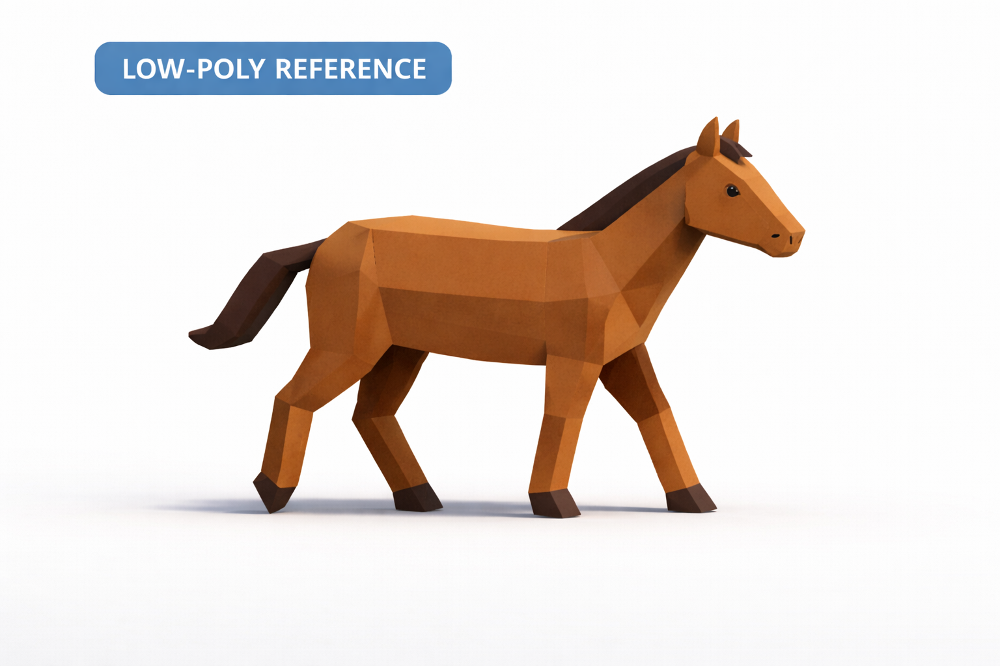
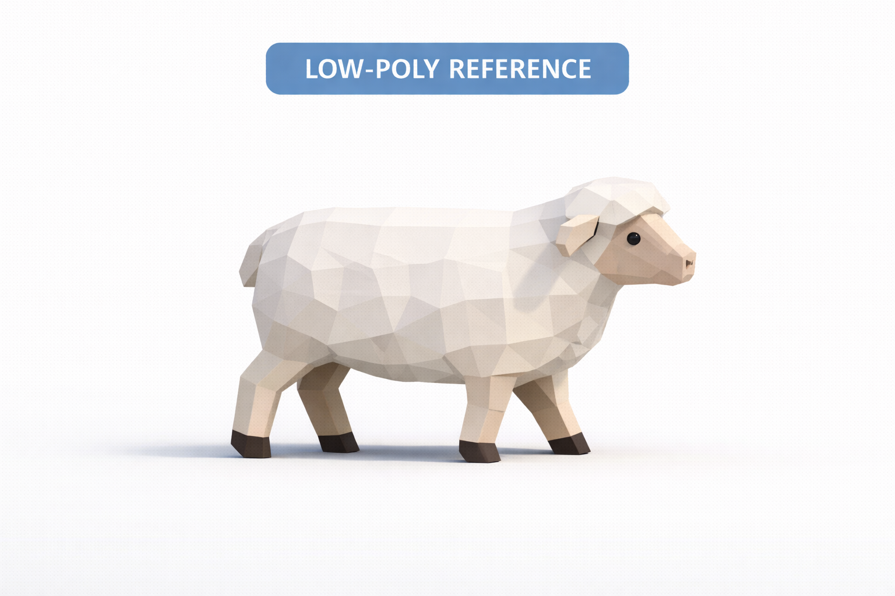
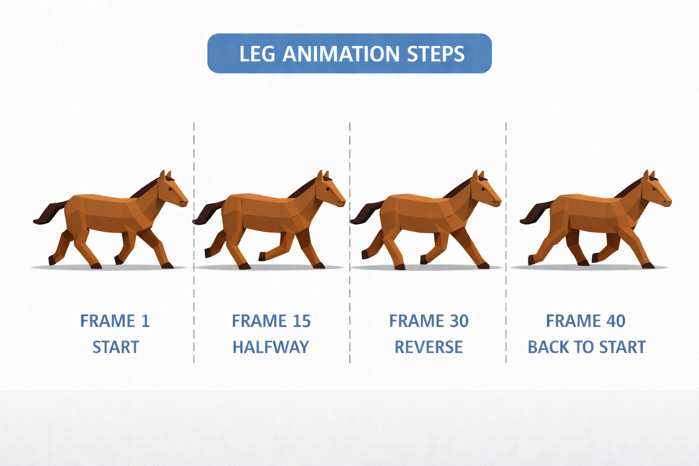

# Самостоятельная работа — Урок 49: Идущее животное фермы 🐄🐑🐴

> 🧑‍🎓 Делаешь сам(а) — **с нуля**. На уроке зашагал человечек — а ты **смоделируй low-poly животное фермы**, оснасти его и сделай **цикл ходьбы**. Это продолжение нашей фермы из Модуля 2: моделирование + риг + анимация в одном проекте.

> 🎯 **Цель-сцена:** ферма, где корова, лошадь и овца **гуляют**. Каждый делает **одно** животное — вместе соберём ферму в итоговом ролике (урок 56).

*Куда мы идём: low-poly ферма с гуляющими коровой, лошадью и овцой.*

---

## Выбери животное (референсы)

| 🐄 Корова | 🐴 Лошадь | 🐑 Овца |
|-----------|-----------|---------|
|  |  |  |

*Low-poly референсы. Разбери на простые формы: тело-«бочка», 4 ноги-цилиндра, голова-куб, уши, хвост.*

---

## Этап 1 — Моделирование (повтор Модуля 2, урок 13)

1. **Тело:** Cube → вытяни в «бочку» → **Loop Cut** + **Proportional Editing** (`O`) округли.
2. **Ноги:** выдели 4 нижние грани → **Extrude** вниз (4 ноги-столбика); копытца — короткий Extrude + тёмный материал.
3. **Голова + шея:** Extrude вперёд-вверх; уши/рога — Extrude; морда — подтяни.
4. **Хвост:** Extrude назад (у коровы — кисточка).
5. **Симметрия:** работай с **Mirror**-модификатором (урок 3) — левая/правая половины сами.
6. **Материалы (Shading):** окрас по референсу (пятна коровы — отдельные грани + Assign, урок 18); **Shade Smooth**.

✅ *Итог:* узнаваемое low-poly животное.

---

## Этап 2 — Риг (повтор урока 46)

1. **Скелет:** позвоночник (хвост→спина→шея→голова) + по **2–3 кости** на каждую ногу. Имена ног — `.L`/`.R` (передние/задние различай: `Нога.Пер.L` и т.п.).
2. **Symmetrize** — правые ноги зеркалом.
3. **Привязка:** меш + `Shift`-арматура → `Ctrl+P → With Automatic Weights`. Проверь сгиб ног в Pose Mode, поправь Weight Paint при защипах.

✅ *Итог:* животное гнёт ноги и шею.

---

## Этап 3 — Цикл ходьбы (по схеме)

Четвероногие шагают **по диагонали** (передняя левая + задняя правая идут вместе). Сделай простой 4-кадровый цикл по схеме:

*Схема ног: кадр 1 (старт) → 15 (середина) → 30 (обратная фаза) → 40 (назад к старту). Между ними — Paste Flipped.*

1. **Кадр 1:** диагональ вперёд (перёд-левая + зад-правая вперёд, другие назад). Ключ.
2. **Кадр 20:** **Paste Flipped** (`Ctrl+C` → `Ctrl+Shift+V`) — диагональ поменялась. Ключ.
3. **Кадр 40 = кадр 1** (`Ctrl+V`) — замкни цикл.
4. **Make Cyclic** (Graph Editor) — идёт без остановки.
5. Голова чуть покачивается (follow-through, урок 47).

✅ *Итог:* животное шагает по кругу. 🐄🚶

---

## Требования

- [ ] Животное **смоделировано сам** (тело, 4 ноги, голова — из простых форм, Mirror)
- [ ] Материалы по окрасу (Shading)
- [ ] Построен **риг** (позвоночник + 4 ноги, `.L`/`.R`, Symmetrize), привязка
- [ ] Сделан **цикл ходьбы** (ключевые позы + **Paste Flipped** + Make Cyclic)
- [ ] Цикл зациклен, ноги не «разъезжаются»
- [ ] Файл сохранён

---

## 💡 Подсказки (повтори прошлое)

- **Форма тела:** Cube → Loop Cut → `O` (Proportional) округлить в «бочку» (урок 13).
- **Ноги:** Extrude нижних граней вниз; **Mirror** для парных ног.
- **Окрас пятнами:** выдели грани → новый слот материала → **Assign** (урок 18).
- **Риг ног:** 2–3 кости на ногу; **имена `.L`/`.R`** обязательно (для Symmetrize и Paste Flipped).
- **Привязка:** меш → `Shift`-арматура → `Ctrl+P → With Automatic Weights`; защипы — Weight Paint Blur (урок 46).
- **Зеркало шага:** `Ctrl+C` → `Ctrl+Shift+V` (Paste Flipped); замкнуть — `Ctrl+V`.
- **Зациклить:** Graph Editor → Make Cyclic (урок 42).
- **Диагональный шаг:** передняя левая и задняя правая — вместе вперёд; вторая диагональ — назад.

---

## 📥 Что скачать (только если совсем застрял с моделью)

Главное — **смоделировать самому**. Но если нужен ориентир по форме/топологии — бесплатные low-poly животные: **Quaternius** [quaternius.com](https://quaternius.com) (Animated Animals), **Kenney** [kenney.nl/assets](https://kenney.nl/assets). Разбери их сетку — и сделай своё. Каталог — [справочники/где-скачать.md](../../справочники/где-скачать.md).

---

## Что сдать

`.blend` + запись (5–10 сек) идущего животного + 2–3 кадра модели. Подпиши, какое животное, какие приёмы моделирования повторил и где Paste Flipped.

> 💡 **Перекличка:** твоё животное войдёт в **общую ферму** (урок 56) — корова, лошадь и овца от разных учеников гуляют вместе.
