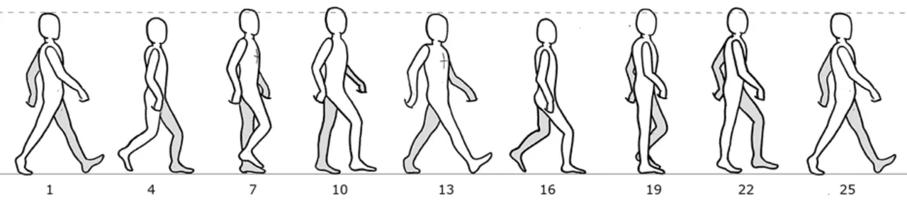

# Урок 49 — Поза и ходьба: цикл шага 🚶

**Модуль 6 | 2 академических часа (1,5 часа)**

> 🔁 В начале урока — [повторение урока 48](повторение.md) (викторина по FK/IK, 5–7 мин)

> 🎬 Кульминация риггинга — **заставим персонажа ИДТИ!** Ходьба кажется сложной, но это **повторяющийся цикл** из нескольких ключевых поз. Сделаем половину шага — а вторую получим **зеркалом** одним кликом. Это самый «волшебный» момент: статичный человечек оживает и шагает.

---

## Цель урока

- Понять **цикл ходьбы**: ключевые позы и их повтор
- Освоить **позирование** в Pose Mode + ключи поз
- Поставить **4 ключевые позы** шага (контакт, проход) и зациклить
- Освоить **зеркалирование позы** (Paste Flipped) — половина работы
- Запустить **бесконечный цикл** ходьбы (Make Cyclic)

---

## Часть 1 — Теория: из чего состоит ходьба (20 минут)

### 1.1. Ходьба = повторяющийся цикл 🔁

Когда человек идёт, его тело проходит **одни и те же позы** снова и снова. Достаточно сделать **один цикл** (два шага — левой и правой) и **зациклить** его — персонаж шагает бесконечно.

Посмотри на классический референс цикла шага (кадры одного полного цикла):

*Цикл ходьбы по кадрам. Один полный цикл ≈ **25 кадров** (два шага). Замечай: руки и ноги двигаются **накрест** (левая нога вперёд — правая рука вперёд); тело то **опускается**, то **приподнимается**. Эти позы мы и расставим.*

### 1.2. Четыре ключевые позы шага

В одном шаге — 4 главные позы (потом всё повторяется зеркально для второй ноги):

| Поза | Что происходит |
|------|----------------|
| **Контакт (Contact)** | ноги расставлены: одна пятка впереди, другая носок сзади; руки накрест |
| **Опускание (Down)** | вес на переднюю ногу, тело **ниже** всего |
| **Проход (Passing)** | задняя нога проносится под телом, ноги вместе, тело **выше** всего |
| **Подъём/толчок (Up)** | задняя нога отталкивается, тело поднимается → снова контакт |

> 🧠 **Под капотом — почему накрест (контрапост):** при шаге левой ногой вперёд выходит **правая** рука — так тело сохраняет баланс (иначе бы заваливалось). Это естественно: попробуй пройтись, вынося руку и ногу **одной** стороны — сразу почувствуешь, как неудобно. Поэтому в позе руки и ноги — крест-накрест.

### 1.3. Зеркало экономит половину 🪞

Второй шаг (другой ногой) — это **зеркало** первого. Не нужно лепить его заново: делаешь позу для одной стороны, **копируешь и вставляешь зеркально** (Paste Flipped) — и левый шаг превращается в правый. Вот зачем мы давали костям имена **`.L`/`.R`** (урок 46)!

> 🔬 **Проверь сам (1 мин):** в Pose Mode поставь любую несимметричную позу (рука вверх слева) → `Ctrl+C` (Copy Pose) → `Ctrl+Shift+V` (Paste Flipped) → поза **отзеркалилась** (рука вверх справа). Это и есть наш главный приём для второго шага.

---

## Часть 2 — Подготовка (8 минут)

1. Открой **оснащённого человечка** (риг из урока 46, с IK-ногами из урока 48).
2. Выдели арматуру → **Pose Mode**. Включи **Auto Keying** (красный кружок, урок 41) — позы запишутся сами.
3. Поставь **End = 25**, FPS 24.
   ✅ *Должно получиться:* персонаж в нейтрали, готов к позированию, запись включена.

> 💡 **Фишка — анимируем «на месте»:** проще всего сделать **ходьбу на месте** (как по беговой дорожке) — цикл зациклится. Чтобы персонаж реально **шёл вперёд** — потом сдвинем весь риг ключами или пустим по **Follow Path** (урок 43, бонус).

---

## Часть 3 — Ставим ключевые позы (25 минут)

**Поза 1 — Контакт (кадр 1): правая нога вперёд.**
1. Current Frame = **1**. Поставь позу: **правую** IK-ногу (Empty) вперёд пяткой, **левую** назад носком; корпус чуть вперёд; **левую** руку вперёд, правую назад (накрест).
2. Выдели все кости позы (`A`) → `I → LocRotScale` (зафиксируй).
   ✅ *Должно получиться:* поза «шаг правой» на кадре 1.

**Поза 2 — Контакт зеркальный (кадр 13): левая нога вперёд.**
1. На кадре 1 скопируй позу: `A` → **`Ctrl+C`** (Copy Pose).
2. Current Frame = **13** → **`Ctrl+Shift+V`** (Paste Pose Flipped) → поза отзеркалилась (теперь левая нога и правая рука вперёд).
3. Ключ (`I` / Auto Key).
   ✅ *Должно получиться:* второй шаг — зеркало первого, без ручной лепки. 🪞

> 🎯 **ЛАЙФХАК — показать здесь!** **Зеркалирование поз (Copy/Paste Flipped)** — как сделать половину анимации и получить вторую зеркалом; почему без `.L`/`.R` не работает. Разбор — в [лайфхак.md](лайфхак.md).

**Поза 3 — Проход (кадр 7): ноги вместе, тело выше.**
1. Current Frame = **7**. Поднеси заднюю (левую) ногу под тело, ноги почти вместе; **приподними** корпус (тело в проходе выше всего); руки проходят вдоль тела.
2. Ключ.
   ✅ *Должно получиться:* «проходная» поза между контактами.

**Поза 4 — Проход зеркальный (кадр 19).**
1. На кадре 7: `A` → `Ctrl+C`. Current Frame = **19** → `Ctrl+Shift+V` (Paste Flipped). Ключ.
   ✅ *Должно получиться:* второй проход — зеркало первого.

**Замыкаем цикл (кадр 25 = кадр 1).**
1. На кадре 1: `Ctrl+C`. Current Frame = **25** → **`Ctrl+V`** (Paste — без зеркала!) → ключ.
   ✅ *Должно получиться:* конец цикла совпал с началом — шаг «закольцуется» плавно.

---

## Часть 4 — Зацикливаем и доводим (15 минут)

**Шаг 1. Бесконечный цикл.**
1. Открой **Graph Editor** → выдели все кривые (`A`) → `N` → **Modifiers → Add Modifier → Cycles** (или Channel → Extrapolation → Make Cyclic, урок 42).
2. Поставь End побольше (напр. 100), нажми `Пробел`.
   ✅ *Должно получиться:* персонаж **шагает без остановки**! 🚶🎉

**Шаг 2. Оживляем (принципы урока 47).**
- **Дуги:** проверь стопу и кисть через **Motion Paths** — должны идти по дугам.
- **Easing:** контактные позы — порезче, проход — помягче (Graph Editor).
- **Доводка (follow-through):** дай голове/рукам чуть «качаться» с запозданием.
   ✅ *Должно получиться:* походка стала живой, не «деревянной».

> 💡 **Фишка — идти вперёд (бонус):** чтобы персонаж двигался, а не топтался: выдели **корневую кость/риг** и поставь 2 ключа Location (старт → финиш) на всю длину; или пусти по **Follow Path** (урок 43). Скорость подбери так, чтобы стопы не «проскальзывали».

> 📷 **[Вставь сюда картинку: 4 ключевые позы шага человечка в Blender →](изображения.md#walkkeys)**

---

## Часть 5 — Итог и сохранение (7 минут)

- Запусти цикл: контакт → проход → зеркальный контакт → зеркальный проход → снова контакт. Чувствуешь ритм шага?
- **Сохрани** (`Ctrl+S`) — этого персонажа используем в итоговом ролике (урок 56).

> 💡 **Фишка — ты сделал «святой грааль» новичка:** цикл ходьбы — главное упражнение каждого аниматора. Освоил его — сможешь сделать бег, прыжок, любой цикл по тому же принципу (позы + зеркало + Make Cyclic).

---

## Что мы узнали

- **Ходьба = цикл** из ключевых поз (контакт, опускание, проход, подъём), который **зацикливают**.
- Руки и ноги двигаются **накрест** (баланс).
- **Paste Flipped** даёт зеркальный шаг — половина работы (нужны `.L`/`.R`).
- **Make Cyclic** — бесконечное повторение.
- Принципы урока 47 (дуги, Easing, follow-through) делают походку живой.

**Дальше (урок 50):** **Rigify** — аддон, который соберёт **профессиональный риг** персонажа за минуты (с готовыми контролами и переключателем FK/IK). 🦴⚡

---

## Лайфхак урока

👉 [лайфхак.md](лайфхак.md) — **Зеркалирование поз (Paste Flipped)**: половина анимации → вторая зеркалом (показывается в Части 3)

## Практика

👉 [практика.md](практика.md) — самостоятельная работа: **смоделируй low-poly животное фермы** (корова/лошадь/овца) → оснасти → сделай цикл ходьбы (4 кадра ног) — моделирование + риг + анимация

---

## Навигация

⬅️ [Урок 48 — FK и IK](../урок-48/урок.md)  ·  🔁 [Повторение](повторение.md)  ·  ➡️ [Урок 50 — Rigify](../урок-50/урок.md)
